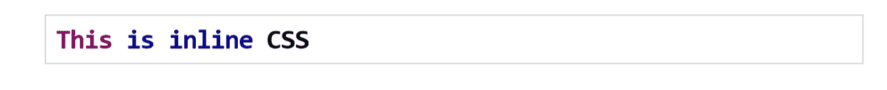

# 如何最好地利用不同类型的 CSS？

> 原文：<https://www.edureka.co/blog/types-of-css/>

本文将向您介绍一个简单而有趣的主题，即 CSS 的类型，并随后进行编程演示。本文将涉及以下几点:

*   [CSS 的类型](#TypesOfCSS)
*   [嵌入式 CSS–样式元素](#EmbeddedCSS-TheStyleElement)
*   [内联 CSS](#InlineCSS)
*   [外部 CSS–链接元素](#ExternalCSS-TheLinkElement)

让我们从这篇文章开始吧，

## **CSS 的类型**

在 CSS 中有三种类型:

*   内嵌 CSS
*   内部 CSS
*   外部 CSS

级联样式表用于设置包含 HTML 元素的网页的样式。在这三种类型的 CSS 中，最常用的方法是内联 CSS 和外部 CSS。

这三种是级联样式表可以用来在这些不同的方法中应用独特样式的不同方法，正如前面提到的，内联 CSS 和外部 CSS 是常用的方法。

继续这篇关于 CSS 类型的文章，

有四种方法可以将样式与 HTML 文档关联起来。

## **嵌入式 CSS–样式元素**

在这些代码中，您可以使用这个

```

<head>
<style type=&rdquo;text/css&rdquo; media=&rdquo;>
Style Rules
&hellip;.&hellip;&hellip;&hellip;&hellip;&hellip;.
</style>
</head>

```

这些与

| **属性** | **值** | **描述** |
| 类型 | 文本/css | 这指定了内容类型的样式表语言。此属性是必需的。 |
| 媒体 | 屏幕电传打字机电视推断手持类型的打印 | 这些设备指定要在其上显示的文档。对于这些，默认值为 all。这是可选属性。 |

继续这篇关于 CSS 类型的文章，

## **内联 CSS**

内联 CSS 用于对单个元素应用各种独特的样式。它还用于为特殊类型的元素定义一个样式，给元素添加一个 class 属性。您可以使用任何 HTML 元素的任何样式属性来定义样式规则。那么规则将只应用于该元素。下面是语法:

```
<element style=&rdquo;&hellip;style rules&hellip;&rdquo;>
```

| **属性** | **值** | **描述** |
| 风格 | 样式规则 | 这里的样式属性是由分号(；). |

**属性**

**例子**

```
<h1 style=&rdquo;color: #36F;&rdquo;> This is inline CSS </h1>
```

**输出**



继续这篇关于 CSS 类型的文章，

## **外部 CSS–链接元素**

这个元素可以用来在 HTML 文档中包含和排除外部样式表文件。外部样式表是带有。css 扩展。因此，这里您定义了文本文件中的所有样式规则，然后使用这个元素将这个文件包含到任何 HTML 文档中。下面是通用语法:

```

<head>
<link type=&rdquo;text/css&rdquo; href=&rdquo;&hellip;&rdquo;media&rdquo;&hellip;/>
</head>

```

**属性**

与

| **属性** | **值** | **描述** |
| 类型 | 文本/css | 这将样式表语言指定为内容类型。这是必需的属性。 |
| Href | 统一资源定位器 | 它指定了具有样式规则的样式表。这是必需的属性。 |
| 媒体 | 屏幕电传打字机电视推断手持类型的打印 | 这些设备指定要显示或查看的文档。这是一个可选属性。 |

**例子**

```

h1, h2, h3
{
color: #36C;
font-weight-weight: normal;
letter-spacing-spacing : .5cm
margin-bottom-bottom: 2cm;
text-transform: lowercase;
}

```

将此文件包含在任何 HTML 文档中，如下所示:

```

<head>
<link type="text/css" href="mystyle.css" media="all"/>
</head>

```

这就把我们带到了这篇关于 CSS 类型的文章的结尾。

*查看* *了解我们的[全栈 Web 开发人员硕士项目](https://www.edureka.co/masters-program/full-stack-developer-training)，该项目包含讲师指导的现场培训和真实项目经验。本培训使您精通使用后端和前端 web 技术的技能。它包括关于 Web 开发、jQuery、Angular、NodeJS、ExpressJS 和 MongoDB 的培训。*

有问题要问我们吗？请在文章的评论部分提到它，我们会给你回复。