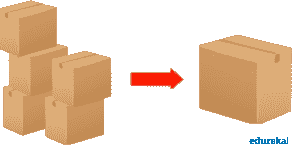
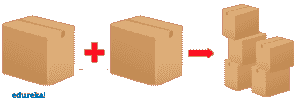
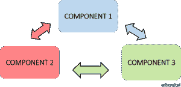
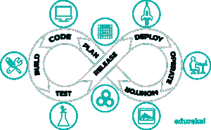
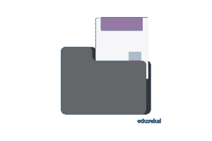

# 软件测试的类型:关于测试类型你需要知道的一切

> 原文：<https://www.edureka.co/blog/types-of-software-testing/>

*“质量绝不出事；它总是智慧努力的结果。”约翰·罗斯金。今天的技术世界完全由机器主导，它们的行为由驱动它的软件控制。质量保证或[软件测试](https://www.edureka.co/software-testing-fundamentals-training)至关重要，因为它从一开始就能识别系统的错误或缺陷。这篇关于“软件测试类型”的文章将按以下顺序为您提供关于不同类型软件测试的深入知识:*

*   [软件测试介绍](#softwaretesting)
*   为什么需要软件测试？
*   [软件测试生命周期](#softwaretestinglifecycle)
*   [软件测试的类型](#typesoftesting)

## **软件测试简介**

[软件测试](https://www.edureka.co/blog/what-is-software-testing/)是一个评估软件应用程序的功能以发现任何软件缺陷的过程。它检查开发的软件是否满足指定的要求，并识别软件中的任何缺陷，以便生产出高质量的产品。

也称为验证和确认软件产品的过程。它检查软件产品是否:

现在让我们继续我们的软件测试博客类型，看看我们需要软件测试的原因。

## **为什么要进行软件测试？**

软件测试的重要性是势在必行的。跳过这个过程绝对不是一个好主意，它可能会影响产品和业务。为了理解测试的重要性，让我们来看看解释为什么您的产品应该进行测试的一些要点:

****

从长远来看，按时测试我们的项目可以节省资金。软件开发由许多阶段组成，如果在早期阶段发现错误，修复它们的成本会低得多。

****

安全——这是软件测试中最敏感和最脆弱的部分。用户总是 寻找他们可以依赖的值得信赖的产品。它有助于预先消除问题和风险。

****

**产品质量**——为了让你的产品愿景成真，它必须按计划进行。遵循产品要求很重要，因为这有助于您获得所需的最终结果。

****

**客户满意度**——产品负责人的最终目标是给客户最好的满意度。应该对软件进行测试，以尽可能带来最好的用户体验。

这些是解释为什么我们需要软件测试的一些原因。现在让我们继续我们的软件测试博客类型，看看软件测试生命周期的不同阶段。

## **软件测试生命周期(STLC)**

[软件测试生命周期](https://www.edureka.co/blog/software-testing-life-cycle/) 是测试团队为确保软件或产品质量而执行的一系列不同活动。它定义了执行软件测试的一系列活动。

软件测试生命周期的不同阶段有:

****

现在让我们继续我们的软件测试博客，了解更多不同类型的测试。

## **软件测试类型**

测试是任何成功软件项目不可或缺的一部分。软件测试的类型取决于各种因素，包括项目需求、预算、时间表、专业知识和适用性。不同类型的软件测试是测试人员为应用程序决定正确测试的关键角色。功能测试和非功能测试是 QA 或软件测试人员执行的两种测试。

## ****

## **功能测试**

功能测试被定义为一种验证软件应用程序的每个功能都符合需求规范的测试。功能测试侧重于手动和自动化测试。

不同类型的功能测试包括:

### **单元测试**

是软件测试的一个层次，对软件的单个单元/组件进行测试。目的是验证软件的每个单元都按照设计执行。单元是任何软件中最小的可测试部分。它通常有一个或几个输入，通常只有一个输出。

**单元测试的好处**

*   单元测试增加了更改或维护代码的信心。如果编写了好的单元测试，并且每次代码更改时都运行这些测试。
*   代码更容易重用。为了使单元测试成为可能，代码需要模块化。
*   发展更快。与修复系统测试或验收测试期间发现的缺陷所需的努力相比，在单元测试期间发现和修复缺陷所需的努力要少得多。
*   与在更高层次上检测到的缺陷相比，修复在单元测试中检测到的缺陷的成本更低。
*   调试很容易。当测试失败时，只需要调试最新的更改。

### **集成测试**

这是软件测试的一个层次，其中单个单元被组合起来，作为一个组进行测试。这一级别的测试的目的是暴露集成单元之间交互中的故障。

**集成测试方法**

*   大爆炸是一种集成测试的方法，其中所有或大部分单元被组合在一起并一次性测试。当测试团队收到一个包中的整个软件时，就采用这种方法。
*   **自顶向下**是一种集成测试方法，首先测试顶层单元，然后逐步测试底层单元。当遵循自顶向下的开发方法时，采用这种方法。
*   **自下而上**是一种集成测试方法，首先测试底层单元，然后逐步测试上层单元。当遵循自底向上的开发方法时，采用这种方法。
*   **夹层/混合**是一种集成测试方法，它结合了自顶向下和自底向上的方法。

### **系统测试**

它是软件测试的一个层次，在这里测试一个完整的和集成的软件。该测试的目的是评估系统是否符合规定的要求。

**系统测试执行的任务**

1.  系统测试计划
    *   准备
    *   回顾
    *   修订
    *   基线
2.  系统测试案例
    *   准备
    *   回顾
    *   修订
    *   基线
3.  系统测试
    *   履行

### **界面测试**

当一个应用程序、软件或网站被开发出来时，它有几个组成部分。这些组件可以是服务器、数据库等。集成和促进这些组件之间的通信的连接被称为接口。它验证系统之间的通信是否正确。

****

**接口测试的三个阶段**

1.  **配置&开发**——界面配置完成后，一旦开发开始，需要根据需求对配置进行验证。
2.  **验证–**当开发完成时，需要对接口进行验证，这也可以作为单元测试的一部分来完成。
3.  **维护–**当我们开始开发一个接口时，我们需要确保我们没有在代码中引入任何缺陷，因此需要在接口上运行测试。

### **回归测试**

回归测试是产品的一个关键阶段&对于开发人员识别需求变化时产品的稳定性非常有用。回归测试是为了验证软件中的代码更改不会影响产品的现有功能而进行的测试。

****

**回归测试技术**

*   **重新测试所有**–重新执行测试套件中的所有测试用例，以确保没有因代码变更而出现的错误。
*   **回归测试选择**–在这种方法中，测试用例是从要重新执行的测试套件中选择的。不是整个套件都被重新执行。测试用例的选择是根据模块中的代码变化来完成的。
*   **测试用例优先级**–高优先级的测试用例比中低优先级的测试用例先执行。测试用例的优先级取决于其关键程度及其对产品的影响
*   **混合–**混合技术是回归测试选择和测试用例优先化的结合。这里，我们只选择那些根据优先级重新执行的测试用例。

### **用户验收测试**

验收测试是软件测试的一个层次，在这里系统被测试可接受性。该测试的目的是评估系统是否符合业务需求，并评估它是否可以交付。

****

**用户验收测试的类型**

1.  **业务验收测试(BAT)–**这是为了评估产品是否符合业务目标和目的。它主要关注商业利益，由于不断变化的市场条件，这些利益非常具有挑战性。
2.  **合同验收测试(CAT)**–这是一份合同，规定一旦产品上线，在预定的时间内，必须进行验收测试，并且应该通过所有的验收用例。
3.  **运行验收测试(OAT)–**这是为了评估产品的运行准备情况，属于非功能性测试。主要包括恢复性、兼容性、可维护性、技术支持可用性、可靠性、故障转移、本地化等测试。
4.  alpha 测试-这是由一个专业的测试团队在开发/测试环境中评估产品，这个团队通常被称为 Alpha 测试人员。
5.  **Beta 测试–**这是通过将产品暴露给真实的最终用户来评估产品，通常被称为 Beta 测试人员/beta 用户。收集来自用户的持续反馈，并解决问题。

现在你已经看到了不同类型的功能测试，让我们继续我们的软件测试博客，学习非功能测试类型。

## **非功能测试**

在测试应用程序时，有许多软件测试类型区分 QA 的工作。它是确定系统性能的测试，主要是测量、确认或验证系统的质量属性。

不同的**类型的非功能测试**有:

### **文档测试**

文档测试有助于估计所需的测试工作和测试覆盖率。软件文档包括测试计划、测试用例以及需求部分。

**测试文档的重点领域**

*   **说明—**如果为某些活动提供了特定的说明，我们很可能会为这些相同的活动定义测试场景
*   **示例—**可能会提供分步示例来解释 GUI 屏幕输入、阐明命令或其他界面的语法、显示预期输出或说明其他要点。
*   **消息–**当我们遇到问题时，例如错误消息，我们应该验证消息的文档是否正确。
*   **样本—**样本有时会被记录为初始化或调整参数输入文件。

### **安装测试**

安装测试是软件行业中的一种质量保证工作，集中于客户需要做什么来成功地安装和设置新软件。测试过程可能包括全部、部分或升级安装/卸载过程。

****

**安装测试提示**

1.  **安装应用程序的完整版本**
2.  自动化测试工作
3.  **Required Disk Space check in installation**
4.  **分布式测试环境的使用**
5.  **自动检查安装后安装的文件**
6.  **安装后确认注册表更改**
7.  **安装测试中的阴性测试**
8.  **卸载测试**

### **性能测试**

**性能测试** 被定义为一种软件 **测试** 以确保软件应用在预期的工作负载下运行良好。

**性能测试的种类**

*   **负载测试**是一种性能测试，用于评估系统在不断增加的工作负载下的行为。
*   **压力测试**是一种性能测试，旨在评估系统在达到或超过预期工作负载极限时的行为。
*   **耐久性测试**是一种性能测试，旨在评估持续给定大量工作负载时系统的行为。
*   **峰值测试**是一种性能测试，用于评估负载突然大幅增加时系统的行为。

### **可靠性测试**

可靠性测试确保产品无故障，并且对其预期目的是可靠的。它是对应用程序进行测试，以便在系统部署之前发现故障。

**可靠性测试的种类**

1.  **特性测试:**软件中的每个功能至少要执行一次。此外，应该减少两个或更多功能之间的交互
2.  **回归测试:**每当在应用程序中添加新功能或删除旧功能时，都会进行回归测试，以确保不会引入新的错误。
3.  **负载测试:**负载测试用于测试应用程序是否支持所需的负载而不会崩溃。为了找到应用程序的断点，负载逐渐增加，直到应用程序挂起、崩溃、不可用等。
4.  **可靠性测试的目标:**在定义可靠性测试的目标之前，可以应用给定条件下的软件行为、可行目标和时间约束等限制。

### **安全检测**

安全测试是软件测试的一种变体，它确保组织中的系统和应用程序没有漏洞。安全测试将发现系统中所有可能导致员工丢失信息的弱点。

****

**重点领域**

*   **网络安全:**这包括寻找网络基础设施中的漏洞。
*   系统软件安全性:这包括评估应用程序所依赖的各种软件中的弱点。
*   **客户端应用程序安全性:**确保客户端不会被操纵。
*   服务器端应用程序安全性:这包括确保服务器代码及其技术足够健壮以抵御任何入侵。

这些是我们在日常生活中需要的不同类型的软件测试，以便构建一个没有错误的产品或应用程序。

## **软件测试类型| Edureka**

[https://www.youtube.com/embed/cl6pNHGHQEQ?rel=0&showinfo=0](https://www.youtube.com/embed/cl6pNHGHQEQ?rel=0&showinfo=0)

本视频涵盖了各种功能和非功能测试。

至此，我们结束了这个“软件测试类型”的博客。我希望你们喜欢这篇文章，并且理解什么是软件测试和不同类型的软件测试。既然你已经了解了测试的类型，那就来看看 Edureka 的 [**软件测试基础课程**](https://www.edureka.co/software-testing-fundamentals-training) ，这是一家值得信赖的在线学习公司，拥有遍布全球的 250，000 多名满意的学习者。本课程旨在向您介绍完整的软件测试生命周期。您将学习不同级别的测试、测试环境设置、测试用例设计技术、测试数据创建、测试执行、错误报告、DevOps 中的 CI/CD 管道以及软件测试的其他基本概念。有问题要问我们吗？请在“软件测试的类型”的评论部分提到它，我们会给你回复。