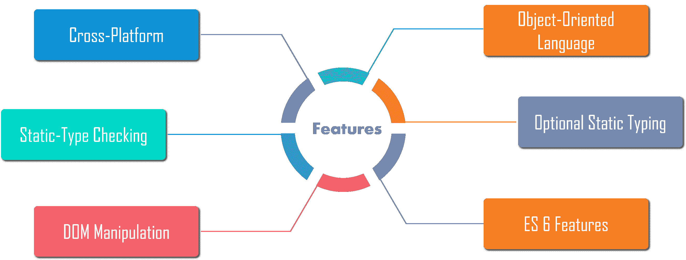
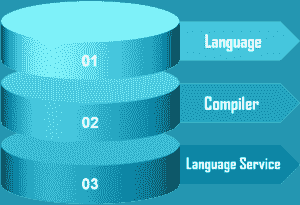
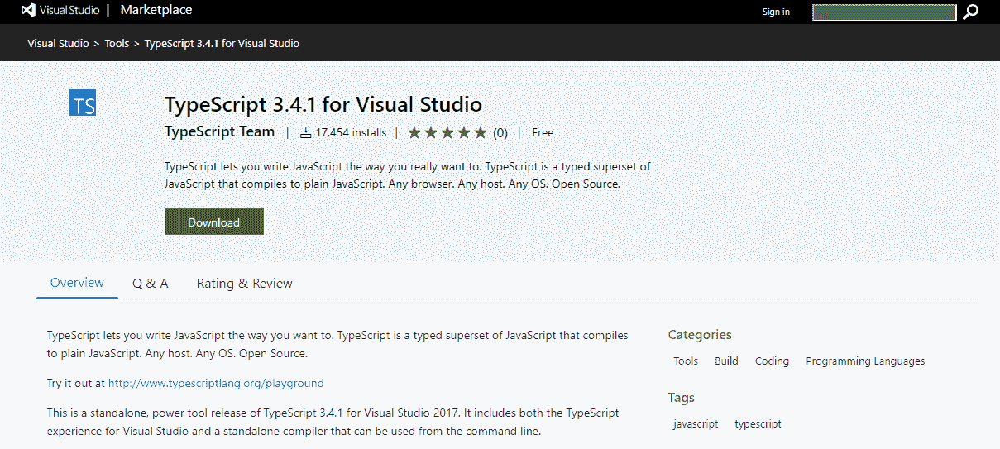
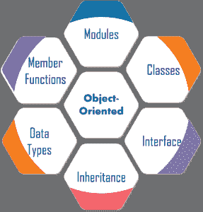
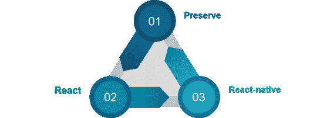

# 2023 年你必须准备的 50 个打字稿面试问题

> 原文：<https://www.edureka.co/blog/interview-questions/typescript-interview-questions/>

JavaScript 是 Web 开发不可或缺的一部分。这是一个新的客户端框架或技术的时代，如 AngularJs、Gulp、Grunt、Yeoman 等。，提供更好的用户体验。TypeScript 是 [JavaScript](https://www.edureka.co/blog/javascript-tutorial/) 的另一个重要部分，它让你以你真正想要的方式编写代码，并解决 JavaScript 问题。我相信你已经意识到了这些事实，这让你想到了这篇打字稿面试问题的文章。

因此，如果你计划在 Web 开发领域开始你的职业生涯，并且你希望了解与之相关的技能，现在正是时候，因为这项技术正处于蓬勃发展的状态。TypeScript 面试问题将为您提供深入的知识，并帮助您准备面试。

## **打印面试问题**

### **Q1。TypeScript 和 JavaScript 有什么区别？**

| **打字稿** | **JavaScript** |
| TypeScript 是一种面向对象的语言 | JavaScript 是一种脚本语言 |
| 它有一个特性叫做**静态类型** | 它没有静态类型 |
| TypeScript 支持模块 | JavaScript 不支持模块 |
| 它支持可选的参数功能 | 它不支持可选参数功能 |

### **Q2。什么是 TypeScript？**


TypeScript 是编译成普通 JavaScript 的 **JavaScript** 的类型化**超集**。它是纯面向对象的，有类、接口和静态类型的编程语言，如 [C#](https://www.edureka.co/blog/c-sharp-tutorial/) 或 [Java](https://www.edureka.co/blog/javascript-tutorial/) 。您将需要一个编译器来编译并生成 JavaScript 文件中的代码。基本上，TypeScript 是 JavaScript 的 ES6 版本，具有一些额外的特性。

**语法:**

```
var message:string = "Welcome to Edureka!"
console.log(message)
```

一段 TypeScript 代码写在一个带**的文件里。ts 扩展**然后用编译器编译成 JavaScript。您可以在任何代码编辑器中编写该文件，并且编译器需要安装在您的平台上。安装完成后，命令 **tsc <文件名>。ts** 将 TypeScript 代码编译成一个普通的 JavaScript 文件。

### **Q3。我们为什么需要 TypeScript？**

JavaScript 开发人员应该考虑使用 TypeScript 的原因有很多。其中一些包括:

*   **使用 ECMAScript 的新特性:** TypeScript 支持新的 ECMAScript 标准，并将其转换为您选择的 ECMAScript 目标。因此，您可以使用 ES2015 及更高版本的功能。

*   **静态类型:** JavaScript 是动态类型的，在运行时实际实例化之前不知道变量是什么类型。TypeScript 为 JavaScript 添加了类型支持。

*   **类型推断:**通过使用类型推断，TypeScript 使打字变得更容易，也更不明确。即使您没有显式地对类型进行类型化，它们仍然存在，以避免您做一些否则会导致运行时错误的事情。

*   **更好的 IDE 支持:**使用 TypeScript 的开发体验是对 JavaScript 的巨大改进。有许多 ide 对类型脚本有很好的支持，如[Visual Studio](https://www.edureka.co/blog/visual-studio-tutorial/)&VS code、  [Atom](https://www.edureka.co/blog/atom-python-ide/) 、Sublime 和 IntelliJ/WebStorm。

*   **严格的空值检查:**错误，如无法读取未定义的属性‘x’，常见于  [JavaScript 编程](https://www.edureka.co/blog/dom-in-javascript/)。您可以避免大多数这类错误，因为不能使用 TypeScript 编译器不知道的变量。

*   **互操作性:** TypeScript 与 JavaScript 密切相关，因此它具有强大的互操作能力，但是需要做一些额外的工作来与 TypeScript 中的  [JavaScript 库](https://www.edureka.co/blog/javascript-libraries/) 一起工作。

### **Q4。提及 TypeScript 的一些特性**

****

*   **跨平台:**TypeScript 编译器可以安装在 Windows、MacOS、Linux 等任何操作系统上。

*   **面向对象语言** : TypeScript 提供了  [类](https://www.edureka.co/blog/javascript-classes/)、接口、模块等特性。因此，它可以为客户端和服务器端开发编写面向对象的代码。

*   静态类型检查 : TypeScript 使用静态类型，并在编译时帮助进行类型检查。因此，您可以在编写代码时发现错误，而无需运行脚本。

*   可选的静态类型化:如果你使用 JavaScript 的动态类型化，TypeScript 也允许可选的静态类型化。

*   **DOM 操作**:您可以使用 TypeScript 操作 DOM 来添加或删除元素。

*   **ES 6 特性** : TypeScript 包含了计划中的 ECMAScript 2015 (ES 6，7)的大部分特性如类、接口、箭头函数等。

### **Q5。使用 TypeScript 有什么好处？**

使用 TypeScript 的好处是:

*   TypeScript 是  **快速、简单、易学** 并且可以在任何浏览器或 JavaScript 引擎上运行。

*   它与**JavaScript**相似，使用相同的语法和语义。

*   这有助于后端开发者更快地编写前端  **代码**。

*   您可以从一个  **现有的 JavaScript 代码**中调用类型脚本代码。此外，它可以与现有的 JavaScript 框架和库一起工作，没有任何问题。

*   扩展名为. d.ts 的定义文件支持现有的 JavaScript 库，如  **Jquery、D3.js** 等。

*   它包含了来自**ES6**T5**ES7**的特性，可以在类似  [Node.js](https://www.edureka.co/blog/node-js-installation/) 这样的 ES5 级 JavaScript 引擎中运行。

### **Q6。TypeScript 的缺点是什么？**

TypeScript 有以下缺点:

*   TypeScript 需要**长时间**来编译代码。

*   它不支持抽象类。

*   如果我们在浏览器中运行 TypeScript 应用程序，需要一个**编译步骤**来将 TypeScript 转换成 JavaScript。

*   Web 开发人员使用 JavaScript 已经几十年了，TypeScript 并没有带来任何新的东西。

*   要使用任何第三方库，**定义文件**是必须的。

*   类型定义文件的质量是一个问题。

### **Q7。TypeScript 有哪些组件？**

TypeScript 中有三种不同类型的组件，包括:

****

*   **语言**——由语法、关键字和类型注释组成。

*   **TypeScript 编译器**——这个**编译器(tsc)** 将以 TypeScript 编写的指令转换成其 JavaScript 等价物。

*   TypeScript 语言服务——该语言服务在核心编译器管道周围公开了一个附加层，类似编辑器的应用程序。语言服务支持一组常见的典型编辑器操作。

### **Q8。Typescript 是谁开发的，当前可用的稳定版本是什么？**

安德斯·海尔斯伯格开发了打字稿。同时，他也是 **C#** 语言开发团队的核心成员之一。typescript 于 2012 年 10 月 1 日首次发布，标记为版本 0.8。但是，它是由微软在 Apache 2 许可下开发和维护的。它是为大型应用程序的开发而设计的。

**TypeScript 目前的稳定版本是 2018 年 9 月 30 日发布的 3.2** 。Typescript 编译成简单的 JavaScript 代码，可在任何支持 ECMAScript 2015 框架的浏览器上运行。此外，它还支持最新的和不断发展的 JavaScript 特性。

### **Q9。如何安装 TypeScript？**

安装 TypeScript 工具有两种主要方式，例如:

1.  via**NPM**(node . js 包管理器)命令行工具

    `*npm install -g typescript*`

2.  通过  **Visual Studio** 安装[打字稿](https://www.npmjs.com/package/typescript)。

如果您使用 Visual Studio 或 VS Code IDE，添加到 Visual Studio 或 VS 代码的最简单方法是搜索并添加一个包或从 TypeScript 网站下载。此外，您可以下载 Visual Studio 的 TypeScript 工具。



### **Q10。如何编译 TypeScript 文件？**

任何类型脚本文件的扩展名都是**。ts** 。任何 JavaScript 文件都是类型脚本文件，因为它是 JavaScript 的超集。所以，一旦你改变了**的扩展名。js"** 到**"。ts"** ，你的打字稿文件准备好了。编译任何。ts 文件到。js 使用以下命令:

`tsc <TypeScript File Name>`

例如，编译 **"edureka.ts"**

`tsc edureka.ts`

结果是 **edureka.js**

### **Q11。我们能不能把多个？ts 文件合并成一个。js 文件？**

是的，我们可以合并多个文件。编译时，我们需要添加–outFILE[output js filename]选项。

`tsc --outFile comman.js file1.ts file2.ts file3.ts`

这将编译所有 3”。ts”文件并输出到单个“comman.js”文件中。

`tsc --outFile file1.ts file2.ts file3.ts`

如果不提供输出文件名，file2.ts 和 file3.ts 将被编译，输出将被放在 file1.ts 中。

### **Q12。有哪些不同类型的类型脚本？**

类型系统表示语言支持的不同类型的值。在程序存储或操作所提供的  **值** 之前，检查  **有效性** 。


它可以分为两种类型，例如:

*   **内置**:包括数字、字符串、布尔、void、null 和未定义。
*   **自定义**:包括枚举(enums)、类、接口、数组、元组。

### **Q13。列出 TypeScript 中的内置数据类型。**

在 TypeScript 中，内置数据类型也称为原始数据类型，列表包括:

*   **数字:**表示数字类型的值。这些数字在 TypeScript 中存储为浮点值。

*   **String:**String 表示存储为 Unicode UTF-16 代码的字符序列。

*   **布尔:**这代表一个逻辑值。当我们使用布尔类型时，我们得到的输出只有真或假。

*   **Null:** Null 表示值未定义的变量。不可能直接引用空类型值本身。

*   **未定义**:未定义类型表示所有未初始化的变量。

*   **Void**:Void 是不返回任何类型值的函数的返回类型。

### **Q14。TypeScript 中的变量是什么，如何创建？**

变量是内存中用来存储值的命名空间。在 TypeScript 中声明变量的类型语法包括变量名后的冒号(:)，后跟变量的类型。类似于 JavaScript，我们用 [var 关键字](https://www.edureka.co/blog/javascript-variable/) 来声明一个变量。在 Typescript 中声明变量时，必须遵循某些规则

*   变量名必须是一个**字母**或**数字**数字。
*   您不能以**位数字**开始姓名。
*   不能包含空格和**特殊字符**，除了**下划线(_)** 和**美元($)** 符号。

### **Q15。声明一个变量有哪些不同的方式？**

有四种方法可以声明变量:

```
var [identifier] : [type-annotation] = value; //Declaring type and value in a single statement
```

```
var [identifier] : [type-annotation]; //Declaring type without value
```

```
var [identifier] = value; //Declaring its value without type
```

```
var [identifier]; //Declaring without value and type
```

### **Q16。有没有可能编译？ts 自动随实时变化。ts 文件？**

是的，我们可以编译”。ts "自动随实时变化。ts 文件。这可以通过使用–watch 编译器选项来完成:

`tsc --watch file1.ts`

上面的命令首先编译 file1.js 中的 file1.ts，并观察文件的变化。如果检测到任何变化，它将再次编译文件。这里，我们需要确保在使用–watch 选项运行时命令提示符不能关闭。

### **Q17。TypeScript 支持哪些面向对象的术语？**

TypeScript 支持下列面向对象的术语:



*   **模块**
*   **类**
*   **接口**
*   **继承**
*   **数据类型**
*   **成员函数**

### **Q18。TypeScript 中的接口是什么？**

接口是在应用程序中定义契约的结构。它定义了类要遵循的语法。它只包含成员的声明，定义成员是派生类的责任。TypeScript 编译器使用 interface 进行类型检查，并检查对象是否具有特定的结构。

**语法:**

```
interface interface_name {
// variables' declaration
// methods' declaration
}
```

### **Q19。TypeScript 中的类是什么？列出一些特征。**

TypeScript 引入了类，这样它们就可以利用封装和抽象等面向对象技术的优势。TypeScript 编译器将 TypeScript 中的类编译成普通的 JavaScript 函数，以便跨平台和浏览器工作。

一个类包括以下内容:

*   **构造器**
*   **属性**
*   **方法**

**举例:**

```
class Employee {
empID: number;
empName: string;

constructor(ID: number, name: string) {
this.empName = name;
this.empID = ID;
}

getSalary() : number {
return 40000;
}
}
}
```

类的一些特征是:

*   **继承**
*   **封装**
*   **多态性**
*   **抽象**

### **Q20。TypeScript 支持哪些访问修饰符？**

TypeScript 支持访问修饰符 public、private 和 protected，它们确定类成员的可访问性，如下所示:

*   **Public**–该类的所有成员、其子类以及该类的实例都可以访问。

*   **Protected**–该类及其子类的所有成员都可以访问它们。但是类的实例不能访问。

*   **Private**–只有该类的成员才能访问它们。

如果没有指定访问修饰符，它就是隐式公共的，因为这符合 JavaScript 的便利性。

### **Q21。TypeScript 如何成为一种可选的静态类型语言？**

TypeScript 被称为可选静态类型，这意味着您可以要求编译器忽略变量的类型。使用任何数据类型，我们可以给变量赋任何类型的值。TypeScript 在编译期间不会进行任何错误检查。

**举例:**

```
var unknownType: any = 4;
unknownType = "Welcome to Edureka"; //string
unknownType = false; // A boolean.
```

### **Q22。TypeScript 中的模块是什么？**

模块是创建一组相关变量、函数、类和接口等的强大方法。它可以在自己的范围内执行，但不能在全局范围内执行。基本上，您不能在模块外部直接访问模块中声明的变量、函数、类和接口。

使用**导出**关键字可以创建一个模块，使用**导入**关键字可以在其他模块中使用。

**举例:**

```
module module_name{
class xyz{
export sum(x, y){
return x+y;
}
}
```

### **Q23。内部模块和外部模块有什么区别？**

| **内部模块** | **外部模块** |
| 内部模块将类、接口、函数、变量组合成一个单元，可以在另一个模块中导出。 | 外部模块有助于隐藏模块定义的内部语句，并且只显示与声明的变量相关联的方法和参数。 |
| 内部模块是早期 Typescript 版本的一部分。 | 外部模块在最新版本中被称为模块。 |
| 这些是其他模块的本地或导出成员。 | 这些是使用外部模块名引用的单独加载的代码体。 |
| 内部模块是使用指定其名称和主体的 modules 声明来声明的。 | 外部模块被编写为包含至少一个导入或导出声明的单独的源文件。 |

### **Q24。Typescript 中的命名空间是什么，如何声明？**

名称空间对功能进行逻辑分组。这些在内部维护 typescript 的遗留代码。它封装了共享某些关系的特性和对象。命名空间也称为内部模块。命名空间还可以包括接口、类、函数和变量，以支持一组相关的功能。

**语法:**

```
namespace <namespace_name> {
export interface I1 { }
export class c1{ }
}

```

### **Q25。TypeScript 支持函数重载吗？**

是的，TypeScript 支持函数重载。但是实现很奇怪。因此，当您在 TypeScript 中重载时，您只有一个具有多个签名的实现。

**例如:**

```
class Customer {
name: string;
Id: number;
add(Id: number);
add(name:string);
add(value: any) {
if (value && typeof value == "number") {
//Do something
}
if (value && typeof value == "string") {
//Do Something
}
}

```

第一个签名有一个 number 类型的参数，而第二个签名有一个 string 类型的参数。第三个函数包含实际的实现，并有一个 any 类型的参数。然后，实现检查所提供参数的类型，并根据提供者参数类型执行不同的代码。

### **Q26。解释 TypeScript 中的装饰者。**

装饰器是一种特殊的声明，可以应用于类、方法、访问器、属性或参数。Decorators 是以@expression symbol 为前缀的函数，其中 expression 必须计算出一个函数，该函数将在运行时使用有关被修饰声明的信息进行调用。

TypeScript Decorators 用于以声明的方式向现有代码添加注释和元数据。要启用对 decorators 的实验性支持，您需要在命令行或我们的 tsconfig.json 中启用 experimentalDecorators 编译器选项:

**命令行**

`$tsc --target ES5 --experimentalDecorators`

**tsconfig.json**

```
{
"compilerOptions": {
"target": "ES5",
"experimentalDecorators": true
}
}
```

### **Q27。什么是混合蛋白？**

在 Javascript 中，Mixins 是一种从可重用组件构建类，然后通过组合更简单的分部类来构建它们的方法。

这个想法很简单，不是 A 类扩展 B 类来获得它的功能，而是函数 B 接受 A 类并返回一个新的类，这个新的类增加了这个功能。这里，函数 B 是一个 mixin。

### **Q28。TypeScript 如何支持函数中的可选参数？**

与 JavaScript 不同，如果您试图调用一个函数，而没有提供函数签名中声明的参数的确切数量和类型，TypeScript 编译器会抛出错误。为了解决这个问题，您可以通过使用问号('？')来使用可选参数).它表示可能接收值也可能不接收值的参数可以附加一个“？”将它们标记为可选。

**举例:**

```
function Demo(arg1: number, arg2? :number) {
}So, arg1 is always required, and arg2 is an optional parameter.
```

在上面的示例中，arg1 始终是必需的，arg2 是可选参数。

### **Q29。什么是范围变量？**

范围是一组对象、变量和函数，JavaScript 可以有全局范围变量和局部范围变量。

您可以在两个不同的范围内声明变量，例如:

*   **局部作用域变量**–是在函数中使用的函数对象

*   **全局作用域变量**–你可以在函数外和函数内使用这个窗口对象

### **Q30。如何调试一个类型脚本文件？**

要调试任何 TypeScript 文件，您需要一个. js 源映射文件。所以你必须编译。带有–source map 标志的 ts 文件，以生成源映射文件。

`$ tsc -sourcemap file1.ts`

这将创建 file1.js 和 file 1 . js . map。file 1 . js 的最后一行将是源映射文件的引用。

`//# sourceMappingURL=file1.js.map`

### **Q31。什么是 TypeScript 定义管理器，我们为什么需要它？**

TypeScript 定义管理器(TSD)是一个包管理器，用于直接从社区驱动的定义类型的存储库中搜索和安装 TypeScript 定义文件。

现在，如果您想在您的。ts 文件:

`$(document).ready(function() { //Your jQuery code });`

这里，当你试图用 tsc 编译它时，会给出一个编译时错误:**找不到名字“$”**。因此，您需要通知 TypeScript 编译器“$”属于 jQuery。为了做到这一点，TSD 开始发挥作用。您可以下载 jQuery 类型定义文件并将其包含在我们的。ts 文件。

### **Q32。包含类型定义文件的步骤是什么？**

包含类型定义文件的过程中涉及的步骤有:

*   首先，你必须安装 TSD。

`$ npm install tsd -g`

*   接下来，在 TypeScript 目录中，通过运行以下命令创建一个新的 TypeScript 项目:

`$ tsd init`

*   然后安装 jQuery 的定义文件。

`tsd query jquery --action install`

*   上述命令将下载并创建一个新目录，其中包含以“. d.ts”结尾的 jQuery 定义文件。现在，通过更新 TypeScript 文件以指向 jQuery 定义来包含定义文件。

`/// <reference path="typings/jquery/jquery.d.ts" />``$(document).ready(function() { //To Do`

*   最后，重新编译。这一次 js 文件将被生成，没有任何错误。因此，对 TSD 的需求帮助我们获得所需框架的类型定义文件。

### **Q33。什么是 TypeScript 声明关键字？**

JavaScript 库或框架没有类型声明文件。但是如果您想在 TypeScript 文件中使用它们而不出现任何编译错误，就必须使用 declare 关键字。declare 关键字用于环境声明和方法，在这些声明和方法中，您希望定义可能存在于其他地方的变量。

如果你想在我们的 TypeScript 代码中使用这个库，你可以使用下面的代码:

```
declare var myLibrary;
```

TypeScript 运行时会将 **myLibrary** 变量赋值为任意类型。

### **Q34。TypeScript 中的默认参数函数是什么？**

默认情况下，可以为函数参数赋值。参数不能同时声明为可选的和默认的。

**举例:**

```
let discount = function (price: number, rate: number = 0.40) {
return price * rate;
}
discount(500); // Result - 200
discount(500, 0.45); // Result - 225
```

在上面的例子中，rate 是折扣函数中的一个默认参数。如果我们传递折扣的 rate 参数中的值，它将使用这个值，否则使用默认值 0.40。

### **Q35。什么是 tsconfig.json 文件？**

tsconfig.json 文件是 json 格式的文件。在 tsconfig.json 文件中，可以指定不同的选项来告诉编译器如何编译当前项目。目录中存在 tsconfig.json 文件表明该目录是 TypeScript 项目的根。

【tsconfig.json 文件示例:

```
{
"compilerOptions": {
"declaration": true,
"emitDecoratorMetadata": false,
"experimentalDecorators": false,
"module": "none",
"moduleResolution": "node"
"removeComments": true,
"sourceMap": true
},
"files": [
"main.ts",
"othermodule.ts"
]
}
```

### **Q36。TypeScript 中的泛型是什么？**

TypeScript 泛型是一种工具，它提供了一种创建可重用组件的方法。它能够创建能够处理各种数据类型而不是单一数据类型的组件。此外，它提供了类型安全性，而不会影响性能或生产率。泛型允许我们创建泛型类、泛型函数、泛型方法和泛型接口。

在泛型中，类型参数写在开()括号之间，这使得它成为强类型集合。它使用一种特殊的类型变量<t>来表示类型。</t>

**举例:**

```
function identity<T>(arg: T): T {
return arg;
}
let output1 = identity<string>("edureka");
let output2 = identity<number>( 117 );
console.log(output1);
console.log(output2);

```

### **Q37。接口语句和类型语句有什么区别？**

| **界面** | **类型** |
| 接口声明引入了命名的对象类型 | 类型别名声明引入了任何类型的名称，包括基元、联合和交集类型 |
| 它可以在 extends 或 implements 子句中命名。 | 不能在 extends 或 implements 子句中命名对象类型文本的类型别名 |
| 接口创建了一个到处都可以使用的新名称 | 他们没有创造任何新的名字 |
| 它可以有多个合并的声明 | 它不能有多个合并的声明 |

### **Q38。打字稿里的 JSX 是什么？**

JSX 是一种可嵌入的类似 XML 的语法，它旨在被转换成有效的 JavaScript。JSX 因 React 框架而变得流行起来。TypeScript 支持嵌入、类型检查和将 JSX 直接编译成 JavaScript。

如果您想在您的文件中使用 JSX，您需要用. tsx 扩展名命名您的文件并启用 jsx 选项。

### **Q39。TypeScript 支持哪些 JSX 模式？**

TypeScript 由三种 JSX 模式组成:



“保留”模式将 JSX 作为输出的一部分，供另一个变换步骤进一步使用。此外，输出将具有. jsx 文件扩展名。react 模式发出 React.createElement，在使用之前不需要经过 JSX 变换，并且输出将具有. js 文件扩展名。react-native 模式相当于 preserve 模式，它保留所有 JSX，但是输出的文件扩展名是. js。

### **Q40。什么是打字稿中的环境，什么时候使用它们？**

环境声明告诉编译器存在于别处的实际源代码。如果这些源代码在运行时不存在，而我们试图使用它们，那么它将会在没有警告的情况下中断。

环境声明文件类似于 docs 文件。如果源代码发生变化，文档需要保持更新，如果环境声明文件没有更新，那么您将得到编译器错误。此外，它允许我们安全方便地使用现有的流行 JavaScript 库，如 [jquery](https://www.edureka.co/blog/jquery-tutorial/) 、 [angularjs](https://www.edureka.co/blog/why-angularjs/) 、 [nodejs](https://www.edureka.co/blog/videos/nodejs-communication-and-round-robin-way/) 等。

### **Q41。什么是类型脚本映射文件？**

TypeScript 映射文件是一个源映射文件，它保存了关于原始文件的信息。的。映射文件是源映射文件，它允许工具在发出的 JavaScript 代码和创建它的 TypeScript 源文件之间进行映射。此外，调试器可以使用这些文件，这样我们就可以调试 TypeScript 文件，而不是 JavaScript 文件。

### **Q42。什么是 TypeScript 中的类型断言？**

类型断言的工作方式类似于其他语言中的类型转换，但它不执行其他语言(如 C#和 Java)中的类型检查或数据重构。类型转换附带运行时支持，而类型断言对运行时没有影响。然而，类型断言纯粹由编译器使用，并向编译器提供我们希望如何分析代码的提示。

**举例:**

```
let empCode: any = 007;
let employeeCode = <number> code;
console.log(typeof(employeeCode)); //Output: number

```

### **Q43。什么是 Rest 参数？**

rest 参数用于向函数传递零个或多个值。它是通过在参数前加上三点字符(“…”)来声明的。它允许函数在不使用 arguments 对象的情况下拥有可变数量的参数。当我们有不确定数量的参数时，这是非常有用的。

### **Q44。声明 Rest 参数的规则是什么？举个例子。**

rest 参数中要遵循的规则:

*   一个函数中只允许一个 rest 参数。
*   它必须是数组类型。
*   它必须是参数列表中的最后一个参数。

**举例:**

```
function sum(a: number, ...b: number[]): number {
let result = a;
for (var i = 0; i < b.length; i++) {
result += b[i];
}
console.log(result);
}
let result1 = sum(2, 4);
let result2 = sum(2,4,6,8);

```

### **Q45。TypeScript 中的“as”语法是什么？**

“as”是 TypeScript 中类型断言的附加语法。引入 as 语法的原因是原始语法与 JSX 相冲突。

**举例:**

```
let empCode: any = 007;
let employeeCode = code as number;
```

将 TypeScript 与 JSX 一起使用时，只允许 as 样式的断言。

### **Q46。解释 TypeScript 中的枚举。**

枚举是一种 TypeScipt 数据类型，它允许我们定义一组命名的常量。使用枚举可以更容易地记录意图，或者创建一组不同的事例。它是相关值的集合，可以是数值或字符串值。

**举例:**

```
enum Gender {
Male,
Female
Other
}
console.log(Gender.Male); // Output: 0
//We can also access an enum value by it's number value.
console.log(Gender[1]); // Output: Female
```

### **Q47。解释相对和非相对模块导入。**

| **相对** | **非亲属** |
| 非相对导入可以相对于 baseUrl 进行解析，或者通过路径映射进行解析。换句话说，当导入任何外部依赖项时，我们使用非相对路径。**举例:**`import * as $ from "jquery";` | Relative imports can be used for our own modules that are guaranteed to maintain their relative location at runtime. A relative import is starts with /, ./ or ../.**举例:**`import Entry from "./components/Entry";` |

### **Q48。什么是匿名函数？**

匿名函数是声明时没有任何命名标识符的函数。这些函数是在运行时动态声明的。同样，匿名函数可以接受输入并返回输出，就像标准函数一样。最初创建后，它通常不可访问。

**举例:**

```
let myAdd = function(x: number, y: number): number { 
return a+b; 
}; 
console.log(myAdd())
```

### **Q49。什么是 TypeScript 中的方法重写？**

如果子类或子类具有与父类中声明的方法相同的方法，这就是所谓的方法重写。基本上，它重新定义了派生类或子类中的基类方法。

**方法覆盖规则:**

*   该方法必须与父类中的名称相同
*   它必须具有与父类中相同的参数。
*   肯定是有关系或者继承的。

### **Q50。什么是 Lambda/Arrow 函数？**

ES6 版的 TypeScript 为定义匿名函数(即函数表达式)提供了速记语法。这些箭头函数也称为 lambda 函数。lambda 函数是没有名字的函数。而 arrow 函数省略了 function 关键字。

**举例:**

```
let sum = (x: number, y: number): number => { 
return x + y; 
} 
console.log(sum(10, 20)); //returns 30

```

在上例中，**？= >？**是一个**λ运算符**,( x+y)是函数的主体,( x: number，y: number)是内嵌参数。

到此，我们已经到了 TypeScript 面试问题博客的尾声。我希望这些**打字稿面试问题**能对你的面试有所帮助。如果你最近参加过面试，请把这些面试问题贴在评论区，我们会回答。如果你在面试中有任何问题，你也可以在下面评论。

*查看我们的 **[全栈 Web 开发人员硕士课程](https://www.edureka.co/masters-program/full-stack-developer-training)** ，该课程包含讲师指导的现场培训和真实项目经验。本培训使您精通使用后端和前端 web 技术的技能。包括 Web 开发、jQuery、Angular、NodeJS、ExpressJS 和 MongoDB 方面的培训。*

*有问题吗？请在“打字稿面试问题”博客的评论部分提到它，我们会给你回复。*