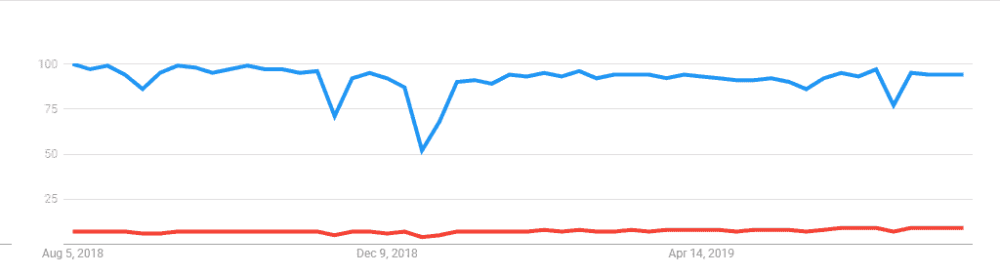

# TypeScript vs JavaScript:有什么区别？

> 原文：<https://www.edureka.co/blog/typescript-vs-javascript/>

嘿流浪者。您是否陷入了使用哪种脚本语言(TypeScript 或 JavaScript)的困境？嗯，这正是你该来的地方。这篇关于 **TypeScript vs JavaScript** 的文章将让你对 TypeScript 和 [JavaScript 编程语言](https://www.edureka.co/blog/javascript-tutorial/)有一个完整的了解，帮助你做出决定。

下面是这篇 TypeScript vs JavaScript 文章中涉及的主题:

*   [JavaScript 是什么？](#whatisjavascript)
*   [如何使用 JavaScript？](#howtousejavascript)
*   [为什么是 JavaScript？](#whyjavascript)
*   [什么是 TypeScript？](#whatistypescript)
*   [如何使用 TypeScript？](#howtousetypescript)
*   [为什么打字稿？](#whytypescript)
*   [TypeScript vs JavaScript](#Typescriptvsjavascript)
*   [当前 TypeScript 和 JavaScript 的趋势](#Trend)
*   [哪个比较好？](#better)

在创建交互式网页时，这两种语言都被广泛使用，当然，在这个互联网热情和必要性的时代，这种情况经常发生。因此，让我们深入挖掘并逐一理解 TypeScript 和 JavaScript，了解您头脑中的所有困惑。

## **JAVASCRIPT 是什么？**

[JavaScript](https://www.edureka.co/blog/javascript-tutorial/)(JS)是一种脚本语言，主要用于创建网页。它用于增强 HTML 页面，一般嵌入在 [HTML](https://www.edureka.co/blog/what-is-html/) 代码中。JavaScript 不需要编译，因为它是一种解释型语言。它有助于创建动态的、创造性的和交互式的网页。JavaScript 文件由。js 扩展。

## **如何使用 JAVASCRIPT？**

在 HTML 文件中使用 JavaScript 有两种方法。

*   将所有 JavaScript 代码嵌入到 HTML 代码中。
*   创建一个单独的 JavaScript 文件，可以从 Script 元素中调用该文件(用 Script 标记括起来)。

## **为什么是 JAVASCRIPT？**

JavaScript 是最常用的开源编程语言，在大多数现代 web 应用程序中广泛使用，包括客户端和服务器端。它很灵活，有一个相当优雅的核心，并使您能够使用面向对象和函数式编程。JavaScript 变量可以有任何类型的值，比如数字、[字符串](https://www.edureka.co/blog/javascript-string-functions/)、[数组](https://www.edureka.co/blog/javascript-array/)、布尔值等。

## **什么是 TYPESCRIPT？**

 TypeScript 是一种开源编程语言，可以让你以自己喜欢的方式编写 JavaScript。TypeScript 是编译成简单 JavaScript 的 JavaScript 的超集。TypeScript 是纯面向对象的，带有类和接口。它帮助程序员编写面向对象的程序，并在服务器端和客户端将它们编译成 JavaScript。

## **如何使用 TYPESCRIPT？**

打字稿代码写在文件里，后面跟。ts 扩展。需要在您的平台上安装一个 TypeScript 编译器，然后使用命令“tsc”将 TypeScript 代码编译成普通的 JavaScript 文件。ts”。TypeScript 文件可以在任何代码编辑器中编写，一旦它被转换成普通的 JavaScript 文件，就可以包含在 HTML 中，并可以在任何浏览器上运行。

tsc 示例. ts

Example.ts—————🡪Example.js

## **为什么打字稿？**

TypeScript 是一种开源语言，它扩展、简化了 JavaScript 代码，使其更易于阅读和调试。它为 JavaScript IDEs 和实践提供了高效的开发工具，比如静态检查。此外，对于已经在从事 JavaScript 工作的程序员来说，它很容易学习和实现。它与现有的 [JavaScript 库](https://www.edureka.co/blog/javascript-libraries/)和[框架](https://www.edureka.co/blog/top-10-javascript-frameworks/)配合良好。

在了解了这两种语言的基本定义和特征之后，现在让我们来比较它们，并了解更多关于这两种语言的信息。

## **TypeScript vs JavaScript**

|  | Java Script 语言 | 以打字打的文件 |
| 语言 | 脚本语言 | 面向对象的编程语言 |
| 学习曲线 | 灵活易学 | 程序员应该事先掌握脚本知识 |
| 类型 | 轻量级的解释编程语言 | 强类型面向对象编程语言 |
| 客户端/服务器端 | 客户端和服务器端 | 专门用于客户端 |
| 文件扩展名 | 。射流研究… | 。ts 或者。tsx |
| 时间 | 更快的 | 编译代码需要时间 |
| 数据绑定 | 没有类型和接口的概念 | 用于描述所用数据的概念，如类型和接口。 |
| 释文 | 不需要注释 | 代码必须不断地被注释以充分利用 TypeScript 的特性。 |
| 句法 | 所有的语句都写在脚本标签中。浏览器程序开始将这些标签之间的所有文本解释为一个脚本<脚本> // javascript 代码</脚本> | 一个打字稿程序由以下部分组成:模块函数变量语句表达式注释 |
| 静态打字 | JavaScript 中没有静态类型的概念 | 支持静态类型。 |
| 模块支持 | 不支持模块 | 为模块提供支持 |
| 连接 | 没有接口 | 有一个接口 |
| 可选参数函数 | 不支持 | 支持 |
| 原型特征 | 没有任何这样的功能 | 具有原型的特征 |
| 开发者社区 | 由于 JavaScript 占据了大部分代码，它被编程社区广泛接受和使用 | TypeScript 是新的，并且具有相对较小的社区基础。 |
| 选择偏好 | JavaScript 更适合在小型编码项目中使用。 | TypeScript 是一种面向对象的语言，它使代码更加一致、干净、简单和可重用。所以大型项目最好使用 TypeScript。 |

## **打字稿代码示例**

```
var message:string =“Hey People”console.log(message)

```

编译时，它将生成下面的 JavaScript 代码。

```
var message = “Hey People”;
console.log(message);

```

第一行声明了一个名为 message 的变量。第二行将变量值打印到提示符下。在这里，控制台是指终端窗口，函数 log()用于在屏幕上显示文本。

JAVASCRIPT 代码示例:

```
<html>
<body>
<script
language=”javascript”
type=”text/javascript”>
<!–
document.write
(“Hello World!”)
//–>
</script>
</body>
</html>
```

## **当前 TypeScript 和 JavaScript 的趋势**



在 Typescript 和 JavaScript 之间的对峙之后，您必须清楚哪种语言更适合您。现在，让我们以最后一瞥来结束这篇文章，从更广泛的意义上看，哪一个更好。

## **哪个比较好？**

正如本文中所讨论的，TypeScript 是 JavaScript 的超集，这意味着 TypeScript 是具有附加功能的 JavaScript。它编译成简单的 JavaScript，可以用于任何 JavaScript 代码，所以使用 TypeScript 更有优势。尽管 JavaScript 被广泛使用，但由于 TypeScript 相对于 JavaScript 的许多优点和特性，它的受欢迎程度和被采用的程度与日俱增。但是 TypeScript 永远无法取代 JavaScript，因为 TypeScript 的核心是 JavaScript。然而，它可能会取代人们为 web 应用程序编写代码的方式。

*既然你已经了解了 TypeScript vs JavaScript，那就去看看 Edureka 的 **[Web 开发认证培训](https://www.edureka.co/complete-web-developer)** 。* *Web 开发认证培训将帮助您学习如何使用 HTML5、CSS3、Twitter Bootstrap 3、jQuery 和 Google APIs 创建令人印象深刻的网站，并将其部署到亚马逊简单存储服务(S3)。*

*有问题吗？请在“TypeScript 与 JavaScript”的评论部分提到它，我们会尽快回复您。*