# ui path Web Automation–Web 提取的一站式解决方案

> 原文：<https://www.edureka.co/blog/uipath-web-automation/>

企业和初创公司都将其应用程序设置在广泛结构化的基于 web 的系统上。这些基于网络的系统中的信息非常复杂，需要大量的处理才能被阅读、理解和分析。嗯，对此，我们需要[机器人流程自动化。](https://www.edureka.co/robotic-process-automation-training)在 UiPath Web Automation 的帮助下，我们可以自动化各种类型的任务，如表单填写、屏幕抓取、数据提取网站测试等。

本文将涵盖以下主题:

*   什么是机器人过程自动化？
*   [什么是 UiPath？](#What%20is%20UiPath?)
*   什么是 Web 自动化？
*   [网络自动化的使用](#Usage%20of%20Web%20Automation)
*   [动手操作:谷歌联系人的网络抓取](#Hands-On:%C2%A0Web%20Scraping%20of%20Google%20Contacts)
*   [动手操作:从电子商务网站提取数据并存储在电子邮件中](#Hands-On:%C2%A0Extracting%20Data%20From%20a%20E-Commerce%20Website%20and%20storing%20in%20Email)

所以，让我们开始吧！！

## **什么是机器人过程自动化？**

在机器人/软件的帮助下自动化工作流程以减少人类参与的过程被称为  [**机器人过程自动化。**](https://www.edureka.co/blog/rpa-tutorial/)

这里主要有三个术语你需要了解: *机器人，过程* 和  *自动化。* 让我为你一一解释这些术语。

*   **机器人:**模仿人类行为的实体称为机器人。
*   **过程:**导致有意义活动的一系列步骤。例如，泡茶的过程或你最喜欢的菜等。
*   **自动化:**任何由机器人完成的没有人为干预的过程。

如果我们将所有术语总结在一起，那么，在没有任何人类干预的情况下，模仿人类的行动来执行一系列步骤，从而导致有意义的活动，这被称为 [**机器人过程自动化**。](https://www.edureka.co/blog/what-is-robotic-process-automation/)

现在，为了实现机器人流程自动化，我们需要工具，其中一个工具就是 UiPath。因此，在这篇关于 UiPath Web Automation 的文章中，让我们简要了解一下 UiPath。

## **什么是 UiPath？**

UiPath 是一个机器人流程自动化工具，主要用于 Windows 桌面自动化。该工具提供了一个社区版，终身免费，并支持拖放功能。使用 UiPath，您可以执行[各种类型的自动化](https://www.edureka.co/blog/uipath-automation-examples)如 Excel 自动化、Citrix 自动化、Web 自动化、 [PDF 自动化](https://www.edureka.co/blog/uipath-pdf-data-extraction/)等等。在这篇文章中，我们将关注 Web 自动化。

## **什么是 Web 自动化？**

Web 自动化是一个自动化过程，通过这个过程，您可以根据属性来识别 web 元素，并相应地操作它们。这种自动化适用于任何网站，也可以远程部署在网络中的各种机器上。UiPath 提供了一个内置的记录器，可以在直观的图形化工作流编辑器的帮助下读取和执行基于 web 的活动。

您也可以浏览 UiPath Web Automation 的录音，其中我们的 ***[认证](https://www.edureka.co/blog/robotic-process-automation/)***RPA 培训 ***[专家](https://www.edureka.co/robotic-process-automation-training)*** 对概念进行了深入的解释。

## **ui path Web Automation |自动化 Web 数据提取–ui path | edu reka**

[https://www.youtube.com/embed/96pDRsPbb10?rel=0&showinfo=0](https://www.youtube.com/embed/96pDRsPbb10?rel=0&showinfo=0)

本视频将帮助您了解如何使用 UiPath 实现 web 自动化。

现在，让我们看看 UiPath 中 Web 自动化的顶级实现。

## **Web 自动化的使用**

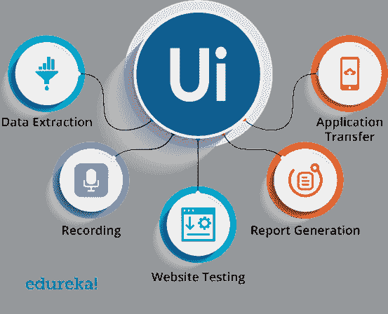web 自动化在当今行业中的主要用途有:

*   **数据提取:**可以从各种网站提取海量数据并存储到文件和数据库中。
*   **记录:**在网站上执行的操作可以被记录下来，以便将来进一步执行。
*   **网站测试:**您的网站功能和特性可以根据用户的要求进行测试。
*   **报表生成:**可以通过提取所有数据，然后对各种参数进行分析，生成报表。
*   **应用转移:**根据使用需求，应用可以从一个域转移到另一个域。

网络抓取可以用于各种类型的网页格式，如 JSON，HTML。现在，你知道什么是 web 自动化，让我们看看如何使用 UiPath 来执行 Web 自动化的实用方法。在本文中，我们将看到两次动手实践。它们是:

*   从谷歌联系人中抓取数据
*   从电子商务网站抓取数据并存储在电子邮件中

让我们从本文中关于 UiPath Web Automation 的第一手操作开始。

## **动手:谷歌通讯录的网页抓取**

### **任务**

从 Google 联系人中提取数据，并存储在文件中。

### **步骤自动化**

按照以下步骤完成任务:

*   使用数据抓取工具提取数据。
*   相应地提取相关值。
*   使用 Write CSV 活动将数据存储在 CSV 文件中。

### **解**

**第一步:** 打开谷歌联系人页面提取数据。

**第二步:** 现在，打开 **UiPath 工作室**，创建**黑项目。**

**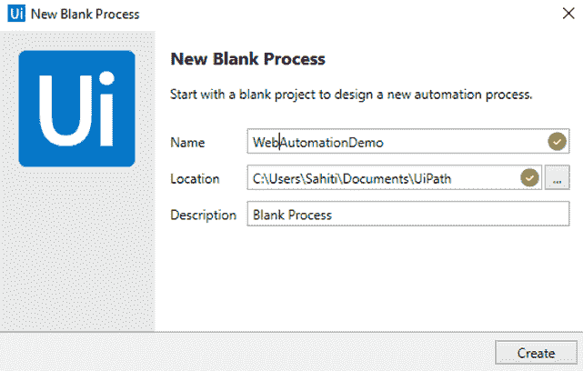第三步:**从功能区中选择  **数据抓取**  选项，选择您想要选择的元素。在下面的对话框中，按下  **下一步**  。

**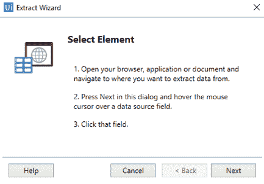步骤 3.1: ** 将鼠标悬停在某个数据源字段上，然后点击该数据源字段。在这里我要选择名字。

**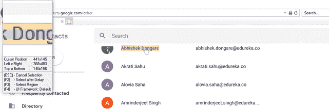步骤 3.2: ** 之后，你会看到另一个对话框，要求你选择第二个元素来创建一个图案。

**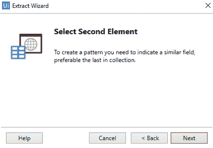第四步:** 一旦你选择第二个元素来创建一个模式，你会得到一个 **配置列** 的选项。在打开的对话框中，您可以重命名列名并提取 URL。之后点击**下一个**。参考下文。

**第五步:** 现在，要从网站提取其他数据源，点击 * **提取相关数据** * 选项，重复上述步骤。在这里，我将提取联系人的电子邮件 id。您会看到下面的输出。

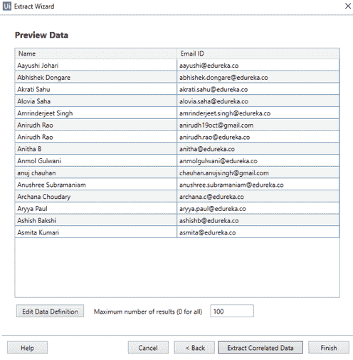

**第六步:** 提取完所有需要的数据后，点击 **完成** 。此操作将打开一个对话框，询问您是否希望将数据跨多个页面。参考下文。

**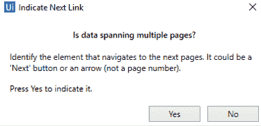第七步:** 要跨多个页面，选择 **是** 并将鼠标悬停在该区域，可重定向至下一页面。然后，您将被重定向到您的 UiPath 仪表板。

**第八步:** 现在将提取的所有数据保存到一个. csv 文件中，拖动 **将 CSV 活动** 写入 **Do** 段的 **数据抓取** 。

**第九步:** 在 **文件的** 段中提到了这个活动的 ***路径。csv 文件*** 你要存储提取的数据然后在 **数据表段** 中提到 ***提取数据表变量*** 。参考下文。

**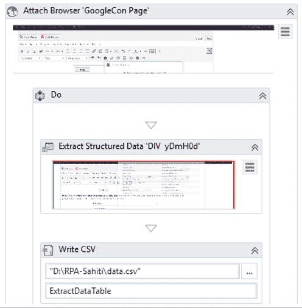**

*NOTE: The ExtractDataTable variable is the output variable that is automatically generated from the Data Scraping Wizard. You can find this variable in the Extract Structured Data activity.*

****步骤 10:** 点击 **运行** 按钮执行此序列。您会看到数据存储在。csv 文件。**

**伙计们。这就是你从网站中提取数据的方式。现在，您已经知道了如何从网站上抓取数据，让我们继续这篇文章中关于 UiPath Web Automation 的第二次动手操作。**

## ****动手:从一个电子商务网站提取数据****

### ****任务****

**在这次实践中，我的任务是设计自动阅读电子邮件的主题行并执行自定义搜索。因此，举例来说，如果我的主题是 LG 电视，那么设计的自动化必须在 Flipkart 中搜索 LG 电视，并提取名称、URL 和价格。**

### ****步骤自动化****

**按照以下步骤完成任务:**

***   拖动“获取 IMAP 邮件”活动并配置该活动。*   拖动每个活动的以执行一组操作。*   拖动打开的浏览器活动并提及 URL*   使用数据抓取工具并提取数据。*   相应地提取相关值。*   拖动“写入 CSV”活动，并提及文件的路径。*   使用“发送 SMTP 邮件”活动发送电子邮件。**

### ****解****

****第一步:**创建一个**空白项目****

**第二步:我们的第一个任务是收到一封带有主题行的电子邮件。在这里，我希望主题行是苹果手机。因此，要做到这一点，拖动**获取 IMAP 邮件消息**活动。**

****步骤 2.1:** 转到该活动的**属性窗格**，并提及以下内容:**

***   端口号:993*   服务器名称:“imap.gmail.com”*   电子邮件:提及你的电子邮件 ID*   密码:说出你的密码*   Top: 1(这只会显示收件箱中的第一封至第一封电子邮件。)*   选中只读未读邮件框。(这将只读取未读邮件。)**

**参考下文。**

**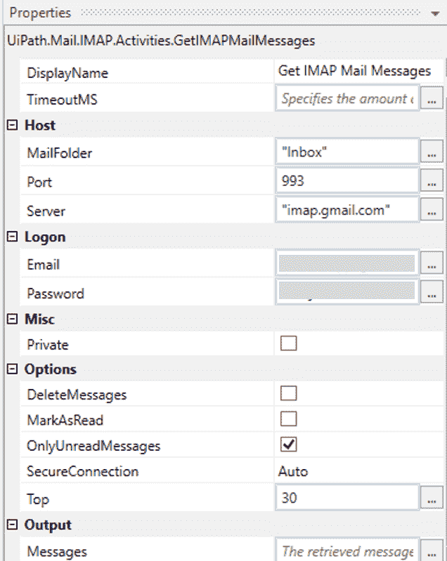 **步骤 2.2:** 现在为了存储来自电子邮件的数据，我们需要创建一个变量。因此，要创建一个变量，进入**变量面板**并提及变量的名称和类型。这里我将把名称称为 M **ailMessages** ，类型称为 **List < T >** 。**

****步骤 2.3:** 现在在< T >中，就不得不提一下**邮件消息**。为此，**在变量部分浏览类型**并搜索 **System.Net.Mail.** 在该部分下，您必须选择 **MailMessage** 。参考下文。**

** **步骤 2.4:** 在**获取 IMAP 邮件消息**活动的输出部分提到变量 **MailMessages** 。**

****第三步:**现在，为了能够阅读‘n’封电子邮件的信息，您必须拖动每个活动的**，在**获取 IMAP 邮件消息活动的下面。******

****步骤 3.1:** 接下来，在**项段**中提及**邮件**，在**表达式段**中提及 **MailMessages** 变量。这将使您能够对每封邮件执行正文部分提到的一系列操作。另外，在本活动的**属性部分**中，提到**类型参数**为**系统。Net.MailMessage** 。参考下文。**

**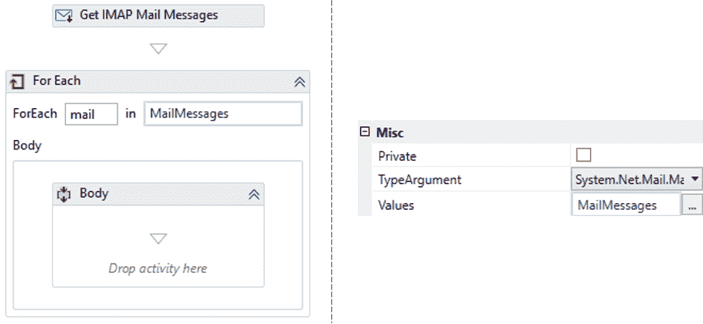 **第四步:**现在，你要打开 Flipkart 网站。为此，您必须拖动 F **或每个活动**的**主体部分**中的**打开浏览器活动**，并在双引号中提及 URL。在这里我会搜索化石手表，并提到[网址](https://www.flipkart.com/search?q=fossil%20watches&otracker=search&otracker1=search&marketplace=FLIPKART&as-show=on&as=off)。**

***Note: It doesn’t matter what you search for, since we will change the URL in the next step.***

******步骤 5:** 现在，由于我们的任务是阅读主题行，然后搜索主题行中提到的项目，我们必须**修改**打开浏览器活动**中提到的 URL** 。****

****所以，如果你的网址如下:****

*******https://www.flipkart.com/searchq=fossil%20watches&otracker = search&otracker 1 = search&market place = FLIPKART&as-show = on&as = off***，然后你让**更改搜索参数**下的项目，并包含 **+mail。引号中的主题+**。所以，你的新网址应该如下所示。****

*******https://www.flipkart.com/search?q="+mail.Subject+"&otracker = search&otracker 1 = search&market place = FLIPKART&as-show = on&as = off*******

****参考下文。****

****到目前为止，你已经将你的自动化设计为阅读电子邮件的主题行，然后在 Flipkart 网站中执行自定义搜索。因此，如果主题行有苹果手机，那么设计的自动化将读取主题行并在 Flipkart 中搜索苹果手机。****

****现在，我们的下一个任务是执行数据搜集。****

******步骤 6:** 进行数据抓取，可以参考我们之前的**动手，执行 1-7T5[步骤。](#Steps%20from%201-7)******

******步骤 7:** 现在，一旦你已经抓取了数据并被重定向到 UiPath 仪表板，你必须删除**附加浏览器活动**，并且只保留每个活动的**主体部分**中的**提取数据表部分**。****

******第八步:**之后，将提取的所有数据保存到一个. csv 文件中，将一个**写 CSV 活动**拖到每个活动的**的 **Do** 段中。******

******第九步:** 接下来，在 **文件的** 活动的路径部分，提到了 ***的路径。csv 文件*** 你要存储提取的数据然后在 **数据表段** 中提到 ***提取数据表变量*** 。参考下文。****

****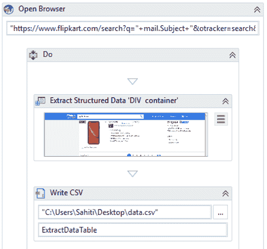 **步骤 10:** 现在，要获得一封包含所有数据的电子邮件，您必须将**发送 SMTP 邮件消息活动**拖动到序列中。****

******步骤 10.1:** 在此活动中，您必须提及以下内容:****

*****   收件人电子邮件地址:“abc@gmail.com”*   主题:“附件”*   正文:“PFA”****

****这一步将设计一个任务，发送一封电子邮件包含刮数据，提到的电子邮件地址与主题行附件和机构是 PFA。参考下文。****

******步骤 10.2:** 由于我们还没有附加文件，要附加文件，在本活动中点击**附加文件选项**，并在打开的对话框中提及文件的路径。然后点击**确定。**参考下文。****

******步骤 10.3:** 现在，您必须转到 SMTP 活动的**属性窗格，并提及以下内容:******

*****   端口号-> 465*   服务器名称:“smtp.gmail.com”*   电子邮件:提及发件人电子邮件地址*   密码:输入发件人电子邮件地址的密码*   发件人:提及发件人电子邮件地址****

******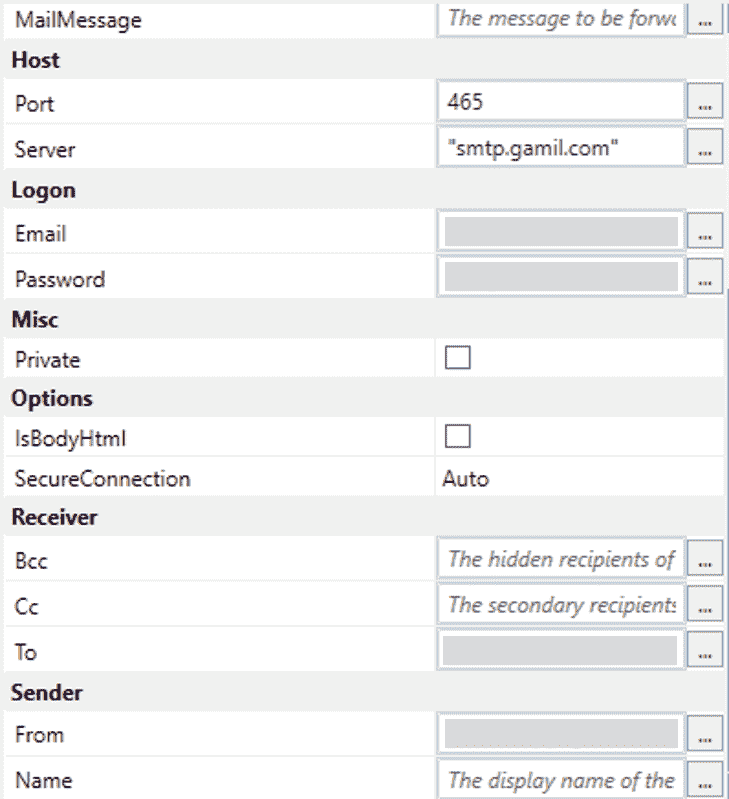******

******步骤 11:** 现在，给自己写一封邮件，主题为 **apple%20phones** (%20 用于标识 UiPath 中的空格)。收到邮件后，返回 UiPath 仪表盘，点击**运行**执行自动化操作。您会看到一封邮件，其中附有抓取的数据。参考下文。****

****伙计们，这篇关于 UiPath 自动化示例的文章到此结束。我希望您喜欢阅读这篇关于 UiPath Web Automation 的文章，并学习如何自动化任务。如果你希望进一步了解机器人过程自动化，并成为一名 [RPA 开发人员](https://www.edureka.co/blog/rpa-developer-roles-and-responsibilities/)，那么你可以使用 UiPath 查看我们关于 ***[机器人过程自动化的课程。](https://www.edureka.co/robotic-process-automation-training)*** 本课程将帮助您增强 RPA 方面的知识，并为您提供大量 UiPath 实践经验。****

*****有问题吗？请在“ **UiPath Web Automation** ”的评论区提出来，我会回复你。*****