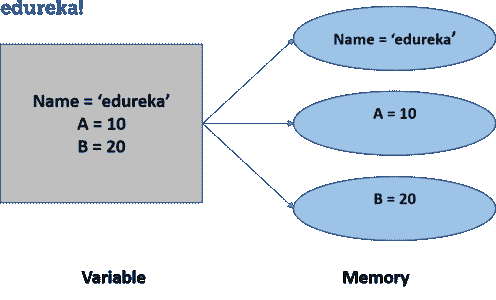
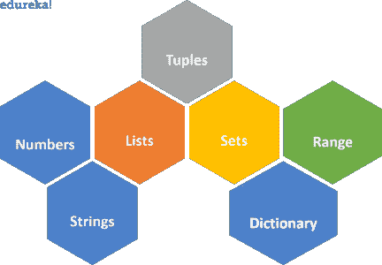
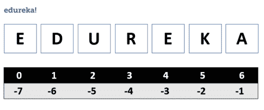

# 什么是 Python 数据类型和变量？

> 原文：<https://www.edureka.co/blog/variables-and-data-types-in-python/>

Python 编程语言是当今最受欢迎的编程语言之一。开发人员希望专注于实现部分，而不是花时间编写复杂的程序。这是 python 实际提供的地方，具有易访问性和可读性。[基本概念](https://www.edureka.co/blog/introduction-to-python/)是任何编程语言的基础，因此在这篇博客中，我们将学习 Python 变量和 Python 数据类型的概念。以下是本博客的主题:

*   [Python 中有哪些变量？](#1)
*   [变量定义&声明](#2)
*   [Python 中的数据类型](#3)
    *   [数值数据类型](#4)
    *   [琴弦](#5)
    *   [列出了](#6)
    *   [元组](#7)
    *   [集](#8)
    *   [字典](#9)
    *   [范围](#10)

## **Python 中有哪些变量？**

python 中的变量和数据类型顾名思义就是变化的值。在编程语言中，变量是存储值的内存位置。您存储的值将来可能会根据规格发生变化。



一个 Python 变量一旦被赋值就被创建。在 python 中声明变量不需要任何额外的命令。

在编写变量时，我们必须遵循一定的规则和条例，让我们看看变量的定义和声明，以了解我们如何在 python 中声明变量。

## **变量定义&声明**

Python 没有额外的命令来声明变量。一旦给它赋值，变量就被声明了。

```

x = 10
#variable is declared as the value 10 is assigned to it.

```

在声明一个变量时，我们必须记住一些规则:

1.  变量名不能以数字开头。它只能以字符或 n 下划线开头。
2.  python 中的变量是区分大小写的。
3.  它们只能包含字母数字字符和下划线。
4.  不允许使用特殊字符。

python 中有几种数据类型。让我们来看看 python 数据类型。

我们在 python 中声明的每个值都有一个数据类型。数据类型是类，变量是这些类的实例。

## **Python 中的数据类型**

根据它们所拥有的属性，主要有六种 python 数据类型。尽管在 python 中使用[循环时，还有一个经常使用的数据类型范围。](https://www.edureka.co/blog/loops-in-python/)



### **Python 中的数值数据类型**

数值数据类型保存数值。在数字数据中也有 4 个子类型。以下是数值数据类型的子类型:

1.  整数
2.  浮动
3.  复数
4.  布尔型

**整数**用来表示整数值。

```

x = 100
y = 124
# it will be the integer as long as the value is a whole number.

```

要检查任何变量的数据类型，我们可以使用 **type()** 函数。它将返回提到的变量数据类型的类型。

浮点数据类型用于表示小数点数值。

```

x  = 10.25
y = 12.30

```

**复数**用来表示虚数。虚数在数字末尾用“j”表示。

```

x = 10 + 5j

```

**布尔**用于分类输出，因为布尔的输出不是真就是假。

```

num = 5 > 4
#num is the boolean variable
type(num)
#the output will be bool
print(num)
#this will print true.

```

### **琴弦**

python 中的字符串用来表示 unicode 字符值。Python 没有字符数据类型，单个字符也被视为字符串。

我们用单引号或双引号来表示或声明字符串值。为了访问字符串中的值，我们使用索引和方括号。



```
name = 'edureka'
name[2] 
#this will give you the output as 'u'

```

字符串本质上是不可变的，这意味着一旦被替换，你就不能改变它。

**命令行输入为字符串**

```
x = input()
print( 'hello' , x)

```

**操作使用字符串**

```

name = 'edureka'
name.upper()
#this will make the letters to uppercase
name.lower()
#this will make the letters to lowercase
name.replace('e') = 'E'
#this will replace the letter 'e' with 'E'
name[1: 4]
#this will return the strings starting at index 1 until the index 4.

```

现在我们已经理解了数字和字符串，让我们来理解相对复杂的数据类型。

### **列出了**

List 是 python 中四种集合数据类型之一。当我们选择集合类型时，了解集合的功能和限制是很重要的。元组、集合和字典是 python 的另一种集合数据类型。

与字符串不同，列表是有序且可变的。我们也可以添加重复的值。我们用方括号来声明一个列表。

```

mylist = [10,20,30,40,20,30, 'edureka']

```

**从列表中取值**

我们使用索引来访问字符串中的值。

```

mylist[2:6]

#this will get the values from index 2 until index 6.

```

**添加/替换列表中的值**

```

mylist[6] = 'python'

#this will replace the value at the index 6.

mylist.append('edureka')

#this will add the value at the end of the list.

mylist.insert(5, 'data science')

#this will add the value at the index 5.

```

我们可以对列表执行的其他操作如下:

| **方法名** | **属性** |
| 清除() | 从列表中移除所有元素 |
| 复制() | 返回列表的副本 |
| 扩展() | 将列表元素添加到当前列表的末尾 |
| 计数() | 返回指定值的元素个数 |
| 索引() | 返回元素的索引 |
| 流行() | 从指定位置移除元素 |
| 移除() | 移除具有指定值的项 |
| 排序() | 对列表排序 |
| 反向() | 返回反转列表 |

列表可以将任何数据类型存储为项目。无论是数字、字符串还是任何其他数据类型。

```

a = [10,20,30]

b = [60 , 50 , 40, a]

#to access a value from the list a we can write

b[3][2]

#this will return 30 as output.

```

让我们理解 python 中的下一个集合数据类型，即元组。

### **元组**

元组是不可改变或不可变的集合。它是有序的，并且可以使用索引值来访问这些值。一个元组也可以有重复的值。为了声明一个元组，我们使用圆括号。

```

mytuple = (10,10,20,30,40,50)

#to count the number of elements

mytuple.count(10)

#the output will be 2

#to find the index

mytuple.index(50)

#the output will be 5\. since the index number at 50 is 5.

```

因为一旦你声明了一个元组，它就不可改变，所以你不能在元组上执行很多操作。但是使用 tuple 也有好的一面，你可以在 tuple 中存储你不想在项目中改变的值。虽然您可以访问这些值，但是不会有任何更改。

### **集**

集合是一个无序的集合，它也没有任何索引。为了在 python 中声明一个集合，我们使用了花括号。

```

myset = {10, 20 , 30 ,40, 50, 50}

```

集合没有任何重复值，即使在声明集合时不会显示任何错误，输出也只有不同的值。

要访问集合中的值，我们可以遍历集合，或者使用一个[成员操作符](https://www.edureka.co/blog/operators-in-python/)来找到一个特定的值。

```
for x in myset:
print(x)
#this will get all the values.
20 in myset
#this will  return true if the value is in the set.
#to add a value in a set
myset.add('edureka')
#to add multiple values in a list
myset.update([ 10, 20, 30, 40, 50])
#to remove an item from a set
myset.remove('edureka')
#we can use the discard or pop method to remove an item from a set as well.
myset = {10, 20, 30}
myset1 = {10,30,50}
myset.issubset(myset1)
#this will return false
myset.union(myset1)
#this will return a set with the union of the two sets.

```

| **方法名** | **属性** |
| 清除() | 从集合中清除项目 |
| 复制() | 返回集合的副本 |
| 差异() | 返回两个集合之差的集合 |
| isdisjoint() | 返回集合是否有交集 |
| issubset() | 如果集合是子集，则返回 |
| 对称差分() | 返回具有对称差的集合 |
| 更新() | 用集合的并集更新集合 |

让我们来看看另一种具有键值对的集合数据类型。

### **字典**

字典就像 python 中的任何其他集合数组一样。但是它们有键值对。字典是无序的，多变的。我们使用这些键来访问字典中的条目。为了声明一个字典，我们使用花括号。

```

mydictionary = { 'python': 'data science', 'machine learning' : 'tensorflow' , 'artificial intelligence': 'keras'}

mydictionary['machine learning']

#this will give the output as 'tensorflow'

mydictionary.get('python')

#this serves the same purpose to access the value.

```

由于我们使用密钥来访问项目，因此它们不能重复。这些值可以有重复的项目。

**字典中的数据操作**

```

#adding a new value

mydictionary['analysis'] = 'matplotlib'

#replacing a value

mydictionary['analysis'] = 'pandas'

#deleting a value

mydictionary.pop('analysis')

#remove() , del also serves the same purpose for deleting a value.

```

字典中的其他操作包括。

| **方法名** | **属性** |
| 复制() | 返回字典的副本 |
| 清除() | 清除字典 |
| 项目() | 返回包含键值对元组的列表 |
| 按键() | 返回包含所有键的列表 |
| 更新() | 用所有的键值对更新字典 |
| 值() | 返回字典中所有值的列表 |
| setdefault() | 返回指定键的值 |

### **射程**

范围是一种数据类型，主要在我们使用循环时使用。让我们举个例子来理解这一点。

```

for x in range(10):

print(x)

#this will print the numbers from 0-10\. Range will have the numbers from 0-10

```

现在我们已经了解了不同的 python 数据类型，还有另一个重要的类型转换概念，当我们从一种数据类型转换到另一种数据类型时，这个概念很有帮助。让我们理解类型转换的概念。

### **型铸造**

类型转换基本上是将一种数据类型转换成另一种数据类型的过程。python 数据类型中的每种数据类型都有构造函数。

1.  列表()
2.  set()
3.  元组()
4.  dict()
5.  str()
6.  int()
7.  float()

我们可以简单地使用这些构造函数来使用指定的数据类型，或者我们可以使用这些构造函数将一种数据类型改变为另一种。让我们通过一个例子来理解这一点。

```

a = [ 10 , 20 ,30,40]

#to change this list into a tuple i can simply write

tuple(a)

#now the list will change to a tuple.

```

使用这些构造函数，我们可以使用不同的数据类型和其他的功能。假设我们将示例中提到的列表声明为程序中的一个元组，那么对于该特定操作，它将变得不可变。同样，我们也可以使用其他构造函数。

既然我们已经讨论了 Python 变量和 Python 数据类型。我希望你清楚每种数据类型的属性和操作。如果你想开始学习 python 编程，可以参考 Edureka 的 [Python 在线课程](https://www.edureka.co/python-programming-certification-training)的 Python 编程课程。课程是一流的，包含掌握 python 的结构化学习。

*如有疑问，写在评论区。我们会回复你的。*