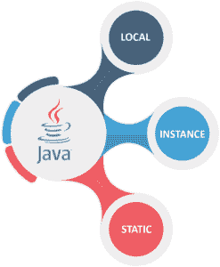

# 关于 Java 中的变量，你需要知道的一切

> 原文：<https://www.edureka.co/blog/variables-in-java/>

变量是任何程序的基本需求，无论是 T2、Java、Python、JavaScript 还是 T7。它是存储的基本单位。它充当一个容器，用于保存数据值。由变量保存的值可以在程序执行期间改变。每个变量都被赋予一种数据类型。简单来说，变量是一个**名**赋予一个**内存位置**。因此，我按照以下顺序排列了 Java 中变量的摘要:

*   [**Java 中的变量**](#vb)
*   [**变量声明和初始化**](#declaration)
*   [**Java 中的变量类型**](#types)

## **Java 中的变量**

Java 中的变量可以有不同的类型:

*   **String:** 用于存储“Welcome”等文本内容。
*   **int:** 用于存储 567 等整数值。
*   **float:** 存储浮点数如 29.99。
*   **char:** 存储单个字符，如‘s’、‘R’。
*   **布尔:**存储属于两种状态的值——“真”或“假”

## **变量声明和初始化**

通过指定以下参数来声明变量:

*   **数据类型:**存储在变量中的数据类型。

*   **变量名称:**赋予变量的唯一名称。

*   **值:**存储在变量中的初始值。

```

int age = 50 ;

float weight = 50.60;

```

在 ab ove 示例中， **int** 是数据类型， **age** 是赋予变量的名称， **50** 是值。同样， **float** 是数据类型，weight 是变量名， **50.60** 是值。

## **Java 中变量的类型**

Java 为用户提供了三种类型的变量:

****

**局部变量:**这些类型的变量定义在程序的块、方法或构造函数中。

*   这些变量在函数被调用时创建，并在函数调用返回后立即被销毁。

*   局部变量**禁止**使用访问修饰符。

*   这些变量只能在特定程序块内访问**。**

```
public class EmployeeId { 
    public void EmployeeId() 
    { 
        // local variable ID 
        int id = 0; 
        id = id + 6; 
        System.out.println("Employee ID : " + id); 
    } 

    public static void main(String args[]) 
    { 
        EmployeeId obj = new EmployeeId(); 
        obj.EmployeeId(); 
    } 
}

```

**输出:**

```

Employee ID : 6

```

在上面给出的例子中，变量 id 是函数的局部变量**，也就是说，它只能在函数**中使用**。**

在作用域外使用局部变量时，会返回一个错误。让我们看一下下面的代码，以便更好地理解它。

```
public class EmployeeId { 
    public void EmployeeId() 
    { 
        // local variable id
        int id = 0; 
        id = id + 6; 
    } 

   public static void main(String args[]) 
    { 
        // using local variable outside the scope 
        System.out.println("Employee ID : " + id); 
    } 
}

```

**输出:**

```
/EmployeeId.java:12: error: cannot find symbol
        System.out.println("Employee ID : " + id); 
                                              ^
  symbol:   variable id
  location: class EmployeeId
1 error

```

**实例变量:**它们是可以在类、块、方法或构造函数之外声明的变量。它们不是静态的。

*   这些变量在一个类的**对象被创建**时被创建，在**对象被销毁**时被销毁。

*   访问修饰符可用于实例变量。

*   如果没有指定修饰符，则使用默认修饰符。

*   实例变量有默认值，数字用 **0** ，布尔用 **false** ，对象引用用 **null** 。

```
import java.io.*;
class Price { 
    // Instance variables that are declared in a class and not inside any function
    int guitarPrice; 
    int pianoPrice; 
    int flutePrice; 
} 

public class Main { 
    public static void main(String args[]) 
    { 
        // first object 
        Price ob1 = new Price(); 
        ob1.guitarPrice = 10000; 
        ob1.pianoPrice = 5000; 
        ob1.flutePrice = 1000; 

        // second object 
       Price ob2 = new Price(); 
        ob2.guitarPrice = 9000; 
        ob2.pianoPrice = 4000; 
        ob2.flutePrice = 2000; 

        // displaying the price for first object 
        System.out.println("Price for first object:"); 
        System.out.println(ob1.guitarPrice); 
        System.out.println(ob1.pianoPrice); 
        System.out.println(ob1.flutePrice); 

        // displaying the price for second object 
        System.out.println("Price for second object:"); 
        System.out.println(ob2.guitarPrice); 
        System.out.println(ob2.pianoPrice); 
        System.out.println(ob2.flutePrice); 

    } 
}

```

**输出:**

```
Price for first object:
10000
5000
1000
Price for second object:
9000
4000
2000

```

**静态变量:**本质上和实例变量类似。主要区别在于它们是使用 static 关键字声明的，并且每个类只允许有一个静态变量的副本。

*   它们也被称为类变量。

*   不管创建了多少个对象，每个类只允许有一个静态变量的副本。

*   这些变量是在程序开始时创建的，在程序执行完成时自动销毁。

*   静态变量的默认值与实例变量相同。

*   要访问静态变量，没有必要创建该类的对象。

*   可以通过以下方式访问该变量:

```
class_name.variable_name

```

```
c import java.io.*; 
class Manager { 

    // static variable salary 
    public static double salary; 
    public static String name = "Jonathan"; 
}
public class Main { 
    public static void main(String args[]) 
    { 

        // accessing static variable without object 
        Manager.salary = 90000; 
        System.out.println(Manager.name + "'s avg salary:"
                           + Manager.salary); 
    } 
}

```

**输出:**

```
Jonathan's avg salary:90000.0

```

***上面讨论的变量广泛用于高效的编程体验。每个变量都有自己独特的属性，必须正确使用。***

*这样，我们就结束了 Java 文章中的这些变量。我希望上面提到的例子足以让你开始学习 Java* ，*看看 Edureka 的  [**Java 培训**](https://www.edureka.co/java-j2ee-soa-training)* *，edu reka 是一家值得信赖的在线学习公司，在全球拥有超过 25 万名满意的学习者。Edureka 的 Java J2EE 和 SOA 培训和认证课程是为想成为 Java 开发人员的学生和专业人士设计的。该课程旨在为您提供 Java 编程的良好开端，并训练您掌握核心和高级 Java 概念以及各种 Java 框架，如 Hibernate & Spring。*

有问题要问我们吗？请在这篇“Java 中的变量”文章的评论部分提到它，我们会尽快回复您。