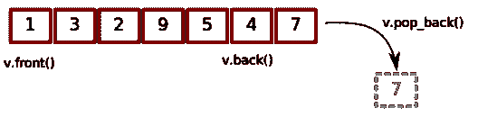
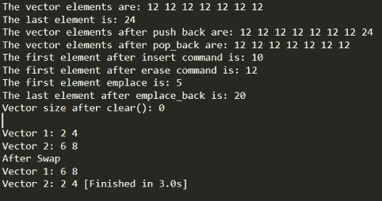
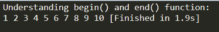
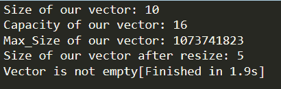

# C++中的向量是什么？你只需要知道

> 原文：<https://www.edureka.co/blog/vectors-in-cpp/>

C++中的向量是序列容器，表示大小可变的数组。它们的元素使用连续的存储位置，这意味着它们的元素也可以使用指向其元素的常规指针上的偏移量来访问，就像在数组中一样高效。本文将涉及以下几点:

*   [c++中的 Vector 是什么？](#what)
    *   [向量在 C++中是有序的吗？](#ordered)
    *   [向量在 C++中是如何存储的？](#store)
*   [向量的成员函数](#member)
    *   [修饰词](#modifiers)
    *   [迭代器](#iterators)
    *   [容量](#capacity)

## **c++中的 Vector 是什么？**

C++中的向量是用来存储数据的动态数组。与用于存储顺序数据的静态数组不同，向量为程序提供了更大的灵活性。当插入或删除元素时，Vectors 可以根据要执行的任务的需要自动调整自身的大小。在一个数组中，只有给定数量的值可以存储在一个变量名下，这是不同的。



### **向量在 C++中是有序的吗？**

没有向量在 C++中是不排序的。向量元素放在相邻的存储器中，这样就可以使用迭代器访问和遍历它们。在向量中，数据被插入到它的末尾。在末尾插入一个元素需要不同的时间，因为有时可能需要扩展向量。移除最后一个元素只需要恒定的时间，因为没有发生调整大小。在向量的开始或中间插入和擦除在时间上是线性的。

### **向量在 C++中是如何存储的？**

要创建一个向量，你需要遵循下面给出的语法。

**语法:**

```
vector< object_type > variable_name;
```

**举例:**

```
#include <vector>
int main()
{
    std::vector<int> my_vector;
}
```

在上面的例子中，创建了一个空白向量。Vector 是一个动态数组，不需要声明大小。

## **c++中向量的成员函数**

STL 中的矢量容器为我们提供了各种有用的功能。

1.  修饰语
2.  迭代器
3.  容量

### **修饰词**

1.  **push_back():** 该函数将元素从后面推入一个矢量中。如果在 push_back()中作为参数传递的对象类型与 vector 的类型不同，则抛出异常。

2.  **assign():** 它通过替换旧的值给向量元素分配一个新值。

3.  **pop _ back():**pop _ back()函数用于从后面弹出或移除一个向量中的元素。 它将向量的大小减少一个元素。

4.  **insert():** 这个函数在迭代器指向的位置之前的元素之前插入新元素。我们还可以传递第三个参数 count，它计算元素在指向的位置之前被插入的次数。

5.  **erase():** erase()函数用于从 sp 中删除容器中的元素

6.  特定的位置或范围。我们可以传递需要移除的特定元素的位置，也可以传递一系列元素的起点和终点。

7.  **swap():** swap()函数用于将一个向量的内容与同类型的另一个向量进行交换。尺寸可能不同。

8.  **【clear():**clear()函数用来清除矢量容器中的所有元素

**举例:**

```
// Modifiers in vector 
#include <bits/stdc++.h> 
#include <vector> 
using namespace std; 

int main() 
{ 
    // Assign vector 
    vector<int> vec; 

    // fill the array with 12 seven times 
    vec.assign(7, 12); 

    cout << "The vector elements are: "; 
    for (int i = 0; i < 7; i++) 
        cout << vec[i] << " "; 

    // inserts 24 to the last position 
    vec.push_back(24); 
    int s = vec.size(); 
    cout << "nThe last element is: " << vec[s - 1]; 

     // prints the vector 
    cout << "nThe vector elements after push back are: "; 
    for (int i = 0; i < vec.size(); i++) 
    cout << vec[i] << " "; 

    // removes last element 
    vec.pop_back(); 

    // prints the vector 
    cout << "nThe vector elements after pop_back are: "; 
    for (int i = 0; i < vec.size(); i++) 
        cout << vec[i] << " "; 

    // inserts 10 at the beginning 
    vec.insert(vec.begin(), 10); 

    cout << "nThe first element after insert command is: " << vec[0]; 

    // removes the first element 
    vec.erase(vec.begin()); 

    cout << "nThe first element after erase command is: " << vec[0]; 

    // inserts at the beginning 
    vec.emplace(vec.begin(), 5); 
    cout << "nThe first element emplace is: " << vec[0]; 

    // Inserts 20 at the end 
    vec.emplace_back(20); 
    s = vec.size(); 
    cout << "nThe last element after emplace_back is: " << vec[s - 1]; 

    // erases the vector 
    vec.clear(); 
    cout << "nVector size after clear(): " << vec.size(); 

    // two vector to perform swap 
    vector<int> obj1, obj2; 
    obj1.push_back(2); 
    obj1.push_back(4); 
    obj2.push_back(6); 
    obj2.push_back(8); 

    cout << "nnVector 1: "; 
    for (int i = 0; i < obj1.size(); i++) 
        cout << obj1[i] << " "; 

    cout << "nVector 2: "; 
    for (int i = 0; i < obj2.size(); i++) 
        cout << obj2[i] << " "; 

    // Swaps obj1 and obj2 
    obj1.swap(obj2); 

    cout << "nAfter Swap nVector 1: "; 
    for (int i = 0; i < obj1.size(); i++) 
        cout << obj1[i] << " "; 

    cout << "nVector 2: "; 
    for (int i = 0; i < obj2.size(); i++) 
        cout << obj2[i] << " "; 
}
```

**输出:**

### 

我们可以看到我们上面研究过的各种修饰语的用法。

### **迭代器**

1.  **begin():** 这个函数返回一个迭代器，指向向量中的第一个元素**。**

2.  **end():**end()函数返回一个迭代器，指向向量中最后一个元素**。**

**举例:**

```
#include <iostream> 
#include <vector> 

using namespace std; 

int main() 
{ 
    vector<int> vec1; 

    for (int i = 1; i <= 10; i++) 
        vec1.push_back(i); 

    cout << "Understanding begin() and end() function: " << endl; 
    for (auto i = vec1.begin(); i != vec1.end(); ++i) 
        cout << *i << " "; 

    return 0; 
}
```

**输出:**



在上面的例子中，我们可以看到 begin()和 end()函数的使用。首先，我们定义一个向量 vec1，我们使用 for 循环将其中的值从 1 推回到 10。然后，我们使用 for 循环打印向量的值，我们使用 begin()和 end()函数来指定 for 循环的起点和终点。

### **容量**

1.  **size():** 这个函数返回向量中元素的个数。

2.  **max _ size():**max _ size()函数返回向量所能容纳的最大元素数。

3.  **capacity():**capacity()函数根据分配给 vector 的内存，返回当前分配给 vector 的存储空间的大小，以元素数表示。

4.  **resize():** 这个函数调整容器的大小，使其包含“n”个元素。如果向量的当前大小大于 n，则从向量中移除后面的元素，并且如果当前大小小于 n，则在向量的后面插入额外的元素。

5.  **empty():** 返回容器是否为空，如果 vector 为空则返回 true，否则返回 false。

**举例:**

```
#include <iostream> 
#include <vector> 

using namespace std; 

int main() 
{ 
    vector<int> vec1; 

    for (int i = 1; i <= 10; i++) 
        vec1.push_back(i); 

    cout << "Size of our vector: " << vec1.size(); 
    cout << "nCapacity of our vector: " << vec1.capacity(); 
    cout << "nMax_Size of our vector: " << vec1.max_size(); 

    // resizes the vector size to 4 
    vec1.resize(4); 

    // prints the vector size after resize() 
    cout << "nSize of our vector after resize: " << vec1.size(); 

    // checks if the vector is empty or not 
    if (vec1.empty() == false) 
        cout << "nVector is not empty"; 
    else
        cout << "nVector is empty"; 

    return 0; 
}
```

**输出:**



我们可以看到上面讨论的容量函数的工作情况。

至此，我们结束了这篇关于 C++中的向量的文章。我希望你能了解向量的不同成员函数，以及每一个成员函数的工作原理。我希望您对 C++中的命名空间有所了解，并知道定义它的不同方法。如果你想了解更多，请查看由 Edureka(一家值得信赖的在线学习公司)提供的 [**在线培训项目**](https://www.edureka.co/) 。

*有问题要问我们吗？请在本博客的评论部分提及此事，我们将尽快与您联系。*