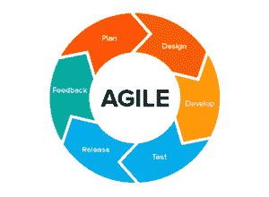

# 关于敏捷中的速度，你必须知道的一切

> 原文：<https://www.edureka.co/blog/velocity-in-agile/>

[敏捷](https://www.edureka.co/blog/what-is-agile-project-management/)能够减少启动项目所需的工作和计划量，从而专注于创造有价值的产品和服务，并快速提供给客户和用户。相反，不熟悉敏捷或刚接触敏捷的组织通常不知道如何使他们团队的产出可预测且一致。在这篇敏捷速度的文章中，我们将了解以下主题:

*   [敏捷中的速度是什么？](#what)
*   [看板和 Scrum 中的速度](#kanban-scrum)
*   [如何使用速度](#how)
*   敏捷中的速度如何帮助衡量效率？
*   [速度的优缺点](#advantage-disadvantage)

## **敏捷中的速度是什么？**

为了度量敏捷团队的进展，速度是一个很好的度量工具。通俗地说，速度是指团队在给定的时间内完成的工作量。对于一个团队来说，测量速度有各种各样的参数。

它可以用一个人花费的时间、一些任务或故事点来衡量。这取决于你用什么计量单位来计算你的工作。

## **看板和 Scrum 中的速度**

在[看板](https://www.edureka.co/blog/scrum-vs-kanban/)中，一组恒定的任务由团队处理，其中所有的任务大小相同，负担相同。在这种情况下，速度可以通过一天内完成的任务数量来衡量。通过计算一周时间内的每日速度并得出其平均值，您可以预测和估计团队在更长时间内可以完成的工作量。

另一方面， [Scrum](https://www.edureka.co/blog/how-to-become-a-certified-scrum-product-owner/) 团队的速度指的是在 sprint 中完成的人-小时故事点的数量。

## **如何使用速度**

使用速度可以很好地洞察团队的发展和进步，因为它被用来衡量生产力和预测团队的表现。相反，它不包含做出良好和可靠预测所需的所有必要的相关信息。

*   为此，Scrum 大师、发布经理和产品负责人需要集思广益，关注细节。速度作为一种工具，当它与稳定且经验丰富的团队一起使用时，证明是有益的，这些团队已经一起工作了很长时间，也一起进行了评估。如果团队成员经常变化或者长时间缺席，那么速度将被证明是低效和没有意义的。

*   另一个可能影响速度的情况是，如果产品 backlog 丢失了用户故事，这很可能在很长一段时间内发生。敏捷最有希望的好处之一是，它给你技能和能力来快速响应客户需求的变化，并在相对较短的时间内将这些变化整合到你的产品中。

*   事实证明，在提前有效地详细计划发布时，这是一个很大的优势。重要的是要记住，速度也可以通过时间框架来衡量(迭代、冲刺或周)。但是，一旦你决定了如何测量速度，你就应该在你的项目中继续用同样的方法测量它。例如，为了测量敏捷中的速度，通常由 Scrum 团队测量 sprint 中用户点的数量。

*   在几次冲刺的基础上衡量这一点之后，团队就能够预测每次冲刺应该完成多少用户点。然后，团队可以估算出完成一个给定项目需要多少次冲刺，从而能够在整个过程中衡量团队的效率。

## 敏捷中的速度如何帮助衡量效率？

你不能依赖敏捷速度提供的数字。相反，最终衡量和促进效率的是趋势。因此，速度不能作为效率目标来使用和依赖。理解这意味着什么是很重要的。

当团队看到速度数字下降时，他们想知道并专注于如何使数字更高或回到原来的位置。这给开发人员带来了实现特定速度目标的巨大压力。相反，如果您的速度数字呈螺旋式下降，团队应该深入挖掘并分析可能导致数字下降的可能的低效率。

为了得到更准确的时间表和预算，你可以在项目中设定一个稍微低一点的速度值。同时，不应该避免速度数字的快速增加，因为这可能表明团队进行得太快，没有保持和产生期望的工作质量。

在敏捷中使用速度的最安全和最好的方法是实事求是，保持目标简单，以便识别项目中的不足之处。因此，速度的最终目标是能够在保持质量的同时实现效率。

## **速度的优缺点**

除了可能增加团队的整体能力和容量之外，velocity 还使开发团队能够估计出当前 sprint 可能会积压多少产品。产品负责人可以了解团队处理积压工作的速度，他可以根据开发团队的速度修改预测的交付时间。

速度作为一种衡量标准受到高度重视，因为 Scrum 团队可以了解他们自己的进步、优势和不足，以便在接下来的冲刺中表现得更好。

另一方面，速度不应该作为分析团队表现的衡量标准。团队透明度的存在对于产品的顺利运行和交付至关重要。

总之，速度不是最终目标，而是结果。它应该用于团队的持续改进，而不是用于任何其他目的。当这个度量被用于另一个目的时，团队将停止收获它的好处，并将最终导致失去对他们的敏捷目标的关注。

至此，我们在敏捷文章中结束了这种速度。我希望你理解了速度的概念，以及它在敏捷、Scrum 和看板中的作用。

*[**edu reka**](https://www.edureka.co/certified-scum-master-certification-training)认证 Scrum 大师培训提供了敏捷项目管理的 Scrum 框架的全面概述，并将帮助你成为认证 Scrum 大师。您将学习 Scrum 的基础知识，如 Scrum 生命周期，如何组织 Scrum 团队和建立项目，以及如何实施 Scrum，从发布和冲刺到企业转型。为期两天的课堂培训将为您在多个行业领域开启新的职业机会。*