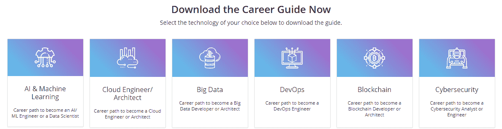

# XI 卷–edu reka 职业观察–2019 年 4 月 13 日

> 原文：<https://www.edureka.co/blog/vol-xi-edureka-career-watch>

*“Success usually comes to those who are too busy to be looking for it.” – Henry David Thoreau*

**今天的就业市场就像一个迷宫，需要好的计划和策略才能通过。所以，为了帮助你对你的职业做出正确的判断，我们为你带来了一期特别版的 *Edureka 职业观察*。本周，除了为您带来来自全球的新闻报道，我们还将关注我们称之为 [Edureka 2019 年科技职业指南](https://www.edureka.co/career-guide)。**

**在我们深入探讨本指南的内容之前，让我们先了解一下我们为什么需要它，以及我们希望利用这些事实达到什么目的。**

**那么，我们从头开始吧。**

## **Edureka 2019 年科技职业指南**

**我们大多数人都知道并接受这样一个事实，即当今行业存在着巨大的技能缺口。这意味着，在公司寻找的专业人士类型和专业人士目前拥有的技能之间，存在一种隐现的差异。本质上，我们可以说，IT 行业正在加速发展，技术专业人员真的无法跟上。事实上，Edureka 之前的一份技能报告强调了这样一个事实，即今天的专业人士需要在职业生涯中提升 15-20 倍的技能，才能在当今竞争激烈的 IT 行业中保持相关性。不管专业人士的经验和他们目前工作的领域如何，这个事实都是真实的。**

****

**Edureka Tech 职业指南希望帮助专业人士认识到他们的职业目标，设定目标，并遵循成熟的学习路径实现目标。众所周知，总有一些职业道路比其他职业更受欢迎，也更有利可图。这就是我们希望为你分解的。**

**那么，这份职业指南给了你什么？**

**《Edureka 技术职业指南》希望回答你在追求职业目标过程中的三个主要问题。这些是:**

***   为了在职业生涯中取得进步，哪些技能值得投资和掌握？*   现在市场上最抢手的职位是什么？*   为了达到你想要的职位，你需要达到哪些里程碑？**

**我们希望通过向您提供事实、统计数据、市场前景、热门技术职位的确切职业道路、学习时间以及相关资源来回答这些问题。**

**这份职业指南是我们的专家数月研究的结果。我们花了几个小时采访主题专家、职业顾问，并利用我们的内部专业知识来制定一份可以帮助任何人实现职业目标的文件。我们还采访了数百名 IT 专业人士，询问他们希望在未来获得哪些职位，以及他们希望如何实现这些职位。**

**我们的指南涵盖了 6 个热门技术类别，即 AI / ML 和数据科学、大数据、云计算、DevOps、区块链和网络安全，这些可以说是当今最受欢迎和最受欢迎的职业。因此，如果你渴望在这些趋势领域中的任何一个领域建立一个利润丰厚的职业生涯，[今天就下载 Edureka 2019 科技职业指南](https://www.edureka.co/career-guide)，开始你的旅程。**

## **万事达卡与微软一起加入网络安全人才计划**

**很少有人知道和理解的一个事实是，网络安全是一个以指数速度增长的领域。一项调查进一步强调了这一点，该调查指出，2017 年 9 月至 2018 年 8 月期间，美国有 313，000 个网络安全职位空缺。为了弥补这一日益扩大的技能与机会之间的差距，一项名为“网络安全人才计划”的计划启动了。该倡议的目的是教育和呼吁领先的公司、联邦机构和高等教育机构携手合作，帮助培养网络安全专业人才，以保护国家和支持我们的数字经济。万事达卡最近与之前的创始合作伙伴微软和 Workday 一起加入了该计划。**

**网络安全是目前 IT 行业最有前途的领域之一，在这一技术市场领域的职业肯定会有利可图，前途光明。**

*****via[fine extra](https://www.finextra.com/pressarticle/77983/mastercard-joins-cybersecurity-talent-initiative/retail)T5*****

## **移动应用开发两年内在澳洲创造了 23000 个工作岗位**

**澳大利亚一家经济机构最近发布的一份报告发现，自 2017 年 3 月以来，应用开发市场已经在该大陆创造了超过 23，000 个就业岗位。该报告还指出，iOS 生态系统在这方面处于领先地位，提供了 121，000 个澳大利亚就业岗位，自 2017 年以来增长了 25%。相比之下，安卓系统的工作岗位增加了 22%，达到约 106，000 个。当谈到 it 部门时，应用程序开发领域通常被忽略，因为大多数人将其等同于编程。但是，这些新趋势表明，这个领域本身是强大的，可以提供惊人的职业机会。**

**我们在 Edureka 也有几个职位空缺。你可以[在 LinkedIn](https://www.linkedin.com/company/edureka/) 上关注我们的更新，或者[直接点击这里进入我们的“职业”页面](https://www.edureka.co/careers)。**

**我们还有更多好消息要告诉你！Edureka 职业观察现在也可以作为一个视频系列。在 [Instagram](https://www.instagram.com/edureka.co/) 、 [LinkedIn](https://www.linkedin.com/company/edureka/) 、[脸书](https://www.facebook.com/edurekaIN/)和 [Twitter](https://twitter.com/edurekaIN) 上关注我们，永远不要错过最新消息。**

**充分利用 Edureka 在教育和职业咨询领域的专业知识。请立即与我们的课程顾问联系，以更清晰地了解您的职业道路及更多信息。**拨打电话:*IND:[+91-960-605-8406](tel:9606058406)/*US:[1-833-855-5775](tel:18338555775)(免费)*。*****

**这些是本周市场上与职位空缺和职业趋势相关的主要新闻。如果你有任何问题，建议或者你想让我们报道的任何特定话题，请在下面的评论区联系我们。《Edureka 职业观察》将于下周为您带来您需要知道的头条新闻。所以，请确保您通过下面的订阅按钮订阅了我们的博客，千万不要错过这些重要的更新。**