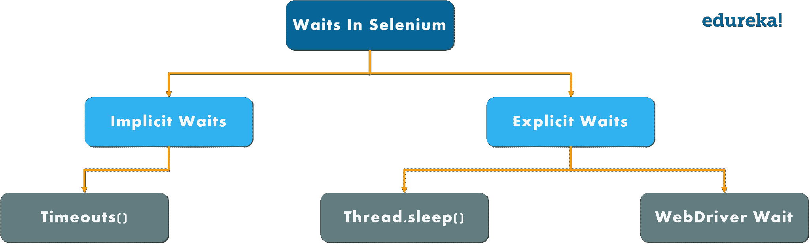

# 您需要了解的一切都在 Selenium 中等待

> 原文：<https://www.edureka.co/blog/waits-in-selenium/>

在编写第一个 selenium 程序时，您可能遇到过等待命令。但是，你知道[硒](https://www.edureka.co/blog/selenium-tutorial)到底是什么吗？嗯，selenium 中的等待是执行测试用例所需的一段重要代码。在本文中，我将简要介绍实践中广泛使用的不同类型的等待命令。

以下是本文将涉及的主题

*你也可以去看看这个在 Selenium 中等待的记录，我们的 **[Selenium 认证](https://www.edureka.co/selenium-certification-training)** 专家已经用例子详细地解释了这个主题。*

## **等待硒|硒等待命令**


[//www.youtube.com/embed/qgup1XwDzhQ?rel=0&showinfo=0](//www.youtube.com/embed/qgup1XwDzhQ?rel=0&showinfo=0)

本视频讲述了不同类型的 selenium 等待，以及使用隐式和显式等待的步骤，并附有示例。

## **什么是硒候？**

等待帮助用户在重定向到不同网页时解决问题。这是通过刷新整个网页并重新加载新的 web 元素来实现的。有时，也可能有 Ajax 调用。因此，在重新加载网页和反映网页元素时，可以看到时间延迟。

用户经常被发现来回浏览不同的网页。因此，由 web 驱动程序提供的 navigate()命令/方法通过参考 web 浏览器的历史在网页之间导航来帮助用户模拟实时场景。

## **为什么在 Selenium 中需要等待？**

大多数 web 应用程序都是使用 Ajax 和 Javascript 开发的。当浏览器加载页面时，我们想要与之交互的元素可能会在不同的时间间隔加载。这样，不仅很难识别元素，而且如果元素没有被定位，它将抛出一个“**ElementNotVisibleException**”异常。通过使用等待，我们可以解决这个问题。

现在让我们进一步了解不同类型的等待。

## **内侍类型**

Selenium 支持两种类型的等待，它们如下

1.  隐式等待
2.  显式等待

**注:** *最广泛使用的等待是隐式和显式等待，流畅等待对于实时项目并不可取。*

[](/blog/wp-content/uploads/2019/02/Types-of-Waits-in-Selenium-Waits-in-Selenium-Edureka.png) 

首先，我们来了解一下[硒](https://www.edureka.co/blog/10-reasons-to-learn-selenium/)中的隐性等待是什么。

### **隐侍**

隐式等待将告诉 web 驱动程序在抛出“没有这样的元素异常”之前等待一段时间。隐式等待的默认设置为零。一旦设置了时间，web 驱动程序将在抛出异常之前等待特定的时间。

```
***Syntax:*** driver.manage().timeouts().implicitlyWait(TimeOut, TimeUnit.SECONDS);
```

让我们以隐式等待为例，了解它是如何工作的。

```
package Edureka;
import java.util.concurrent.TimeUnit;
import org.openqa.selenium.By;
import org.openqa.selenium.WebDriver;
import org.openqa.selenium.WebElement;
import org.openqa.selenium.chrome.ChromeDriver;
import org.openqa.selenium.support.ui.ExpectedConditions;
import org.openqa.selenium.support.ui.WebDriverWait;

public class ImplicitWait{
public static void main(String[] args) throws InterruptedException{
System.setProperty("webdriver.chrome.driver", "C:Selenium-java-edurekachromedriver_win32chromedriver.exe");
WebDriver driver = new ChromeDriver();
driver.manage().window().maximize();
driver.manage().deleteAllCookies();
driver.manage().timeouts().pageLoadTimeout(40, TimeUnit.SECONDS); // pageload timeout
driver.manage().timeouts().implicitlyWait(20, TimeUnit.SECONDS);    // Implicit Wait for 20 seconds
driver.get("https://login.yahoo.com/");
driver.findElement(By.xpath("//input[@id='login-username']")).sendKeys("edureka@yahoo.com"); //Finding element and sending values
Thread.sleep(1000);
driver.findElement(By.xpath("//input[@id='login-signin']")).click(); //Clicking on the next button if element is located
}
}

```

在上面的代码中，我给了隐式等待 20 秒，这意味着特定元素加载或到达输出的最大等待时间是 20 秒。

**注意:** *隐式等待是全局应用的，这意味着它始终可用于整个驱动程序实例中的所有 web 元素。这意味着如果驱动程序与 100 个元素交互，那么隐式等待适用于所有 100 个元素。*

这都是关于隐式等待的。现在深入研究等待，理解什么是显式等待。

### **显性等待**

它是**动态等待**的概念，动态等待特定的条件。可以通过 ***WebDriverWait*** 类实现。要理解 [Selenium](https://www.edureka.co/blog/what-is-selenium/) Webdriver 中的显式等待，你应该知道为什么我们在程序中使用 wait 语句的要求。我将给出几个例子，在这些例子中，您将完全理解为什么等待在 selenium 中很重要。

#### **硒中显式等待的条件** web 驱动

***条件 1—***假设我有一个网页，里面有一些登录表单，登录后，加载账户页面或主页要花很多时间。这个页面是动态的，这意味着有时需要 10 秒来加载主页，有时需要 15 秒，以此类推。在这种情况下，显式等待有助于我们一直等到特定页面不存在。

***条件 2—***您正在处理一个旅行申请，您已经填写了一个 web 表单并点击了提交按钮。现在你要等到具体数据没有显示出来。在这种情况下，您可以再次使用显式等待，在这种情况下，您可以让*等待*，直到不显示特定的元素或元素集。

```
***Syntax:*** WebDriverWait wait=new WebDriverWait(WebDriveReference,TimeOut);
```

在上面的语法中，我创建了一个 WebDriver wait 的对象，并将驱动引用和超时作为参数传递。这就是您需要编写显式等待的方式。现在让我们举一个例子来理解显式等待是如何工作的。让我们看看下面的代码。

```
package Edureka;
import java.util.concurrent.TimeUnit;
import org.openqa.selenium.By;
import org.openqa.selenium.WebDriver;
import org.openqa.selenium.WebElement;
import org.openqa.selenium.chrome.ChromeDriver;
import org.openqa.selenium.support.ui.ExpectedConditions;
import org.openqa.selenium.support.ui.WebDriverWait;

public class Locators {
public static void main(String[] args) throws InterruptedException {
System.setProperty("webdriver.chrome.driver", "C:Selenium-java-edurekachromedriver_win32chromedriver.exe");
WebDriver driver = new ChromeDriver();
driver.manage().window().maximize();
driver.manage().deleteAllCookies();
driver.manage().timeouts().pageLoadTimeout(40, TimeUnit.SECONDS);
driver.manage().timeouts().implicitlyWait(30, TimeUnit.SECONDS);
driver.get("https://www.facebook.com/");
WebElement firstname= driver.findElement(By.name("firstname"));
WebElement lastname= driver.findElement(By.name("lastname"));
sendKeys(driver, firstname, 10, "Edureka");
sendKeys(driver, lastname, 20, "Edureka");
WebElement forgotAccount= driver.findElement(By.linkText("Forgotten account?"));
clickOn(driver,forgotAccount, 10);
driver.manage().timeouts().implicitlyWait(30, TimeUnit.SECONDS);
}
public static void sendKeys(WebDriver driver1, WebElement element, int timeout, String value){
new WebDriverWait(driver1, timeout).until(ExpectedConditions.visibilityOf(element));
element.sendKeys(value);
}
public static void clickOn(WebDriver driver1, WebElement element, int timeout){
new WebDriverWait(driver1, timeout).until(ExpectedConditions.elementToBeClickable(element));
element.click();
}
}

```

在上面的例子中，我使用了 facebook 注册凭证，并使用名称定位器找到了它们。此外，我还创建了一个实用程序或一个通用函数，所有元素都可以使用它来提供显式等待。在上面的例子中，我编写了自己的 *sendKeys()* 方法。该方法将在特定的文本字段中输入值，但是在内部它也将显式地提供 wait。在 *sendKeys()* 方法中，我已经给出了元素可见性的预期条件。也就是说，我要求驾驶员等待 20 秒，直到该元件的预期条件可见。此外，如果条件得到满足，那么您可以将 *sendKeys()* 应用于该方法。现在，假设我想输入我的名和姓。我要做的是，我将使用这个 *sendKeys()* 方法，并将驱动程序、名字、超时(即 10 秒)和值作为 edureka 传递。姓氏也是如此。

当你执行该程序时，chrome 驱动程序将启动谷歌 Chrome 浏览器，在 facebook.com 导航并输入代码中提到的值。不强制显式设置等待特定值的超时，根据您的需求，您可以更改它。这是使用显式等待的主要优势，但对于隐式等待，一旦你定义了 10 秒，它将适用于网页上的所有元素，并且不能修改。 *clickOn()* 方法也是如此。但是，这种方法只对网页上的链接有用。这就是你如何使用显式等待。

**注:** *隐性、显性、流畅的内侍，都是动态内侍。**什么是动态等待？**考虑一种情况，您已经给定超时值为 20 秒。如果元素在 5 秒内被加载，那么剩余的 15 秒将被忽略。它不会等到超时值完成，即 20 秒。这就是为什么所有的等待都被认为是动态等待。*

让我们进一步区分隐式和显式等待。

## **隐性 vs 显性**

| **隐侍** | **显性等待** |
| 1。隐式等待时间应用于脚本中的所有元素 | 1。显式等待时间仅适用于用户指定的元素 |
| 2。在隐式等待中，我们需要**而不是**在要定位的元素上指定“期望条件” | 2。在显式等待中，我们需要在要定位的元素上指定“ExpectedConditions” |
| 3。当元素位于隐式等待中指定的时间范围内时，建议使用 | 3。建议在元素需要很长时间加载时使用，也可用于验证元素的属性，如(visibilityOfElementLocated，elementToBeClickable，elementtoselected) |

我希望你明白隐式和显式等待的区别。这就把我们带到了关于在 [Selenium](https://www.edureka.co/blog/selenium-tutorial) 等待的博客的结尾。

*如果您希望学习 Selenium 并在测试领域建立职业生涯，那么请查看我们的互动在线直播****[Selenium 认证培训](https://www.edureka.co/selenium-certification-training)*** *在这里，我们将为您提供 24*7 全天候支持，在您的整个学习期间为您提供指导。*

*有问题吗？请在 Selenium 博客的评论部分提到它，我们将会回复您。*