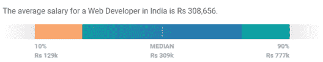
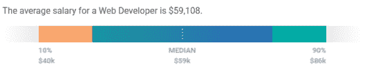
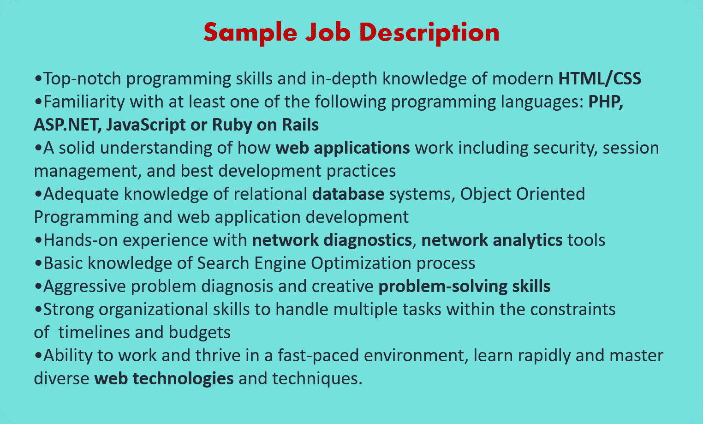

# 如何打造一份令人印象深刻的 Web 开发者简历？

> 原文：<https://www.edureka.co/blog/web-developer-resume/>

你可能听说过一句谚语“良好的第一印象可以创造奇迹”。你的简历通常是潜在雇主对你的第一印象。所以，要给人留下第一印象，你的简历必须从人群中脱颖而出。在这篇文章中，你将学会如何建立一份 **网站开发人员简历** ，这将帮助你在网站开发的激烈竞争中脱颖而出。Web 开发者认证是你脱颖而出的重要资产。

我们将在本文中讨论以下主题:

*   谁是 Web 开发人员？
*   [网页开发人员工资](#salary)
*   [职位描述](#job)
*   [角色和职责](#roles)
*   [所需技能](#skills)
*   [Web 开发人员简历样本](#resume)

## 谁是 Web 开发人员？

[Web 开发](https://www.edureka.co/blog/videos/web-development-with-html5-css3-javascript/) 基本上就是开发通过内部网或互联网托管的网站。web 开发过程涉及 [网页设计](https://www.edureka.co/blog/videos/trendy-web-designs-using-html5/) 、web 内容开发、客户端/服务器端脚本和网络安全配置。

web 开发人员是专门使用客户机-服务器模型开发万维网应用程序的程序员。他们还负责设计，编码和修改网站，从布局到功能，并根据客户的规格。

## **网页开发人员工资**

**印度** 的网页开发人员平均工资为**Rs 308656**。

Source- [*Payscale*](https://www.payscale.com/research/IN/Job=Web_Developer/Salary)

在  **美国** 一个网页开发者的平均工资是**$ 59108**。

[Glassdoor](https://www.glassdoor.co.in/) 网站开发人员的平均基本工资为每年 93，000 美元。这远远高于 PayScale 和 Salary.com，他们声称中位数为**【6 万美元**。

## **职位描述**

制作简历的第一步是看一下 **职位描述** 。那么，让我们来看看一个基于 [Glassdoor](https://www.glassdoor.co.in/) 中不同公司提供的细节的职位描述示例。

## **角色&网页开发人员的职责**

web 开发人员必须拥有跨多个平台规划和交付 Web 应用程序的经验。Web 开发人员的一些常见角色和职责包括:

*   你必须高效地编写代码
*   使用标准的 **HTML、CSS、** **JavaScript、JQuery** 和 API 的实践创建网站
*   与网站设计师和程序员紧密合作制作网站
*   与业务中的其他同事进行持续的**沟通**以开发和部署他们的内容。此外，确保清楚地确定在什么时间范围内可以创建什么
*   研究不同的**软件程序**，维护软件**文档**
*   在网站瘫痪的情况下实施**应急计划**
*   网站建成后的维护、扩展和增强
*   你必须知道如何**管理一个团队**并一起工作。

## **所需技能**

有些技术和知识是所有 web 开发人员工作所共有的。以下是 Web 开发人员角色所需的一组常见技能:

### **前端技能**

*   **HTML**–[超文本标记语言](https://www.edureka.co/blog/what-is-html/) ( **HTML** )是所有网站的基础。当你浏览一个网站时，它是你的  **浏览器** 中加载的主要文件类型。
*   **CSS**–[层叠样式表](https://www.edureka.co/blog/what-is-css/) ( **CSS** )用于 HTML 元素的样式化。它提供了 1000 个样式函数，用于  **样式****HTML 元素。**
*   JavaScript——这种编程语言允许你与网站上的元素进行交互并操纵它们。而 CSS 给 HTML 增加了样式，[JavaScript](https://www.edureka.co/blog/javascript-tutorial/)增加了交互性，让一个  **网站** 更加  **动态**。
*   **响应式设计**—[前端开发人员](https://www.edureka.co/blog/become-a-front-end-developer/) 的一个主要作用就是理解响应式设计原则，以及如何在编码端实现它们。它是  **CSS 框架** 的固有部分，类似于  **Bootstrap** 。
*   **构建工具**——现代网络浏览器配备了用于  [测试](https://www.edureka.co/blog/what-is-software-testing/) 和调试的开发工具。这些工具允许你在浏览器中测试网页，并找出网页是如何解释代码的。  **浏览器开发者工具** 通常由一个检查器和一个  **JavaScript 控制台**组成。
*   **版本控制/Git**–[版本控制](https://www.edureka.co/blog/what-is-git/) 是跟踪和控制对您的源代码的更改的过程，这样如果出现任何问题，您就不必从头开始。
*   **CSS** 和 **JavaScript 框架** 是通过提供通用功能来执行不同任务的 CSS 或 JS 文件的集合。比较流行的一些框架有 **[jQuery、](https://www.edureka.co/blog/jquery-tutorial/)** [**Angular、**](https://www.edureka.co/blog/what-is-angular-getting-started-with-angular/) **[React](https://www.edureka.co/blog/reactjs-tutorial) 、** **Vue。**

### **后端技能**

*   [**Python**](https://www.edureka.co/blog/python-tutorial/) 是一种开源的、 [**面向对象的** 编程语言](https://www.edureka.co/blog/object-oriented-programming-python/)于 1991 年发布，自此成为大多数软件和  **web 开发人员最喜爱的语言之一**。
*   [**Java**](https://www.edureka.co/blog/java-tutorial/) 是 Sun Microsystems 于 1996 年发布的一种开源的高级编程语言。它遵循  **写一次随处运行** (WORA)的方法，这使得它兼容运行在任何平台上。
*   **[PHP](https://www.edureka.co/blog/php-tutorial-for-beginners/)** 是一种开源的，  **服务器端脚本语言** 用于开发应用的后端逻辑。它是制作动态互动网站的强大工具。
*   [**NodeJS**](https://www.edureka.co/blog/nodejs-tutorial/)是开源的，  **JavaScript 框架** 专门用于创建应用的后端或服务器端。通过 NodeJS，JavaScript 现在终于可以在 web 的服务器端运行了。

可以查看 [Web 开发教程](https://www.edureka.co/blog/web-development-tutorial/) 上的文章，深入了解重要的技能，增长自己在这些领域的知识。

## **Web 开发人员简历样本**

起草简历时，有些事情你应该注意。下面列出了一些简单的建议，可以帮助你把简历做得更好。

*   **简介** 应该是很简单的而且应该很中肯。
*   你的  **教育细节** 应该有直到你最新学位的细节。
*   接下来你需要指定的是你的  **经历**。可以是项目工作、实习或之前的工作经验。
*   如果你是一名大一新生，你可以提到你参与过的  **项目** 并证明你在其中的作用。
*   如果你有经验，提及你的  **最近的工作角色** 以及你在之前的组织中做过的项目&你的成就。
*   提及你的  **技术技能** 指定你擅长的不同技术。
*   最后，但同样重要的是，提及你的  **成就和爱好**。尽量不要夸大其词，因为这可能会分散面试官的注意力。保持简单。

到此，我们就结束了这个 Web 开发者简历博客。我希望你们喜欢这篇文章，并了解如何写一份有创意的简历来帮助你在职业生涯中取得进步。

*查看我们的  [全栈 Web 开发人员硕士课程](https://www.edureka.co/masters-program/full-stack-developer-training) ，该课程包含讲师指导的现场培训和真实项目体验。本培训使您精通使用后端和前端 web 技术的技能。它包括关于 Web 开发、jQuery、Angular、NodeJS、ExpressJS 和 MongoDB 的培训。*

有问题要问我们吗？请在“Web 开发人员简历”博客的评论部分提到它，我们会回复您。