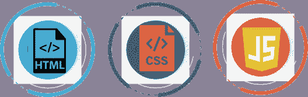
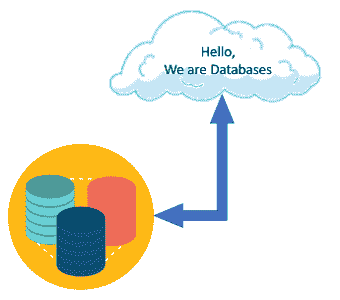

# Web 开发教程:初学者完全指南

> 原文：<https://www.edureka.co/blog/web-development-tutorial/>

网站基本上是各种彼此相关的网页的集合，并且可以通过访问主页来访问。它由几个元素组成，在设置过程中注意每一个元素是很重要的。这个网站开发教程将为你提供一个完整的关于建立一个网站的指南，并按以下顺序提供所需的技能:

*   什么是 Web 开发？
*   我们为什么需要它？
*   [网络开发基础](#basic)
*   [前端技能](#skills)
*   [前端框架](#framework)
*   [后端技能](#backend)
*   [数据和数据库](#data)
*   [服务器和部署技能](#server)

## 什么是 Web 开发？

[Web 开发](https://www.edureka.co/blog/videos/web-development-with-html5-css3-javascript/)基本上是与开发通过内部网或互联网托管的网站相关的任务。web 开发过程涉及 [web 设计](https://www.edureka.co/blog/videos/trendy-web-designs-using-html5/)，web 内容开发，客户端/服务器端脚本和网络安全配置。

网站可以是简单的单页网站，也可以是极其复杂的网络应用程序。当你在浏览器中浏览你的网站时，这是因为所有的网页开发过程。

## 我们为什么需要它？

网站在想要分享信息的人和想要消费信息的人之间起着桥梁的作用。它帮助你在**的全球舞台**接触到**的潜在客户**。有各种各样的原因表明了网站的重要性:

*   网站是一个在线小册子，帮助你宣传你在 T2 的业务。
*   它提供了一个接触广泛的全球客户群的平台。
*   你也有可能通过你在网站上的博客来影响你的 T2 读者。
*   你可以展示你所有的**想法**和**在网站上发布**。
*   如果你有一个商业想法，你可以开一个**网店**，在网上销售你的产品或服务。
*   你可以**与你的**客户**沟通**，给他们一个表达自己的机会。

现在你已经知道了什么是 web 开发，以及我们为什么需要网站，让我们深入学习这篇 web 开发教程，了解所需的基本技能。

通过这个[网页开发人员培训](https://www.edureka.co/complete-web-developer)课程学习和探索网页设计和开发。

## **基础知识:Web 开发教程**

网站是存储在称为服务器的计算机上的一堆文件。服务器是用于托管网站和存储网站文件的计算机。这些服务器被连接到一个名为**万维网**的巨大网络上。

浏览器是你在电脑上运行的程序。他们通过你的网络连接下载网站文件。现在，每个网站都有三个主要组成部分:

****

*   **HTML**–[超文本标记语言](https://www.edureka.co/blog/what-is-html/) ( **HTML** )是所有网站的基础。当你浏览一个网站时，它是载入你的浏览器的主要文件类型。这种脚本语言用于构建我们内容的不同部分，并定义它们的含义或目的。

*   -[层叠样式表](https://www.edureka.co/blog/what-is-css/) ( **CSS** )用于 HTML 元素的样式化。它提供了 1000 多个样式函数，用于对我们定义的 **HTML 元素**进行**样式**。它是我们用来设计网页内容风格和布局的语言。

*   JavaScript-这种编程语言允许你与网站上的元素进行交互，并操纵它们。CSS 给 HTML 增加了风格， [JavaScript](https://www.edureka.co/blog/javascript-tutorial/) 增加了交互性，使**网站**更加**动态**。

## **前端技能**

无论用户的带宽、屏幕大小、网络或设备能力如何，确保 web 应用程序下载速度快并对用户交互做出响应是非常重要的。

中级**前端技能**包括:

*   响应式设计(Responsive Design)——我们使用不同的小工具，如电脑、手机和平板电脑来浏览网页。网页会根据您使用的设备进行自我调整，而无需您付出任何额外的努力。这要归功于响应式设计。一个[前端开发人员](https://www.edureka.co/blog/become-a-front-end-developer/)的一个主要角色是理解响应式设计原则以及如何在编码端实现它们。它是像 **Bootstrap** 一样的 **CSS 框架**的固有部分。这些技能都是相互关联的，所以当你学习一种技能时，你通常会同时在其他技能上取得进步。

*   **构建工具**——现代网络浏览器配备了用于[测试](https://www.edureka.co/blog/what-is-software-testing/)和调试的开发工具。这些工具允许你在浏览器中测试网页，并找出网页是如何解释代码的。**浏览器开发者工具**通常由一个检查器和一个 **JavaScript 控制台**组成。该检查器允许您查看页面上的运行时 HTML 是什么样子，页面上的每个元素与什么 CSS 相关联。JS 控制台允许您查看浏览器试图执行 JS 代码时发生的任何错误。

*   **版本控制/Git**–[版本控制](https://www.edureka.co/blog/what-is-git/)是对你的源代码的变更进行跟踪和控制的过程，这样如果出了问题，你就不必从头开始。它是一个工具，用于跟踪以前所做的更改，以便您可以返回到您工作的以前版本，并找出哪里出了问题，而不必将整个东西拆掉。

## **前端框架**

**CSS** 和  **JavaScript 框架** 是通过提供通用功能来执行不同任务的 CSS 或 JS 文件的集合。您不是从一个空的文本文档开始，而是从一个已经包含大量 JavaScript 的代码文件开始。

框架有它们的长处和短处，这使得为你正在构建的网站类型选择最好的框架变得很重要。例如，一些  [JS 框架](https://www.edureka.co/blog/top-10-javascript-frameworks/) 非常适合构建复杂的用户界面，而另一些则擅长显示网站的所有内容。

一些流行的框架是:

*   [**jQuery**](https://www.edureka.co/blog/jquery-tutorial/)
*   
*   [**反应过来**](https://www.edureka.co/blog/reactjs-tutorial)
*   视图

这是关于建立一个网站所需的前端技能。现在，让我们继续这个 web 开发教程，了解不同的后端技能。

## **后端技能**

后端层形成了前端和数据库之间的动态连接。为了让这一层工作起来，了解至少一种编程语言是很重要的，比如 Python、Java、PHP、Ruby 等，并且必须了解服务器端框架，比如 T2、NodeJS、T3。

*   [**Python**](https://www.edureka.co/blog/python-tutorial/) 是一种开源的、**面向对象的**编程语言，于 1991 年发布，自那以后，它已经成为大多数软件和 **web 开发人员最喜欢的语言之一**。

*   [**Java**](https://www.edureka.co/blog/java-tutorial/) 是 Sun Microsystems 于 1996 年发布的一种开源的高级编程语言。它遵循**写一次运行在任何地方** (WORA)的方法，使它兼容运行在任何平台上。

*   **[PHP](https://www.edureka.co/blog/php-tutorial-for-beginners/)** 是一种开源的、**服务器端脚本语言**用于开发应用的后端逻辑。它是制作动态互动网站的强大工具。

*   **NodeJS** 是一个开源的、 **JavaScript 框架**专门用于创建应用的后端或服务器端。通过 NodeJS，JavaScript 现在终于可以在 web 的服务器端运行了。

## **数据和数据库**

数据层是一个巨大的信息仓库。它包含一个**数据库存储库**，它从前端通过后端捕获并存储信息。先决条件是要了解数据是如何存储、编辑、检索等的。必须了解数据库，如[、MySQL](https://www.edureka.co/blog/mysql-tutorial/) 、[、MongoDB](https://www.edureka.co/blog/mongodb-the-database-for-big-data-processing/) 。

*   MySQL 是一个开源的关系数据库管理系统，提供多用户访问并支持多存储引擎。

*   **MongoDB** 以易用性和处理大量数据的速度著称。这是一个开源的、面向对象的 NoSQL 数据库，具有高度的可伸缩性，在处理非结构化数据方面非常高效。

## **服务器和部署技能**

服务器基本上是存储网站文件和其他资源(如数据库)的计算机。

### **服务器设置**

要在互联网上公开访问网站，需要将其安装在服务器上。一旦有了域名和服务器空间，就该在服务器上建立站点了。第一件事是将域名定向到服务器唯一的 **IP 地址**。然后需要设置网站文件，最后是**数据库**等配置。

### **部署工具**

要将文件从你自己的电脑上传到你的服务器，你需要一个**协议**。这基本上是一种在服务器之间传输文件或其他数据的方法。

部署工具存储您的 **FTP/SFTP** 设置，当一个更改被推送到主分支 [Git](https://www.edureka.co/blog/what-is-git/) 时，该工具将为您传输文件。所以，不需要记住你修改了哪些文件，减少了你犯的错误。

所以这些是你在网站开发中需要的一些重要的指导方针和技能。至此，我们的 web 开发教程到此结束。我希望你了解网站开发的不同方面和你需要学习的不同技能。从这个[网络开发实习](https://www.edureka.co/internship/full-stack-web-development)项目开始你的职业生涯。

*查看我们的  [全栈开发人员课程](https://www.edureka.co/masters-program/full-stack-developer-training)，该课程包含讲师指导的现场培训和真实项目体验。本培训使您精通使用后端和前端 web 技术的技能。它包括关于 Web 开发、jQuery、Angular、NodeJS、ExpressJS 和 MongoDB 的培训。*

有问题要问我们吗？请在“Web 开发教程”博客的评论部分提到它，我们会给你回复。