# Web 服务:真正的交易

> 原文：<https://www.edureka.co/blog/web-services-the-real-deal/>

有没有想过帮助别人却找不到方法？是的，我知道软件开发人员没有时间做所有这些。事实上，我们一生中的一部分时间都花在为这样或那样的应用程序编码上。所以所有这一切让我思考，作为一名开发人员，我能为我的开发伙伴做些什么好的事情吗？

为什么不用任何语言写一个可以被任何开发者使用的代码呢？那不是很棒吗？是的！你猜怎么着？解决方案是“网络服务”

根据 W3C 的定义，Web 服务是“一种软件系统，旨在支持网络上可互操作的机器对机器的交互。”

用一种语言开发的 Web 服务可以在任何其他语言中使用，最好的部分是它有助于将一个应用程序连接到另一个应用程序。

当两个系统相互通信时，请求服务的软件系统称为服务请求者，处理请求并提供服务的软件系统称为服务提供者。

现在，如果你在思考交流是如何发生的，让我们开始吧。

有一些特定的规则定义了不同系统之间如何进行通信。这些规则包括一个系统如何从另一个系统请求数据、数据请求中需要的参数、生成的数据的结构以及违反某些规则时显示的错误消息。这些规则在一个名为 WSDL (Web 服务描述语言)的文件中定义，扩展名为. WSDL

创建 web 服务后，会生成一个 WSDL 文件来描述使用 soap 协议()在 UDDI(通用分布发现和互操作性)中发布或注册服务的 web 服务，以便其他人可以使用我们的服务。UDDI 定义了哪种类型的数据应该联系哪个软件系统。

服务请求者联系 UDDI，并检查提供其所需数据的提供者。然后，它使用 soap 协议联系服务提供商。服务提供者通过引用 WSDL 来验证请求，并使用 Soap 协议发回 XML 格式的结构化数据。使用 XSD(XML Schema Definition——为 XML 定义规则或元素的文档)再次验证这个 XML。

[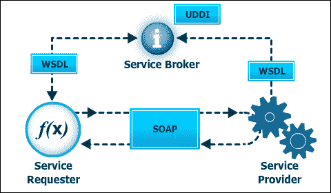](https://cdn.edureka.co/blog/wp-content/uploads/2015/01/Divyas-blog_inside_blog.png)

既然您已经理解了它是如何工作的，那么让我们来开发一个 web 服务。

在. NET 中，管理 web 服务开发的主要有三个方面。

1.创建 web 服务 2。创建一个代理 3。使用创建的 web 服务。

[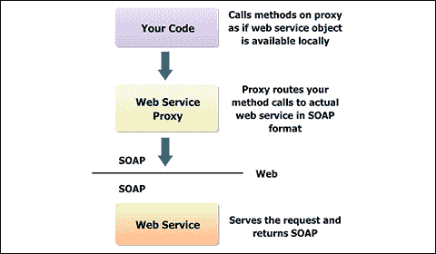](https://cdn.edureka.co/blog/wp-content/uploads/2015/01/Div_blog_1.png)

在中创建 web 服务。网络:

1.右键单击您的项目>添加>新建项目。

[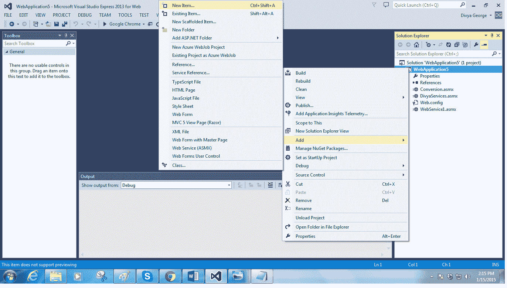](https://cdn.edureka.co/blog/wp-content/uploads/2015/01/2-3.png)

1.Web > Web 服务 2。为你的网络服务取一个名字 3。单击添加。

[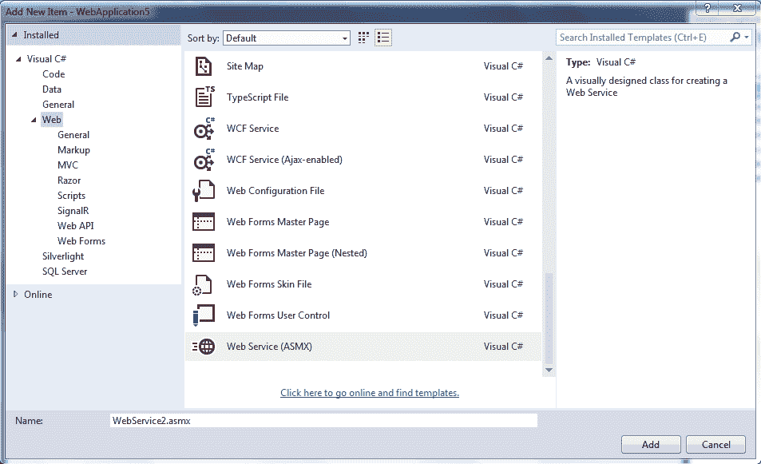](https://cdn.edureka.co/blog/wp-content/uploads/2015/01/2-4-1.png)

请注意，web 服务文件以。asmx 现在您已经创建了一个默认的 web 服务，您将看到以下内容:

```
using System;
using System.Collections.Generic;
using System.Linq;
using System.Web;
using System.Web.Services;

namespace WebApplication5
{
/// <summary>
/// Summary description for WebService2
/// </summary>
[WebService(Namespace = "http://tempuri.org/")]
[WebServiceBinding(ConformsTo = WsiProfiles.BasicProfile1_1)]
[System.ComponentModel.ToolboxItem(false)]
// To allow this Web Service to be called from script, using ASP.NET AJAX, uncomment the following line.
// [System.Web.Script.Services.ScriptService]
   public class WebService2 : System.Web.Services.WebService
   {

     [WebMethod]
     public string HelloWorld()
     {
       return "Hello World";
     }
   }
}
```

在上面的代码片段中，web 服务类继承自系统。Web.Services.WebService，它由 Web 服务属性[WebService]包围，您可以在其中指定名称空间并提供 Web 服务的简要描述。

WebMethod 属性[WebMethod]用于将方法声明为 web 服务的一部分。它必须放在您希望在 web 服务中公开的每个方法的声明之前，并且所有方法都应该声明为 public。

要创建 web 服务方法，请将代码添加到一个公共方法中，并将 web 方法属性添加到 WebService1 类中。例如:

```
[WebMethod]
public int ConvertToFarenheit(int celsius)
{
int f = 0;
f = (celsius * 9 / 5) + 32;
return f;
}
```

之后运行 web 服务，我们将得到下面的页面:

[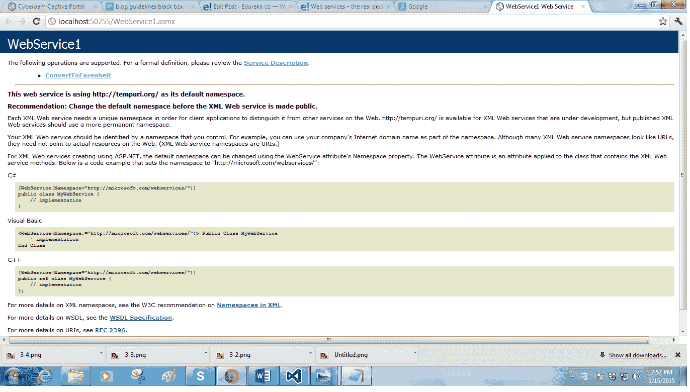](https://cdn.edureka.co/blog/wp-content/uploads/2015/01/2-5.png)

这包括我们在 web 服务中公开的方法，以及到服务描述(WSDL 文件)的链接。现在要测试你的 web 服务，点击方法，得到下面的页面。传递参数值并单击 invoke。

[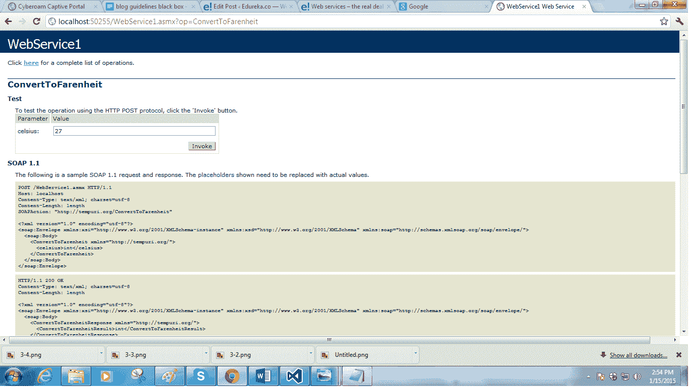 ](https://cdn.edureka.co/blog/wp-content/uploads/2015/01/2-6.png) 你会得到这样的 web 服务的输出:

[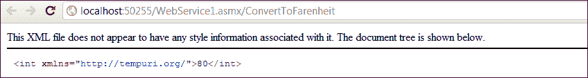](https://cdn.edureka.co/blog/wp-content/uploads/2015/01/2-71.png)

现在，让我们看看如何使用我们在应用程序中创建的 web 服务。 1。在您的项目中，右键单击 references >添加服务引用

[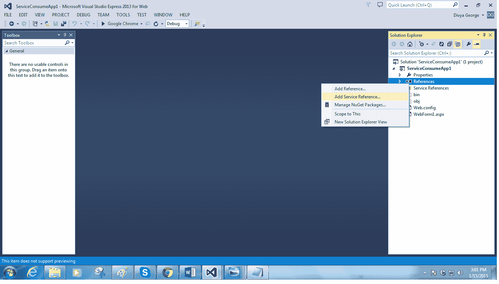](https://cdn.edureka.co/blog/wp-content/uploads/2015/01/2-8.png)

如下面的屏幕截图所示: 1。在地址栏中输入服务描述符或 WSDL 文件的 URL。然后单击开始。它找到我们创建的 web 服务。 2。单击确定

[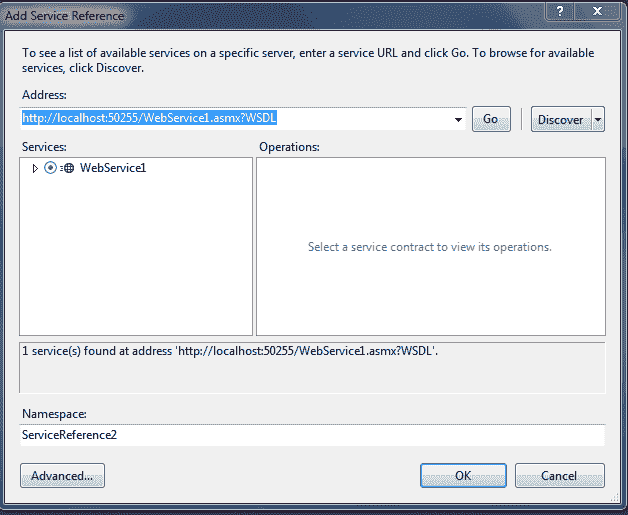](https://cdn.edureka.co/blog/wp-content/uploads/2015/01/2-9.png)

在 solution explorer 中，我们可以看到，在 References 下创建了一个服务引用目录。它包括一个文件夹，其中包含与使用 web 服务相关的所有文件

[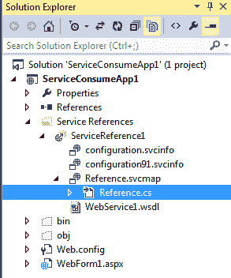](https://cdn.edureka.co/blog/wp-content/uploads/2015/01/2-10.png)

这里，ServiceReference1 是我们创建的 web 服务。在 servicereference 1>reference . SVC map>reference . cs 中创建了一个代理类(WebService1SoapClient ),我们可以用它来调用 web 服务中定义的方法。

[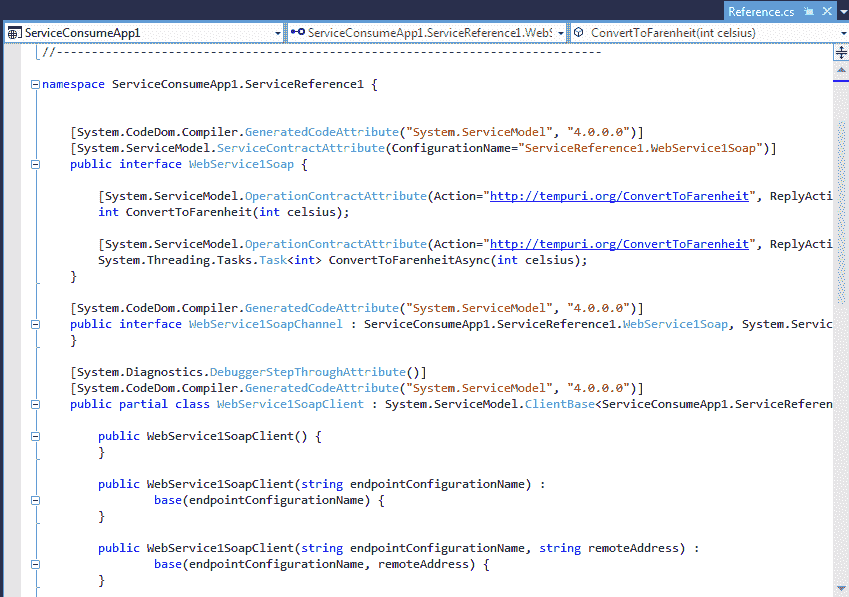](https://cdn.edureka.co/blog/wp-content/uploads/2015/01/2-11.png)

在我们的应用程序中使用它: 1。创建代理类的对象。 2。通过代理类的对象调用 web 服务中可用的方法。

```
using System;
using System.Collections.Generic;
using System.Linq;
using System.Web;
using System.Web.UI;
using System.Web.UI.WebControls;
using ServiceConsumeApp1.ServiceReference1;

using ServiceConsumeApp1.ServiceReference1;

namespace ServiceConsumeApp1
{
  public partial class WebForm1 : System.Web.UI.Page
  {
     protected void btnConvertRates_Click(object sender, EventArgs e)
     {
        WebService1SoapClient fn1 = new WebService1SoapClient();
        TextBox2.Text = fn1.ConvertToFarenheit(Convert.ToInt32(TextBox1.Text)).ToString();
     }
  }
}
```

当我们运行应用程序时，在 web 表单中放置适当的控件来显示我们的结果之后，输出将显示如下。

这就是我们如何在. NET 中创建和使用 web 服务。

[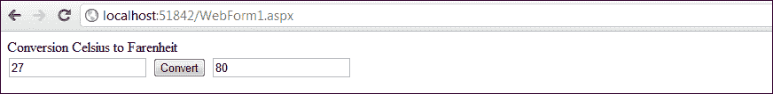](https://cdn.edureka.co/blog/wp-content/uploads/2015/01/2-12-1.png)

您可以在中创建许多 web 服务。NET 上面提到的步骤。用任何语言构建的任何应用程序都可以访问这些 web 服务。因此，Web 服务解决了不同应用程序之间的通信问题，并证明了这是一笔真正的交易。查看此[全栈开发者课程](https://www.edureka.co/masters-program/full-stack-developer-training)以了解更多关于 web 服务的信息。

有问题要问我们吗？请在评论区提到它，我们会给你回复。

**相关帖子:**

[【Microsoft.NET】入门](https://www.edureka.co/microsoft-dotnet-framework-self-paced?%20&)

[释放出临朐的力量。净道](https://www.edureka.co/blog/unleash-the-power-of-linq-the-net-way/)