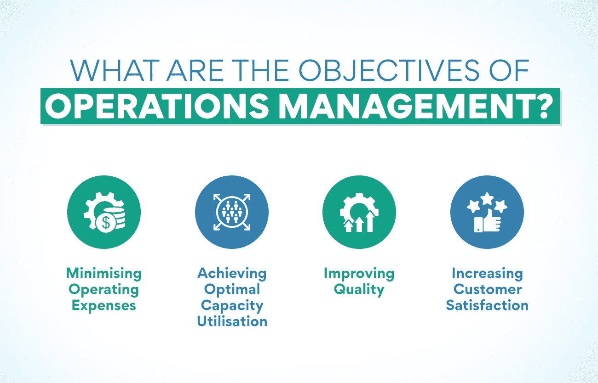
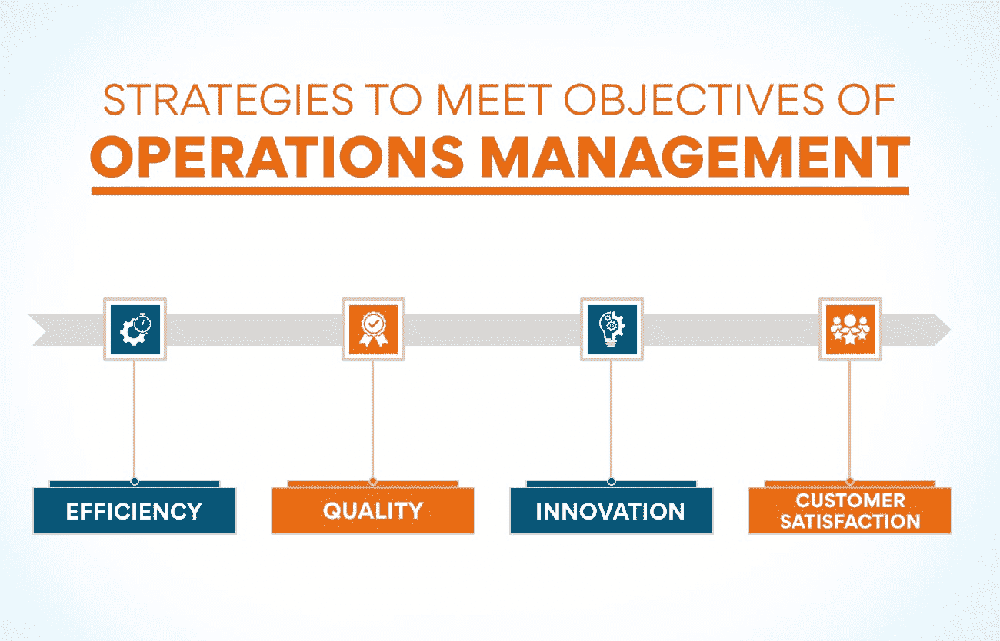

# 运营管理的目标是什么？

> 原文：<https://www.edureka.co/blog/what-are-the-objectives-of-operations-management/>

每个企业都必须有一个有效的运营管理系统才能成功。运营管理有许多目标，但最重要的是为客户创造价值并获取利润。其他目标包括确保质量、保持效率和降低成本。这篇博文将更详细地强调运营管理的目标。

## 什么是运营管理及其在商业中的重要性？

[运营管理](https://www.edureka.co/blog/beginners-guide-to-operations-management/)是监督、设计和控制商品和服务生产的过程。它包括管理生产商品和服务所需的资源。运营管理的目标是确保高效和有效地交付产品和服务

运营管理至关重要，因为它有助于企业实现目标。它确保高效和有效地生产产品和服务。它还允许公司控制成本和提高质量。

运营管理对任何企业来说都是一项至关重要的职能。它可以通过确保高效和有效地生产产品和服务来帮助企业实现其目标。它还可以帮助公司控制成本和提高质量。

对于任何组织来说，运营管理都是一项至关重要的职能。它协调和监督生产商品或服务所需的资源和流程。运营管理的目标是确保这些资源和战略得到有效和高效的利用，以满足组织的目标。

## **运营管理的好处**

有效的运营管理有很多好处。也许最重要的是，它可以帮助提高组织的整体绩效。良好的运营管理有助于确保资源得到有效利用，流程高效，目标得以实现。这可以增加利润，提高客户满意度，并提高员工满意度。

运营管理也有助于降低成本。通过提高效率和有效性，运营经理可以帮助减少资源使用。这可以降低生产成本，最终提高利润。

此外，良好的运营管理有助于提高产品或服务质量。通过确保资源和流程的最高质量，运营经理可以帮助提高组织产出的整体质量。这可以提高客户满意度和回头客。

最后，有效的运营管理有助于为组织创造竞争优势。通过提高效率和质量，运营经理可以帮助组织的产品或服务对客户更具吸引力。最终会带来更高的利润，增加市场。

如你所见，运营管理的目标对任何组织都是至关重要的。通过确保资源和流程得到适当使用，运营经理可以帮助提高组织的整体绩效。这可以增加利润，提高客户满意度，并提高员工满意度。因此，如果你在你的组织中负责运营管理，确保你牢记这些目标。

没有开始运营经理的职业生涯？看一看我们的运营经理证书课程，向富有成效的旅程迈出第一步。

## 运营管理的目标是什么？

运营管理是与生产商品和服务相关的垂直行业，包括资源、流程和人员的管理。运营管理的目标可以分为两大类:内部和外部。

内部目标与业务本身的运作有关，涉及效率、质量和成本等问题。另一方面，外部目标与企业对其周围环境的影响有关，并与环境影响、客户满意度和社会责任等问题有关。

这两种类型的目标对企业的成功都至关重要，企业需要确保实现内部和外部目标。为了做到这一点，公司需要清楚地了解他们的目标是什么，以及实现这些目标的理想方式。

我们来详细讨论一下运营管理的目标:

**最小化运营费用:**[运营管理](https://www.edureka.co/blog/what-is-the-scope-of-operations-management/)的目标之一就是最小化运营费用。这可以通过各种方法来实现，例如减少浪费、提高流程效率以及与供应商谈判更好的价格。它有助于企业降低总体成本，提高盈利能力。毫无疑问，它是运营管理的关键要素之一。

企业可以通过多种方式来降低运营费用。一些方法如下:

*   减少浪费: 企业可以通过改善流程，确保只使用自己需要的资源来减少浪费。
*   **提高流程效率:** 企业可以通过简化流程并确保其平稳运行来提高流程效率。
*   **与供应商协商更好的价格:** 企业可以通过批量购买或协商长期合同的方式与供应商协商更好的价格。

**实现最佳产能利用率:** 运营管理的另一个目标是实现最佳[产能利用率](https://www.edureka.co/blog/what-is-capacity-planning-in-operations-management/)。这意味着最大限度地利用企业的可用资源来生产商品和服务。通过高效的计划、生产调度和有效的库存管理技术，可以以最佳方式利用最佳产能。

运营经理可以通过多种方式实现最佳产能利用率:

*   **高效的生产计划和调度:** 这涉及到确保生产过程的计划和组织能够充分利用现有资源。这可以通过使用有效的生产计划和调度技术来实现。
*   有效的库存管理: 这涉及到确保维持适当的库存水平，以便生产能够不受任何干扰地进行。这可以通过使用有效的库存管理技术来实现。
*   **技术的运用:** 技术的运用也有助于实现最佳的产能利用率。这是因为它有助于生产过程的自动化，从而减少对手工劳动的需求。

**提高质量:** 提高质量也是运营管理的一个基本目标。这可以通过实施质量控制程序和技术来实现。质量改进目标应当与企业的总体目标相一致，以确保它们是可以实现的。

在一个企业中，有各种各样的方法来提高质量。然而，重要的是要确保质量目标是现实的和可实现的。

*   **进行质量审核:** 质量审核是一个有助于评估运营管理目标是否实现的过程。这可以通过使用不同的工具和技术来完成。
*   **实施质量控制程序:** 质量控制程序可以用来提高产品和服务的质量。这些程序的设计应满足业务的特定需求。
*   培训员工: 应该对员工进行质量重要性以及如何提高质量的培训。这将有助于确保他们了解运营管理的目标以及如何实现这些目标。
*   **评审质量目标:** 应定期评审质量目标，以确保满足这些目标。这将有助于确定任何需要改进的地方。

**提高顾客满意度:** 运营管理的另一个目标是提高顾客满意度。实施客户服务程序和技术是实现这一目标的最佳途径。客户满意度目标应该与企业的总体目标相一致，以确保它们是可以实现的。

提高客户满意度有多种方法，包括:

*   提供卓越的客户服务: 这包括确保客户得到礼貌、高效的对待，他们的疑问或顾虑得到及时处理。
*   **提供好的产品或服务:** 这意味着提供满足顾客需求和期望的产品或服务。
*   信守承诺: 信守对客户的任何承诺都很重要，比如交货日期或产品特性。
*   有效沟通: 这包括让客户了解进展情况，并确保他们了解正在发生的事情。
*   **快速解决问题:** 如果产品或服务有任何问题，快速有效地解决它们是很重要的。

运营管理还有许多其他目标，但以下是其中一些最重要的目标。通过实现这些目标，企业可以提高他们的整体业绩，变得更加成功。

## 如何实现运营管理的目标？

运营管理有各种目标，但最重要的目标是确保产品/服务在预算内及时交付，同时满足或超过客户期望。

运营经理还必须有效地管理和激励员工，同时不断改进流程和程序。为了实现这些目标，运营经理必须对业务的各个方面有深刻的理解，包括营销、财务和人力资源。

虽然运营管理的目标看起来令人望而生畏，但重要的是要记住这些目标是任何企业成功的福音。公司可以通过理解和实施有效的运营管理技术来优化资源和提高利润。

## **实现运营管理目标的策略**

实现运营管理目标的策略多种多样，但最重要的策略可以分为四个关键领域:效率、质量、创新和客户满意度。以下是实现运营管理目标的策略:

****

**效率**

运营经理努力充分利用所有资源，包括劳动力、材料、技术和时间。这里的目标是用最少的投入或浪费获得预期的产出。这可以通过简化流程、消除瓶颈和减少浪费来实现。效率是实现成本、生产率和利润相关目标的关键。

**质量**

运营经理还致力于生产满足或超过客户期望的产品和服务。这就需要设计出质量一致的流程，并实施质量控制措施，以确保产品和服务符合这些标准。没有足够的质量，运营管理毫无用处。这是实现运营管理动态目标的关键策略之一。

**创新**

虽然效率和质量是基本目标，但运营经理还必须能够适应变化和创新。这需要不断寻找改进流程和产品的方法，并接受新的想法。每一种产品/服务都需要能够带来更多价值的独特创新。因此，部署全新的创新以实现运营管理的不同目标变得势在必行。

**客户满意度**

最终，运营管理的目标是生产顾客满意的产品和服务。一个公司如果不能确保客户 100%满意，就无法想象一个成功的产品。这需要了解客户的需求和愿望，设计满足这些需求的流程和[产品](https://www.edureka.co/blog/what-are-the-stages-and-examples-of-a-product-lifecycle/)。它还包括确保客户在整个过程中随时了解情况，并及时解决他们的问题。

## **如何成为运营经理？**

任何潜在的运营经理都应该知道运营管理的几个目标。首先，运营经理必须能够识别和管理资源。它包括物质资源，如材料和劳动力，以及无形资源，如时间和信息。其次，运营经理必须能够创建和维护时间表。日常任务的短期计划和大型项目的长期计划都要考虑。最后，运营经理必须能够监控和优化流程。这包括了解流程是如何工作的，识别瓶颈或低效之处，并做出改进流程的更改。

那些有兴趣成为运营经理的人应该知道这些目标，并确保他们能够实现这些目标。对于任何想要在工作中取得成功的运营经理来说，实现这些目标都至关重要。

你有成为运营经理的激情吗？如果你认为你有，那么一定要重温你的目标，开始你的成功之路。我们的[运营、供应链管理和项目管理高级证书](https://www.edureka.co/highered/advanced-program-in-operations-supply-chain-project-management-iitg)是向您的大脑灌输所有运营管理知识的最佳场所。我们为您提供有关运营管理的详细信息以及更多信息。