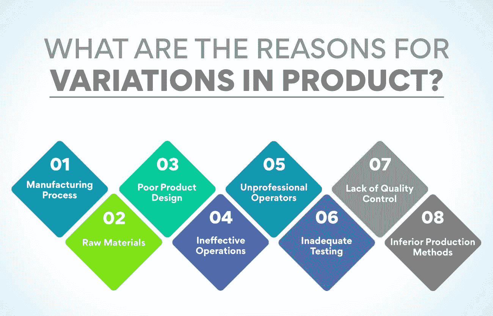
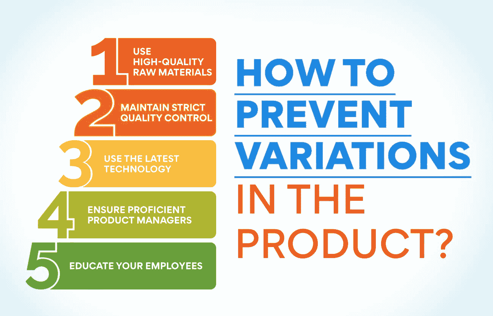

# 产品差异的原因是什么？原因和理由

> 原文：<https://www.edureka.co/blog/what-are-the-reasons-of-variations-in-product-causes-reasons/>

制造产品时，一个单元与下一个单元之间可能会有很多差异。这是由于产品的固有性质，以及制造过程。但是，产品变化的原因是什么？在某些情况下，这可能是由于外部因素，如天气或供应短缺。谈到产品变化，可能有许多原因和起因。当一家公司批量生产产品时，尤其如此。企业需要了解可能导致产品差异的各种因素，以便采取措施减轻这些因素。

想知道是什么原因导致了产品的变化，并在垂直运营和产品管理领域脱颖而出？查看我们的课程[运营、供应链和项目管理](https://www.edureka.co/highered/advanced-program-in-operations-supply-chain-project-management-iitg)高级证书，获得实践经验。从通过基于实践的学习理解关键概念到构建领域专业知识，我们的课程为您成为专业人士做好了一切准备。

## **什么是产品差异？**

产品差异是指两种本应相同的产品在某些方面存在差异。它可以被定义为产品中偏离目标规格的任何差异。这可以包括物理特性(如尺寸或颜色)到性能属性(如功能性或耐用性)。

产品差异对公司来说是一个大问题，会导致客户不满和退货。它可能发生在制造、运输过程中，甚至是产品在商店货架上的时候。换句话说，产品差异是任何使产品与预期不同的东西。

对于制造商来说，产品差异是非常令人沮丧的事情之一，它会对公司的利润产生重大影响。如果顾客对收到的产品不满意，他们可能会退货，或者永远不再从该公司购买。此外，产品差异会导致制造成本增加，因为公司可能不得不生产同一产品的不同版本。

**产品变更的关键要素**

*   产品变化的原因是什么
*   产品变化的好处是什么
*   产品变化的关键要素是什么
*   如何创建产品变化

对于任何想为顾客提供多种产品的企业来说，产品多样化是必不可少的。通过提供不同的产品变化，公司可以迎合客户的不同需求和偏好。

想了解更多关于产品变异的信息，产品变异的原因是什么，和 它对您的业务有何帮助？查看我们的[运营、供应链和项目管理高级证书](https://www.edureka.co/highered/advanced-program-in-operations-supply-chain-project-management-iitg)，从实践学习到个性化职业支持，应有尽有。对于想要在产品管理领域开创事业的初学者和专业人士来说，这是一个千载难逢的机会。

## 产品差异的原因是什么？

几个不同的因素会导致产品的变化；下面我们就来熟悉一下其中的一些常见的。

****

**制造过程**

产品差异最明显也是最常见的原因是制造过程。在任何一种生产中，理想的产品总会有一定程度的偏差。这是由于机器工作不完美，人为错误，甚至每次使用的材料都不完全相同。所有这些因素都会导致最终产品的细微变化。

制造过程中变更的关键要素:

*   机器工作不正常
*   人为错误
*   每次使用的材料并不完全相同。

**原材料**

产品差异的第一个也是最常见的原因是使用来自不同供应商的原材料。这是因为供应商经常从各种渠道获得原材料。即使一家公司使用同一个供应商，原材料也会有差异。不同的因素会导致原材料的变化，如天气条件和一年中的时间。

由于原材料引起的变化的主要因素:

*   原材料的种类
*   供应商
*   原材料的来源
*   天气状况
*   一年中的时间

作为运营经理，你想学习如何最好地优化原材料吗？看看我们的[运营、供应链和项目管理](https://www.edureka.co/highered/advanced-program-in-operations-supply-chain-project-management-iitg)高级证书，它会让你更仔细地了解产品变化是如何工作的。

**糟糕的产品设计**

产品差异背后的一个主要原因是糟糕的产品设计。这通常发生在设计师不清楚终端用户想要什么的时候。他们也可能使用过时的信息或不准确的数据。这会导致设计出不符合用户需求的产品。

随着你的产品开始成形，你需要决定提供什么样的变化。你想要不同的颜色吗？大小不一？材质不同？

选择是无穷无尽的，但最重要的是考虑你的顾客想要什么和需要什么。毕竟客户会是你产品的最终用户！由于产品设计引起的变化通常归结为两件事:

*   **审美:** 这都是为了好看。你希望你的产品有不同的颜色吗？你希望它用其他材料制成吗？
*   **功能:** 这是关于什么工作得好。是否需要不同的尺寸来容纳其他用户？是否需要额外的材料来满足不同的需求？

**无效操作**

产品中可能存在变异的原因有很多，但无效的操作往往是根本原因。当流程没有被很好地理解或控制时，结果就是变化。例如，如果对制造过程了解不多，就会生产出不符合要求公差的零件。这导致返工、报废和成本增加。

无效运营导致产品变化的关键要素:

*   缺乏对流程的理解
*   流程控制不佳
*   返工
*   报废
*   成本增加

**不专业的操作员**

产品质量参差不齐的主要原因之一是操作人员不专业。不熟练的工人通常不明白他们在做什么，以及这是如何影响产品的。他们缺乏动力和生产力会导致质量下降。这可能导致产品质量差，制造过程不一致。这些方法可以解决这个问题:

*   确保您的操作员经过充分培训，并具备工作所需的技能。
*   向他们提供明确的指示和期望。
*   确保他们有足够的动力去做好工作。
*   密切监督他们的工作，并立即解决任何问题。

**测试不充分**

许多产品没有经过适当的测试就发布了。它会导致产品质量的大量变化，这可能会让客户感到沮丧。测试对于确保产品安全并符合所有法规也至关重要。如果产品在发布前没有经过充分的测试，就会造成大量的浪费。

因测试不充分导致产品变化的关键因素:

*   不安全产品
*   缺乏客户满意度
*   质量控制不佳
*   浪费的资源(时间、金钱、材料)

**缺乏质量控制**

缺乏质量控制是产品差异的最常见原因。这可能是由几个因素造成的，例如不正确或不一致的测量、劣质材料或制造缺陷。

如果产品没有按照正确的规格制造，它们将无法满足客户的期望，很可能会被退回或更换。这会给企业带来很多麻烦，更不用说收入损失了。

不一致的测量通常是人为错误造成的，但也可能是机器错误造成的。如果测量不正确或机器校准不正确，会导致产品偏差。

因此，采取良好的质量控制措施对于确保产品符合正确的规格至关重要。它包括拥有一支训练有素的员工队伍和投资质量控制设备。

由于缺乏质量控制导致产品变化的关键因素:

*   不正确或不一致的测量
*   劣质材料
*   制造缺陷
*   劳动力缺乏培训
*   质量控制设备不足

**劣质生产方法**

当以不同的方式制造产品时，你可能会偷工减料，这通常会导致不一致。没有示例性的生产方法，生产一致的产品是具有挑战性的。如果一家公司没有使用合适的生产方法，产品的质量可能会有所不同。这是产品质量参差不齐的常见原因之一。

使用最好的生产方法来防止产品质量的变化是至关重要的。许多因素都会影响生产，例如所用的机器类型、原材料的质量以及工人的技能。如果这些因素中的任何一个不符合标准，都可能导致产品质量低劣。使用现有的最佳生产方法对于确保产品的一致性至关重要。

通过我们引人入胜、见解深刻的课程，了解更多有关产品变化的信息。

## **如何防止产品变异？**

“预防总是胜于治疗”。这同样适用于产品变化。通过采取一些预防措施，您可以完全避免产品差异。现在你知道了产品变异的原因是什么，查看一些如何防止产品变异的技巧:

**使用优质原料:** 这是防止产品变异的最关键因素之一。通过使用高质量的原材料，您可以确保您的产品符合要求的标准。

**保持严格的质量控制:** 质量控制对于防止产品变异至关重要。有一个严格的质量控制过程在早期发现任何变化是非常必要的。

**使用最新技术:** 技术是不断发展的，可以用来防止产品变异。最新的技术和先进的机器可以帮助您生产出质量稳定的产品。

**确保熟练的产品经理:** 产品经理在产品开发中起着举足轻重的作用，确保最终产品无变异。有了熟练的产品经理，你就可以放心，你的产品会达到要求的标准。

**教育你的员工:** 员工在防止产品变异方面起着至关重要的作用。通过教育他们质量控制的重要性和避免偏差需要采取的步骤，你可以确保他们在工作中更加警惕。

## 产品的变化对商业有益吗？

产品多样化是促进业务发展的好方法。它可以帮助你吸引新客户，并让现有客户回头客更多。

变化也是测试新产品或新想法的好方法。通过提供几个不同的选项，你可以看出哪些可行，哪些不可行，而不需要承诺一个完整的产品发布。

关于产品变化，必须考虑几件事。首先，确保你提供的变化是不同的。提供同一产品的多种变化会使顾客困惑，使他们更难决定买什么。

第二，限制你的变化。丰富的选择可能会让顾客不知所措，使他们更难获得满足其需求的最佳产品。

最后，确保你的产品价格合理。如果一种替代品比其他产品贵得多，消费者就不太可能选择它。

## **底线**

毫无疑问，产品变化是营销人员武器库中最有力的工具之一。通过了解产品差异的常见原因，您可以针对与客户密切相关的领域开展有针对性的营销活动。

虽然您很清楚产品变化的原因，但您的客户可能并不清楚。通过对他们进行这些话题的教育，你可以建立更牢固的关系，建立更深层次的信任。

应该战略性地利用产品变化来支持你的营销目标。如果使用正确，产品变化可以帮助您增加销售，提高客户满意度，并建立一个更强大的品牌。

想要成为一名出色的产品经理并了解更多关于产品变化的信息吗？我们为您提供完美的解决方案！进入[运营、供应链和项目管理](https://www.edureka.co/highered/advanced-program-in-operations-supply-chain-project-management-iitg)高级证书课程，在这里您可以积累专业知识，通过实践学习，获得个性化职业支持等。