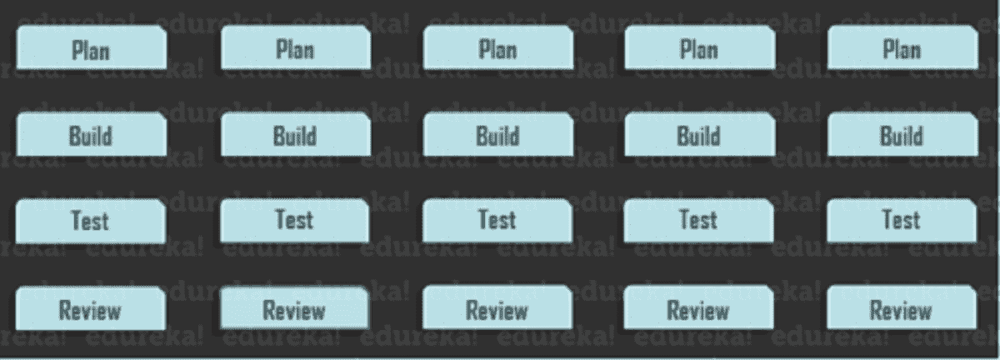
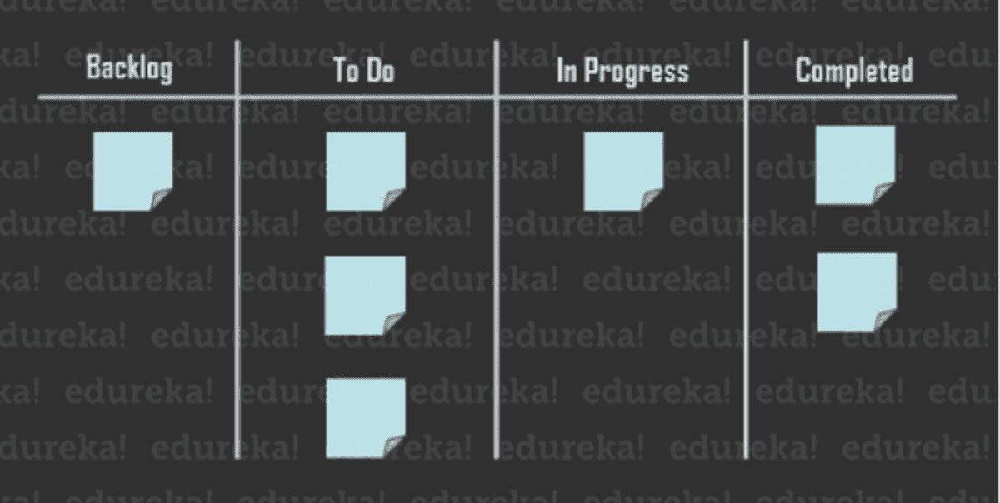

# 敏捷项目管理的人员、原则和过程

> 原文：<https://www.edureka.co/blog/what-is-agile-project-management/>

如果你对敏捷项目管理的概念不熟悉或不熟悉，那么它可能看起来很复杂，很难作为一个系统来处理。目前，软件开发商、教育机构、营销团队都采用敏捷项目管理方法。这是一个很容易建立的有前途和有回报的概念，因此许多公司和组织可以真正从将它实施到他们的系统中受益。虽然有各种资源通过软件、书籍和教练来教育敏捷项目管理；为了获得最大的收益，最好定制一个最适合你的业务和团队的敏捷项目方法。

本文讨论的主题是:

*   [敏捷项目管理指南](#guidelines)
*   [参与敏捷的人](#people)
*   [与敏捷方法相关的过程](#process)

## **敏捷项目管理指南**

敏捷项目管理方法多种多样，每个团队都有自己独特的需求，但通常很少有基本的指导方针和原则被用于决策和产品开发。如果这些指导方针能够被很好地理解和执行，敏捷框架就能见证成功。

*   最高优先级总是通过准时和持续的软件交付来争取客户满意。
*   开发中的变更应该受到欢迎，即使有需要的后期变更。客户的竞争优势要求通过敏捷流程进行变革。
*   应该建立一个短的截止日期，项目应该在短时间内交付。因此，项目交付的频率应该是好的。
*   在项目运行期间，参与过程的团队成员必须每天提供最大限度的持续投入。
*   工作环境应该充满动力，参与项目的个人应该利用这样的环境，并从团队获得足够的支持，以有效地完成分配给他们的工作。
*   团队内部应该注重沟通。面对面的交谈应该是最常用的交流方式，因为这是在团队中传达和传递信息的最有效方式。
*   项目的最终产品是衡量进度的关键。
*   敏捷项目管理方法提倡组织的可持续发展。参与的利益相关者应该在整个项目中保持一致的步调，直到项目完成。
*   持续关注技术技能和优秀的设计至关重要。
*   团队应该足够独立，以便有效地组织自己，因为这能产生最好的架构和设计。
*   团队应该能够定期评估他们自己的表现，并做出相应的调整以提高效率。

既然你已经知道了保证敏捷项目管理成功的指导方针，让我们来看看在使用敏捷开发产品时所涉及的人员。

## **参与敏捷项目管理的人员**

每一种敏捷项目方法都有自己独特的团队成员，并拥有一些敏捷团队成员应该理想拥有的普遍品质和特征。

*   团队中有价值的成员对他们的主题有广泛的了解，对主题有深刻的见解，在一个或多个特定领域有丰富的经验和能力。
*   **跨职能-**这些团队成员拥有他们专业领域之外的技能。他们有关于图形设计原理、数据分析甚至像 HTML/CSS 这样的基本编程的基础知识。
*   **适应性强–**这些团队成员不管面对什么样的情况和环境，都有稳定的产出。他们知道如何运用他们的技能。
*   好奇–好奇会带来新的发现和解决方案，这些发现和解决方案可能会更成功、更高效。问正确的问题和挑战性的情况会导致系统更好的优化和运行，因为有可能取得更好的结果。
*   企业家-敏捷团队成员总是负责和控制项目。他们不需要被告知，因为他们在感觉到需要时会主动开展活动。
*   **团队导向-**团队的成功总是由团队成员之间的动力决定的。如果沟通、协调和行为都很好，团队也很好地融合在一起，那么这就是胜利。
*   **追求卓越-**敏捷项目促进更快的交付和更好的工作质量。致力于通过工作追求卓越的成员永远不会满足于平均水平，他们将不断被自己的奉献精神所激励。

接下来，在这篇敏捷项目管理文章中，让我们来看看使用敏捷理念开发产品时所涉及的过程。

## **与敏捷方法相关的过程**

与传统的瀑布式项目管理相比，敏捷提供的好处是缩短了开发周期，便于频繁的产品发布。这导致团队和客户之间更好更快的沟通，因为团队可以更快更有效地满足客户的需求。最常用的两个敏捷框架是和 **看板** 。所有现有的框架都像他们的方法一样遵循相同的过程。

### **敏捷项目管理规划**

每个项目背后都应该有一个愿景。在开始项目工作之前，团队应该很好地适应目标和目的，以及它给组织带来的价值。在这种情况下，可以设计项目范围。应用敏捷项目管理和使用其方法的主要功能是它能够轻松地应用变更和添加到项目中。

### **创建产品路线图**

路线图是指最终产品构成的特性的分解。这是规划阶段最重要的部分和步骤，因为在每个级别，团队都将负责构建这些单独的功能。产品 backlog 也需要开发，它包括最终产品的所有特性和可交付物的完整列表。当团队在后面的过程中计划冲刺时，这种积压将是有帮助的。

### **发布计划**

在传统的瀑布项目管理中，整个项目开发完成后，只有一个确定的实施日期。然而，在敏捷项目管理中，项目采用更短的开发周期，称为 sprints，每个周期都由它自己的特性组成。在项目开始之前，将为特性发布设计一个计划，并且在每个 sprint 的开始，将研究和评估该特定特性的发布计划。

### **冲刺规划**

在项目中每个冲刺阶段的开始，利益相关者必须决定每个人在冲刺阶段要实现的功能和目标，以及如何实现。任务负担应该在团队成员中平均分配，这样他们就可以在冲刺阶段高效地完成任务。为了团队的透明性，工作流应该被理想地记录下来，并在团队中培养更好的理解和信任。

### **定期会议**

定期召开每日例会是一种很好的做法，有助于在每次冲刺阶段更好地帮助团队合作。召开的会议也有助于评估可能出现的问题或确认要进行的更改(如果有)。在会议中，团队成员将被要求就他们的待办事项列表和前一天完成的任务分别启发整个团队。这些会议应该简短快速，因为它们不应该是一般性会议或解决问题的平台。

### **冲刺回顾和冲刺回顾**

每次冲刺后都要开两次会。第一次会议将集中在 sprint 评审上，项目涉众将在会上展示最终产品。召开此次会议非常重要，因为它有助于与利益相关方进行公开透明的沟通。出现的任何问题都可以当面讨论。第二次会议将是与涉众的 sprint 回顾会议，讨论的重点将是对 sprint 的整体评估。重点是冲刺阶段哪些进展顺利，哪些进展不顺利，哪些本可以做得更好，每个成员的任务分配和结果以及最终结果。

## **结论**

由于其特定的流程、特性和角色，向敏捷项目管理方法的过渡从来都不容易，但这是一个更加简化和有益的过程，可以获得更好的投资回报。它有助于改变你的心态和对项目的态度。

就这样，伙计们！就这样，我们到了文章的结尾。你也可以顺便看看  **[Scrum Master 面试问题](https://www.edureka.co/blog/scrum-master-interview-questions/)** 。

*有问题吗？请在这篇* *文章的评论部分提到它，我们会尽快回复你。*