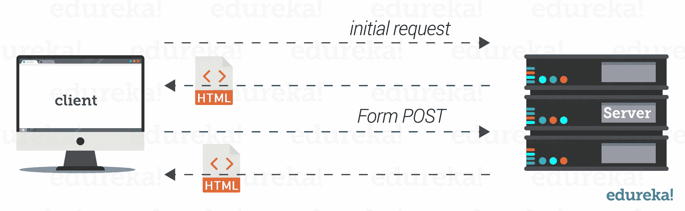
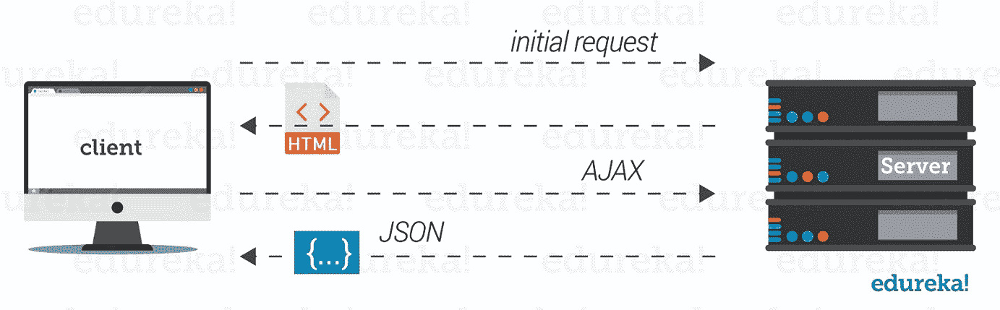
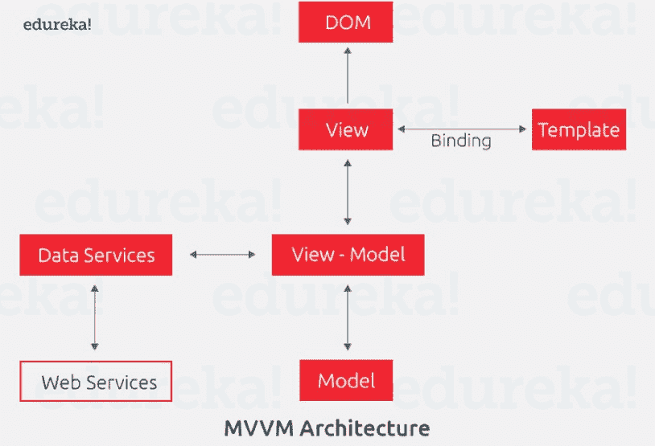
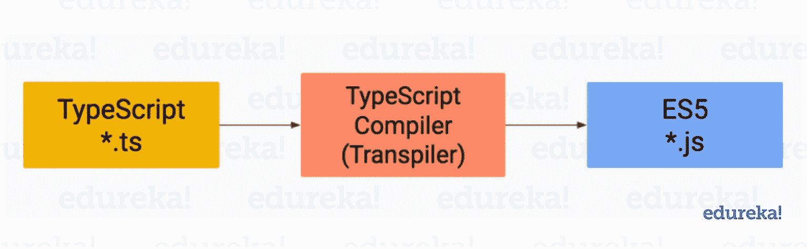
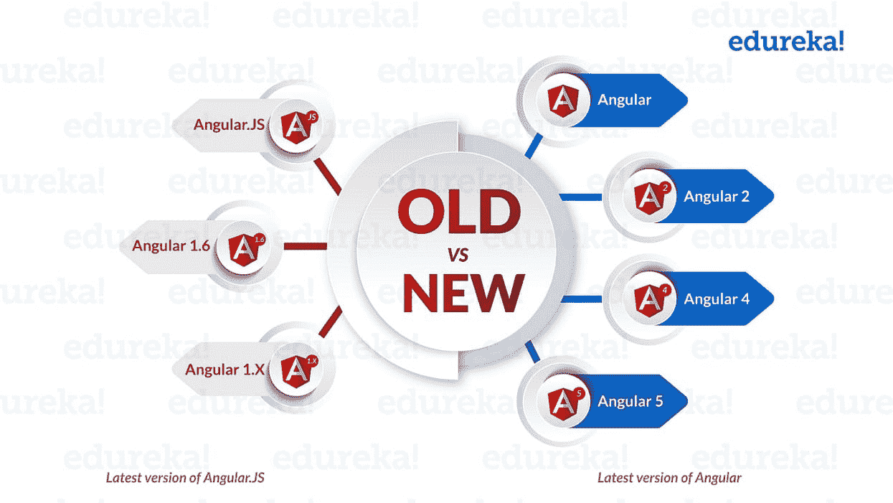
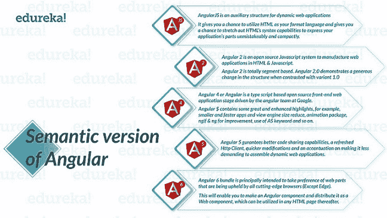
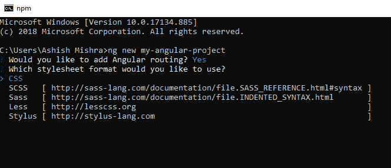
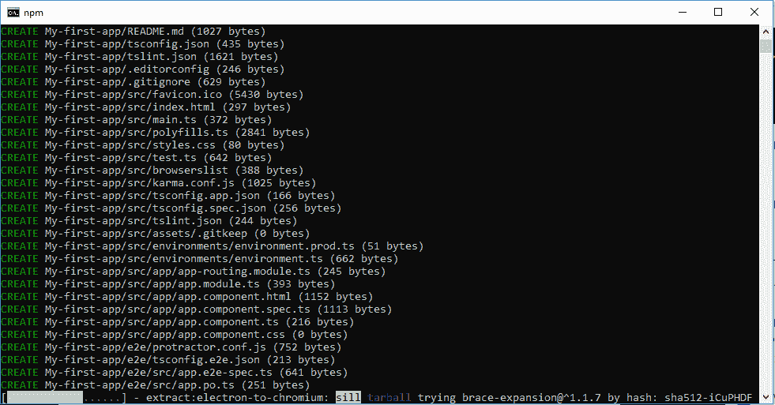
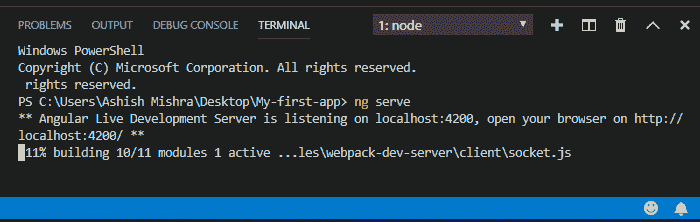
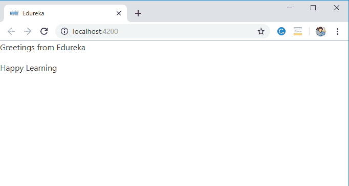

# 什么是 Angular——Angular 入门

> 原文：<https://www.edureka.co/blog/what-is-angular-getting-started-with-angular/>

Angular 因其先进的功能被谷歌、脸书、Paypal 等跨国公司广泛使用。它创建了一个丰富的 web 应用程序，并让开发人员创建一个交互式的客户端应用程序。Angular 是最流行的 [JavaScript](https://www.edureka.co/blog/what-is-javascript/) 前端框架。在浏览这篇关于什么是棱角分明的博客之前，让我们先来看看这些问题:

1.  在 Angular 出现之前，Web 开发的场景是怎样的？
2.  为什么需要开发一个不同的框架？
3.  *为什么 Angular 被称为开发者的游戏规则改变者？*
4.  *为什么要引入单页面应用模型？*

当你浏览这个博客的不同部分*什么是棱角分明的*，你将能够找到上述问题的答案。

以下是本博客将涉及的主题:

*   **[传统 web 应用 Vs 单页面应用](#webapplicationvssinglepageapplication)**
*   **[什么是 AngularJs 及其弊端？](#whatisangularjs)**
*   **[什么是棱角分明？](#whatisangular)**
*   **[不同版本的棱角](#versionsofangular)**
*   **[棱角分明的工作角色&市场分析](#angularjobroles)**
*   **[如何安装角形？](#installangular)**
*   **[建筑和服务角应用](#buildangularapplication)**
*   **[角形项目文件结构](#angularprojectstructure)**
*   **[动手:使用 Angular](#handson)** 创建 Web 应用程序

因此，让我们从了解传统 Web 应用程序和单页面应用程序的区别开始我们的旅程。

## **传统 Web 应用 vs 单页面应用**

如果你还记得我们过去的日子，无论何时你从浏览器请求任何网页。对于每一个请求，页面都会重新加载 来显示数据。

**什么是有棱角的——传统方式生命周期**

从上面的图片中，你可以看到页面为每一个请求重新加载。这种模式被称为**传统网络应用(TWA)。****TWA 模型** 的主要问题是每个&请求的页面渲染过程非常耗时，最终会破坏用户体验。

为了克服所有这些问题，2002 年末引入了单页面应用程序模型。 SPA 模型通过使 web 应用程序的响应速度比以前更快，解决了为转发的每个请求频繁重新加载网页的问题。

那么，什么是 SPA 模式呢？让我们更详细地理解这一点。

在 SPA 模型中，客户端请求一个 URL，然后将整个页面加载到客户端的浏览器中。现在，这不需要重新加载页面。【图片】



**什么是 Angular 单页应用生命周期**

全球的跨国公司都有基于 SPA 模式的网站，如谷歌、脸书、贝宝等。

之后，Angular、Vue.js 等很多 JavaScript 框架都采用了 SPA 模型。

**什么是棱角分明——MVVM 建筑**

现在你已经了解了单页应用程序如何解决 TWA 的问题，让我们来了解一下 **AngularJs** 的缺点以及 **AngularJs 和 Angular 之间的区别。**

## **什么是安古拉及其弊端**

AngularJs 是一个开源的前端 JavaScript 框架，用于创建单页面 web 应用程序，由 Google 于 2002 年开发。

**角度问题:**

毫无疑问，AngularJs 在当时非常流行。但是，AngularJS 缺少市场上其他 JavaScript 框架提供的许多重要特性。

AngularJS 缺乏的主要特征是:

*   大捆尺寸
*   性能问题
*   不支持移动设备

因此，AngularJS 无法解决上述问题，这导致了一个更加稳定和快速的新 JavaScript 框架的开发。

**棱角分明的崛起:**

向前看，为了解决 AngularJs 遇到的问题，谷歌推出了 **Angular** ，一个开源的 JavaScript 框架。这是 AngularJs 的一个完整的 r*ewrite*并在一个不同的范例上工作。

现在，让我们来了解一下**什么是有角**以及不同版本的**有角。**

## **什么是棱角分明？**

是最流行的 JavaScript 前端框架之一。它被许多公司的开发者用来创建和管理网页应用程序。用 ***Typescript*** 编写，一种开源编程语言。

**Typescript** 是 JavaScript 的超集。有了 TypeScript，将 [**面向对象编程**](https://www.edureka.co/blog/object-oriented-programming/) 范式引入 web 开发。

**TypeScript**编程语言是为大型应用程序的开发而设计的。由于浏览器仅支持 JavaScript 语言，因此需要将其转换为 JavaScript。

**什么是角——反编译**

是的，AngularJs 和 Angular is 是完全不同的框架，因此，为了学习，不需要 AngularJS 的知识。事实上，Angular 社区已经停止了 AngularJS 的进一步开发。

因此，随着 Angular 的推出，开发人员开始从 AngularJS 转向 Angular。Angular 成为创建网页应用程序最强大的语言。

到目前为止，你已经了解了 AngularJS & Angular 的区别。让我们继续澄清另一个最常见的关于 Angular 的困惑，为什么 Angular 有这么多版本。

## **不同版本的棱角**

Angular 2 是 Angular 的第一个版本。后来，Angular 3、Angular 4 等版本相继发布。 当你在谷歌**、**上搜索关键词 **Angular** 你会看到类似 **Angular 2、Angular 4、Angular 5、Angular 6 等不同版本。**

我们来试着理解一下为什么 Angular 有这么多版本？

**什么是棱角分明——新旧棱角分明**

角形语义版本有三个不同的部分:

*   **专业**
*   **小调**
*   **路径**

举例- **棱角分明 7.2.11** - > 7 是主版本，2 是次版本& 11 是补丁级别。

*   **重大发布**包含重大新功能，
*   **次要版本**包含不需要对代码库 进行任何更新的小功能
*   **补丁级别**低风险&漏洞修复发布 。

**什么是 Angular——Angular 的语义版本**

从上图中，你可以很容易地比较不同版本的 Angular。Angular 的新版本包括新的捆绑包管理、组件添加、几个补丁修复和代码生成减少等功能，以更少的工作量和复杂性构建应用程序。

因此，**角度**是用于指代新角度的术语，即角度 2、角度 4 等。所以，简单地说，有角的 2 或 4 或 6 都是相同的，它们是有角的的子集。

现在，让我们继续，看看现有的角度工作角色及其薪资分析。

## **工作岗位&市场分析**

Angular 框架被许多公司使用，他们总是在寻找优秀的 Angular 开发人员。下面我们来分析一下 对于 Angular 框架来说不同的 可用工作角色。

| **工作角色** | **平均值。工资(印度卢比；)** | **平均值。**工资(美元) |
| 网络开发者 | Rs。48 万/年 | $94，000/年 |
| 用户体验设计师 | Rs。454，000 人/年 | $90，600/年 |
| 用户界面设计师 | Rs。45 万英镑/年 | 84，000 美元/年 |
| 服务器管理员 | Rs。44.5 万英镑/年 | 72，000 美元/年 |

从上表中，你可以看到随着公司雇佣大量棱角分明的开发人员，薪资分析日益增长。

到现在，我们已经明白了“**W**帽子是有棱角的”。接下来，在本文中，让我们了解 Angular 框架是如何工作的，以及我们如何使用 Angular 创建自己的 web 应用程序。

## **入门**

## 由于 Angular 7 是最新版本，所以我将使用 Angular 7。首先，让我们在系统中安装 Angular。

### **安装角形**

按照以下步骤安装 Angular:

**步骤一:Node.js 安装**

安装 [**节点。Js**](https://www.edureka.co/blog/nodejs-tutorial/) 出自[https://nodejs.org/en/download/](https://nodejs.org/en/download/)

**安装 NodeJS 的理由:** 作为 Chrome、Firefox 等网页浏览器只理解 JavaScript，我们必须把我们的类型脚本转换成 JavaScript。因此，Typescript transpiler 需要 Node。Js 来生成 JavaScript 的类型脚本代码。

**第二步:角度 CLI 安装**

接下来，在控制台(命令提示符)中运行以下命令来安装 Angular CLI，它将用于生成 Angular 项目。在这里，我将使用 ***npm*** 作为默认情况下 NodeJS 附带的包管理器。

```
npm install -g @angular/cli  // -g, is used for installing it globally.

```

**Angular CLI**是一个命令行界面工具，用于初始化、开发和维护 Angular 应用。我们可以在命令 shell 中直接使用这个工具，或者通过 [角度控制台](https://angularconsole.com/) 等交互 UI 间接使用。

**第三步。使用 Angular CLI**T3 创建我们的项目。

要创建您的项目，您必须运行以下命令:

```
cd <my_project>

```

这将创建您的 Angular 项目文件夹。该文件夹将包含许多文件和依赖项。

**什么是角——角项目**

选择 CSS 样式表并按回车键。



**什么是角度-创建角度项目**

如您所见， 我们的项目已经被创建。现在让我们构建和服务我们的应用程序。

### **建筑和服务应用**

为了构建和服务应用程序，我将使用 IDE (Visual Studio)进行演示。您可以根据需要使用任何 IDE 或终端(命令提示符)。

为了在本地服务我们的项目，您将从 IDE 终端运行以下命令。

让我们用 IDE 打开我们的项目，然后按照下面给出的步骤操作:

**第一步:** 进入项目目录里面。

```
cd <my_project>

```

**第二步:**接下来，你要为你的应用服务:

```
ng serve

```

现在，你会想 **ng 发球**是做什么的？嗯，*'****ng serve****'*命令将构建我们的应用程序，并在我们的本地机器上服务它。

使用*'****ng serve****'*的主要好处是，你不需要在修改你的代码库的同时一次又一次地保留你的应用程序。

Angular live development server 将开始监听分配的本地主机。默认情况下，应用程序将在**端口 4200** 上提供服务，这个端口也可以更改。

**什么是 Angular–ng 服务器**

现在，为了检查你的应用，打开你的浏览器，访问:

```
http://localhost:4200

```

为了创建我们自己的网页应用程序，我们需要编辑所有的默认模板，即角度模板。

但是，在进一步编辑不同的文件之前，您是否想过，当您用**ng new<project-name>创建项目目录时，为什么在您的项目目录中会有这么多文件&文件夹。**

我们来了解一下 Angular 项目目录的文件结构。

## **角力项目文件结构**

项目目录中的所有[文件和文件夹](https://www.edureka.co/blog/angular-tutorial/)在 Angular 应用的创建&管理中有其重要性。


**什么是角度-项目结构**

让我们更详细地讨论一下项目结构。

**1->****【e2e】文件夹**:代表 **端到端测试** 也称为集成测试【互连】为 web 应用程序提供高级概述。**e2e 文件夹中的** 由 **spec & config** 文件组成。E2E 由一个名为量角器的测试库驱动，量角器是一个 e2e 测试运行程序，可以进行场景测试并在浏览器中运行。

**2->****node _ module 文件夹:****node _ module**文件夹由 web 应用需要的所有 **npm** 包&依赖项组成。

**3 - >** **src 文件夹:****src 文件夹** 由三个子文件夹组成- > **app 文件夹，assets 文件夹，environment 文件夹** ，以及许多其他文件。

**3.1**->**app 文件夹:**app 文件夹包含定义逻辑和数据的组件

**3 . 1 . 1->**app . component . ts:这个类型脚本文件定义了名为 Appcomponent 的应用的根组件的逻辑。

**3 . 1 . 2->**【app.component.html】&app . component . CSS:**。html** 文件定义了与根 Appcomponent 和 t he **关联的 html 模板。CSS** 文件为根 Appcomponent 定义了基本 CSS 样式表。

**3 . 1 . 3->****app . component . spec . ts:**此。 **spec.ts** 文件为根 Appcomponent 定义一个单元测试。

**3 . 1 . 4->****app . module . ts:****app . module . ts**定义了根模块(AppModule)，负责组装应用。我们可以添加更多的组件，但是应该在这个文件中声明。

**3.2**->**assets 文件夹:** 该文件夹由图像文件&其他资产文件组成，当我们构建自己的应用程序时，将复制这些文件。

**3.3**->**环境文件夹:** 该文件夹包含开发环境&生产环境两个环境文件。

**3.4->favicon . ico:**该文件由一个图标组成，显示在浏览器选项卡中。

**3.5->index . html:**这是您的网页在浏览器中显示时提供的主 HTML 页面。你可以在网页浏览器中通过检查(Ctrl + shift + I)来查看网页的页面源。

**3.6->main.ts:**这个 main . ts 文件是我们 web-app 的入口点。它编译 web-app &引导 **Appmodule** 在浏览器中运行。

**3.7->poly fills . ts:**这个文件由几行代码组成，这使得我们的应用程序可以兼容不同的浏览器。

**3.8 - > test.ts:** 该文件是 web 应用的[单元测试](https://www.edureka.co/blog/what-is-unit-testing)的主要入口点。

**3.9->style . sass:**该文件用 CSS 为项目提供样式。

**3.10->ts config . App . json**&**ts config . spec . JSON:**这些 JSON 文件分别是和 **单元测试** 的配置文件。

到目前为止，我已经讨论了你的项目文件夹的文件结构。让我们继续创建我们自己的网页应用程序。

## **创建自己的网页**

从上图可以看到**“角页”**默认运行输出。html &。ts 文件，现在，我们来编辑它，开发我们自己的网站。

Angular 提供了美化网页的模块。我们只需要简单地从“ **app.module** ”中导入各自的模块，并在**中使用即可。html 文件。**

**例->****从' @angular/core '导入{ Component，on init }；**

正如我所料，你已经使用 **ng serve 完成了你的 Angular web 应用程序。** 现在，按照这些步骤来创建你自己的 web 应用程序。

**步骤 1 - >** 打开**【app . component . html】**文件，删除 **所有默认编写的代码。**

**第二步- >** 现在，编写自己的 HTML 代码和标签。

```
<p>Greetings from Edureka</p>
<p>Happy Learning</p>

```

**步骤 3 - >** 现在，打开你的浏览器，在 **http://localhost:4200** 上请求查看你的输出。



**什么是 Angular-Output(Angular 网页)**

你可以看到你的网络应用。此外，您可以通过添加样式、按钮、gif、弹出窗口和许多其他功能来玩 Angular web 应用程序。

这就把我们带到了“ **什么是棱角分明的** ”的博客的结尾。我希望这篇博客是信息丰富的，并为你增加了价值。现在，你必须清楚 Angular 框架的基础，以及如何创建 Angular 应用程序。我会推荐你通过这个 *Angular 教程* [*Edureka 视频播放列表*](https://www.youtube.com/playlist?list=PL9ooVrP1hQOFyAdwmvyPgFlbiBKiDoTa_) 观看视频，学习如何创建一个 Angular 应用。

*如果您希望了解更多关于 Angular framework 的知识，请查看我们的 [**Angular 课程**](https://www.edureka.co/angular-training) ，该课程包含讲师指导的现场培训和真实项目体验。这个训练将帮助你深入了解 Angular，并帮助你掌握这个主题。*

有问题要问我们吗？请在“**的评论区提一下什么是棱角分明？**“我会回来找你的。