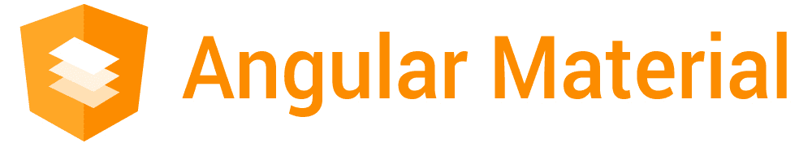
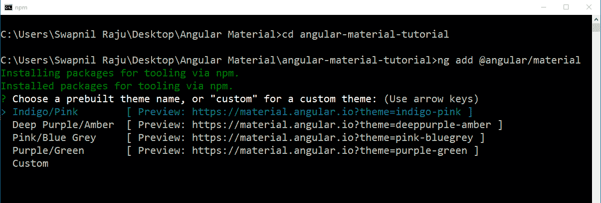
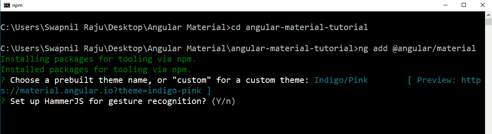
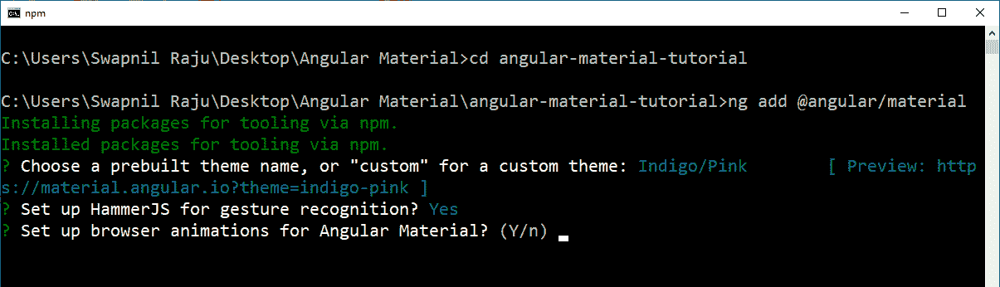
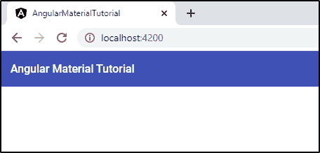
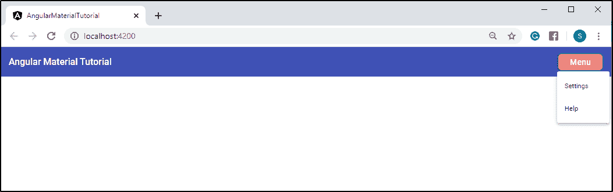
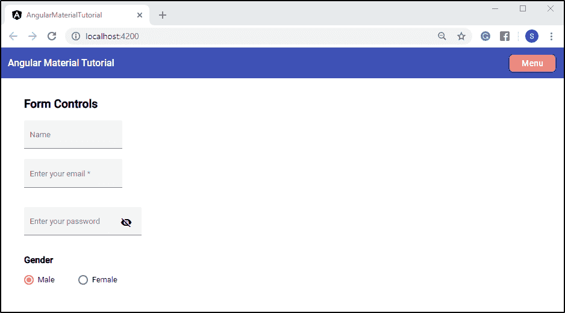
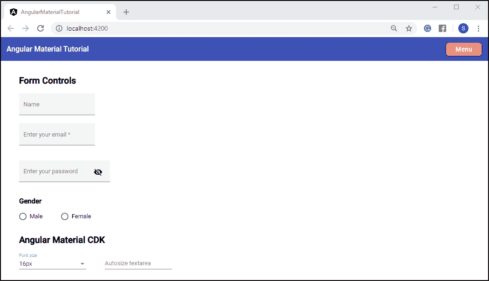

# 什么是角材，如何实现？

> 原文：<https://www.edureka.co/blog/what-is-angular-material/>

UI/UX 组件中的有角材料，称为**有角材料。**他们 帮助棱角分明的应用高效地执行。然而，如果你还没有意识到它们，这里有一篇文章可以帮助你详细地学习有角度的材料。还有，t o 为了深入了解 Angular，可以考虑报名参加 Edureka 的 ***Angular 认证培训*** 。

在这篇文章中，我将讨论以下主题:

*   [棱角材料简介](#intro)
*   [棱角分明的材料安装](#install)
*   [有棱角的物质成分](#component)
    *   [导航](#nav)
        1.  [工具栏](#toolbar)
        2.  菜单
    *   [表单控件](#form)
        1.  [表单域](#field)
        2.  [单选按钮](#radio)
*   [棱角分明的物质 CDK](#cdk)
    *   [文本字段](#text)

## **角状材料介绍**

**材料** 是谷歌在 2014 年开发的一种设计语言。 **材质设计** 是前端框架的工具 ，帮助你进行 **视觉** 、 **动作** 、以及 **交互** 的设计。它还可以帮助您适应不同的设备和不同的屏幕尺寸。首先，它被标记为 AngularJS，以使这些应用程序更具吸引力，并更快地执行。然后，Google 完全从头重新编写代码，去掉 JS 即 [JavaScript](https://www.edureka.co/blog/javascript-tutorial/) ，并于 2016 年 9 月将其命名为 [Angular](https://www.edureka.co/blog/what-is-angular-getting-started-with-angular/) 。后来 Google 将材质设计标记为 Angular，使用[类型脚本](https://www.edureka.co/blog/what-is-typescript/)，命名为 Angular Materials。

****

**Angular Materials** 或用户界面(UI)组件帮助你以一种 **结构化** 的方式设计你的应用。它们吸引用户，并使 **更容易访问** 应用程序中的元素或组件。它们还可以帮助您以一种吸引人的方式设计应用程序，具有独特的 **样式** 和 **形状** 。这些组件有助于让你的应用程序更加**快速****通用** ，甚至设计出响应灵敏的网站。

## **角材安装**

现在，让我们从如何安装角形材料的快速教程开始。首先，确保你的系统中安装了 Angular。如果您不熟悉 Angular，请参考 [Angular CLI 安装](https://www.edureka.co/blog/angular-cli/#angular)上的链接。一旦你设置好了一切，你就可以使用下面的命令给你的项目添加角度材质:

```
ng add @angular/material
```

首先，它会要求你选择一个预建的主题名称或一个自定义主题。



你需要选择“靛蓝/粉色”预设主题，这是你应用程序的默认主题。您也可以选择“自定义”主题，这样您就可以自定义您的主题文件，其中包括所有常见的样式。

接下来，它会要求你设置 **HammerJS** 。HammerJS 是一个流行的库，主要用于 Angular 应用程序。它增加了对滑动、平移、挤压、旋转等触摸手势的支持，尤其是在移动应用程序中。



你可以选择“是”或“否”。在手机上使用应用程序时，HammerJS 会很有用。由于手机提供触摸显示屏，这些手势更有用，在您的移动应用程序中可能看起来更时尚。

在你选择了你的选择后，接下来会要求你为有棱角的素材设置 **浏览器动画** 。



您需要选择“是”,这样您就可以在应用程序中使用动画。有角度的动画使你的应用程序更有趣，更容易使用。这可以改善你的应用和用户体验，吸引用户的注意力。

随后，这将在你的应用中安装有角度的材料。

## **有角度的材料成分**

如前所述，棱角分明的材质组件无非就是 **UI/UX** 设计组件。它们包含各种各样的组件，比如表单控件、导航、按钮&指示器、弹出窗口等等。这些组件帮助您根据材料设计规范实现模式。

接下来，让我们看几个例子，看看如何在您的角度应用中实现这些组件。

### **导航**

首先，我将讨论导航中的组件。

*   **工具栏**

您需要在文件中键入以下代码，以便在您的应用程序中使用工具栏组件。

```
<mat-toolbar color=&rdquo;primary&rdquo;>
    <span>Angular Material Tutorial</span>
</mat-toolbar>
```

*<mat-toolbar>*是一个由棱角分明的材料制成的容器，用于页眉和标题。使用 *颜色* 属性可以改变*<mat-toolbar>*容器的颜色。 默认情况下，工具栏使用基于当前主题的中性背景色，即亮或暗。您可以选择三种默认主题，分别是: *【主要】**【重音】* 或 *【警告】* 。 要使用该工具栏，首先需要使用以下命令从 Angular materials 的*app . module . ts*文件中导入它:

```
import { MatToolbarModule } from '@angular/material';
```

之后，还需要在 *中添加这个模块，导入: *中的* 段，位于 app.module.ts* 文件中。

```
imports: [
    BrowserModule,
    AppRoutingModule,
    BrowserAnimationsModule,
    MatToolbarModule
],
```

对于 Mat-Toolbar，需要添加“*【mattoolbar module】*”。

现在，让我们使用下面的命令来服务您的项目:

```
ng serve -o
```

这将在系统的默认浏览器上打开您的项目，如下所示:



如果你想根据自己的选择改变工具栏的颜色，你可以在 CSS 样式表的帮助下完成。让我给你看一个例子。

首先，你需要从*<mat-toolbar>*容器中擦除 *颜色* 属性，然后，在*app . component . CSS*文件中键入下面的*CSS*代码。

```
mat-toolbar{
    background-color: /*color-of-your-choice*/;
    color: /*text-color*/;
}
```

现在，为你的项目服务，看看结果。

*   菜单

接下来，我将讨论菜单组件。您需要在您的文件中键入以下代码。

```
<mat-toolbar color=&rdquo;primary&rdquo;>
    <span>Angular Material Tutorial</span>
    <span class=&rdquo;space&rdquo;></span>
    <button class=&rdquo;btns&rdquo; mat-button [matMenuTriggerFor]=&rdquo;menu&rdquo;>Menu</button>
    <mat-menu #menu=&rdquo;matMenu&rdquo;>
	<button mat-menu-item>Settings</button>
	<button mat-menu-item>Help</button>
    </mat-menu>
</mat-toolbar>

```

让我们在 *菜单* 按钮上添加一些样式。您需要在您的*app . component . CSS*文件中键入以下代码。

```
.space{
    flex: 1 1 auto;
}

.btns{
    width: 100px;
    height: 40px;
    font-size: large;
    border-radius: 10px;
    border: 3px solid #113c89;
    background-color: lightcoral;
}
```

*class = " space "*用于在“工具栏名称”和“菜单选项”之间添加间距。

万一你对 CSS 样式表不熟悉，可以参考我们关于 [CSS 教程](https://www.edureka.co/blog/what-is-css/)的博客深入了解。

就像工具栏一样，要使用*<mat-menu>*和*<mat-button>*容器，需要遵循与上面相同的步骤，从导入和*matbutton 模块*

现在为您的项目提供服务以显示输出。

### ****

### **表单控件**

现在，我将讨论表单控制中的组件。

*   **表单域**

顾名思义，表单域用于用户输入。它最常用于在应用程序或网站中注册用户。

您需要在文件中键入以下代码，以便在您的应用程序中使用表单域组件。

```

<h2 class=&rdquo;example-container&rdquo;>Form Controls</h2>

<div class=&rdquo;example-container&rdquo;>
		<mat-form-field appearance=&rdquo;fill&rdquo;>
			<mat-label>Name</mat-label>
			<input matInput placeholder=&rdquo;ABC&rdquo;>
		</mat-form-field>
	</div>

```

像往常一样，你需要导入*MatFormFieldModule*和*MatInputModule*并将它们添加到*imports:*节位于*app . module . ts*文件中。上面的代码通常用于输入名字，如“名”、“姓”等。您甚至可以使用验证器并使一个字段成为强制的。例如，您可以将它用于电子邮件字段。您可以隐藏或取消隐藏密码文本。供您参考，请查看下面的代码:

```

<div class="example-container">
<mat-form-field appearance="fill">
    			<mat-label>Enter your email</mat-label>
    			<input matInput placeholder="abc@example.com" [formControl]="email" required>
<mat-error *ngIf="email.invalid">{{getErrorMessage()}}</mat-error>
  		</mat-form-field>
</div>

<div class="example-container">
  	<mat-form-field appearance="fill">
    		<mat-label>Enter your password</mat-label>
<input matInput [type]="hide ? 'password' : 'text'">
<button mat-icon-button matSuffix (click)="hide = !hide" [attr.aria-label]="'Hide password'" [attr.aria-pressed]="hide">
<mat-icon>{{hide ? 'visibility_off' : 'visibility'}}</mat-icon>
   		 </button>
  	</mat-form-field>
	</div>

```

在您的*app . component . CSS*文件中，您需要添加以下代码:

```
.example-container{
    padding-left: 50px;
}
```

现在，在你的*app . component . ts*文件中，你需要从*@ angular/forms*目录中导入*form control*和 *验证器* 。

```
import {FormControl, Validators} from '@angular/forms';
```

您甚至需要在下面的类中添加显示错误的文本。

```
export class AppComponent {
    email = new FormControl('', [Validators.required, Validators.email]);

    getErrorMessage() {
        return this.email.hasError('required') ? 'You must enter a value' :
               this.email.hasError('email') ? 'Not a valid email' :
            '';
    }

    hide = true;
}
```

参照上述步骤，您需要在您的*app . module . ts*文件中键入以下代码，以导入所需的模块。

```
import { FormsModule, ReactiveFormsModule } from '@angular/forms';
import { MatIconModule } from '@angular/material';
```

之后，你需要在 *导入:【】* 段添加这些模块。

*   **单选按钮**

单选按钮通常用于在不同的选项中进行选择。您可以查看以下代码以供参考。

为文件，

```

<div>

<h3 class=&rdquo;example-container&rdquo;>Gender</h3>

    <mat-radio-group aria-label="Select an option">
        <mat-radio-button value="1">Male</mat-radio-button>
        <mat-radio-button value="2">Female</mat-radio-button>
    </mat-radio-group>
</div>

```

为*app . component . CSS*文件，

```
mat-radio-button{
    Padding-left: 50px;
}
```

现在，您需要导入*MatRadioModule*并将其添加到*imports:【】*节位于*app . module . ts*文件中。

稍后，您需要为您的项目提供显示输出。



继续往下，我将讨论有棱角的物质 CDK。

## **棱角分明的物质 CDK**

CDK，又称 **组件开发工具包** ，是 Angular Material 中 **预定义行为** 的库，是实现常见 **交互模式****应用特性** 的一套工具。它没有任何特定于材料设计的样式。让我们看一个 CDK 的例子。

*   **文本字段**

文本字段组件提供了处理文本输入字段的工具。您可以在文本字段上使用 CDK 组件来调整输入的大小。让我们看一个如何实现它的例子。

为文件，

```

<div class=&rdquo;example-container&rdquo;>

<h2>Angular Material CDK</h2>

	<mat-form-field>
  		<mat-label>Font size</mat-label>
        <mat-select #fontSize value="16px" (selectionChange)="triggerResize()">
    		<mat-option value="10px">10px</mat-option>
    		<mat-option value="12px">12px</mat-option>
    		<mat-option value="14px">14px</mat-option>
    		<mat-option value="16px">16px</mat-option>
    		<mat-option value="18px">18px</mat-option>
    		<mat-option value="20px">20px</mat-option>
  	</mat-select>
        </mat-form-field>

        <mat-form-field [style.fontSize]="fontSize.value" class=&rdquo;example-container&rdquo;>
  		<mat-label>Autosize textarea</mat-label>
  		<textarea matInput cdkTextareaAutosize #autosize="cdkTextareaAutosize" cdkAutosizeMinRows="1" cdkAutosizeMaxRows="5"></textarea>
        </mat-form-field>
</div>

```

对于*app . component . ts*文件，需要先导入必要的组件。

```
import {CdkTextareaAutosize} from '@angular/cdk/text-field';
import {NgZone, ViewChild} from '@angular/core';
import {take} from 'rxjs/operators';
```

现在，你需要在类中输入下面的代码。

```
export class AppComponent {
    constructor(private _ngZone: NgZone) {}

    @ViewChild('autosize', {static: false}) autosize: CdkTextareaAutosize;

    triggerResize() {
        this._ngZone.onStable.pipe(take(1))
            .subscribe(() =&amp;amp;amp;gt; this.autosize.resizeToFitContent(true));
    }
}
```

接下来，您需要导入*MatSelectModule*并将其添加到*imports:【】*部分位于*app . module . ts*文件中。

最后，你需要服务你的项目来显示输出。



这不是结论，角状材料中还有其他几种成分。可以从角料的[官网](https://material.angular.io/)上参考。

我想以此结束我的博客。我希望你清楚有角材料的基本原理。 如果你对本文有任何疑问，请在下面的评论区留言。

**

*如果你想从这个博客学到你刚刚学到的一切，以及更多关于 [Angular](https://angular.io/) 的知识，并把你的职业生涯导向一个精通 Angular 的开发者，那么考虑报名参加我们的* [***Angular 课程***](https://www.edureka.co/angular-training) *。*

*有问题吗？请在这个“有棱角的材料”博客的评论部分提到它，我们会尽快回复你。*