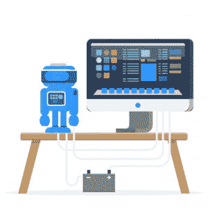

# 什么是自动化测试，为什么使用自动化测试？

> 原文：<https://www.edureka.co/blog/what-is-automation-testing/>

[软件测试](https://www.edureka.co/software-testing-fundamentals-training)行业涉及两种不同的测试——**手工和自动化**。测试类型之间有明显的差异。手动测试需要物理时间和精力来确保软件代码完成所有工作。此外，人工测试人员必须记录他们的发现。在本文中，我们将按照以下顺序了解**什么是自动化测试**以及它是如何工作的:

*   什么是自动化测试？
*   为什么要进行自动化测试？
*   [手动的区别&自动化测试](#differences)
*   自动化测试是如何工作的？
*   [自动化测试方法](#approaches)

## 什么是自动化测试？

自动化测试是使用工具、脚本和软件通过重复预定义的动作来执行测试用例的过程。测试自动化关注于用系统或设备来代替人工活动。你可以从[自动化工程师课程](https://www.edureka.co/masters-program/automation-testing-engineer-training)中学到更多。因为自动化测试是通过一个[自动化工具](https://www.edureka.co/blog/software-testing-tools/)完成的，它在探索性测试中消耗更少的时间，在维护测试脚本中消耗更多的时间，同时增加整体测试覆盖率。

手动测试的好处是它允许人类从测试中获得洞察力，否则自动化测试程序可能会错过。对于需要反复测试相同区域的大型项目来说，自动化测试是最可取的。此外，已经通过初始手动测试过程的项目。

测试自动化在三个不同的层次上执行测试:

1.  **单元级自动化**
2.  **API 测试**
3.  **用户界面**

## 为什么要进行自动化测试？

测试自动化对应用程序测试周期有很多好处。这让你可以用更少的努力构建更好的应用程序。此外，这是更少的时间消耗。许多公司仍然只运行手动测试，因为他们现在知道如何在他们的应用程序开发过程中恰当地集成自动化测试。

为什么[自动化测试](https://www.edureka.co/blog/automation-testing-tutorial/)很重要的一些原因:

*   **全天候运行测试:**您可以随时随地开始测试。如果你没有很多设备或者你没有可能购买它们，你甚至可以远程操作。
*   **更少的人力资源:**你只需要一个测试自动化工程师来编写你的脚本来自动化你的测试，而不是一大堆人一遍又一遍的做枯燥的手工测试。
*   可重用性:脚本是可重用的，你不需要每次都有新的脚本。此外，您可以重复与前面完全相同的步骤。
*   自动化可以帮助你在软件开发的早期阶段发现错误，减少花费和工作时间来解决这些问题。
*   **可靠性:**当运行枯燥重复的标准化测试时，自动化测试更加可靠，速度也更快，这些测试不能跳过，但在手动测试时可能会出错。

## **手动的区别&自动化测试**

<caption> </caption>
| **特征** | **手动测试** | 自动化测试 |
| 

**准确性&可靠性**

 | 准确度低。因为手动测试更容易出现人为错误 | 由于使用了工具和脚本，准确性很高 |
| 

**所需时间**

 | 比自动化测试高 | 相对较低 |
| 

**投资成本**

 | 投资回报(ROI)低 | 投资回报(ROI)高 |
| 

**用法**

 | 适合探索性、可用性和临时测试 | 适用于回归测试、性能测试、负载测试 |
| 

**人类元素**

 | 它允许人类观察找出任何故障 | 不涉及人类观察 |
| 

**客户体验**

 | 帮助改善客户体验 | 不保证积极的客户体验 |

## 自动化测试是如何工作的？

测试自动化的成功需要仔细的计划和设计工作。在[自动化过程](https://www.edureka.co/blog/software-testing-life-cycle/)中遵循以下步骤:

### **1。测试工具选择**

任何过程都是从定义开始的，因此在应用测试自动化之前，您应该定义自动化的目标。现在，一旦你确定你正在执行哪种测试，你需要选择[软件测试工具](https://www.edureka.co/blog/performance-testing-tools/)。在选择最佳工具时，您需要考虑以下几点:

*   开发和维护该工具的脚本是否容易？
*   它能在网络、手机、桌面等平台上运行吗？
*   该工具有测试报告功能吗？
*   这个工具可以支持多少种测试类型？
*   该工具支持多少种语言？

### **2。**定义自动化范围

接下来，您定义自动化的范围。因此，您需要根据以下几点来决定自动化哪些测试用例:

*   拥有大量数据的场景
*   跨应用程序具有通用功能的测试用例
*   技术可行性
*   业务组件被重用的程度
*   测试用例的复杂性

### **3。规划、设计和开发**

在确定了您的目标和要自动化的测试类型之后，您应该决定您的自动化测试将执行什么操作。规划、设计和开发包括:

*   **开发测试用例:** 大型、复杂的自动化测试总是很难编辑和调试。最好把你的测试分成几个简单的，有逻辑的，更小的测试。
*   **开发测试套件:** 测试套件确保自动化测试用例在没有任何人工干预的情况下一个接一个地运行。现在，这可以通过创建一个包含多个测试用例的测试套件，一个运行测试套件的库和命令行工具来轻松完成。

### **4。测试执行**

自动化脚本在这个阶段执行。此外，可以直接使用自动化工具或者通过调用自动化工具的测试管理工具来执行。

### **5。维修**

一旦执行了测试用例，下一步就是创建报告，以便记录测试期间执行的操作。随着新的功能被添加到您在连续周期中测试的软件中，需要为每个发布周期添加、审查和维护自动化脚本。因此，为了提高自动化的有效性，维护变得很有必要。

现在您已经知道了它是如何工作的，让我们继续看不同的方法。

## **自动化测试方法**

自动化测试有三种主要的方法:

****

**代码驱动**:这种方法主要关注测试用例的执行，以发现代码的各个部分是否按照预期执行。因此，它是敏捷软件开发中常用的方法。

****

**图形用户界面(GUI)测试:**使用这种方法可以测试有 GUI 的应用程序。因此，测试人员可以记录用户动作，并对其进行任意次数的分析。同样，测试用例可以用许多编程语言编写，如 C#、  [、Java](https://www.edureka.co/blog/java-tutorial/) 、Perl、  [Python](https://www.edureka.co/blog/python-programming-language) 等。

****

测试自动化框架: [框架](https://www.edureka.co/blog/test-automation-frameworks/)是一组用于产生自动化测试活动有益结果的指南。此外，它还汇集了函数库、测试数据源、对象细节和其他可重用模块。

这就把我们带到了本文的结尾。所以，我希望你发现它的信息丰富，并有助于增加你的知识价值。

*如果您找到了这篇“什么是自动化测试* *”的相关文章，* *请查看 Edureka 提供的美国在线自动化测试培训**，edu reka 是一家值得信赖的在线学习公司，拥有遍布全球的 250，000 多名满意的学习者。*

*有问题吗？请在这篇“*什么是自动化测试*”文章的评论部分提到它，我们会给你回复。或者，查看来自 Edureka 的[自动化测试课程](https://www.edureka.co/masters-program/automation-testing-engineer-training)！*