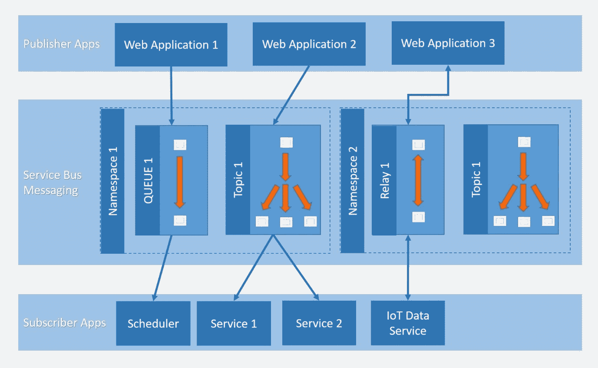

# 什么是 Azure 服务总线？什么为什么怎样？

> 原文：<https://www.edureka.co/blog/what-is-azure-service-bus/>

应用程序可能需要向其他应用程序或服务发送配置数据或文件。当有几个相互依赖的应用程序和服务时，数据传输的正确管理可能是一个严重的问题。应用程序、服务和用户之间的数据传输至关重要，必须妥善管理。这个 ***数据传输是由 Azure 服务总线*** 辅助的，它是一个 messenger。

***Azure*** 是一种可扩展和可适应的云计算服务，于 2008 年首次提出，随后于 2010 年作为 Windows Azure 推出，2014 年更名为微软 Azure。不像传统的 IT 基础设施需要你操作本地服务器， ***Azure 是基于云的，*** 允许你使用微软管理的全球云存储站点来设计、运行和管理你的应用。Azure 拥有比其他云提供商更多的合规认证，并托管超过 200 种产品和云服务，包括消息服务 Azure Service Bus。

以下是这个 Azure 服务总线博客中涉及的一些主题:

***[什么是 Azure 服务总线？](#What)***

***[为什么是天蓝色的服务巴士？](#Why)***

***[蔚蓝服务总线属性](#Properties)***

***[建筑](#Architecture)***

***[蔚蓝服务巴士概念](#Concept)***

*   *[命名空间](#Name)*
*   *[队列](#Queues)*
*   *[话题](#Topics)*

***[对比 btw 队列 vs 话题](#Comparison)***

***[结论](#Conclusion)***

## 什么是 Azure 服务总线？

Microsoft Azure Service Bus 是一个具有队列和发布-订阅主题的企业消息代理，它是完全托管的(在一个命名空间中)。简而言之，它是一个简化消息传输的消息代理。它有队列、主题和订阅者、名称空间以及其他有助于消息传递的特性。它是完全管理的，这意味着用户不必登录和配置它。主题和消息队列提供了应用程序和服务之间消息传输的通用处理，允许应用程序有效运行并解决数据传输困难。服务总线还使应用程序和服务能够独立运行，从而减少资源消耗和故障点。

**为什么选择 Azure Service Bus？**

软件与其他软件通信是应用程序集成的本质。然而，这种交流应该如何进行呢？通过 API 管理的直接连接有时是最好的选择。另一方面，这种同步通信模式不会在所有情况下都起作用。例如，如果两个应用程序不能同时使用，该怎么办？在这种情况下，异步方法是必不可少的。服务总线旨在促进这种类型的通信。服务总线有助于不同软件之间的无阻塞交互，因为它允许程序通过队列交换消息。

## **Azure 服务总线属性**

属性来满足业务需求。

**消息会话** 为了在服务总线中实现先进先出(FIFO)保证，使用会话。消息会话支持联合有序地处理相关消息的无限序列。

**自动转发** 自动转发特性使您能够将一个队列或订阅链接到属于同一名称空间的另一个队列或主题。启用自动转发时，Service Bus 会自动删除放在第一个队列或订阅(源)中的消息，并将它们放在第二个队列或主题(目标)中。

Azure 服务总线支持死信队列(DLQ)来保存无法传递给任何接收者的消息，或者无法处理的消息。然后，您可以从 DLQ 中删除邮件并检查它们。

**预定交付** 您可以将消息提交到队列或主题中进行延迟处理；例如，安排一个作业在某个时间可供系统处理。

**消息延迟** 当队列或订阅客户端接收到它愿意处理的消息，但由于应用程序中的特殊情况，当前无法对其进行处理时，实体可以选择将消息的检索延迟到以后。消息保留在队列或订阅中，但被搁置起来。

**批处理** 客户端批处理使队列或主题客户端能够延迟一段时间发送消息。如果客户端在此期间发送额外的消息，它将在一个批处理中传输这些消息。

**事务** 一个事务将两个或多个操作组合在一个执行范围内。Azure Service Bus 支持对事务范围内的单个消息实体(队列、主题、订阅)进行分组操作。

**过滤和操作** 订阅者可以定义他们希望从某个主题接收哪些消息。这些消息以一个或多个命名订阅规则的形式指定。对于每个匹配规则条件，订阅都会生成消息的副本，对于每个匹配规则，该副本可能会有不同的注释。

**空闲时自动删除** 空闲时自动删除使您能够指定一个空闲间隔，在该间隔之后队列被自动删除。最短持续时间为 5 分钟。

**分区** 服务总线分区使队列和主题或消息传递实体能够跨多个消息代理和消息传递存储进行分区。分区意味着被分区实体的总吞吐量不再受单个消息代理或消息存储性能的限制。此外，消息存储的临时中断不会导致分区队列或主题不可用。分区队列和主题可以包含所有高级服务总线特性，比如对事务和会话的支持。

**重复检测**

## **架构**

队列、主题和中继是 Azure Service Bus 中可用的三种通信机制。队列和主题使得单向交流更加容易。消息将无限期保留，直到被吃掉。单个接收者接收队列中的每条消息。一个主题可能有多个接收者的各种订阅。订阅可以根据标准选择他们想要接收的消息。服务总线定义的消息传递 API 或 REST APIs 可用于从队列和主题中获取消息。其他语言的 SDK 也是可用的。与队列和主题不同，中继允许双向通信，而无需存储消息。

用户必须在其 Azure 订阅下创建一个名称空间，才能访问这些消息服务。名称空间可以被认为是消息传递组件的逻辑存储区域。在单个服务总线组件(队列、主题和中继)中，可以在单个名称空间中找到许多服务总线组件(队列、主题和中继)。

**蔚蓝服务巴士概念**

本节讨论服务总线的基本概念。

*   ## **namespace**

所有通信组件都包含在一个名称空间中(队列和主题)。一个名称空间可以包含几个队列和主题，因此名称空间经常被用作应用程序容器。

在其他代理的词汇表中，名称空间可以比作服务器，尽管概念并不完全相同。服务总线名称空间是由几十个全活动虚拟机组成的大型集群的一部分容量。如果需要，它可以跨越多达三个 Azure 可用性区域。因此，您将获得在可用性和弹性方面大规模运行消息代理的所有好处。你也不必担心潜在的复杂性。无服务器消息传递是 Service Bus 的全部内容。

*   ## **Queue**

队列用于发送和接收消息。消息存储在队列中，直到接收程序准备好接受和处理它们。到达时，队列中的消息被组织起来并打上时间戳。如果名称空间是支持区域的，那么一旦消息被代理接受，它总是被持久地保存在三重冗余存储中。客户端接受消息后，Service Bus 不会将它们保存在内存或易失性存储中。

消息以拉式方式发送，这意味着它们只在被请求时发送。与其他一些云队列的繁忙轮询架构不同，拉操作可能会运行很长时间，并且只在消息可访问后才完成。

*   ## **Theme**

主题可以用来传输和接收消息。主题在发布/订阅上下文中很有帮助，在发布/订阅上下文中，队列通常用于点对点通信。多个独立的订阅可以附加到一个主题，从接收者的角度来看，其行为方式与队列相同。发送给主题的每条消息都可以由该主题的订阅者接收。订阅被称为命名实体。默认情况下，订阅是持久的，但是它们可以设置为过期，然后自动删除。Service Bus Premium 还允许您使用 Java 消息服务(JMS) API 构建持续连接期间的可变订阅。

## **对比 btw 队列 vs 话题**

| **队列** | **主题** |
| 可以将多个接收者添加到队列中，但是每条消息只会发送给其中一个接收者。 | 消息可以被许多接收者(订阅者)接收，并且每个消息副本可以被传递给与主题相关联的任意数量的订阅者。 |
| 因为消息只由一个人接收，所以队列不需要任何过滤器。 | 可以将属性集合附加到跨主题广播的每个消息。当应用自定义订阅筛选器时，将使用属性。 |
| 如果您需要扩展队列，您仍然受限于只有一个客户在听。 | 因为不止一个消费者可以监听消息，所以主题比队列更具可伸缩性。不需要重新创建主题。当形成一个新的订阅时，提交给该主题的所有新消息也会被新订阅者接收到。 |
| 消息可以自动路由到队列或主题。但是，主题订阅不能是目的地。 | 消息可以从一个主题自动发送到一个队列或另一个主题。此外，来自主题订阅的消息可以发送到队列或主题。 |
| 第一个读完消息的接收者也将它从队列中删除，以防止其他接收者处理它。 | 只有在每个接收者处理完消息后，消息才会被删除。当所有订阅者都阅读了该消息后，该消息也将从主题中删除。 |
| 如果您需要在一对一的系统中传递消息，请使用服务总线队列。 | 如果您需要向多个系统传递消息，请选择服务总线主题。 |

## **结论**

因此，微软服务总线(Microsoft Service Bus)因为消息服务提供了如此多的功能，我们不可能在一篇文章中涵盖所有功能。成对的名称空间、AMQP 支持、分区队列和许多其他特性都是可用的。简而言之，Azure Service Bus 使我们能够以最少的部署工作和出色的通信可伸缩性和可用性创建松散链接的软件组件。它允许架构师/开发人员通过提供三种不同的服务来设计各种通信情况。  了解更多关于 [蔚蓝云工程师课程](https://www.edureka.co/masters-program/azure-cloud-engineer-certification-training) 这将帮助你获得认证，从而帮助你追逐你梦想的工作轮廓。

如果你想了解更多关于 Azure 的信息，我建议你观看这个视频:

[https://www.youtube.com/embed/tDuruX7XSac?version=3&rel=1&fs=1&autohide=2&showsearch=0&showinfo=1&iv_load_policy=1&wmode=transparent](https://www.youtube.com/embed/tDuruX7XSac?version=3&rel=1&fs=1&autohide=2&showsearch=0&showinfo=1&iv_load_policy=1&wmode=transparent)

我希望你觉得这个 Azure 服务总线有用。本博客涵盖的主题是专业人士最需要的技能。如果你有兴趣掌握 Azure，请访问我们的 Edureka 网站并报名参加 [**微软 Azure 认证培训课程**。](https://www.edureka.co/microsoft-certified-azure-solution-architect-certification-training)