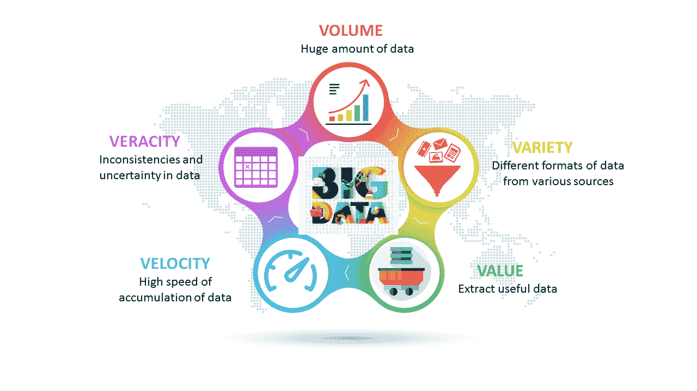
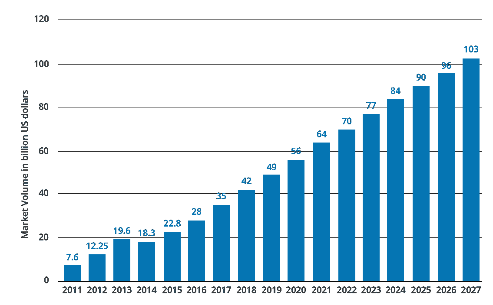

# 什么是大数据？–大数据世界初学者指南

> 原文：<https://www.edureka.co/blog/what-is-big-data/>

没有大数据不存在的地方！过去几年，人们对什么是大数据的好奇心一直在飙升。让我告诉你一些令人难以置信的事实！《福布斯》报道称，每分钟，用户观看*415 万个 YouTube 视频*，在 Twitter 上发送 *456，000 条推文*，在 Instagram 上发布 *46，740 张照片*，在脸书上发布 *510，000 条评论*和 *293，000 条状态更新*！

想象一下这些活动产生的大量数据。这种使用社交媒体、商业应用程序、电信和各种其他领域不断创建数据的现象正在导致大数据的形成。您可以从 [Hadoop 课程](https://www.edureka.co/big-data-hadoop-training-certification)中更好地理解大数据及其各种概念。

为了解释**什么是大数据**，我将讲述以下主题:

*   大数据的演变
*   大数据定义
*   大数据的特征
*   大数据分析
*   大数据的工业应用
*   大数据的范围

## **大数据的演变**

在进一步探索之前，让我先了解一下为什么这项技术如此重要。

你们记得上一次用软盘或光盘存储数据是什么时候？让我猜猜，得追溯到 21 世纪初，对吗？手工纸质记录、文件、软盘和光盘的使用现已过时。原因是数据的指数级增长。人们开始将他们的数据存储在关系数据库系统中，但是随着对新发明、新技术、具有快速响应时间的应用程序的渴求，以及互联网的引入，即使这样现在也是不够的。这一代连续的、海量的数据，可以称为大数据。我将在本博客的后面解释大数据的其他一些特征。

《福布斯》报道称，以我们目前的速度，每天有 2.5 万亿字节的数据产生，但这一速度还在不断加快。物联网(IoT)就是这样一种技术，在这种加速中发挥了重要作用。今天所有数据的 90%是在过去两年中生成的。

## **大数据定义**

**什么是大数据|大数据分析|爱德华卡**

[https://www.youtube.com/embed/HOYOVB5MMRw?rel=0&showinfo=0](https://www.youtube.com/embed/HOYOVB5MMRw?rel=0&showinfo=0)

这个视频给大家简单介绍一下大数据。您还可以了解它的真实使用案例，从而理解它有多有用。

### ***什么是大数据？***

在我解释什么是大数据之前，让我告诉你什么不是大数据！与之相关的最常见的误解是，它只是关于数据的大小或数量。但实际上，这不仅仅是收集“大量”数据的问题。 ***[大数据](https://www.edureka.co/blog/big-data-tutorial)*** 是指从各种数据源涌入的、格式各异的大量数据。即使以前有大量的数据存储在数据库中，但是由于这些数据的多样性，传统的关系数据库系统无法处理这些数据。大数据不仅仅是不同格式的数据集的集合，它是一种重要的资产，可用于获得可列举的好处。

从华盛顿的 [Hadoop 培训](https://www.edureka.co/big-data-and-hadoop-washington)中了解更多关于大数据的信息。

大数据的三种不同格式是:

1.  ***结构化:*** 用固定的模式组织数据格式。例如:RDBMS
2.  ***半结构化:*** 没有固定格式的部分组织的数据。例如:XML，JSON
3.  ***非结构化:*** 模式未知的无组织数据。例如:音频、视频文件等。

## **大数据的特征**

以下是特征:

上图描绘了大数据的五个 V，但随着数据的不断发展，V 也会随之发展。我列出了五个随着时间的推移逐渐发展起来的 V:

*   有效性:数据的正确性
*   可变性:动态行为
*   波动性:随时间变化的趋势
*   漏洞:易受破坏或攻击
*   可视化:可视化数据的有意义的使用

## **大数据分析**

既然我已经告诉了你什么是大数据以及它是如何以指数级增长的，那么让我向你展示一个非常有趣的例子，关于领先的连锁咖啡馆之一*星巴克*如何利用大数据。

我看到了《福布斯》的这篇文章，报道了*星巴克*如何利用这项技术来分析顾客的偏好，以提升和个性化他们的体验。他们分析了会员的咖啡购买习惯，以及他们通常在一天中的什么时间点他们喜欢的饮料。因此，即使当人们来到一家“新”星巴克店时，该店的销售点系统也能够通过智能手机识别顾客，并向咖啡师提供他们喜欢的订单。此外，根据订购偏好，他们的应用程序会推荐客户可能有兴趣尝试的新产品。我的朋友们，这就是我们所说的大数据分析。  你甚至可以用 [数据工程课程](https://www.edureka.co/microsoft-azure-data-engineering-certification-course) 查看大数据的细节。

基本上，它在很大程度上被公司用来促进他们的成长和发展。这主要包括对给定的数据集应用各种数据挖掘算法，这将帮助他们做出更好的决策。

处理大数据的工具有***[Hadoop](https://www.edureka.co/blog/what-is-hadoop/)******[猪](https://www.edureka.co/blog/pig-tutorial/)******[蜂巢](https://www.edureka.co/blog/hive-tutorial/)******卡珊德拉******[火花](https://www.edureka.co/blog/spark-tutorial/)******卡夫卡**这取决于组织的要求。*

## **大数据** **应用**

以下是大数据应用发生变革的一些领域:

*   **娱乐:**网飞和亚马逊用它向用户推荐节目和电影。
*   **保险:**利用这种技术预测疾病、事故，并据此为其产品定价。
*   **无人驾驶** **汽车:** 谷歌的无人驾驶汽车每秒收集大约 1g 的数据。这些实验的成功进行需要越来越多的数据。
*   **教育:**选择大数据驱动的技术作为学习工具，而不是传统的授课方式，这增强了学生的学习，也有助于教师更好地跟踪他们的表现。
*   **汽车:**劳斯莱斯已经接受了这项技术，在它的引擎和推进系统中安装了数百个传感器，记录下它们运行的每一个微小细节。数据的实时变化会报告给工程师，工程师将决定最佳行动方案，如安排维护或在问题需要时派遣工程团队。
*   **政府:**一个非常有趣的用例是在政治领域分析模式和影响选举结果。剑桥分析有限公司就是这样一个组织，它完全依靠数据来改变受众行为，并在选举过程中发挥重要作用。

## **大数据的范围**

*   **众多工作机会:**大数据领域的职业机会包括，大数据分析师、大数据工程师、大数据解决方案架构师等。根据 IBM 的数据，59%的数据科学和分析(DSA)工作需求来自金融和保险、专业服务和 IT。
*   **分析专业人才需求上升:**《福布斯》的一篇文章透露，“IBM 预测对数据科学家的需求将飙升 28%”。根据 IBM 的数据，到 2020 年，美国所有数据专业人员的工作岗位数量将增加 36.4 万个，达到 272 万个。
*   **薪资方面:**《福布斯》报道称，雇主愿意支付高于学士和研究生水平薪资中位数 8736 美元的溢价，成功申请者的起薪为 80265 美元
    *   **大数据分析的采用:**全球大数据分析的使用大幅增长。 从德里 [数据工程培训](https://www.edureka.co/microsoft-azure-data-engineering-certification-course-delhi) 了解更多大数据及其应用。

上图描绘了从 2011 年到 2027 年大数据市场收入的增长，以十亿美元计。以上就是我在博客中的全部内容，我希望这能有所帮助。如需进一步了解，请参考休斯顿的 [Hadoop 培训。](https://www.edureka.co/big-data-and-hadoop-houston)

*有问题吗？请在评论区提到它，我们会给你回复。*