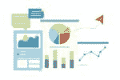

# 什么是商业分析？你只需要知道

> 原文：<https://www.edureka.co/blog/what-is-business-analytics>

商业[分析](https://www.edureka.co/blog/big-data-analytics/)是指通过统计分析对数据进行研究，形成预测模型，应用相关优化技术，并进一步将这些得出的结果传达给客户、商业伙伴和学院高管。它采用定量方法，数据需要证据来为企业建立某些模型并做出有利可图的决策。因此，业务分析主要依赖并使用大数据。

*   [了解商业分析](#understand)
*   [商业分析的用途和优势](#uses)
*   商业分析如何帮助您的企业？
*   [商业分析工具及其优势](#tools)
*   [商业分析的应用](#applications)
*   [信息的力量](#power)

**了解商业分析**

商业分析是在研究了过去的表现和问题之后，对信息进行剖析，从而为未来设计一个成功的计划的过程。大数据或大量数据用于推导解决方案。

这种经营企业的方法，或者说这种建立和维持企业的观点，对于经济和在经济中蓬勃发展的行业至关重要。

**商业分析的用途和优势**

企业采用商业分析来促进数据驱动的决策。借助业务分析获得的洞察力使公司能够优化其各种流程，以提供更好的结果，从而获得超越他人的竞争优势。

*   进行**数据挖掘**，探索新数据，发现新的模式和关系。
*   进行**统计和定量分析**，为某些事件提供解释。
*   测试先前的决策是在 **A/B 测试**和多元测试的帮助下做出的。
*   部署**预测模型**预测未来结果。

商业分析如何帮助您的企业？

在企业和组织中见证的简化流程和流程优化归功于分析的实施。公司认可的采用数据分析的三个最重要的目标是降低成本、提高盈利能力和改善风险管理的能力。

*   **发现商机**

诚然，分析数据提高了生产力和效率，但也有助于发现可能被忽视的新机会。因此，企业不知不觉地依赖智能来实现潜在增长。模型基于数据分析，可以洞察客户的购买行为和模式，从而帮助公司制定战略。

基于此，分析可以帮助识别并纠正基于数据衍生读数的关注领域。如今，大数据也被用于人力资源，以招募符合各自公司文化和工作场所的候选人。这是可能的，因为通过收集的数据对候选人进行了仔细的评估。

*   **改进的客户定位策略**

网上有许多信息可用于预测分析，这些信息可以识别客户的体验以及对特定品牌或公司的重要性。购买者的本能和模式可以帮助公司通过检查购买行为、互联网浏览习惯，将这些信息纳入并实施到你的战略中，从而深入了解客户的想法。

*   **改进的内部流程**

一个公司或企业可以对自己的系统有一个深入的了解和清晰的认识，并确定他们在组织中做得有效率，哪些可以改进。在确定问题后，分析师可以提供基本问题的答案，如:

*   是什么导致了这个问题？–通过 **报告**
*   为什么会这样？–通过 **诊断**
*   未来有什么可期待的？–通过 **预测**
*   下一步该采取什么措施？–通过 **推荐**

因此，数据分析有助于您采用正确的方法开展业务。

**商业分析工具及其优势**

市场上最常用和最流行的商业分析工具有:

*   Sisense
*   清除分析
*   Pentaho BI
*   微观战略
*   QlikView

通过业务分析工具获得的重要洞察力有助于公司确定和自动化业务流程。他们的优势是:

*   它有助于高效地跟踪和监控业务，使公司能够更轻松地面对复杂的挑战。

*   它提供市场洞察力，在此基础上，公司可以通过分析竞争对手来获得竞争优势。最重要的是，你可以用最新的消费趋势来教育自己，并识别潜在的新市场。

*   通过收集有关市场状况的预测，并同时朝着最佳结果努力，可以通过预测性分析设计出相关且成功的营销策略。

*   公司战略的成功和失败可以通过定量和统计分析来解释和分析。

*   业务分析工具可以衡量关键绩效指标(KPI)通过制定更好的组织决策来进一步提高生产力。

**商业分析的应用**

*   **营销—**商业分析有助于营销领域，因为它能正确研究消费者行为和市场趋势。此外，公司可以根据这些重要信息制定战略，确定目标受众，并确定要渗透的新市场。

*   **金融—**在金融领域，商业分析工具可以帮助公司通过处理大量数据来揭示关于股票表现的重要见解。

*   **人力资源—**人力资源专业人士正转向商业分析工具，对候选人进行背景调查，并获取相关的有价值信息。

*   **制造—**收集的数据可用于这些工具，以提供有关库存管理、供应链管理、绩效洞察和风险缓解方法的信息。公司也可以通过这些工具提高运营技能。

**信息的力量**

只有利用独特性和利用 USP，才能建立竞争优势。每个组织都可以并且有办法通过利用他们最有希望的资源，即他们拥有的数据，来利用他们的独特性。无论在社会中还是在组织中，积累和处理如此大量的数据始终是一项挑战。应该灵活高效地处理数据。仔细选择有价值信息的能力至关重要。简而言之，需要分析的应用。

公司和组织需要能够处理这些海量数据的人，因为这需要大量的时间和精力。应用分析需要高度的灵活性，这本身就是一种竞争优势。组织可以完全转变为能够量化、衡量、分析和交付从这些数据中提取的价值。

*Edureka 有一个专门策划的  [**数据分析主计划**](https://www.edureka.co/masters-program/data-analyst-certification) ，让你精通数据分析专业人士使用的工具和系统。它包括关于统计学、R 数据分析、SAS 和 Tableau 的深入培训。该课程是通过对全球 5000 多个职位描述的广泛研究而确定的。*

有问题要问我们吗？请在这篇文章的评论部分提到它，我们会给你回复。