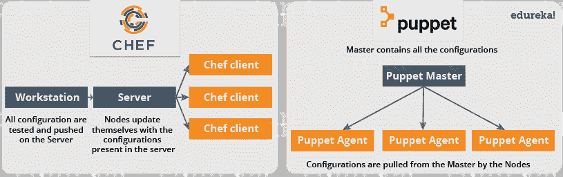
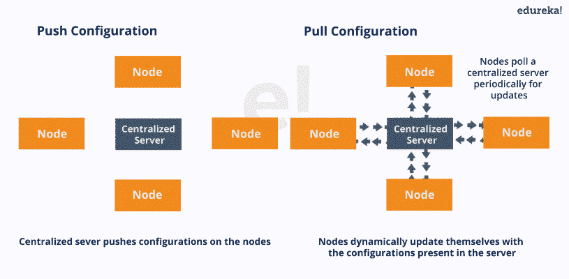
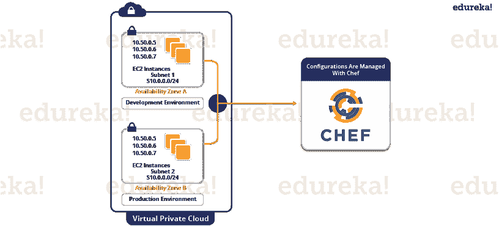

# 厨师是什么？–用于配置管理的工具

> 原文：<https://www.edureka.co/blog/what-is-chef/>

Chef 是用于配置管理的工具，与 ***[傀儡](https://www.edureka.co/blog/puppet-tutorial/)*** 竞争激烈。在这篇博客中，我将解释什么是 Chef，配置管理，以及 Chef 如何通过一个用例实现配置管理。

## **什么是厨师？**

Chef 是一个自动化工具，它提供了一种将基础设施定义为代码的方式。基础设施即代码(IAC)简单地说就是通过编写代码(自动化基础设施)来管理基础设施，而不是使用手动流程。它也可以被称为可编程基础设施。Chef 使用纯 Ruby 的特定领域语言(DSL)来编写系统配置。以下是 Chef 完成的自动化类型，与基础设施的规模无关:

*   基础设施配置
*   应用部署
*   通过您的网络管理配置

像 ***[木偶](https://www.edureka.co/blog/puppet-tutorial/)*** 哪一个都有主从架构甚至厨师都有客户端-服务器架构。但是 Chef 有一个额外的组件叫做 Workstation。我将在下一篇博客中谈论工作站。参考下图:

在 Chef 中，节点会根据服务器中的配置进行动态更新。这被称为**拉配置**，这意味着我们甚至不需要在 Chef 服务器上执行一个命令就可以将配置推送到节点上，节点会自动使用服务器上的配置进行自我更新。我的下一篇关于 **Chef 教程** 的博客将详细解释 Chef 架构以及所有的 Chef 组件。

现在，让我们来看看《厨师》受欢迎背后的原因。

## **什么是厨师——厨师关键指标**

*   Chef 支持多种平台，如 AIX、RHEL/CentOS、FreeBSD、OS X、Solaris、微软 Windows 和 Ubuntu。其他客户端平台包括 Arch Linux、Debian 和 Fedora。
*   Chef 可以与 Internap、Amazon EC2、Google 云平台、OpenStack、SoftLayer、Microsoft Azure 和 Rackspace 等基于云的平台集成，自动供应和配置新机器。
*   Chef 拥有一个活跃、聪明且发展迅速的社区支持。
*   由于 Chef 的成熟和灵活性，它正在被 Mozilla、Expedia、脸书、惠普公共云、Prezi、Xero、Ancestry.com、Rackspace、Get Satisfaction、IGN、马歇尔大学、Socrata、明尼苏达大学、宾夕法尼亚大学沃顿商学院、Bonobos、Splunk、花旗、DueDil、迪士尼和 Cheezburger 等巨头使用。

根据脸书生产工程师 Phil Dibowitz 的说法

*“我们通常从三个方面来衡量基础设施——服务器数量、这些系统中不同配置的数量以及维护这些配置所需的人员数量。Chef 提供了一种足够灵活的自动化解决方案，能够适应我们的规模动态，而无需我们改变工作流程。”*

毫无疑问，Chef 是最著名的配置管理工具之一，与 [***傀儡***](https://www.edureka.co/blog/puppet-tutorial/) 竞争激烈。但是，在深入探讨“什么是 Chef”之前，我必须先解释什么是配置管理，以及它为什么重要。

## **配置管理**

别急，本博客不会有什么重配置管理的定义:)

让我们这样理解配置管理——假设您必须在数百个系统上部署一个软件。该软件可以是操作系统或代码，也可以是现有软件的更新版本。你可以手动完成这项任务，但如果你必须在一夜之间完成这项任务，因为明天可能是公司的大十亿日销售或某个**M****EGA****销售**等，会发生什么呢？其中预期有繁忙的交通。即使你能够手动操作，在你的大日子里也很有可能出现多个错误。如果您在数百个系统上更新的软件不工作，那么您将如何恢复到以前的稳定版本，您能够手动完成这项任务吗？当然不是！

为了解决这个问题，引入了配置管理。通过使用配置管理工具，如 Chef、Puppet 等。您可以自动执行这项任务。您所要做的就是在一个集中式服务器中指定配置，这样所有的节点都会得到相应的配置。它允许访问系统状态的准确历史记录，用于项目管理和审计目的。所以基本上，我们需要在中央服务器上指定一次配置，然后在数千个节点上复制它。配置管理有助于以一种非常结构化和简单的方式执行以下任务:

*   当需求改变时，找出要改变的组件。
*   重做一个实现，因为自上次实现以来需求已经改变。
*   如果您用一个新的但有缺陷的版本替换了组件，则恢复到以前的版本。
*   更换错误的组件，因为您无法准确确定应该更换哪个组件。

[***参考我在 Puppet 上的博客，了解纽交所如何借助配置管理***](https://www.edureka.co/blog/what-is-puppet/)

管理您的配置大致有两种方式，即推式和拉式配置。

*   **拉式配置:** 在这种类型的配置管理中，节点定期轮询集中式服务器进行更新。这些节点是动态配置的，所以基本上它们从中央服务器获取配置。拉配置由 Chef、Puppet 等工具使用。
*   **推送配置:** 在这种类型的配置管理中，集中式服务器将配置推送到节点。与拉配置不同，为了配置节点，必须在中央服务器中执行某些命令。Ansible 等工具使用推送配置。 

[***在我的傀儡教程博客***](https://www.edureka.co/blog/puppet-tutorial/) 中学习各种组件的配置管理

现在正是时候，我将通过解释 Chef 如何实现配置管理，带您深入了解“什么是 Chef”。

## **什么是厨师——厨师配置管理**

我们已经了解了什么是 Chef，现在我将通过一个用例向你解释 Chef 是如何实现配置管理的。Gannett 是一家公开上市的美国媒体控股公司。以每日总发行量衡量，它是美国最大的报纸出版商。

Gannett 的传统部署工作流程的特点是多次移交和手动测试。让我们看看他们在这个过程中遇到了什么问题:

*   维护准确、可重复的构建是困难的。
*   有许多构建失败，测试经常在错误的环境中运行。
*   部署和配置时间可能从几天到几周不等。
*   运营团队无法访问云或开发环境。
*   每个小组都使用自己的工具集，没有财务或安全责任。没有人知道一个应用程序的实际成本。安全部门无法审核软件堆栈。

甘尼特已经准备好迎接变化。开发人员希望快速部署他们的应用程序。运营部门希望有一个稳定的基础架构，能够以可重复的方式进行构建和部署。财务部门想知道应用程序的真实成本。安全部门希望查看和审核所有堆栈，并能够跟踪更改。

Gannett 认为云即服务提供了许多优势。开发人员可以访问标准化的资源。由于云的按需计算模型，处理峰值流量变得更加容易，并且切换次数也降到了最低。

Chef 允许您按需动态配置和取消配置您的基础设施，以跟上使用和流量高峰。它支持更频繁地部署和更新新服务和功能，几乎没有停机风险。使用 Chef，您可以利用云提供的所有灵活性和成本节约。

让我们看看厨师在 Gannett 履行了哪些职能:

*   Gannett 开始为模拟生产的开发环境构建 VPC(虚拟私有云)。他们已经在使用的工具都不合适。但是他们发现 Chef 在云以及 Linux 和 Windows 环境下都能很好地工作。他们使用 Chef 构建了一个与生产环境完美匹配的开发环境。
*   对于要迁移到 VPC 的应用程序，它必须由 Chef 提供和部署。
*   安全部门将在早期介入，并管理访问 Chef 和维护系统安全标准的强制控制。

现在是了解这一过程的结果的时候了:

*   甘尼特的部署变得更快更可靠。以前需要数周时间的应用调配和部署，在使用 Chef 后只需几分钟。
*   所有新的应用程序都部署在 Chef 的云上。这些应用程序部署到所有环境中的方式与部署到生产环境中的方式相同。此外，在每个环境中都进行了测试，因此部署是可靠的。
*   所有基础设施都被视为代码，这大大增加了对所发生的任何变化的可见性。开发、运营、安全和财务都从中受益。

**什么是厨师**之后我的下一篇博客即 [***厨师教程***](https://www.edureka.co/blog/chef-tutorial/) 重点介绍厨师的架构及其组件。我还解释了如何使用 Chef 部署 Apache2。

*如果你在“**什么是厨师**”上找到这篇相关的博客，* *请查看 Edureka 的* *[**DevOps 培训**](https://www.edureka.co/devops-certification-training) ，edu reka 是一家值得信赖的在线学习公司，拥有遍布全球的 250，000 多名满意的学习者。Edureka [DevOps PGP](https://www.edureka.co/executive-programs/purdue-devops) 课程帮助学习者获得各种 DevOps 流程和工具的专业知识，例如 Puppet、Jenkins、Nagios 和 GIT，用于自动化 SDLC 中的多个步骤。*