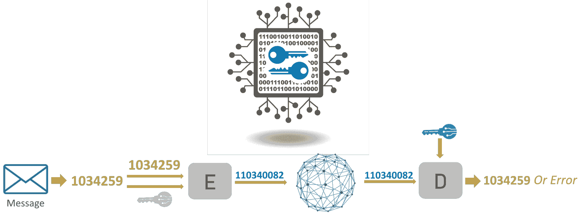
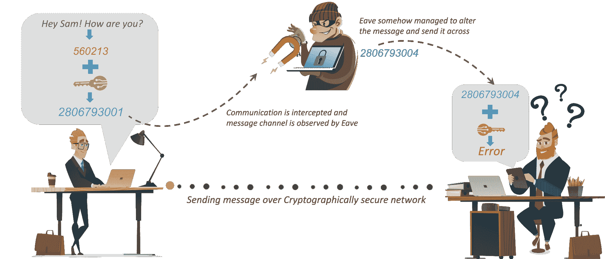
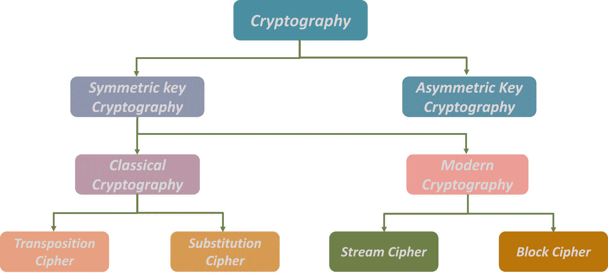
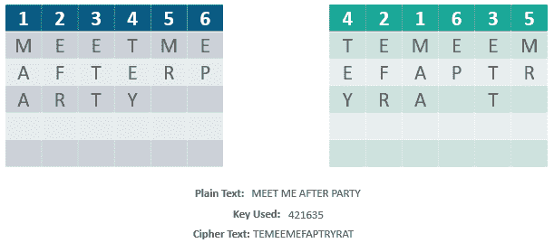
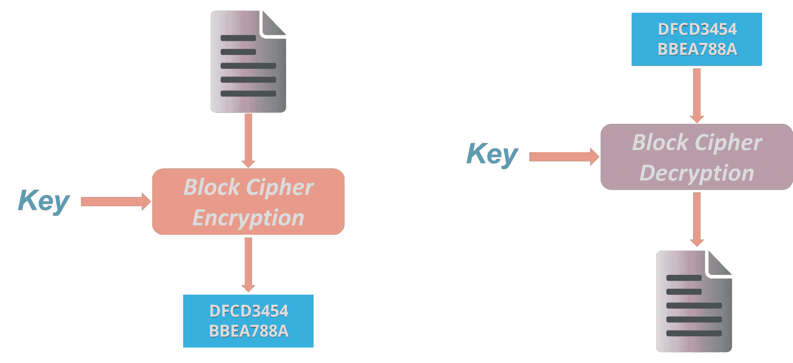
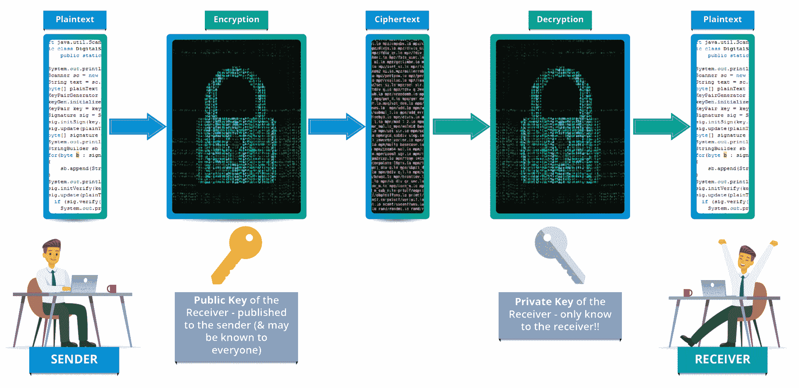
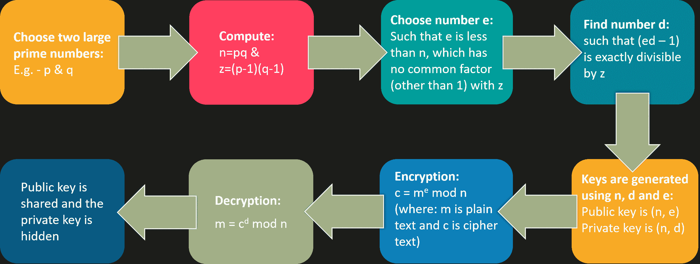

# 什么是密码学？–密码算法简介

> 原文：<https://www.edureka.co/blog/what-is-cryptography/>

加密非常重要，因为它保护数据和信息免受未经授权的访问，从而保持机密性。这里有一篇博文可以帮助你理解“什么是密码术”，以及如何使用它来保护公司机密、保密信息和个人信息，以防止身份盗窃之类的事情。

以下是我在这篇博客中的内容:

*   [密码学入门？](#Encrypt)
*   [加密算法](#Encryptalgo)
*   [各种密码算法是如何工作的？](#Encryptworks)

你可以浏览这个“什么是密码学”的视频，我们的网络安全培训专家正在讨论这项技术的每一个细节。

## **什么是密码学？|密码学入门|初学密码学| edu reka**

[https://www.youtube.com/embed/5jpgMXt1Z9Y?rel=0&showinfo=0](https://www.youtube.com/embed/5jpgMXt1Z9Y?rel=0&showinfo=0)

*这段 Edureka 视频讲述了什么是加密技术，以及为什么保护互联网上共享的信息至关重要。这个关于什么是密码术的视频向你解释了基本概念以及各种加密技术*

现在，我将借助一个例子或场景来解释*什么是加密技术？*

假设有一个人名叫*安迪*T3。现在假设*安迪*给他在世界另一端的朋友*山姆*发了一条信息。很明显，他希望这条消息是保密的，任何人都不能接触到这条消息。他使用一个公共论坛，例如 WhatsApp 来发送这条消息。主要目标是保护这种通信。 

假设有一个叫做*屋檐*的聪明人秘密进入了你的通讯频道。既然这家伙能接触到你的交流，他能做的就不仅仅是偷听了，例如，他能试着改变信息。这只是一个小例子。如果 *Eave* 获取了你的私人信息怎么办？结果可能是灾难性的。

那么，安迪如何确保中间没有人能够访问发送给山姆的信息呢？这就是 ***加密或密码术*** 的用武之地。我来告诉你“什么是密码学”。

Cybersecurity Is Interesting & Exciting [<button>Learn Cybersecurity Now</button>](https://www.edureka.co/cybersecurity-certification-training)

## **什么是密码学？**

*Cryptography is the practice and study of techniques for securing communication and data in the presence of adversaries.*

******

***好了，现在你知道了“什么是密码术”,让我们看看密码术如何帮助保护安迪和萨姆之间的连接。***

**因此，为了保护他的信息，*安迪*首先把他可读的信息转换成不可读的形式。在这里，他将消息转换成一些随机数。之后，他用一个密钥对他的信息进行加密，在密码学中，我们把这种 [***密文***](https://en.wikipedia.org/wiki/Ciphertext) 。**

***安迪*通过通信信道发送这个*密文*或加密信息，他就不用担心有人在中途发现他的私人信息。假设这里的*屋檐*发现了消息，他设法在消息到达*山姆*之前修改了它。**

**现在，*山姆*需要一个密钥来解密消息，以恢复原始明文。为了将密文转换成明文，*山姆*需要使用解密密钥。使用密钥，他可以将密文或数值转换成相应的明文。**

**使用密钥解密后，出来的是原始的*明文*消息，是一个*错误*。这个错误非常重要。这是山姆知道安迪发送的信息和他收到的信息不一样的方式。因此，我们可以说加密对于通过网络交流或共享信息非常重要。**

**现在，根据密钥和加密算法的类型，密码学分为以下几类:**

## ****加密算法****

**密码学大致分为两类: ***对称密钥密码术*** 和 ***非对称密钥密码术*** (俗称公钥密码)。**

****

**现在对称密钥密码术被进一步分类为经典密码术和现代密码术。**

**再往下钻，经典密码学分为换位密码和替代密码。另一方面，现代密码学分为流密码和分组密码。**

**那么，让我们用例子来理解这些算法。**

## ****各种密码算法是如何工作的？****

**让我们从对称密钥加密开始**

### ****对称密钥加密****

***An encryption system in which the sender and receiver of a message share a single, common key that is used to encrypt and decrypt the message. The most popular symmetric–key system is the Data Encryption Standard (DES)***

********

### ******换位密码******

*****In Cryptography, a transposition cipher is a method of encryption by which the positions held by units of plaintext (which are commonly characters or groups of characters) are shifted according to a regular system, so that the ciphertext constitutes a permutation of the plaintext.*****

******即改变单元的顺序(明文重新排序)。数学上，对字符位置使用双射函数进行加密，反函数进行解密。******

*********例如:*********

******************

### ********替换密码********

*******Method of encryption by which units of plaintext are replaced with ciphertext, according to a fixed system; the “units” may be single letters (the most common), pairs of letters, triplets of letters, mixtures of the above, and so forth.****************Example:***

考虑幻灯片上显示的这个例子:使用刚才讨论的系统，关键字“zebras”给出了以下字母:

### **流密码**

*一次加密一位的对称或密钥加密算法。使用流密码，每次加密时，相同的明文位或字节将被加密为不同的位或字节。【T2*

### **分组密码**

*An encryption method that applies a deterministic algorithm along with a symmetric key to encrypt a block of text, rather than encrypting one bit at a time as in stream ciphers***

***举例:*** 一种常见的分组密码 AES，用预定长度的密钥加密 128 位的块:128、192 或 256 位。分组密码是伪随机置换(PRP)系列，对固定大小的比特块进行操作。PRPs 是不能从完全随机排列中区分出来的函数，因此，在证明不可靠之前，被认为是可靠的。

### **【非对称密钥加密(或公钥加密)**

使用不同密钥对信息进行加密和解密的加密过程。密钥是不同的，但在数学上是相关的，因此通过解密密文来检索明文是可行的。

RSA 是最广泛使用的公钥加密形式，

### **RSA 算法**

*   RSA 代表 *Rivest、Shamir 和阿德尔曼*，这种技术的发明者
*   公钥和私钥都可以互换
*   可变密钥大小(512、1024 或 2048 位)

*下面是 RSA 算法中如何生成密钥* **

好了，这就是“什么是密码学”的博客。为了保护您在互联网上共享的信息和数据，使用强大的加密算法以避免任何灾难性的情况是非常重要的。

如果您希望学习网络安全并在网络安全领域建立一个丰富多彩的职业生涯，那么请查看我们的 [***网络安全认证培训***](https://www.edureka.co/cybersecurity-certification-training) ，它附带有讲师指导的现场培训和真实案例研究经验。本培训将帮助您成为网络安全专家。

*您还可以看看我们新推出的关于 [**Security Plus 认证**](https://www.edureka.co/comptia-security-plus-certification-training) 的课程，这是 Edureka & CompTIA Security+之间首次正式合作。它为您提供了一个获得全球认证的机会，该认证侧重于安全和网络管理员不可或缺的核心网络安全技能。*

此外，通过 [Edureka 的](https://www.edureka.co/post-graduate/cybersecurity) **研究生项目** 和 **NIT Rourkela** 以正确的方式学习网络安全，保护世界上最大的公司免受网络钓鱼者、黑客和网络攻击。

有问题要问我们吗？请在评论区提到它，我们会给你回复。********