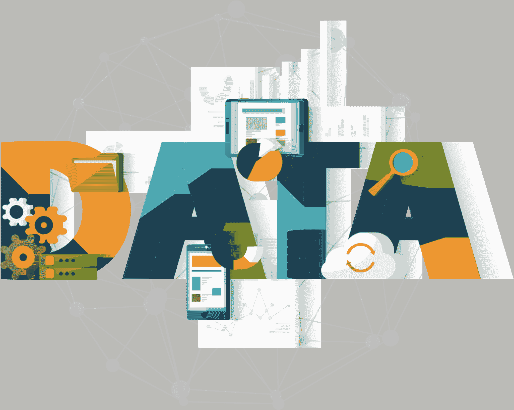
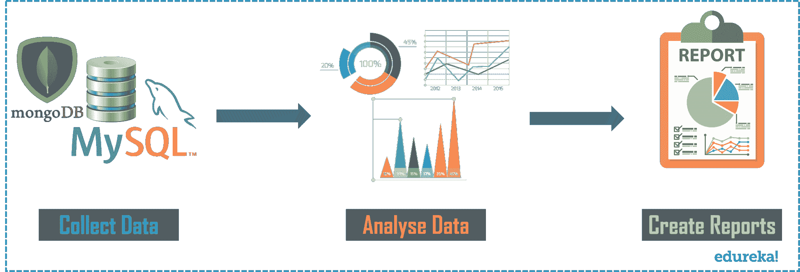
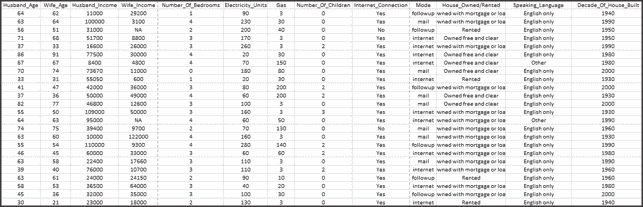
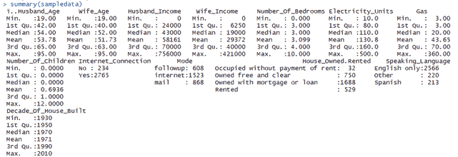
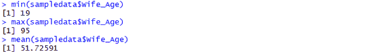
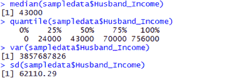
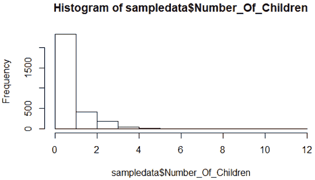
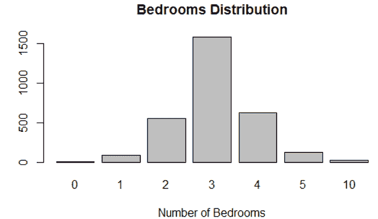

# 什么是数据分析？数据分析介绍

> 原文：<https://www.edureka.co/blog/what-is-data-analytics/>

数据已经成为流行词汇很久了。无论是大规模企业产生的数据，还是个人产生的数据，都需要对数据的每一个方面进行分析，才能让自己从中受益。但是我们怎么做呢？这就是“数据分析”这个术语的由来。在这篇关于“什么是数据分析？”的博客中，您将通过实际操作了解这一术语。

让我们来看看本文将要讨论的主题:

*   [为什么数据分析很重要？](#Why%20is%20Data%20Analytics%20important?)
*   [什么是数据分析？](#What%20is%20Data%20Analytics?)
*   [顶级数据分析工具](#Top%20Data%20Analytics%20Tools)
*   [如何成为一名数据分析师？](#How%20to%20become%20a%20Data%20Analyst?)
*   [动手](#Hands-On)

## **数据分析为什么重要？**

数据分析在改善您的业务方面发挥着关键作用，因为它用于收集隐藏的见解、生成报告、执行市场分析以及改善业务需求。

### **数据分析的作用是什么？**

可以参考下面:

*   **收集隐藏的见解**–收集数据中隐藏的见解，然后根据业务需求进行分析。
*   **生成报告**–从数据中生成报告，并传递给各自的团队和个人，以处理业务大幅增长的进一步行动。
*   **进行市场分析**–可以进行市场分析以了解竞争对手的优势和劣势。
*   **改善业务需求**–数据分析允许根据客户需求和体验改善业务。

现在，您已经知道了数据分析的需求，让我来快速阐述一下对您来说什么是数据分析。

## **什么是数据分析初学者？【T2**

数据分析是指用于分析数据以提高生产力和商业收益的技术。从各种来源提取数据，并对其进行清理和分类，以分析各种行为模式。所使用的技术和工具因组织或个人而异。

因此，简而言之，如果你了解你的企业管理，并有能力执行探索性的数据分析，收集所需的信息，那么你很适合从事数据分析职业。

现在你已经知道什么是数据分析，让我快速介绍一下这个领域中使用的顶级工具。

## **数据分析使用的工具有哪些？**

随着市场上对数据分析需求的不断增长，许多具有各种功能的工具应运而生。无论是开源的还是用户友好的，数据分析市场上的顶级工具如下。

*   [**R 编程**](https://www.edureka.co/blog/r-tutorial/)–该工具是用于统计和数据建模的领先分析工具。r 编译并运行在各种平台上，如 UNIX、Windows 和 Mac OS。它还提供了根据用户需求自动安装所有软件包的工具。
*   [**Python**](https://www.edureka.co/blog/python-tutorial/)–Python 是一种开源的、[面向对象编程](https://www.edureka.co/blog/python-class/)语言，易于阅读、编写和维护。提供了 [Scikit-learn](https://www.edureka.co/blog/scikit-learn-machine-learning/) 、 [TensorFlow](https://www.edureka.co/blog/tensorflow-tutorial/) 、 [Matplotlib](https://www.edureka.co/blog/python-matplotlib-tutorial/) 、 [Pandas](https://www.edureka.co/blog/python-pandas-tutorial/) 、Keras 等各种机器学习和可视化库。它也可以在任何平台上组装，比如 SQL server、MongoDB 数据库或 JSON
*   [**Tableau Public**](https://www.edureka.co/blog/tableau-tutorial/)——这是一款连接 Excel、企业数据仓库等任何数据源的免费软件。然后，它创建可视化，地图，仪表板等，并在网上实时更新。
*   [**QlikView**](https://www.edureka.co/blog/qlikview-tutorial/)–该工具提供内存数据处理，并将结果快速发送给最终用户。它还提供数据关联和数据可视化，数据被压缩到原始大小的近 10%。
*   [**SAS**](https://www.edureka.co/blog/sas-tutorial/)–一种用于数据操作和分析的编程语言和环境，该工具易于访问，可以分析不同来源的数据。
*   **Microsoft Excel**–该工具是最广泛使用的数据分析工具之一。这个工具主要用于客户的内部数据，它通过数据透视表的预览来分析汇总数据的任务。
*   **rapid miner**–一个强大的集成平台，可与任何数据源类型集成，如access、Excel、Microsoft SQL、Tera data、Oracle、Sybase 等。该工具主要用于预测分析，如数据挖掘、文本分析、[机器学习](https://www.edureka.co/blog/what-is-machine-learning/)。
*   Konstanz Information Miner (KNIME)是一个开源的数据分析平台，它允许您对数据进行分析和建模。凭借可视化编程的优势，KNIME 通过其模块化数据管道概念提供了一个报告和集成平台。
*   open refine–也称为 GoogleRefine，这款数据清理软件将帮助您清理数据以供分析。它用于清理杂乱的数据，数据的转换和解析来自网站的数据。
*   [**Apache Spark**](https://www.edureka.co/blog/spark-tutorial/)–最大的大规模数据处理引擎之一，该工具在 Hadoop 集群中执行应用的速度在内存上快 100 倍，在磁盘上快 10 倍。这个工具在数据管道和机器学习模型开发中也很受欢迎。

现在，你知道了所有这些关于数据分析的知识，让我告诉你通过获得这个领域的知识你可以成为什么样的人。

嗯，可以成为知名的数据分析师。现在如果你问我 *[谁是数据分析师？](https://www.edureka.co/blog/data-analyst-roles-and-responsibilities/#whoisdataanalyst)，*那么我的回答是，数据分析师是一名专业人士，能够通过应用各种工具和技术并收集所需的见解来分析数据。

那么，现在让我们来讨论一下如何成为一名数据分析师？

## **如何成为一名数据分析师？**

数据分析师将数字翻译成简单的英语。数据分析师通过 **获取关于特定主题的信息** ，然后 **解释、分析** ，并在综合 **报告** 中呈现调查结果，从而为他们的公司提供价值。因此，如果你有能力从各种来源收集数据，分析数据，收集隐藏的见解，并生成报告，那么你就可以成为一名数据分析师。请参考下图:

**图 1** :数据分析的过程——什么是数据分析

除了上述能力之外，数据分析师还应该具备统计、数据清理、探索性数据分析和[数据可视化](https://www.edureka.co/blog/ggplot2-tutorial/)等技能。此外，如果你有机器学习的知识，那么这将使你脱颖而出。

平均而言，一名数据分析师的预期薪资为**【₹404,660】**或**83，878 美元(美国)。作为专家，数据分析师经常被要求使用他们的技能和工具来提供竞争分析并确定行业内的趋势。如果你想了解更多关于数据分析师的薪资趋势，那么你可以阅读我们关于[数据分析师薪资](https://www.edureka.co/blog/data-analyst-salary/)的完整文章。**

现在，您已经对数据分析有了一些了解，让我在 [R](https://www.edureka.co/blog/r-tutorial/) 向您展示一次动手操作，我们将分析数据集并收集一些见解。

## **什么是数据分析举例:动手**

下面是一个数据分析的例子，我们将分析人口普查数据并解决一些问题陈述。

### **数据集结构:**

数据集包含以下列:



*   门牌号码
*   丈夫年龄
*   妻子年龄
*   丈夫收入
*   妻子 _ 收入
*   卧室数量
*   电力 _ 单位
*   气体
*   儿童数量，互联网连接
*   方式
*   自有/租赁房屋，使用语言
*   建造房屋的十年。

### **问题陈述:**

了解以下内容:

*   知道妻子的最小、最大和平均年龄
*   知道丈夫收入的中位数，分位数，方差和标准差
*   找出孩子数量和卧室数量的频率

### **解:**

我们将要遵循的步骤如下:

*   导入数据集
*   执行数据清理
*   计算妻子年龄的最小值、最大值和平均值
*   计算丈夫收入的中位数，分位数，方差，标准差
*   绘制儿童数量和卧室数量的数据

**步骤 1:** 要导入数据集，您可以使用 ***read.csv*** 命令，并输入要读取的 csv 文件的路径。之后，将这个 CSV 文件赋给一个变量，以备将来使用。这里我把它赋给了 ***sampledata*** 。

```

#Importing Dataset
sampledata <- read.csv("C:/Users/Sahiti/Desktop/Census_Data.csv")

```

**步骤 2:** 现在，您可以通过使用 view 命令和变量名来查看您的数据集。

```

View(sampledata)

```

 **第三步:**现在，如果你在你的数据集中观察，你会发现 NA 值。因此，我将把 **NA** 值替换为 **0** 。为此，您可以使用 **is.na** 函数。这个函数将找到所有 NA 值，用 0 替换它们，并将其赋回同一个变量。参考下文。

```

#Replacing NA Values with 0
sampledata[is.na(sampledata)]<- 0

```

现在，如果您再次查看数据集，您会发现所有 NA 值都被替换为 0。你可以使用*视图(sampledata)* 来实现。

**步骤 4:** 现在，所有的空值都被删除了，使用 summary 函数获得数据集的摘要。

```

#summary of dataset
summary(sampledata)

```

**第五步:**在此之后，要计算 Wife_Age 的最小值、最大值和平均值，可以使用内置函数(min、max、mean)如下。

```

#To calculate the min, max, and mean of Wife_Age
min(sampledata$Wife_Age)
max(sampledata$Wife_Age)
mean(sampledata$Wife_Age)

```



**步骤 6:** 现在，要计算丈夫收入的中位数、分位数范围、方差和标准差，您可以使用内置函数(中位数、分位数、var、sd)，如下所示。

```

#To calculate the median, quantile,variance, standard deviation of Husband_Income
median(sampledata$Husband_Income)
quantile(sampledata$Husband_Income)
var(sampledata$Husband_Income)
sd(sampledata$Husband_Income)

```



**步骤 7:** 现在，要绘制孩子数量和卧室数量，您可以使用直方图和条形图。

```

#To plot the number of children
hist(sampledata$Number_Of_Children)

```



从上面的图中可以清楚地看到，0-2 岁的孩子数量出现的频率最高。

现在，为了找到卧室的数量，我已经将卧室的数量分配给了一个表，该表又被分配给了一个变量 ***countofbedrooms*** 。

```

#To plot the number of bedrooms.
countofbedrooms <- table(sampledata$Number_Of_Bedrooms)
barplot(countofbedrooms, main="Bedrooms Distribution", xlab="Number of Bedrooms")

```



正如你在上面的图中看到的，卧室 3 的数量最高。

因此，伙计们，我们就此结束了“什么是数据分析？”文章。如果你想进入一个有趣的职业，现在是提升技能和利用数据分析职业机会的好时机。

*Edureka 有一个专门策划的  [**数据分析主计划**](https://www.edureka.co/masters-program/data-analyst-certification) ，让你精通数据分析专业人士使用的工具和系统。它包括关于统计学、R 数据分析、SAS 和 Tableau 的深入培训。该课程是通过对全球 5000 多个职位描述的广泛研究而确定的。*

有问题要问我们吗？请在“什么是数据分析？”文章，我们会回来找你。