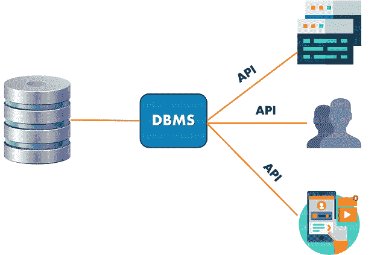

# 什么是数据库管理系统？–数据库管理系统综合指南

> 原文：<https://www.edureka.co/blog/what-is-dbms>

毫无疑问，每天都有大量数据从各种应用程序、不同格式的商业网站中产生。但是，你认为，我们可以处理各种格式的数据，并产生有用的见解。要做到这一点，我们需要数据库管理系统(DBMS)。在本文中，我将按以下顺序向您解释什么是 DBMS:

*   [什么是数据库？](#database)
*   [数据库管理系统简介](#dbms)
*   [数据库管理系统的特征](#characteristicsofdbms)
*   [数据库管理系统的类型](#typesofdbms)
*   [数据库管理系统的优缺点](#advantagesanddisadvantages)

在我们了解 DBMS 之前，让我们先了解一下什么是数据库以及它如何在数据库管理系统中发挥重要作用。

## **什么是数据库？**

顾名思义，数据库是所有数据以结构化格式存储的地方。它帮助用户方便地访问、管理和更新所需的信息。因此，通俗地说，你可以理解，数据库是一个大容器，其中所有关于网站或应用程序的信息都以结构化格式存储。

例如，一个公司可以有员工的各种详细信息，如姓名、empID、电子邮件、血型、工资等等。所有这些细节都可以存储在名为“Employee”的数据库中，采用结构化格式，如表、层次结构等。

在任何组织中，无论是初创公司还是高速发展的公司，都可能存在许多数据库，但以适当的方式管理这些数据库非常重要。因此，本文的下一步让我们了解如何管理这些数据库。

## **什么是 DBMS？**

DBMS 或数据库管理系统是用于访问、创建和管理数据库的软件应用程序。在数据库管理系统的帮助下，你可以很容易地创建、检索和更新数据库中的数据。DBMS 由一组操作数据库的命令组成，充当最终用户和数据库之间的接口。参考下文。

数据库管理系统还旨在通过提供各种管理操作(如调优、性能监控和备份恢复)来简化数据库的概览。

数据库管理系统允许用户进行以下操作:

*   **定义数据**–允许用户创建、修改和删除定义数据库组织的定义。
*   **更新数据**–允许用户插入、修改和删除数据库中的数据。
*   **检索数据**–允许用户根据需要从数据库中检索数据。
*   **用户管理**–注册用户并监控他们的行为，加强数据安全性，维护数据完整性，监控性能并处理并发控制。

### **数据库管理系统的特征**

以下是数据库管理系统的一些特征:

*   以**限制**用户的**权限**

*   提供单个数据库模式的多个**视图**

*   促进**安全性**并消除数据冗余

*   允许**多用户事务**处理和共享数据

*   遵循**酸**属性

*   提供物理和逻辑数据独立性

现在，让我们向前看，了解 DBMS 的类型。

## **数据库管理系统的类型**

以下是不同类型的数据库管理系统:

*   分级数据库管理系统:这种类型的数据库管理系统展示了一种前任-继任型关系的风格。您可以将其视为类似于树，树的节点表示记录，树的分支表示字段。
*   **关系数据库管理系统(RDBMS):** 这种类型的数据库管理系统，其结构允许用户识别和访问与数据库中的另一条数据相关的数据*。在这种类型的 DBMS 中，数据以表的形式存储。*
*   **网络 DBMS:** 这种类型的数据库管理系统支持多对多的关系，其中可以链接多个用户记录。
*   **面向对象的 DBMS:** 这种类型的数据库管理系统使用称为 objects 的小型个人软件。这里，每个对象都包含一段数据和对数据进行操作的指令。

比较流行的 DBMS 软件有 [MySQL](https://www.edureka.co/blog/what-is-mysql/) 、 [PostgreSQL](https://www.edureka.co/blog/postgresql-tutorial) 、 [Oracle](https://www.edureka.co/blog/interview-questions/top-50-oracle-interview-and-answers/) 、 [SQLite](https://www.edureka.co/blog/sqlite-tutorial/) 、MariaDB、 [MS SQL Server](https://www.edureka.co/blog/interview-questions/sql-server-interview-questions/) 等。所有这些软件都基于市场上不同类型的数据库管理系统。因此，这完全是用户的选择，哪种类型的数据库将适合他/她的数据，并证明有利于产生有意义的见解。

在本文中，让我们来看看 DBMS 的优点和缺点。

## **数据库管理系统的优缺点**

### 数据库管理系统的优势

数据库管理系统的几个优点如下:

*   它提供了多种方法来使用[查询语言](https://www.edureka.co/blog/sql-tutorial/)存储和检索各种格式的数据。

*   因为它是一个集中式数据库系统，所以很容易维护。

*   促进*多个应用*使用相同的数据，减少开发和维护时间。

*   以最小的数据重复和冗余提供数据安全性和完整性。

*   它允许无缝集成到应用程序编程语言中，如 [Java](https://www.edureka.co/blog/java-tutorial/) 和 [Python](https://www.edureka.co/blog/python-tutorial/) ，使用户能够将数据库与任何应用程序或网站连接起来。

*   拥有*自动备份和恢复*系统来创建数据的自动备份。

*   授权可以查看、共享和访问数据的用户。

### **数据库管理系统的缺点**

*   数据库管理系统通常是复杂的系统。

*   市场上的数据库管理系统很少是经过许可的。因此，您必须向我们支付贵组织的数据库管理系统。

*   大多数领先的公司将他们的数据存储在一个数据库中。因此，如果数据库由于任何原因被破坏，完整的数据将会丢失。

*   您希望使用的数据库管理系统可能与组织的运营要求不兼容。

*   DBMS 的规模很大，需要时间来设置。

好了，伙计们，关于 DBMS 的这篇文章到此结束。我希望你发现这篇文章信息丰富。如果你想了解更多关于 DBMS 中使用的命令，你可以参考我关于 [SQL 命令](https://www.edureka.co/blog/sql-commands)的文章。

*如果您希望了解更多关于 [MySQL](https://www.edureka.co/blog/what-is-mysql/) 的信息，并了解这个开源的关系数据库，那么请查看我们的 **[MySQL DBA 认证培训](https://www.edureka.co/mysql-dba)** ，它附带有讲师指导的现场培训和真实的项目经验。本培训将帮助您深入了解 MySQL，并帮助您掌握这门学科。*

有问题吗？请在这篇文章的评论部分提到它，我会回复你。