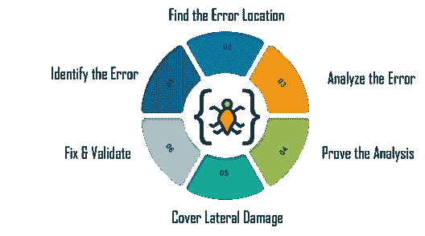

# 什么是调试，为什么它很重要？

> 原文：<https://www.edureka.co/blog/what-is-debugging/>

一个软件应用程序在上市前需要没有错误。客户满意度对任何组织来说都是至关重要的，只有无缺陷的产品才能让您的客户满意。在本文中，我们将按以下顺序了解什么是调试，以及它与[软件测试](https://www.edureka.co/blog/software-testing-tutorial/)有何不同:

*   [什么是调试？](#debugging)
*   [为什么我们需要调试？](#whydebugging)
*   [调试步骤](#debuggingsteps)
*   [调试策略](#debuggingstrategies)
*   [调试工具](#debuggingtools)

我们开始吧。

## **什么是调试？**

软件程序在开发过程中要经历大量的测试、更新、故障排除和维护。通常，软件包含**错误和缺陷**，它们通常会被删除。**D**T5**ebugging**是**修复软件中一个 bug** 的过程。

识别、分析和消除错误。这个过程在软件无法正确执行后开始，并以解决问题和成功测试软件而结束。但是，这被认为是一个极其复杂的任务，因为在调试的各个阶段都需要解决错误。

## **为什么我们需要调试？**

一旦**软件**的**代码**被写入，调试过程开始。然后，当代码与其他编程单元结合形成软件产品时，它在连续的阶段中继续。调试有许多好处，例如:

*   它**立即向**报告一个**错误情况。**这允许更早地发现错误，并使软件开发过程没有压力和问题。
*   它还提供了  **数据结构的最大有用信息** ，并允许**轻松解释。**
*   调试协助开发者在  **中减少无用的**和**中分散注意力的信息。**
*   通过调试，开发者可以  **避免复杂的一次性测试代码**，节省软件开发的时间和精力。

## **调试步骤**

调试过程中涉及的不同步骤有:

**1。识别错误:**错误的错误识别会导致开发时间的浪费。通常情况下，用户报告的生产错误很难解释，有时我们收到的信息是误导性的。识别实际的错误是很重要的。

**2。找到错误位置:**正确识别错误后，需要遍历代码找到错误所在的确切位置。在这个阶段，你需要专注于发现错误，而不是理解错误。

**3。分析错误:**第三步，需要使用从错误位置开始的自底向上的方法，分析代码。这有助于你理解错误。分析一个 bug 有两个主要目标，比如检查错误周围是否有其他错误要被发现，以及确保在修复中输入任何附带损害的风险。

**4。证明分析:**一旦你完成了对原始 bug 的分析，你需要再找几个可能出现在应用程序上的错误。这一步是在测试框架的帮助下为这些领域编写自动化测试。

**5。Cover Lateral Damage:** 在这个阶段，您需要为您将要进行更改的代码创建或收集所有的单元测试。现在，如果你运行这些单元测试，它们都应该通过。

**6。修复&验证:**最后一个阶段是修复所有的错误，并运行所有的测试脚本来检查它们是否全部通过。

## **调试策略**

*   深入研究**系统**的**很重要，这样才能理解这个系统。它帮助调试器构造要调试的系统的不同表示。**
*   **问题的向后分析**从故障信息的位置向后追踪程序，以识别故障代码的区域。您需要彻底研究缺陷区域，以找到缺陷的原因。
*   **程序的向前分析**包括在程序的不同点使用断点或打印语句向前跟踪程序。重点关注获得错误输出的区域非常重要。
*   你必须使用软件的**过往经验**来检查类似问题。这种方法的成功取决于调试器的专业知识。

## **调试工具**

调试工具是用来测试和调试其他程序的计算机程序。有很多像 **gdb** 和 **dbx** 这样的公共领域软件可以用来调试。此外，它们还提供基于控制台的命令行界面。一些自动化调试工具包括基于代码的跟踪器、分析器、解释器等。

下面是一些广泛使用的调试器的列表:

*   **Radare2**
*   **WinDbg**
*   **Valgrind**

说到这里，我们的文章就到此为止了。我希望你明白什么是调试以及调试过程中的不同阶段。

*现在您已经了解了什么是调试，请查看由 Edureka 提供的 [**软件测试基础课程**](https://www.edureka.co/software-testing-fundamentals-training) ，这是一家值得信赖的在线学习公司，拥有遍布全球的 250，000 多名满意的学习者。本课程旨在向您介绍完整的软件测试生命周期。您将学习不同级别的测试、测试环境设置、测试用例设计技术、测试数据创建、测试执行、错误报告、DevOps 中的 CI/CD 管道以及软件测试的其他基本概念。*

有问题要问我们吗？请在“什么是调试”的评论部分提到它，我们会回复您。