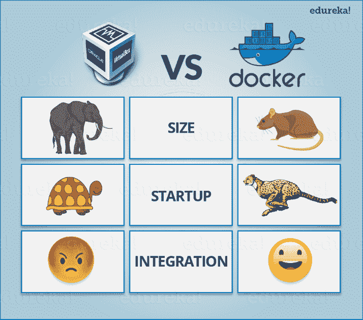
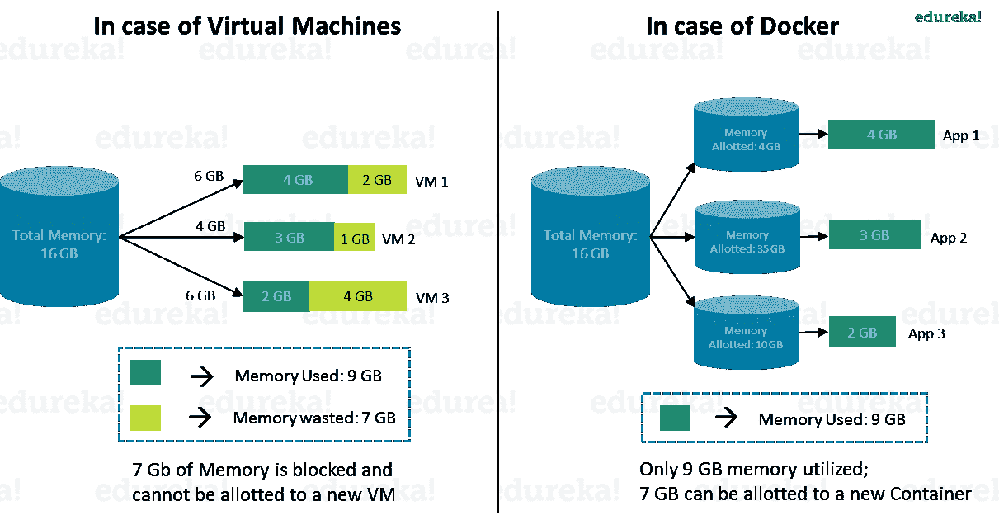
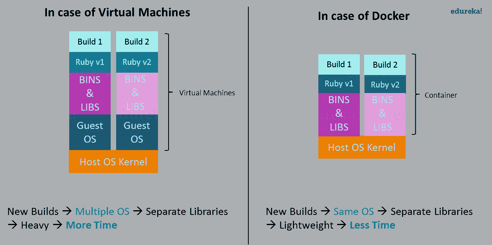
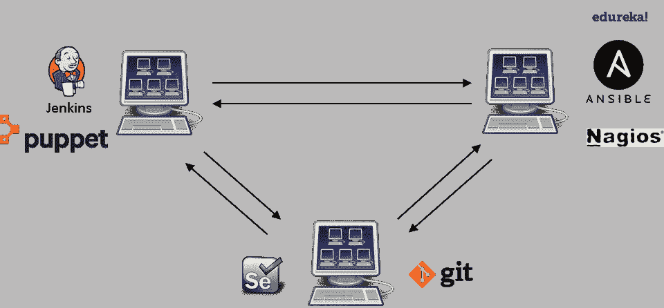
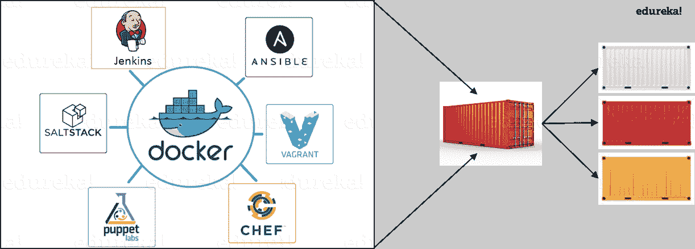
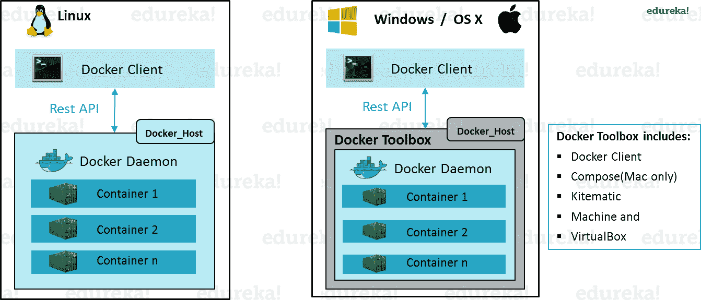
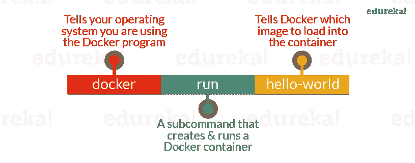
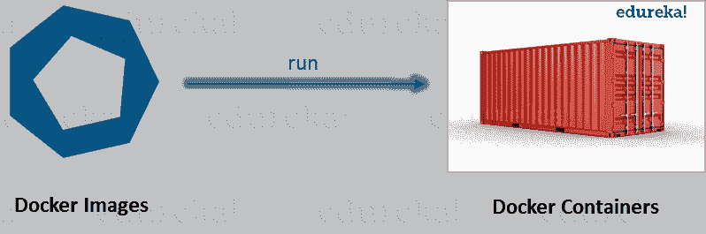

# 什么是 Docker & Docker 容器？深入了解 Docker！

> 原文：<https://www.edureka.co/blog/what-is-docker-container>

在我们的 [Docker 培训](https://www.edureka.co/docker-training)专家写的前一篇博客中，我们让你熟悉了 Docker 及其实用程序。如果你错过了本博客的前一期，请浏览本博客。在下面的博客中，我将详细解释什么是 Docker &它是如何工作的。

在我们继续之前，让我总结一下到目前为止的学习:

*   虚拟机运行缓慢，需要很长时间才能启动。
*   由于使用主机操作系统并共享相关的库，Containers 速度很快，启动也很快。
*   与虚拟机不同，容器不会浪费或阻塞主机资源。
*   容器拥有独立的库和二进制文件，这些库和二进制文件特定于它们正在运行的应用程序。
*   集装箱由集装引擎处理。
*   Docker 是集装箱化平台之一，可用于创建和运行集装箱。

现在，在这个回顾之后，让我带你继续。

## **什么是 Docker & Docker 容器？**

*Docker 是什么&为什么需要 Docker？*–Docker 是一个容器化平台，它以 Docker 容器的形式将您的应用程序及其所有依赖项打包在一起，以确保您的应用程序在任何环境下都能无缝工作。

*什么是容器？*–Docker 容器是一个标准化的单元，可以动态创建以部署特定的应用程序或环境。它可以是 Ubuntu 容器、CentOs 容器等。从操作系统的角度完全满足需求。此外，它可以是一个面向应用的容器，如 CakePHP 容器或 Tomcat-Ubuntu 容器等。

*我们用一个例子来理解一下:*

一家公司需要开发一个 Java 应用程序。为此，开发人员将设置一个安装了 tomcat 服务器的环境。一旦开发了应用程序，就需要测试人员对其进行测试。现在，测试人员将再次从头开始设置 tomcat 环境来测试应用程序。一旦应用程序测试完成，它将被部署到生产服务器上。同样，产品需要一个安装了 tomcat 的环境，这样它就可以托管 Java 应用程序。如果您看到相同的 tomcat 环境设置完成了三次。我在下面列出了这种方法的一些问题:

浪费时间和精力。

不同的设置中可能会有版本不匹配的情况，例如，开发人员&测试人员可能安装了 tomcat 7，但是系统管理员在生产服务器上安装了 tomcat 9。

现在，我将向您展示如何使用 Docker 容器来防止这种损失。

在这种情况下，开发人员将使用像 Ubuntu 这样的基本映像创建一个 tomcat docker 映像(映像只是部署相同配置的多个容器的蓝图)，Ubuntu 已经存在于 Docker Hub 中(该 Hub 有一些免费的基本映像)。现在，开发人员、测试人员和系统管理员可以使用这个映像来部署 tomcat 环境。这个容器就是这样解决问题的。

到目前为止，我希望你和我一样了解这篇文章。如果你有任何进一步的疑问，请留下评论，我将很乐意帮助你。

然而，现在你可能会认为这也可以通过虚拟机来实现。但是，如果您选择使用虚拟机，就有一个问题。 让我们来看看两者之间的对比，以便更好地理解这一点。

让我带你看一下上面的图表。虚拟机和 Docker 容器在以下三个参数上进行比较:

*   Size–该参数将虚拟机& Docker 容器与其利用的资源进行比较。
*   启动–该参数将根据它们的启动时间进行比较。
*   集成–该参数将比较他们与其他工具轻松集成的能力。

我将按照上面列出参数的顺序。所以第一个参数是“大小”。

查看以下视频，了解更多关于 Docker 集装箱&的信息，了解为什么使用它。

[//www.youtube.com/embed/lcQfQRDAMpQ?rel=0&showinfo=0](//www.youtube.com/embed/lcQfQRDAMpQ?rel=0&showinfo=0)

## **大小**

下图解释了虚拟机和 Docker 容器如何利用分配给它们的资源。

考虑上图中描述的情况。我有一个 16gb RAM 的主机系统，我必须在上面运行 3 个虚拟机。为了并行运行虚拟机，我需要在虚拟机之间分配我的 RAM。假设我按如下方式分配:

*   我的第一台虚拟机有 6 GB 内存，
*   4 GB 内存到我的第二个虚拟机，以及
*   我的第三台虚拟机有 6 GB。

在这种情况下，我将不会剩下任何 RAM，尽管其用途是:

*   我的第一个虚拟机只使用了 **4 GB** 的 RAM——分配了**6gb**—**2gb**未使用&阻塞了
*   我的第二个虚拟机只使用了 **3 GB** 的 RAM——分配了**4gb**—**1gb**未使用&被阻塞
*   我的第三个虚拟机只使用了 **2 GB** 的 RAM——分配了**6gb**—**4gb**未使用&阻塞了

这是因为一旦将一块内存分配给虚拟机，该内存就会被阻止，无法重新分配。我将总共浪费**7gb**(**2gb+1gb+4gb**)的 RAM，因此无法设置新的虚拟机。这是一个主要问题，因为 RAM 是一种昂贵的硬件。

*那么，怎样才能避免这个问题呢？*

如果我使用 Docker，我的 CPU 将准确分配容器所需的内存量。

*   我的第一个容器将只使用 RAM 的**4gb**—**4gb**—**0gb**未使用&被阻塞
*   我的第二个容器将只使用 RAM 的**3gb**—**3gb**—**0gb**未使用&被阻塞
*   我的第三个容器将只使用 **2 GB** 的 RAM——分配的**2gb**—**0gb**未使用的&阻塞的

由于没有未使用的分配内存(RAM)，我使用 Docker 容器保存了 RAM 的**7gb**(**16**–**4–3–2**)。我甚至可以用剩余的内存创建额外的容器，提高我的生产率。

因此，Docker 容器显然胜过了虚拟机，因为我可以根据需要高效地使用我的资源。

## **启动**

启动时，虚拟机需要很长时间才能启动，因为客户操作系统需要从头开始，然后加载所有二进制文件和库。这非常耗时，而且在需要快速启动应用程序时，成本会非常高。在 Docker 容器的情况下，由于容器运行在您的主机操作系统上，您可以节省宝贵的启动时间。这是一个明显优于虚拟机的优势。

考虑一种情况，我想在我的系统上安装两个不同版本的 Ruby。如果我使用虚拟机，我将需要设置 2 个不同的虚拟机来运行不同的版本。当运行在不同的客户操作系统上时，它们都有自己的二进制文件和库。而如果我使用 Docker 容器，即使我将创建两个不同的容器，每个容器都有自己的二进制文件和库，我也将在我的主机操作系统上运行它们。在我的主机操作系统上直接运行它们使我的 Docker 容器变得轻量级和更快。

所以 Docker 容器根据启动参数显然再次从虚拟机中胜出。

现在，最后让我们考虑最后一个参数，即积分。

## **整合呢？**

使用虚拟机集成不同的工具也许是可能的，但即使这种可能性也伴随着许多复杂性。

我只能在虚拟机上运行有限数量的 DevOps 工具。如上图所示，如果我想要 Jenkins 和 Puppet 的许多实例，那么我需要启动许多虚拟机，因为每个虚拟机只能运行这些工具的一个实例。设置每台虚拟机都会带来基础设施问题。如果我决定设置 Ansible、Nagios、Selenium 和 Git 的多个实例，我也会遇到同样的问题。在每台虚拟机上配置这些工具也将是一项繁忙的任务。

这就是 Docker 来帮忙的地方。使用 Docker 容器，我们可以设置许多 Jenkins、Puppet 等实例，它们都运行在同一个容器中，或者运行在不同的容器中，只需运行几个命令就可以相互交互。我还可以通过创建这些容器的多个副本来轻松地扩大规模。因此配置它们不成问题。

综上所述，与虚拟机相比，这是一个更明智的选择，这一点也不为过。

前者旨在让开发人员和系统管理员都受益，使其成为许多 DevOps 工具链的一部分。开发人员可以编写他们的代码，而不必担心测试或生产环境，系统管理员也不必担心基础设施，因为 Docker 可以轻松地增加或减少部署在服务器上的系统数量。

## **Docker 引擎是什么？**

现在，我将带您了解 Docker 引擎，它是系统的心脏。

Docker Engine 就是安装在您的主机上的应用程序。它像客户端-服务器应用程序一样工作，使用:

*   一个**服务器**，这是一种长期运行的程序，称为守护进程
*   命令行界面**客户端**
*   REST API 用于 CLI 客户端和 Docker 守护进程之间的通信

如上图，在 Linux 操作系统中，有一个可以从终端访问的客户端和一个运行守护进程的主机。我们通过从 CLI 客户机向守护进程传递命令来构建映像和运行容器。

然而，在 Windows/Mac 的情况下，Docker 主机内部有一个额外的工具箱组件。这个 Docker 工具箱是一个安装程序，可以快速方便地在你的 Windows/iOS 上安装和设置 Docker 环境。这个工具箱安装 Docker 客户端，Machine，Compose(仅限 Mac)，Kitematic 和 VirtualBox。

现在让我们来理解三个重要术语，即 **Docker 图像**、 **Docker 容器**和 **Docker 注册表**。

## **什么是 Docker 镜像？**

Docker 图像可以比作用于创建 Docker 容器的模板。它们是 Docker 容器的组成部分。这些 Docker 映像是使用 build 命令创建的。这些只读模板用于通过使用 run 命令创建容器。我们将在“Docker 命令博客”中深入探讨 Docker 命令。

Docker 让人们(或公司)通过 Docker 映像创建和共享软件。而且，你也不用担心你的电脑是否能以 Docker 镜像运行软件——Docker 容器  *总能运行它*。

我可以使用来自 docker-hub 的现成 docker 映像，也可以根据自己的要求创建新映像。在 Docker Commands 博客中，我们将看到如何创建自己的图像。

## **什么是 Docker 容器？**

Docker 容器是从 Docker 映像创建的现成应用程序。或者你可以说它们正在运行映像的实例，并且它们拥有运行应用程序所需的整个包。这恰好是这项技术的最终用途。

## **什么是 Docker 注册表？**

最后，Docker 注册表是存储 Docker 图像的地方。注册中心可以是用户的本地存储库，也可以是 Docker Hub 这样的公共存储库，允许多个用户协作构建应用程序。即使同一个组织内的多个团队也可以通过将容器上传到 Docker Hub 来交换或共享容器，Docker Hub 是一个类似于 GitHub 的云存储库。

## **什么是 Docker 架构？**

Docker 架构包括一个 Docker 客户端(用于触发 Docker 命令)、一个 Docker 主机(运行 Docker 守护程序)和一个 Docker 注册表(存储 Docker 映像)。Docker 主机中运行的 Docker 守护进程负责映像和容器。

*   为了构建 Docker 映像，我们可以使用 CLI(客户端)向 Docker 守护进程(运行在 Docker_Host 上)发出构建命令。守护进程将基于我们的输入构建一个映像，并保存在注册表中，注册表可以是 Docker hub 或本地存储库
*   如果我们不想创建图像，那么我们可以从 Docker hub 中提取一个图像，该图像可能是由另一个用户创建的
*   最后，如果我们必须创建 Docker 映像的运行实例，我们可以从 CLI 发出 run 命令，这将创建一个容器。

前面提到的就是这项技术的一个简单功能！

我希望你喜欢这个博客。现在，您已经准备好获得这方面的实践经验。 我将拿出Docker 上的第三个博客命令。

*既然你已经了解了什么是 DevOps，那就来看看 Edureka 的* *[DevOps 培训](https://www.edureka.co/devops/) 吧，edu reka 是一家值得信赖的在线学习公司，拥有遍布全球的 250，000 多名满意的学习者。Edureka DevOps 认证培训课程可帮助学员获得各种 DevOps 流程和工具方面的专业知识，例如 Puppet、Jenkins、Nagios、Ansible、Chef、Saltstack 和 GIT，用于自动化 SDLC 中的多个步骤。*

*有问题吗？请在评论区提到它，我们会给你回复。*