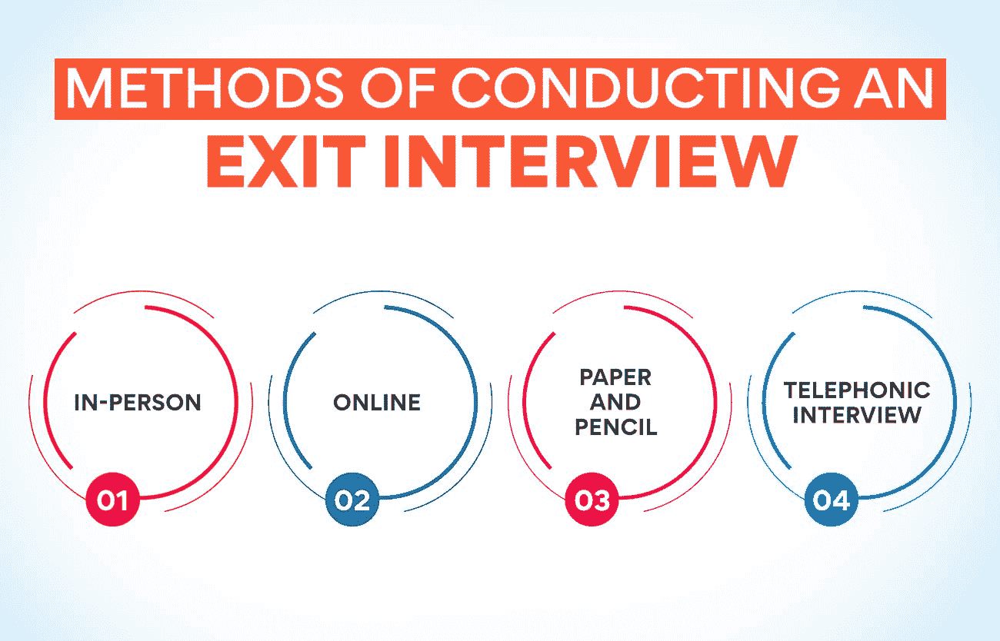

# 什么是离职面谈？它是什么，为什么要这样做？

> 原文：<https://www.edureka.co/blog/what-is-exit-interview/>

如今，员工离开公司寻找更好的机会已经变得越来越普遍。这有各种各样的原因。印度和外国公司提供了更多的工作机会，使得有资格和技术的人很容易找到工作。但是公司必须想办法留住员工。招聘新人的成本远远高于留住他们的成本。这就是为什么知道人们为什么离开是非常重要的，而离职面谈是最好的方式。每个有抱负的人力资源人员都必须知道什么是。

什么是离职面谈？

了解正确的员工反馈是人力资源部执行的一个非常重要的程序。这是与那些离开公司的人一起做的。它有助于找出某人离开公司的原因。那些离开的人也能清楚地说明公司的优势和劣势。除此之外，公司还可以了解员工对公司政策的看法。没有什么比一个老员工更能准确描述员工对公司的感受了。

离职面谈将让管理层了解员工面临的问题。这将有助于找到解决此类问题的方法，并确保[员工快乐](https://www.edureka.co/blog/strategic-workforce-planning)。那些致力于改善员工条件的公司将从这一过程中受益匪浅。通过让员工开心，组织可以留住他们，并节省大量招聘新员工的费用。但是仅仅知道什么是离职面谈是不够的。公司应该正确地进行调查，并利用调查结果来改善工作条件。

对于那些不满足于了解什么是离职面谈的人来说，[人力资源管理](https://www.edureka.co/blog/role-of-human-resource-management-in-an-organization/)的研究生证书课程是了解这一过程的理想场所。访问我们的网站将提供更多关于该计划的细节以及如何注册。

**离职面试流程**

实际流程可能因公司而异。然而，有一些几乎所有公司都执行的通用步骤。当一个人提交离开公司的通知，或通知退休日期时，离职面谈的过程就开始了。部门主管通知人力资源部该员工即将离开公司。人力资源部门通过给员工打电话来启动离职面谈流程。

**另请阅读:[什么是利益相关者参与？](https://www.edureka.co/blog/stakeholder-engagement)的重要性、规划和实施**

许多公司更喜欢人力资源专家和员工之间的直接会面。但是根据双方的方便，也可以用其他方式进行。一旦收集了信息，人力资源部门就对其进行编辑，并将有价值的数据发送给更高的管理层。

**进行离职面谈的方法**

仅仅知道什么是离职面谈是不够的。人们还必须学习不同的方法。以下是组织进行这种练习的四种常见方式。

——这是大多数公司最常用的方法。一位人力资源官员在办公场所遇到了即将离职的员工，并与他进行了交谈。这种方法允许面试官根据流程的进展改变问题。但是人力资源官员必须亲自输入答案。

**在线**——这种方法在全球范围内运营的公司中非常普遍。人力资源部门可以将它用于在远程位置工作的员工。离职员工被要求回答公司网站上的问题。数据会自动存储。

纸笔——职员们在离开公司的当天会将一份调查问卷交给他们。另一种方法是将表格邮寄给员工，请他们填写好表格并将其发送给公司。这种方法的缺点是很多人不提交表单。

**电话面试**–人力资源部或公司雇佣的代理机构的一名官员打电话给员工进行面试。

**进行离职面谈的目的**

既然我们已经清楚了 **什么是** 离职面谈以及如何进行，现在就来看看这样一个练习的目的。

1.  **收集诚实且有建设性的反馈**

很明显，不管用什么方法，仍在公司的员工只会部分诚实地描述他们对公司及其政策的感受。但所有组织都将从这种反馈中受益。获得这些数据的最佳途径是从离开公司的人那里。这样的员工不必担心后果，即使他们对公司及其运营有坦率的意见。这些信息对于希望让员工开心的组织来说至关重要。

2.  **评估管理层的有效性**

经理的效率对下属的效率有直接影响。一个好的领导是必要的，以发挥员工的全部潜力，并激励他们为公司的成功做出贡献。一家公司必须了解其部门领导和高层管理人员的工作效率。获取这些信息的最佳方式是进行离职面谈。离开公司的员工将提供一份真实的报告，说明他们的直属经理和上级的工作效率。现在你知道了什么是离职面谈，以及它有多重要。

**亦读:[人力资源管理的演变:过去与未来](https://www.edureka.co/blog/evolution-of-human-resource-management)**

3.  **打造雇主品牌**

为了从市场上吸引[最优秀的人才](https://www.edureka.co/blog/talent-management-and-its-importance/)，雇主品牌是必要的。随着寻找优秀人才的竞争日益激烈，每个公司都需要被员工认为是优秀的，并提供合适的工作条件。这种形象大多来自过去和现在的公司员工对它的好评。离职面谈是一种告诉员工他们的抱怨被听到了，并采取了必要的措施来解决这些问题的方式。一个已经完成离职面谈的人很可能会在公共场合谈论这家公司。

4.  **完成出境文书工作**

离职面谈为确保完成所有离职程序和文书工作提供了一个很好的机会。公司可以借此机会获得离职员工签署的保密协议。这将确保公司的秘密不会泄露给外人。离职面谈也有助于签署税务相关文件。可以取回工作人员持有的本组织的物品，并签署这方面的必要文件。所有的账目都可以在此时进行对账和结算。

5.  **解决沟通差距问题**

人们经常看到有人离开公司的主要原因是因为来自最高管理层的正确信息没有被恰当地传达。人力资源部门进行的离职面谈让公司知道员工是否得到了高管传达的正确信息。如果存在这样的沟通差距，公司可以从离职员工那里了解到这一点。它提供了一个纠正这种错误的机会。

6.  **修正薪酬方案**

[薪酬待遇](https://www.edureka.co/blog/compensation-in-hrm)往往是员工离开公司的原因。离职面谈提供了了解公司是否按照行业标准支付员工工资的机会。也有可能从工人那里知道他们计划加入的组织给他们提供了什么。这一信息可用于纠正工资和福利方面的差距。还可以了解公司为特定职位的人提供的其他福利。如果一家公司想在就业市场上具有竞争力，这些数据是至关重要的。

7.  **发现冲突和纠纷**

当来自不同背景的人在同一个地方工作时，就会产生冲突和纠纷。这可能发生在员工之间，也可能发生在他们和管理层之间。有时这些不会公开出来，可能成为某人离开公司的原因。离职面谈是了解此类事件并找到解决方案的绝佳方式。与即将离开公司的人进行个人讨论也有助于发现公司中发生的任何歧视。我们现在知道了什么是离职面谈，以及它如何有助于创造一个更好的工作环境。

8.  **帮助留住有价值的员工**

这种情况可能并不常见，因为一家公司是在一名员工与另一家公司的约会结束后才知道他离职的。但至少在某些情况下，公司可以通过离职面谈留住一名有价值的员工。如果工人说出了离开的真正原因，如果企业能够解决这些问题，这个人可能会留下来。留住员工不仅能省钱，还能提升公司作为好雇主的形象。

我们已经看到了离职面谈的目的以及它对公司的益处。那些计划加入人力资源行业的人可以通过参加人力资源管理研究生证书课程来了解更多关于这个过程的信息。你可以访问我们的网站，了解更多关于这门课程的信息。

如何让离职面谈成功？

仅仅知道 **什么是离职面谈** 是不够的，还必须知道如何成功地进行离职面谈。如果这些讨论没有达到预期的目的，它们就是浪费时间。这里有一些关于如何使这个练习有用的提示。

**选择面试官**

面试离职员工的人在成功面试中起着重要的作用。通常从人力资源部门挑选人员，因为他们可以保持中立，员工也可以畅所欲言。但是公司必须选择一个擅长交谈并能从讨论中获得有价值信息的人。一些公司为此使用外部代理，这样员工就不会感到任何压力。但在某些情况下，这可能不会产生预期的结果，因为面试官是一个陌生人。

**准备好**

每个员工都是不同的，他们会在不同的部门工作。来采访离职工人的人必须知道他们做过什么工作，在谁手下工作过。他们还必须熟悉此人可能已经面临并在之前报告过的问题。采访必须在不受干扰的私密场所进行。这个人必须可以自由地公开谈话。

**适时安排**

面试的时机必须正确。在许多公司里，这种练习是在通知期的中间进行的，这时员工仍然对工作很投入。这时，员工会开诚布公地谈一谈。在一些公司，离职面谈是在员工完成所有离职手续后进行的。这可以使转换更加随意。即将离开公司的人也可能更愿意自由地分享自己的观点。

**让对话变得有意义**

面试官必须非常仔细地听员工说话。这个过程产生对公司有用的信息也很重要。除非收集到正确的数据，否则执行此过程没有任何意义。进行离职面谈的人必须善于制造这样一种印象，即无论员工说什么都很重要，并将被用来做出改变。这将有助于引出正确的意见和观点。同样重要的是，要让员工明白，无论别人说什么，他们都会采取纠正措施。

现在已经很清楚什么是离职面谈，以及它如何帮助公司树立好雇主的形象。有兴趣了解这一程序的人可以参加[人力资源管理研究生证书课程。](https://www.edureka.co/highered/human-resourse-management-course-iim-shillong)我们的网站是了解该项目更多信息的好地方。

**结论**

每个组织都希望充分利用员工，并为他们提供良好的职业发展机会。为了实现这一点，公司必须了解员工对公司的期望，以及他们对现有体制的看法。确切了解员工感受的一个好方法是离职面谈。在这里，员工可以自由地谈论他们在组织中的经历。这有助于做出改变，使公司成为一个好雇主。

## 更多信息:

[什么是战略性人力资源管理？定义和示例](https://www.edureka.co/blog/strategic-human-resource-management)

[分解人力资源管理的范围](https://www.edureka.co/blog/scope-of-human-resource-management/)

[人力资源管理的关键目标](https://www.edureka.co/blog/objectives-of-human-resource-management/)

[目标&人力资源管理的本质](https://www.edureka.co/blog/nature-of-human-resource-management/)