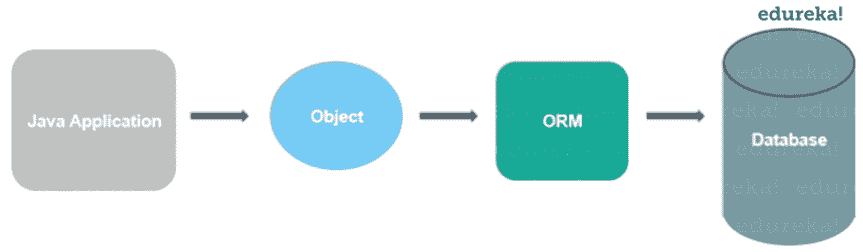

# Java 中的 Hibernate 是什么，我们为什么需要它？

> 原文：<https://www.edureka.co/blog/what-is-hibernate-in-java/>

Hibernate 是一个开源的对象-关系映射器解决方案，在 [Java](https://www.edureka.co/java-j2ee-training-course) 中。它很轻便，克服了我们在与 [JDBC](https://www.edureka.co/blog/connect-mysql-database-in-java) 合作时面临的所有缺点。在本文中，我们将学习“什么是 Java 中的 Hibernate ”,以及 hibernate [框架](https://www.edureka.co/blog/java-frameworks/)的所有功能和优势。以下是本博客讨论的主题:

*   [Java 里的 Hibernate 是什么？](#hibernate)
*   [对 Hibernate 框架的需求](#need)
*   [Java 中的 Hibernate 简介](#introduction)
*   [Hibernate 框架在 Java 中的优势](#advantages)

## **Java 里的 Hibernate 是什么？**

Hibernate 是一个 Java 框架，它有一个抽象层，在内部处理实现。这些实现包括为 [CRUD](https://www.edureka.co/blog/node-js-mysql-tutorial/) 操作编写查询或建立与数据库的连接等任务。

一个框架基本上是一个软件，它提供了对多种技术的抽象，比如 [JDBC](https://www.edureka.co/blog/connect-mysql-database-in-java) 、 [servlet、](https://www.edureka.co/blog/servlet-and-jsp-tutorial/)等等。

Hibernate 开发了持久性逻辑，存储和处理数据以供长期使用。它是轻量级的 ORM 工具，最重要的是它是开源的，这使它比其他框架更有优势。

### 什么是 ORM 工具？

这是一种映射存储在数据库中的对象的技术。ORM 工具简化了数据的创建、操作和访问。它在内部使用 Java API 与数据库进行交互。

让我们来看看在 Java 中使用 hibernate 的必要性。

## **对 Hibernate 框架的需求**

Hibernate 消除了其他技术的缺点，比如 JDBC。让我们看看它如何比 JDBC 更好地优化任务。

*   Hibernate 克服了 JDBC 面临的数据库依赖性。
*   数据库的改变在 JDBC 上花费了大量的工作，hibernate 成功地克服了这个问题。
*   在 JDBC 上工作时，代码可移植性不是一个选项，hibernate 很容易处理这个问题。
*   Hibernate 加强了对象级的关系。
*   它克服了在 JDBC 上工作时强制执行的[异常处理](https://www.edureka.co/blog/java-exception-handling)部分。
*   Hibernate 克服了对象级关系。
*   它通过克服锅炉板问题，减少了代码长度，增加了可读性。

Hibernate 克服了 JDBC 的所有缺点，为任何任务提供了最优和高效的解决方案。让我们来看看在 Java 中使用 hibernate 框架时可以使用的各种操作、技术和数据库。

## **Java 中的 Hibernate 简介**

作为一个开源框架，每个人都可以免费使用它。hibernate 的源代码可以在互联网上找到，它也允许修改。

轻量级框架的优势在于它的安装包更小。效率随着不使用任何容器来执行而增加。即使 hibernate 可以同时使用多种技术，但这并不意味着 hibernate 不能单独工作。我们也可以单独使用 hibernate，也就是说不需要任何技术。

Hibernate 有一个特殊的性质，它不需要实现 hibernate API 接口或者从 hibernate API 类扩展，因为 hibernate 应用程序开发的类是松散耦合的。

### **Hibernate 支持的功能**

*   Hibernate 使用 Hibernate 查询语言，这使得它与数据库无关。
*   它支持自动 DDL 操作。
*   Hibernate 支持自动生成主键。
*   它支持高速缓存。
*   异常处理对于 hibernate 不是强制性的。
*   最重要的是 hibernate 是一个 ORM 工具。

**Hibernate 中支持的数据库**

以下是 Java 中 hibernate 支持的数据库。

*   HSQL 数据库引擎
*   [MYSQL](https://www.edureka.co/blog/install-mysql/) 的实现
*   神谕
*   FrontBase
*   [PostgreSQL](https://www.edureka.co/blog/postgresql-tutorial)
*   DB2/NT
*   Sybase SQL Server
*   Informix 动态服务器
*   Microsoft SQL Server 数据库

Hibernate 几乎支持所有主要的 RDBMS，这使得它高效且易于使用。

### **Hibernate 支持的技术**

Hibernate 支持多种技术。

*   XDoclet 弹簧
*   [胃](https://www.edureka.co/blog/create-selenium-maven-project/)
*   Eclipse 插件
*   [J2EE](https://www.edureka.co/blog/videos/introduction-to-javaj2ee-soa/)

让我们来看看 hibernate 在 java 中的几个优势。

## **Hibernate 在 Java 中的优势**

*   轻量级和开源——轻量级和开源使它变得可访问和高效。
*   提高性能–使用高速缓存有助于提高性能。
*   数据库独立性——独立于数据库使它能够处理不同的数据库。
*   auto DDL Operations——自动创建表让我们不用手动创建表。
*   它负责使用 XML 文件映射 Java 类数据库，而无需编写任何代码。
*   我们可以使用简单的 API 直接从数据库中存储和检索数据。
*   它不需要任何应用服务器来运行。
*   使用智能抓取策略最小化数据库访问。
*   它提供简单的数据查询。

在本文中，我们已经讨论了什么是 hibernate，以及 hibernate 的各种功能和优势。Hibernate 是一个对象关系映射器，它克服了 Java 中 JDBC 的缺点。有了最佳解决方案和效率，使用数据库变得相当容易，没有任何依赖性。java 编程语言中充满了这样的技术，随着效率的提高，在过去十年中对 Java 开发人员的需求也显著增加。随着需求的不断增长，与编程语言的所有技术进步保持同步是极其重要的。要掌握你的技能，报名参加 Edureka 的 [Java 认证](https://www.edureka.co/java-j2ee-training-course)项目，开始你的学习。

*如果你有任何问题？在这篇文章“什么是 Java 中的 Hibernate”的评论部分提到它们，我们会尽快回复您。*