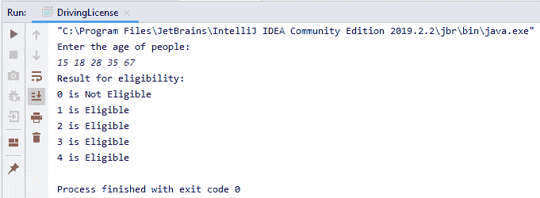
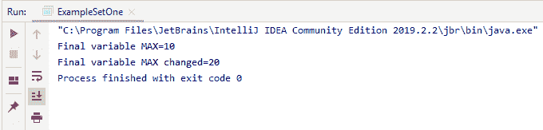
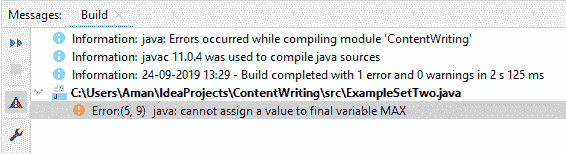
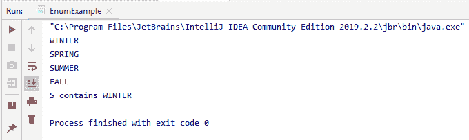

# Java 中什么是常量，如何声明？

> 原文：<https://www.edureka.co/blog/what-is-java-constant/>

**‘恒定’**一词在英语中基本上指的是’**一种不改变**的情况。这是编程的基本概念之一，除了基本的[编程技巧](https://www.edureka.co/blog/java-tutorial/)之外，在学习它之前没有任何特殊的先决条件或概念需要了解。以下是我们将在本文中研究的概念。

*   [Java 中的常量是什么？](#ConstantsinJava)
*   [为什么常数？](#WhyConstants?)
*   [静态和最终修改器](#StaticandFinalModifiers)
*   [使用常量变量的潜在问题](#PotentialProblemsusingConstantVariables)
*   [常量作为枚举](#ConstantsasEnumerations)

让我们开始吧！

## **Java 中的常量是什么？**

当必须实现变量的 **' [静态](https://www.edureka.co/blog/variables-in-java/) '** 值或永久值时，使用 Java 中的常量。Java 不直接支持常量。要使任何变量成为常量，我们必须以如下方式使用“static”和“final”修饰符:

**Java 中赋值常量的语法:**

静态最终数据类型标识符名称=常量；

*   **静态修饰符**使得变量可用，而无需加载其定义类的实例
*   **最终修饰符**使变量不可改变

我们必须同时使用 static 和 final 修饰符的原因是，如果我们只将变量**‘var’**声明为 static，那么同一类的所有对象都将能够访问这个**‘var’**并更改其值。当我们只将一个变量声明为 final 时，那么将为每个不同的对象创建同一个常量值的多个实例，这是没有效率的/不可取的。当我们同时使用 static 和 final 时,“var”保持静态，并且只能初始化一次，从而使它成为一个适当的常量，对于它包含的类的所有对象，它都有一个公共的内存位置。

常量声明的例子:**static final int MIN _ AGE**=**18；**假设我们需要确定一群人中谁有资格获得永久驾驶执照。我们已经知道永久驾驶执照的最低年龄要求是 18 岁。因此，我们没有要求用户输入最小年龄来进行比较，而是将**‘MIN _ AGE’**标识符声明为值为 **18** 的常量整数。

```
import java.util.*;
public class DrivingLicense{
     public static void main(String [] args){
          Scanner sc = new Scanner(System.in);
          static final int MIN_AGE = 18; //Minimum age requirement
          int[] list = new int[5];
          System.out.println("Enter the age of people:");
          for(int i=0;i<5;i++){
                list[i] = sc.nextInt();
          }
          System.out.println("Result for eligibility:");
          for(int i=0;i<5;i++) { 
          if(list[i] >= MIN_AGE)
                System.out.println(i + " is Eligible");
          else
                System.out.println(i + " is Not Eligible");
          }
     }
}

```

**输出:**

****

现在让我们看看为什么常数。

## **为什么常数？**

**常量**让你的程序在被别人阅读时更容易阅读和理解。使用常量也可以提高性能，因为常量同时被 **JVM** 和您的应用程序缓存。

让我们检查一下**静态**和**最终**修改器。

## **静态和最终修改器**

*   静态修饰符主要用于内存管理。
*   它还允许变量在不加载定义它的类的任何实例的情况下可用。
*   最后一个修饰符意味着变量的值不能改变。一旦值被分配给一个变量，不同的值不能被重新分配给同一个变量。

通过使用 final 修饰符，像 int、float、char、byte、long、short、double、Boolean 这样的基本数据类型都可以变成不可变的。正如我们前面所理解的，这些修饰语共同创造了一个常量变量。

通用语法:**public static final int MAX _ VALUE = 1000；**习惯上，我们要声明为常量的变量的名字要大写。如果我们将常量变量的访问说明符保持为私有，那么它的值不能在那个类中被改变，但是如果我们将常量变量的访问说明符保持为公共，那么它的值可以在程序中的任何地方被改变。

**例 1:**

```
public class ExampleSetOne {
     private static final int MAX=10;
     public static void main(String[] args){
           System.out.println("Final variable MAX="+MAX);
           ESO e = new ESO();
           e.printMAX();
     }
}
class ESO{
     private static final int MAX=20;
     void printMAX(){
          System.out.print("Final variable MAX changed="+MAX);
     }
}

```

**输出:**

****

**例 2:**

```
public class ExampleSetTwo {
      public static final int MAX = 10;
      public static void main(String[] args) {
            printMAX();
            MAX = 20;
            printMAX();
      }
      void printMAX() {
            System.out.print("Final variable MAX changed=" + MAX);
      }
}

```

**输出:**



继续处理带有常量变量的潜在问题

## **常数变量的潜在问题**

Java 中 final 关键字的工作原理是变量指向值的指针是不可改变的。这意味着指针不能改变它所指向的位置。不能保证被引用的[对象](https://www.edureka.co/blog/java-object/)会保持不变，只能保证被终结的变量会一直保持对同一个对象的引用。如果被引用对象是可变的(即具有可改变的字段)，那么常量变量可能包含一个不同于最初赋值的值。

现在让我们用[枚举](https://www.edureka.co/blog/enumeration-in-java/)来研究一下常数。

## **常量使用枚举**

*   枚举是命名常数的列表。
*   它类似于最终变量。
*   java 中的枚举是一种包含一组固定常数的数据类型。
*   枚举在 Java 中定义了一个类类型。通过使枚举成为类，它可以有构造函数、方法和实例变量。
*   使用[枚举关键字](https://www.edureka.co/blog/java-enum-tutorial/)创建一个枚举。

**举例:**

```
enum Apple { 
      Jonathan, GoldenDel, RedDel, Winesap, Cortland; 
}
class EnumDemo {
      public static void main(String args[]) {
             Apple ap;
             ap = Apple.RedDel;
             System.out.println("Value of ap: " + ap);// Value of ap: RedDel
             ap = Apple.GoldenDel;
             if(ap == Apple.GoldenDel)
             System.out.println("ap contains GoldenDel.n"); // ap contains GoldenDel.
             switch(ap){
                   case Jonathan: System.out.println("Jonathan is red.");
                                           break;
                   case GoldenDel: System.out.println("Golden Delicious is yellow."); // Golden Delicious is yellow
                                           break;
                   case RedDel: System.out.println("Red Delicious is red.");
                                           break;
                   case Winesap: System.out.println("Winesap is red.");
                                           break;
                   case Cortland: System.out.println("Cortland is red.");
                                           break;
             }
      }
}

```

在本例中，我们使用枚举作为 enum Apple {Jonathan，GoldenDel，RedDel，Winesap，Cortland}。标识符 Jonathan、GoldenDel、RedDel、Winesap 和 Cortland 称为枚举常数。每个都隐式声明为 Apple 的公共静态最终成员。枚举变量可以像另一个原始变量一样创建。它不使用“新建”来创建对象。

**举例**:苹果 AP；**【AP】**属于 Apple 类型，唯一可以赋值(或包含)的值是那些由枚举定义的值。

例如，这个赋值 ap = Apple。雷德尔；

所有的枚举都有两个预定义的方法: **values( )** 和 **valueOf( )** 。这些内置方法的语法是:

*   公共静态枚举类型[ ]。值( )
*   公共静态 enum-type.valueOf(字符串 str)

values()方法给出一个由枚举常数列表组成的数组。value of()方法给出枚举常数，其值对应于 str 中传递的字符串。

**举例:**

```
enum Season { 
     WINTER, SPRING, SUMMER, FALL; 
}
class EnumExample {
     public static void main(String[] args) {
           for (Season s : Season.values())
                  System.out.println(s);//will display all the enum constants of Season
           Season s = Season.valueOf("WINTER");
           System.out.println("S contains " + s);//output: S contains WINTER
     }
}

```

**输出:**



在上面的例子中，我们使用了两个内置的枚举方法。要了解更多关于枚举的信息，请单击此处。

**总结** 简而言之，我们了解到常量是编程的一个基本概念，它们用于实现固定的条件或数据。它们在 Java 中使用变量修饰符如“static”和“final”来实现，它们也可以作为枚举来实现。带着这个我们来到文章的结尾，希望它是有帮助的。

此外，您还可以查看由 **Edureka、**提供的 [**Java 在线课程**](https://www.edureka.co/java-j2ee-training-course) ，这是一家值得信赖的在线学习公司，拥有遍布全球的 25 万多名满意的学习者。我们在这里帮助你的旅程的每一步，为了成为一个成功的 Java 开发人员，我们提出了一个课程，它是为那些想成为 Java 开发人员的学生和专业人士设计的。如果你刚刚开始，那么看看这篇 Java 教程，理解基本的 Java 概念。

[https://www.youtube.com/embed/aqHhpahguVY](https://www.youtube.com/embed/aqHhpahguVY)

有问题吗？请在这个“**Java**常量”博客的评论部分提及它，我们将尽快回复您，或者您也可以参加我们在阿联酋的 [Java 培训。](https://www.edureka.co/java-j2ee-training-course-uae)