# 什么是 JavaScript——关于 JavaScript 你需要知道的一切

> 原文：<https://www.edureka.co/blog/what-is-javascript/>

经过几十年的改进，JavaScript 已经成为有史以来最流行的编程语言之一。这一切都始于 1995 年，当时 Brendan Eich 在 10 天内创建了 JavaScript。从那时起，它经历了多个版本，更新，并已发展到下一个级别。在这个关于什么是 JavaScript 的博客中，我们将学习 JavaScript 的基本概念。

下面是我将在这篇博客中涉及的话题:

## **JavaScript 是什么？**

*JavaScript is a high level, interpreted, programming language used to make web pages more interactive. *

**你有没有想过你的网站少了点什么？ 也许它不够吸引人，或者不如你想的那么有创意。JavaScript 正是这一缺失的部分，它可以用来增强网页、应用程序等，以提供更友好的用户体验。**

***什么是 JavaScript？***

**JavaScript 是网络的语言，它通过给网络添加动态来使网络看起来更生动。更准确地说，它是一种编程语言，让你在网页上实现复杂而美丽的东西/设计。当你注意到一个网页不只是坐在那里呆呆地看着你，你可以打赌这个网页正在使用 JavaScript。**

## ****JavaScript 的特性****

***   **脚本语言而非 Java:** 其实 JavaScript 与 Java 无关。那为什么叫“Java”脚本呢？当 JavaScript 第一次发布时，它被称为 Mocha，后来它被重命名为 LiveScript，然后在 Netscape(创建了 JavaScript)和 Sun 达成许可协议时被重命名为 JavaScript。*   **基于对象的脚本语言**，它支持多态、封装以及某种程度上的继承。*   **解释语言:**不一定要像 Java、C 那样需要编译器来编译。*   **JavaScript 在浏览器中运行:**可以在谷歌 Chrome、ie 浏览器、Safari 等上运行。JavaScript 不仅可以在浏览器中执行，还可以在服务器和任何具有 JavaScript 引擎的设备上执行。**

**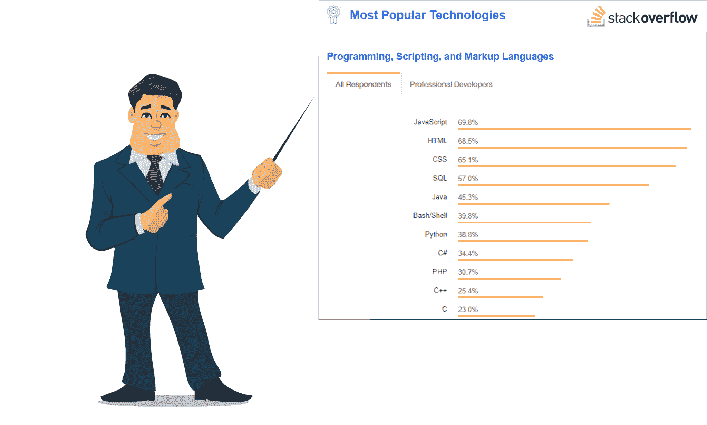**

***什么是 JavaScript–stack overflow stats***

**目前，我们有上百种编程语言，而且每天都有新的语言被创造出来。其中有一些强大的 语言 给市场带来了巨大的变化，JavaScript 就是其中之一。**

**JavaScript 一直在流行编程语言排行榜上。 根据 StackOverflow 的数据，JavaScript 连续第六年保持最受欢迎和最常用的编程语言。要了解更多关于 Javascript 的知识，今天就来看看这个[全栈开发课程](https://www.edureka.co/masters-program/full-stack-developer-training)，**

## ****JavaScript 能做什么？****

***   JavaScript 主要以创建漂亮的网页&应用而闻名。这方面的一个例子是谷歌地图。如果你想探索一个特定的地图，你所要做的就是用鼠标点击和拖动。什么样的语言可以做到这一点？你猜对了！是 JavaScript。*   智能手表中也可以使用 JavaScript。这方面的一个例子是广受欢迎的智能手表制造商 Pebble。Pebble 创建了 Pebble.js，这是一个小型 JavaScript 框架，允许开发人员用 JavaScript 为 Pebble 系列手表创建应用程序。**

**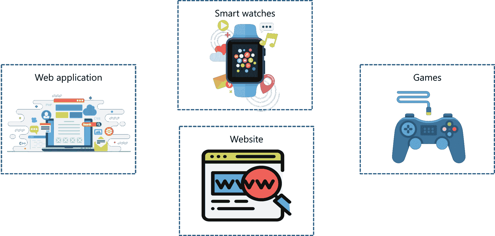**

***什么是 JavaScript——JavaScript 的应用***

***   谷歌、脸书、网飞、亚马逊等最受欢迎的网站都利用了 JavaScript 来建立自己的网站。*   在移动应用、数字艺术、网络服务器和服务器应用中，JavaScript 也被用于制作游戏。很多开发者正在使用 JavaScript 开发小规模的游戏和应用。**

**JavaScript 流行的一个主要原因是 JavaScript 框架。下面简单介绍一下最流行的 JavaScript 框架:**

**1。[**AngularJS**](https://angular.io/)是 Google 的 web 开发框架，为快速应用开发提供了一套现代化的开发和设计特性。**

**2。[**react js**](https://reactjs.org/)是另一个主要由脸书维护的顶级 JavaScript 框架，它在脸书和 Instagram 的用户界面后面，炫耀它在维护这种高流量应用方面的效率。**

**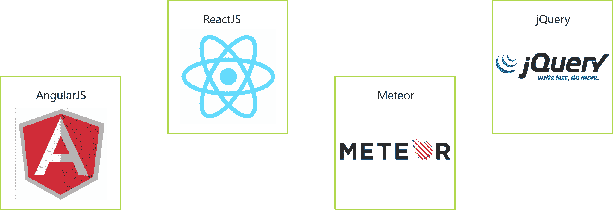**

***什么是 JavaScript——JavaScript 框架***

**3。[](https://www.meteor.com/)主要用于提供后端开发。在后端使用 JavaScript 来节省时间和积累专业知识是 Meteor 背后的主要思想之一。**

**4。[**jQuery**](https://www.edureka.co/blog/jquery-tutorial/)当你想扩展你的网站，让它更具互动性的时候可以使用。像 Google、WordPress 和 IBM 这样的公司都依赖 jQuery。**

**想成为一名认证网页开发者？ [<button>现在报名</button>](https://www.edureka.co/masters-program/full-stack-developer-training)** **## **大图:HTML，CSS&JavaScript**

熟悉 JavaScript 的人都知道，它和 HTML、CSS 有关系。但是这三者之间有什么关系呢？我来打个比方解释一下。

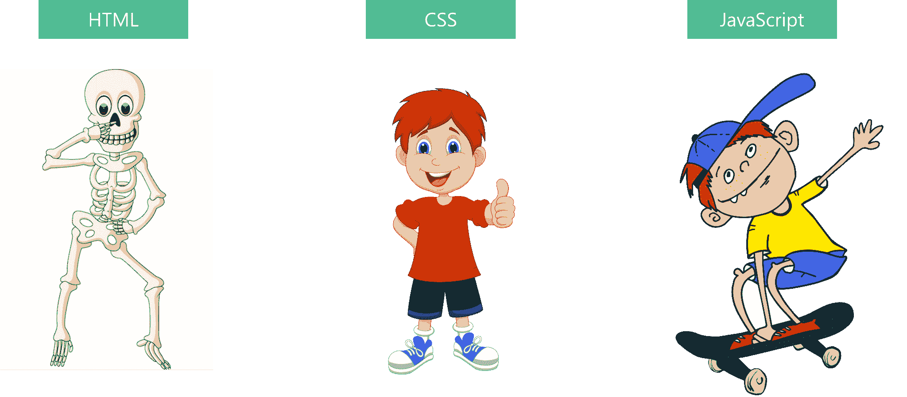

*什么是 JavaScript——HTML，CSS 和 JavaScript*

把 HTML(超文本标记语言)想象成网络的骨架。它用于显示网页。

另一方面，CSS 就像我们的衣服。我们穿上时髦的衣服，以便看起来更好。同样，网络也很时尚。它使用 CSS(代表级联样式表)来设计样式。

然后是将生活融入网页的 JavaScript。就像孩子们如何使用滑板一样，网络也在 JavaScript 的帮助下运动。

## **JavaScript 的好处**

这么多开发人员喜欢 JavaScript 肯定是有原因的。嗯，使用 JavaScript 开发 web 应用程序有几个好处，这里有几个好处:


**简单易学，实现简单。**它是一种弱类型编程语言，不像 Java 和 C++这样的强类型编程语言，它们有严格的编码规则。

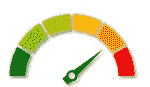

**在当今世界，速度是最重要的**因为 JavaScript 主要是一种客户端编程语言，所以速度非常快，因为任何代码都可以立即运行，而不必联系服务器并等待答案。


**丰富的框架集**像 AngularJS、ReactJS 被用来构建 web 应用程序和执行不同的任务。

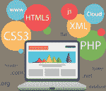

**建立互动网站:**我们都会被设计精美的网站所吸引，而 JavaScript 正是这些吸引人的网站和应用程序背后的原因。

 ** JavaScript 是一种不需要编译器的解释型语言**，因为网页解释 JavaScript。你所需要的只是一个像谷歌 Chrome 或 Internet Explorer 这样的浏览器，你可以在浏览器中做各种事情。

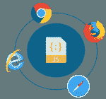**JavaScript 是平台无关的**，它被所有主流浏览器支持，如 Internet Explorer、Google Chrome、Mozilla Firefox、Safari 等。

在这个什么是 JavaScript 的博客中，我们将讲述 JavaScript 的以下基本原理

## **变量**

变量是一个存储单元的名称，该存储单元充当临时存储数据的容器。它们只不过是用来存储值的保留内存位置。

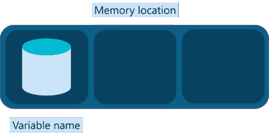

*什么是 JavaScript–变量*

要在 JavaScript 中声明变量，请使用“let”关键字。例如:

```
let age;
age=22;

```

在上面的例子中，我通过使用“let”关键字声明了一个变量“age ”,然后在其中存储了一个值(22)。因此，这里将一个内存位置分配给“年龄”变量，它包含一个值，即“22”。

## **常数**

常量是在执行期间不会改变的固定值。【T2

要在 JavaScript 中声明常量，请使用“const”关键字。比如:

```

const mybirthday; 
mybirthday='3rd August'; 

```

## **数据类型**

您可以为变量分配不同类型的值，如数字或字符串。在 JavaScript 中，有两类数据类型:

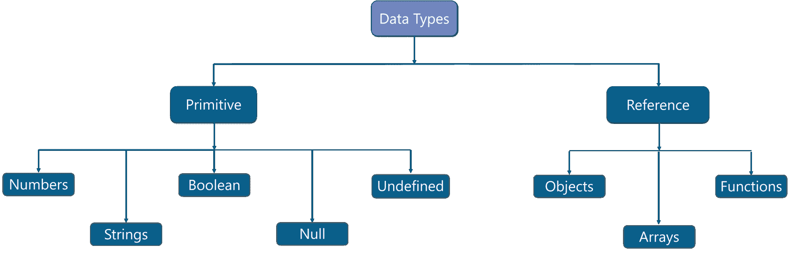

*什么是 JavaScript–数据类型*

## **物体**

对象是具有属性和类型的独立实体，它很像现实生活中的对象。例如，考虑一个女孩，她的名字是艾米丽，年龄是 22 岁，眼睛颜色是棕色的。在这个例子中，对象是女孩，她的名字、年龄和眼睛颜色是她的属性。


*什么是 JavaScript–Objects 示例*

对象也是变量，但是它们包含许多值，所以不用为每个属性声明不同的变量，你可以声明一个存储所有这些属性的对象。

使用‘let’关键字在 JavaScript 中声明一个对象，并确保使用花括号，使得所有属性-值对都在花括号中定义。比如:

```
let girl= {
name: 'Emily',
age: 22,
eyeColour: 'Brown'
};

```

在上面的例子中，我声明了一个名为“女孩”的对象，它有 3 个属性(姓名、年龄、眼睛颜色)和值(艾米丽，22 岁，棕色)。

## **阵列**

数组是一种数据结构，它包含一系列元素，这些元素在一个变量中存储多个值。

例如，让我们考虑一个场景，你去购物购买美术用品。您购买的商品列表可以放入一个数组中。

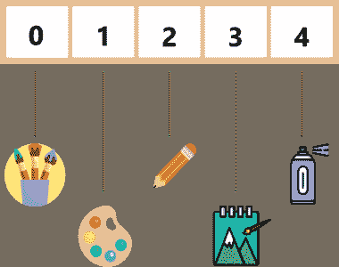

*什么是 JavaScript–数组示例*

若要在 JavaScript 中声明数组，请使用带方括号的“let”关键字，并且所有数组元素都必须包含在方括号中。比如:

```
let shopping=[];
shopping=['paintBrush','sprayPaint','waterColours','canvas'];

```

在上面的例子中，我声明了一个名为‘shopping’的数组，并在其中添加了四个元素。

同样，数组元素从零开始编号。例如，这是你如何访问第一个数组元素:

```
shopping[0];

```

## **功能**

功能是一组有组织的、可重用的代码，用于执行单个相关的动作。

让我们创建一个计算两个数乘积的函数。

要在 JavaScript 中声明函数，请使用“function”关键字。比如:

```
function product(a, b) {
return a*b;
}

```

在上面的例子中，我已经声明了一个名为“product”的函数，并向该函数传递了两个参数，“a”和“b ”,这两个变量的乘积由该函数返回。现在，为了调用一个函数并向这些参数传递一个值，你必须遵循下面的语法:

```
product(8,2);

```

在上面的代码片段中，我用一组值来调用产品函数(8 & 2)。这些是变量 a 和 b 的值，它们被称为函数的参数。

## **条件语句——如果**

条件语句是满足一定条件时执行的一组规则。仅当指定的条件为真时，才使用“if”语句来执行代码块。


*什么是 JavaScript–if 流程图*

若要在 JavaScript 中声明 if 语句，请使用“if”关键字。语法是:

```
if(condition) {
statement;
}

```

现在我们来看一个例子:

```
let numbers=[1,2,1,2,3,2,3,1];
if(numbers[0]==numbers[2]) {
console.log('Correct!');
}

```

在上面的例子中，我定义了一个数字数组，然后定义了一个 if 块。在这个块中有一个条件和一个语句。条件是'(numbers[0]==numbers[2])'，语句是' console.log('正确！')'.如果条件得到满足，那么只有该语句才会被执行。

## **条件语句- Else if**

Else 语句用于在相同条件为假的情况下执行一段代码。

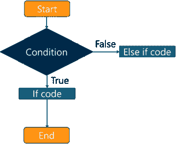

*什么是 JavaScript–Else-if 流程图*

语法为:

```
if(condition) {
statement a;
}
else (condition) {
statement b;
}

```

现在让我们看一个例子:

```
let numbers=[1,2,1,2,3,2,3,1];
if(numbers[0]==numbers[4] {
console.log("Correct!");
}
else {
console.log("Wrong, please try again");
}

```

在上面的例子中，我定义了一个 if 块和一个 else 块。因此，如果 if 块中的条件为假，则执行 else 块。亲自尝试一下，看看你会得到什么！

## **循环**

循环用于重复一个特定的程序块，直到满足某个结束条件。JavaScript 中有三类循环:

1.  while 循环
2.  do while 循环
3.  为循环

## **而循环**

当**条件为真**时，执行循环内的代码。

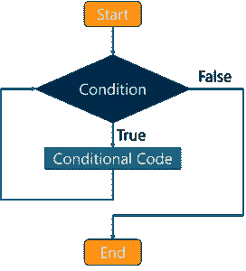

*什么是 JavaScript–while 循环流程图*

语法为:

```
while(condition) {
loop code;
}

```

现在我们来看一个例子:

```
let i=0;
while(i < 5) {
console.log("The number is " +i);
i++;
}

```

在上面的例子中，我定义了一个 while 循环，其中我设置了一个条件。只要条件成立，就会执行 while 循环。亲自尝试一下，看看你会得到什么！

## **边做边循环**

该循环将**首先执行代码**，然后检查条件，当条件为真时，重复执行。

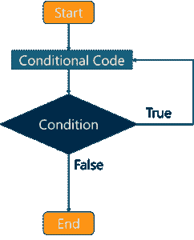

*什么是 JavaScript–Do while 循环流程图*

参考语法更好的理解:

```
do {
loop code;
} while(condition);

```

该循环在检查条件是否为真之前执行一次代码块，然后只要条件为真，它就会重复该循环。

现在我们来看一个例子:

```
do {
console.log("The number is " +i);
i++;
}
while(i > 5);

```

以上代码与 while 循环代码相似，只是首先执行 do 循环中的代码块，然后才检查 while 循环中的条件。如果条件成立，则再次执行 do 循环。

## **为循环**

当给定条件为真时，for 循环重复执行循环代码。它在执行循环体之前测试条件。

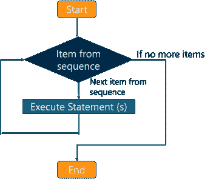

*什么是 JavaScript–for 循环流程图*

语法为:

```
for(begin; condition; step) {
loop code;
}

```

在上面的语法中:

*   **begin** 语句在循环代码执行前执行一次
*   **条件**定义了执行循环代码的条件
*   **步骤**语句在每次执行完代码块后执行

例如:

```
for (i=0;i<5;i++) {
console.log("The number is " +i);
}

```

在上面的例子中，我定义了一个 for 循环，在这个循环中我定义了 begin、condition 和 step 语句。开始语句是“i=0”。执行 begin 语句后，for 循环中的代码执行一次。接下来，检查条件，如果‘I<5’则执行循环中的代码。之后，执行最后一步语句(i++)。试试这个，看看你会得到什么！

## **开关案例**

switch 语句用于根据不同的条件执行不同的动作。

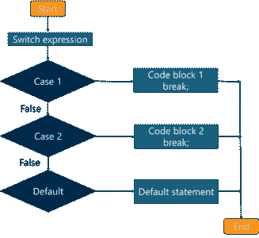

*什么是 JavaScript-Switch 案例流程图*

让我们看看 switch case 的语法:

```
switch(expression) {
case 1:
code block 1
break;
case 2:
code block 2
break;
default:
code block 3
break;
}

```

它是如何工作的？

*   开关表达式计算一次
*   表达式的值与每种情况下的值进行比较
*   如果存在匹配，则执行相关的代码块

让我们用一个例子来试试这个:

```
let games='football';
switch(games) {
case "throwball":
console.log("I dislike throwball!");
break;
case "football":
console.log("I love football!");
break;
case "cricket":
console.log("I'm a huge cricket fan!");
break;
default:
console.log("I like other games");
break;
}

```

在上面的例子中，开关表达式是“游戏”,游戏值是“足球”。将“游戏”的价值与每个案例的价值进行比较。在这个例子中，它被比作“投掷球”、“板球”和“足球”。“games”的值与“football”的大小写匹配，因此执行“football”大小写中的代码。亲自尝试一下，看看你会得到什么！

到此，我们结束了这篇博客。我希望你觉得这篇博客内容丰富，也希望你对 JavaScript 有一个基本的了解。在我的下一篇关于 JavaScript 的博客中，我将深入介绍一些概念，敬请关注。

另外，如果你想尽快开始，请查看我们关于 JavaScript 基础的视频 如果你有任何疑问，不要忘记留下评论，也请告诉我们你是否希望我们在 JavaScript 上创建更多内容。我们在听！

## **JavaScript 初学者教程| JavaScript 编程教程| edu reka**


[//www.youtube.com/embed/J4UKL355sUo?rel=0&showinfo=0](//www.youtube.com/embed/J4UKL355sUo?rel=0&showinfo=0)

这个关于 JavaScript 的 Edureka 教程视频用例子解释了 JavaScript 的所有基础知识。它还解释了 JavaScript 的各种特性和应用。

想成为认证全栈 Web 开发者？ [<button>现在报名参加直播课</button>](https://www.edureka.co/masters-program/full-stack-developer-training)**