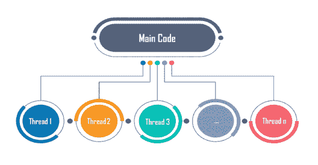

# Python 中什么是多线程，如何实现？

> 原文：<https://www.edureka.co/blog/what-is-mutithreading/>

时间是生命中最关键的因素。由于其重要性，编程领域提供了各种技巧和技术，可以显著地帮助您减少时间消耗，从而提高性能。其中一种方法是 Python 中的多线程，这是 [Python 认证培训](https://www.edureka.co/data-science-python-certification-course)中涵盖的最重要的概念之一。

这里是本文涵盖的所有专业的快速总结:

[Python 中的](#multitasking) [](#multitasking)[多任务](#multitasking) [是什么？](#multitasking) [什么是线程？](#thread)[python 中的多线程是什么？](#multithreading)[Python 中什么时候使用多线程？](#usemt) [如何在 Python 中实现多线程？](#achieve) [如何用 Python 创建线程？](#create)

*   [没有创建类](#without%20class)
*   [通过扩展线程类](#extending)
*   [未扩展线程类](#withoutextending)

[在 Python 中使用多线程的优势](#advantages)

首先，在我们开始学习 Python 中的多线程之前，让我们先试着理解多任务。

## **Python 中的多任务是什么？**

一般来说，多任务处理是指同时执行多项任务的能力。用专业术语来说，多任务指的是操作系统同时执行不同任务的能力。*例如*，你在电脑上下载东西的同时还可以听歌、玩游戏等。所有这些任务都由同一操作系统同步执行。这就是多任务处理，不仅能帮你节省时间，还能提高效率。

操作系统中有两种类型的多任务处理:

*   基于流程的
*   基于线程的

在本文中，你将了解到基于线程的多任务或 ***多线程**。*

## **什么是线程？**

线程基本上是一个 ***独立*** 的执行流。单个进程可以由多个线程组成。程序中的每个线程都执行特定的任务。*例如，*当你在电脑上玩一个游戏，比如说 FIFA，游戏整体上是一个单独的进程*，*但是它由几个线程组成，负责播放音乐，接收用户输入，同步运行对手，等等。所有这些都是独立的线程，负责在同一个程序中执行这些不同的任务。

每个进程都有一个始终运行的线程。这是主线。这个主线程实际上创建了子线程对象。子线程也由主线程发起。我将在本文中进一步向您展示如何检查当前正在运行的线程。

至此，我希望你已经清楚地了解了什么是线程。继续，让我们看看什么是 Python 中的多线程。

**Python 中什么时候使用多线程？**

多线程对于节省时间和提高性能非常有用，但并不是处处适用。 在前面的 FIFA 例子中，音乐线程独立于接受你输入的线程，接受你输入的线程独立于运行你对手的线程。这些线程独立运行，因为它们不相互依赖。

因此，只有当单个线程之间不存在依赖关系时，才能使用多线程。

这篇文章进一步展示了如何在 Python 中实现多线程。

## **如何在 Python 中实现多线程？**

Python 中的多线程可以通过导入 ***线程*** 模块来实现。

在导入这个模块之前，你必须安装它。要在您的 anaconda 环境中安装它，请在 anaconda 提示符下执行以下命令:

康达安装-康达锻造 tbb

成功安装后，您可以使用以下任何命令导入线程模块:

```
import threading
from threading import *

```

现在你已经安装了线程模块，让我们继续前进，用 Python 来做多线程。

## **如何用 Python 创建线程？**

Python 中的线程可以通过三种方式创建:

1.  不创建类
2.  通过扩展线程类
3.  不扩展线程类

### **没有创建类**

Python 中的多线程可以在不创建类的情况下完成。这里有一个例子来说明这一点:

**例如:**

```
from threading import *
print(current_thread().getName())
def mt():
    print("Child Thread")
child=Thread(target=mt)
child.start()
print("Executing thread name :",current_thread().getName())

```

**输出:**

```
MainThread
Child Thread
Executing thread name : MainThread
```

上面的输出显示第一个出现的线程是主线程。这个主线程随后创建一个执行该函数的子线程，然后主线程再次执行最终的打印语句。

现在让我们继续，看看如何通过扩展 Thread 类在 python 中实现多线程。

### **通过扩展线程类:**

当通过扩展线程类来创建子类时，子类代表一个新线程正在执行某个任务。扩展 Thread 类时，子类只能重写两个方法，即 __init__()方法和 run()方法。除了这两个方法之外，没有其他方法可以被重写。

下面是一个如何扩展线程类来创建线程的例子:

**例如:**

```
import threading
import time
class mythread(threading.Thread):
    def run(self):
        for x in range(7):
        print("Hi from child")
a = mythread()
a.start()
a.join()
print("Bye from",current_thread().getName())

```

**输出:** 嗨从子 嗨从子 嗨从子 嗨从子 嗨从子 嗨从子 嗨从子 拜拜从主线程

上面的例子显示了类 myclass 继承了线程类，而子类 myclass 覆盖了 run 方法。默认情况下，任何类函数的第一个参数都需要是 self，它是指向当前对象的指针。输出显示子线程执行 run()方法，主线程等待子线程的执行完成。这是因为 join()函数，它让主线程等待子线程完成。

这种创建线程的方法是最优选的方法，因为它是标准方法。但是如果您想在不继承或扩展 Thread 类的情况下创建线程，您可以用下面的方式来实现。

### **无延伸螺纹类**

创建一个线程而不扩展线程类，可以做如下: **例如:**

```
from threading import *
class ex:
def myfunc(self): #self necessary as first parameter in a class func
    for x in range(7):
        print("Child")
myobj=ex()
thread1=Thread(target=myobj.myfunc)
thread1.start()
thread1.join()
print("done")

```

**输出:**

子子子子子子子搞定

The child thread executes myfunc after which the main thread executes the last print statement.

## **利用线程的优势**

多线程有许多优点，其中一些如下:

*   更好地利用资源
*   简化代码
*   允许各种任务同时并行发生
*   减少时间消耗或响应时间，从而提高性能。

这里有一个例子来检查在 python 中使用和不使用多线程的情况下代码执行需要多长时间:

```
Example:
```

```
import time
def sqr(n):
    for x in n:
        time.sleep(1)
        x%2
def cube(n):
    for x in n:
        time.sleep(1)
        x%3
n=[1,2,3,4,5,6,7,8]
s=time.time()
sqr(n)
cube(n)
e=time.time()
print(e-s)

```

**输出:**

```
16.042309284210205

```

以上是不使用线程执行程序所花费的输出时间。现在让我们使用线程，看看同一个程序会发生什么:

**例如:**

```
import threading
from threading import *
import time
def sqr(n):
    for x in n:
        time.sleep(1)
        print('Remainder after dividing by 2',x%2)
def cube(n):
    for x in n:
        time.sleep(1)
        print('Remainder after dividing by 3',x%3)
n=[1,2,3,4,5,6,7,8]
start=time.time()
t1=Thread(target=sqr,args=(n,))
t2=Thread(target=cube,args=(n,))
t1.start()
time.sleep(1)
t2.start()
t1.join()
t2.join()
end=time.time()
print(end-start)

```

**Output:** 9.040220737457275

上面的输出清楚地表明，与不使用线程的情况下执行相同的程序相比，使用线程所花费的时间要少得多。

我希望你清楚这篇文章中与 Python 中多线程相关的概念。确保尽可能多的练习，因为这是编程中最重要的概念之一。

*有问题吗？请在这个“Python 中的多线程”博客的评论部分提到它，我们* *将* *尽快回复您。*

*要深入了解 Python 及其各种应用，您可以注册参加实时 **[Python 在线培训](https://www.edureka.co/data-science-python-certification-course)** ，该培训提供全天候支持和终身访问。*