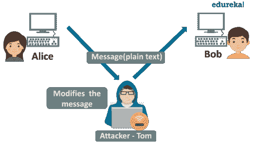
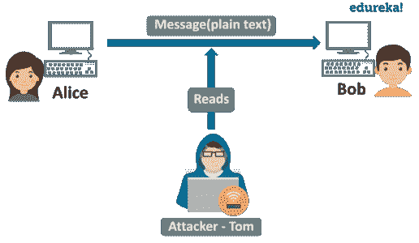

# 什么是网络安全:网络安全介绍

> 原文：<https://www.edureka.co/blog/what-is-network-security/>

我们生活在一个信息时代。如今的企业比以往任何时候都更加数字化，随着技术的进步，组织的安全态势也必须得到增强。现在，随着许多设备通过有线、无线或蜂窝网络相互通信，网络安全是一个重要的概念。在本文中，我们将探讨什么是网络安全及其关键特性。

让我们来看看“什么是网络安全？”中涵盖的主题 文章:

1.  [什么是网络安全？](#NetworkSecurity)
2.  [什么是网络安全攻击？](#NetworkAttack)
3.  [网络安全类型](#NetworkSecurityTypes)
4.  [网络安全岗位](#NetworkSecurityJobs)

## **什么是网络安全？**

***网络安全是采取预防措施保护底层网络基础设施免受未授权访问、误用、故障、修改、破坏或不当泄露的过程。***

毫无疑问，互联网已经成为我们生活的一个重要部分。当今这一代的许多人在他们的职业、社交和个人活动中依赖于互联网。但是你确定你的网络安全吗？

有很多人试图破坏我们联网的电脑，侵犯我们的隐私，使互联网服务无法。鉴于现有攻击的频率和多样性以及未来新的和更具破坏性的攻击的威胁，网络安全已成为网络安全领域的中心话题。实施网络安全措施允许计算机、用户和程序在安全的环境中执行其允许的关键功能。

### **如何才能保证网络安全？**

我们必须确保密码在任何地方都是强而复杂的——在网络内部也是如此，而不仅仅是在一个组织内的个人计算机上。这些密码不能是简单的、默认的和容易猜到的。这个简单的步骤对保护您的网络大有帮助。

### **为什么安全性如此重要？**

信息安全部门扮演着重要角色，例如:

*   该组织不受任何阻碍地运作的能力
*   支持在组织的 IT 系统上实施的应用程序的安全运行
*   保护组织收集的数据及其用途

### **网络安全有哪些不同的类型？**

*   访问控制
*   应用程序安全性
*   防火墙
*   虚拟专用网络
*   行为分析
*   无线安全
*   入侵防御系统

上面提到的话题将在本博客的后面详细讨论。

浏览我们的[道德黑客课程](https://www.edureka.co/ceh-ethical-hacking-certification-course)，探索更多关于道德黑客的知识。本课程将向您传授黑客使用的最新黑客技术、工具和方法。

现在我们知道了什么是网络安全，让我们来看看两大类网络攻击。

## **网络安全|网络安全入门|爱德华卡**

[//www.youtube.com/embed/6Jubl1UnJTE?rel=0&showinfo=0](//www.youtube.com/embed/6Jubl1UnJTE?rel=0&showinfo=0)

## **什么是网络安全攻击？**

A *网络攻击* 可定义为任何用于恶意企图危害网络安全的方法、过程或手段。网络安全是在给定的网络基础设施上防止网络攻击的过程，但攻击者使用的技术和方法进一步区分攻击是主动网络攻击、被动类型攻击还是两者的某种组合。

让我们考虑一个简单的网络攻击示例，以了解主动攻击和被动攻击的区别。

### **主动攻击**

*主动攻击是指攻击者试图对目标上的数据或传输到目标* ***的数据进行更改的网络利用。***

认识一下爱丽丝和鲍勃。爱丽丝想和鲍勃交流，但是距离是个问题。因此，Alice 通过一个不安全的网络向 Bob 发送了一封电子邮件。还有另一个人，Tom，他与 Alice 和 Bob 在同一个网络中。现在，由于数据流对网络上的每个人都是开放的，Tom 修改了授权消息的某些部分，以产生未授权的效果。例如，意思为“允许 BOB 读取机密文件 X”的消息被修改为“允许 Smith 读取机密文件 X”。

主动网络攻击通常是侵略性的、明目张胆的攻击，当攻击发生时，受害者会立即意识到。主动攻击本质上是高度恶意的，通常会锁定用户、破坏内存或文件，或者强行访问目标系统或网络。

### **被动攻击**

被动攻击是一种网络攻击，在这种攻击中，系统会受到监控，有时还会被扫描以发现开放的端口和漏洞，但不会影响系统资源。

让我们考虑一下我们之前看到的例子:

爱丽丝通过一个不安全的网络向鲍勃发送了一封电子邮件。Tom 与 Alice 和 Bob 在同一个网络中，他监控 Alice 和 Bob 之间的数据传输。假设，Alice 以纯文本形式向 Bob 发送了一些敏感信息，如银行帐户详细信息。Tom 可以轻松访问这些数据，并将这些数据用于恶意目的。

因此，被动攻击的目的是获取对计算机系统或网络的访问权，并在不被发现的情况下收集数据。

因此，网络安全包括实施不同的硬件和软件技术来保护底层网络架构。有了适当的网络安全措施，您可以在新出现的威胁渗透到您的网络并危及您的数据之前检测到它们。

## **网络安全有哪些不同的类型？**

网络安全系统有许多组件，它们协同工作来改善您的安全状况。下面讨论最常见的网络安全组件。

### **门禁**

为了阻止潜在的攻击者，您应该能够阻止未经授权的用户和设备访问您的网络。被允许访问网络的用户应该只能使用他们获得授权的资源集。

### **应用安全**

应用安全包括硬件、软件和流程，可用于跟踪和锁定攻击者用来渗透您网络的应用漏洞。

### **防火墙**

防火墙是一种充当看门人的设备或服务，决定什么进入和退出网络。它们使用一组定义好的规则来允许或阻止流量。防火墙可以是硬件、软件或两者兼而有之。

虚拟专用网通常通过互联网对从端点到网络的连接进行加密。通过这种方式，它可以验证设备和安全网络之间的通信，从而在开放的互联网上创建一个安全、加密的“隧道”。

### **行为分析**

您应该知道正常的网络行为是什么样的，这样您就可以在异常或网络违规发生时发现它们。行为分析工具会自动识别偏离常规的活动。

### 无线安全

无线网络不如有线网络安全。网络犯罪分子越来越多地瞄准移动设备和应用程序。因此，您需要控制哪些设备可以访问您的网络。

### **入侵防御系统**

这些系统通常通过将网络活动特征与已知攻击技术的数据库相关联来扫描网络流量，以识别和阻止攻击。

以上是实现网络安全的一些方法。除此之外，您的工具包中还需要各种软件和硬件工具来确保网络安全，它们是:

*   防火墙
*   包匠
*   网络扫描仪
*   数据包嗅探器
*   入侵检测系统
*   渗透测试软件

网络安全对整体网络安全至关重要，因为网络是抵御外部攻击的重要防线。鉴于几乎所有的数据和应用程序都连接到网络，强大的网络安全性可以防止数据泄露。

## **网络安全岗位**

随着 WannaCry 和 Adylkuzz 等流行网络攻击的成功被广泛报道，公司比以往任何时候都更愿意聘请高素质的网络安全专业人员来保护其最脆弱的资产。网络安全分析师和网络安全工程师被列为薪酬最高的两种网络安全工作。网络安全工程师更有可能构建安全系统，而网络安全分析师更有可能负责扫描网络，寻找可能的漏洞。这两个职位的平均收入在 9 万美元到 15 万美元之间。

*如果您希望学习网络安全并在网络安全领域建立丰富多彩的职业生涯，那么请查看我们的 [**网络安全认证培训**](https://www.edureka.co/cybersecurity-certification-training) ，它附带有讲师指导的现场培训和真实项目体验。本培训将帮助您深入了解网络安全，并帮助您掌握该主题。*

*您还可以看看我们新推出的关于 [**CompTIA Security+**](https://www.edureka.co/comptia-security-plus-certification-training) 的课程，这是 Edureka & CompTIA Security+之间首次正式合作。它为您提供了一个获得全球认证的机会，该认证侧重于安全和网络管理员不可或缺的核心网络安全技能。*

通过 Edureka 的[网络安全硕士课程](https://www.edureka.co/masters-program/cybersecurity-training)项目 以正确的方式学习网络安全，保护世界上最大的公司免受网络钓鱼者、黑客和网络攻击。

*有问题吗？请在“什么是网络安全？”我们会回复你的。*