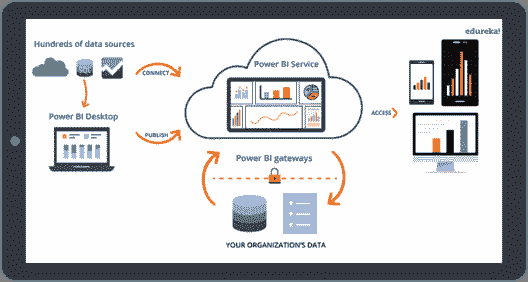
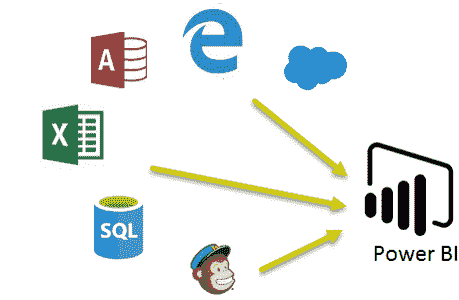
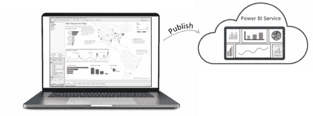
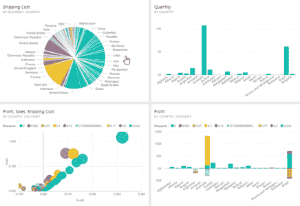
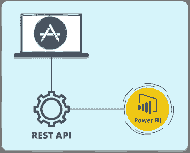
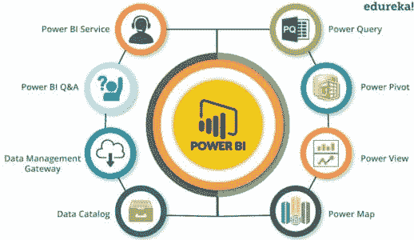

# 什么是能量 BI:介绍、工作原理及其重要性

> 原文：<https://www.edureka.co/blog/what-is-power-bi/>

为了做出明智的商业决策，从数据中提取相关信息并以清晰的方式呈现出来至关重要。微软的 Power BI 套件旨在将您的数据快速转化为有用的信息。这篇“**什么是 Power BI** ”的博客解释了你需要知道的关于 Power BI 的一切。

在这个博客中，你将了解到以下内容:

*   [**为什么权力 BI 很重要？**](#whypowerbi)
*   [**什么是权力 BI？**](#whatispowerbi)
*   [**用异能毕**](#processes)
*   [**你想成为一个功毕的杰出人物吗？**](#crackerjack)
*   [**公司用电 BI**](#companies)
*   [**比较领先的分析工具**](#comparison)

感兴趣？所以，在我告诉你什么是力量匕之前，我们先来看看它的重要性 &为什么组织都在用 [***力量匕教程***](https://www.edureka.co/power-bi-certification-training) 猎取专业人士。

## **为什么权力 BI 很重要？**

Power BI 之所以是如此强大的 BI 工具，有几个原因。

*   Power BI 基于市场上最佳 BI 产品的惯例而构建。我说的是[***SQL Server Analysis Services(SSAS)***](https://www.edureka.co/blog/sql-server-tutorial)和[***Microsoft Excel***](https://www.edureka.co/blog/advanced-excel-tutorial/)。
*   除了传统，Power BI 正在使用最新技术进行构建/重建，如[***云计算***](https://www.edureka.co/blog/videos/what-is-cloud-computing/) 、列存储数据库&智能手机移动应用
*   微软已经为开源贡献开放了自定义视觉画廊，为社区增加了价值。
*   自助服务 ***商业智能*** 的趋势表明了微软在这一领域的领先地位

好了，现在你知道了力量 BI 在 ***分析*** 领域的重要性，让我们来了解一下什么是力量 BI？

## **什么是权力 BI？**

微软的 Power BI 是一种基于云的商业分析服务，用于分析和可视化数据。

Microsoft Power BI 为您提供了一个平台，让您在报告和分析方面更具生产力和创造力。 从 的数据中鼓捣出有用的信息和 [***创造视觉-报表***](https://www.edureka.co/blog/popular-power-bi-charts/) 是一个多步骤的过程，下面我来简单介绍一下步骤。在此之前，你可以看看下面的视频，了解什么是功率 BI。

[https://www.youtube.com/embed/KPc6950u0TE](https://www.youtube.com/embed/KPc6950u0TE)

## **与功匕**

通过一系列步骤从数据到洞察力再到选项。

### **第一步。连接到您的数据**

Power BI 可让您连接到各种数据源。并且，您可以使用 **Power BI 桌面**或 **Power BI** **服务**来连接您的数据。你可以选择**将**文件导入 Power BI 或者**上传**你的文件。

**图 1。将各种来源的数据连接到 Power BI**

### **步** **2。数据的预格式化:**

一旦你的数据被加载，你就可以根据你的需要 塑造数据。这种对数据的整形或转换包括重命名列或表格、将文本改为数字、删除行、 将第一行设置为标题等等。

**Fig 2\. Shaping or Transforming of data**

### **步** **3。数据建模:**

这一步基本上是用关系、计算、度量、层次等来增强数据，这些数据可用于发现业务洞察力。此外，您可以编写一个查询来增强数据，以实现更好的可视化和分析。

**图三。数据造型**

### **步** 4。 **数据可视化:**

这大概就是你摆弄数据和 [***可视化***](https://www.edureka.co/blog/power-bi-visuals/) 类型的步骤。借助各种可视化工具和自定义可视化图库，您可以有效地为您的组织创建令人惊叹的报表。因此，业务用户可以简单地混合数据，甚至不用编写一行代码。 *完全正确，就这么简单！！*

**Fig 4\. Visualizing your transformed data**

现在，假设您想要与您的组织共享这些分析报告。

### **步** **5。发布数据报表:**

使用 **Power BI Services** ，您可以安全地导出或发布报告，并设置自动数据刷新，为每个人提供近乎实时的趋势和指标分析。

**Fig 5\. Publish your reports using Power BI services**

借助实时 [***Power BI 仪表盘***](https://www.edureka.co/blog/power-bi-dashboard/) ，您可以 360 度全方位了解您的业务，并且可以即时检查您的业务何时需要您的关注。

Power BI 网关让您可以将[***SQL Server***](https://www.edureka.co/blog/sql-server-tutorial)数据库、分析服务和许多其他数据源连接到您的仪表板和报告门户。这些网关还支持您嵌入 Power BI 报告和仪表盘，为您提供统一的体验。

这是仪表板的样子:

敬畏了吗？让我给你增添更多的魅力，因为 Power BI 工具给了你更多。

### **获得与力量融合的匕**

为了更快地交付您的解决方案，您可以使用基于标准的 **REST API 将您的应用或服务与 Power BI 集成。**

### **随时随地做出商业决策**

无论您身在何处，使用 Windows 或 iOS 版 Power BI 移动应用程序，您都可以访问所有业务数据。

## ****

好了，现在我们已经了解了什么是能量 BI 及其过程，我觉得你应该问问自己

## **你想成为一个功毕的杰出人物吗？**

熟练掌握 Power BI 的以下组件:

*   **超级查询:**用于搜索、访问和转换公共和/或内部数据源。
*   **动力中枢**:用于内存分析的数据建模。
*   **Power View:** 使用 Power View 将数据分析、可视化、显示为交互式数据可视化。
*   **力量地图:**通过交互式地理可视化将数据带入生活。
*   **Power BI 服务:**共享可从内部和基于云的数据源刷新的数据视图和工作簿。
*   **Power BI Q & A:** 提出问题，用自然语言查询得到即时答案。
*   **数据管理网关:**通过使用该组件，您可以定期刷新数据，显示表格并查看数据馈送。
*   **数据目录**:使用数据目录轻松发现和重用查询。可以为搜索功能提供元数据。

现在，你已经知道了你需要掌握哪些技能，让我们进一步了解哪些领先的公司正在使用 Power BI。

## **公司用电 BI**

使用 Power BI 进行分析的公司有很多，这里仅举几个例子:

现在问题来了**为什么 Power BI 在市场上这么受欢迎？**

为了回答这个问题，我比较了三种领先的自助式商务智能工具，旨在让您直接获得数据所能提供的所有洞察。

## **比较领先的分析工具——Power BI vs Tableau vs QlikView**

| **指标** | **微软 Power BI** | **台式板** | **QlikView** |
| 提供免费版本 | ✔ | 一千 | ✔ |
| 移动版本 | ✔ | ✔ | ✔ |
| 时间点分析 | ✔ | ✔ | ✔ |
| 实时分析 | ✔ | ✔ | ✔ |
| 预测分析 | ✔ | ✔ | 一千 |
| 数据准备工具 | ✔ | ✔ | ✔ |
| 混合/连接/集成数据的工具 | ✔ | ✔ | ✔ |
| 语义查询/自然语言 | ✔ | 一千 | 一千 |
| 社交媒体分析 | ✔ | ✔ | ✔ |
| 可视化功能 | ✔ | ✔ | ✔ |
| 共享/协作工具 | ✔ | ✔ | ✔ |

我想现在很清楚为什么 Power BI 从其他 BI 工具中脱颖而出了。

所以不要等了，下载 ***Power BI 桌面*** 看看 Power BI 如何让您轻松整合数据、发现新见解并与他人分享。

*如果您想学习 Power BI 并在数据可视化或 BI 方面建立职业生涯，那么请查看我们在 **Bangalore** 的 [**Power BI 培训和在 Hyderabad**](https://www.edureka.co/power-bi-certification-training-bangalore) 的 **[Power BI 培训，这些培训带有讲师指导的现场培训和真实项目体验。本培训将帮助您深入了解 Power BI，并帮助您掌握该主题。](https://www.edureka.co/power-bi-certification-training-hyderabad)***

此外，如果您希望在商业智能领域建立职业生涯，我们的[商业智能课程](https://www.edureka.co/masters-program/business-intelligence-certification) 将帮助您挖掘这些数据，并增强整个组织的决策过程。

*有问题吗？请在“什么是 Power BI”的评论区提出来，我会回复你的。*