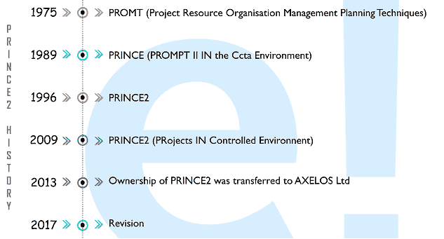
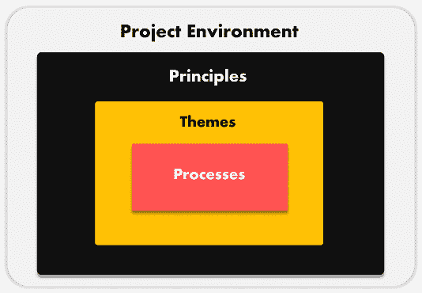

# PRINCE2 是什么，如何实现？

> 原文：<https://www.edureka.co/blog/what-is-prince2/>

无论行业类型或项目规模如何，您可能经常会发现项目经理建议实施 **[【王子 2】](https://www.edureka.co/prince2-certification-training)**作为项目管理方法，以便顺利执行和成功交付项目。通过这篇文章，我将让你全面了解什么是 PRINCE2 以及它 如何带来令人印象深刻的结果。

然而，如果你想超越这个博客，更深入地了解 PRINCE2，你绝对可以从 Edureka 的 [PRINCE2 课程](https://www.edureka.co/prince2-foundation-and-practitioner-certification-training)中学习。

以下是本文涵盖的主题:

*   [项目管理方法](#pmmethodologies)
*   [什么是 PRINCE2 ？](#whatisprince2)
*   [prince 2历史](#history)
*   [PRINCE2 元素——原则、主题和流程](#elements)

让我们开始吧。

## **项目管理方法**

当今的市场在不断发展。新的方法正在被创新和采用，而过时的方法正在被更好和更先进的方法所取代。在这个持续发展/进步的时代，组织内保持不变的是承担新项目的过程。交付成功项目的责任完全落在项目经理的肩上。

但是确保项目成功并满足客户满意度并不是一件容易的事情。在开始一个项目时，全球各地的项目经理经常会遇到各种各样的问题，比如模糊的客户规格和糟糕的组织结构。在少数情况下，项目资金和团队责任没有明确规定。这看起来可能是小问题，但是它们一起会导致巨大的不确定性，最终导致冲突和项目失败。那么，项目经理如何解决这一混乱局面呢？

这就是[项目管理方法](https://www.edureka.co/blog/project-management/)的用武之地。市场上有许多可用的方法。 每种方法都有自己的一套规则、流程、原则和实践。现在你需要实现哪种方法，将完全取决于你的项目的类型。如果您能够正确地识别和选择最佳方法，它将帮助您优化项目的时间和资源分配。

下面我列出了世界上最流行的 8 种项目管理方法:

1.  PRINCE2
2.  [【PMP】/PMBOK 向导](https://www.edureka.co/blog/pmp-exam-all-you-need-to-know/)
3.  [敏捷](https://www.edureka.co/blog/agile-project-management/)
4.  [Scrum](https://www.edureka.co/blog/agile-scrum-tutorial/)
5.  中的“T1”
6.  六个适马
7.  精益
8.  瀑布

在这篇文章中，我将只关注公主 2 。所以，让我们继续这篇文章，找出什么是 PRINCE2 。

## **什么是 PRINCE2** **？**

**PRINCE2** 代表**PR**objects**在 C** 受控 **E** 环境中。在全球 150 个国家拥有超过 100 万的认证从业者，PRINCE2 已经成为项目管理领域事实上的标准。无论行业类型或项目规模如何， [PRINCE2](https://www.edureka.co/blog/how-to-get-prince2-certified/) 都能为所有人带来令人印象深刻的成果。它是一种基于过程的方法，主要集中在组织上，并且从项目的开始到完成都有严格的控制。使用这种方法开发的项目通常从一个详细而全面的计划开始。它为项目提供了一个适当的结构，每个阶段都有明确的开始、中间和结束。它更注重产品的交付，而不是开展活动。一旦项目完成，所有的东西都被整齐地包装起来，所有的零碎东西都被处理好。

## **prince 2历史**

PRINCE2 最初基于 PROMPT，它代表项目资源组织管理计划技术。它是由 Simpact 系统有限公司于 1975 年开发的一种项目管理方法。1989 年，在 CCTA 环境中，意为 PROMPT II 的 PRINCE2 发布，毫不费力地取代了公共领域项目中的 PROMPT。直到 1996 年，PRINCE2 才作为通用项目管理方法发布。2009 年晚些时候，PRINCE2 的首字母缩略词被改为“受控环境中的项目”,方法上也有一些其他的重大变化。经过这次改版，PRINCE2 变得更加 简洁轻巧 。2013 年 7 月，PRINCE2 的所有权转移至[axe los Ltd](https://www.axelos.com/)。2017 年晚些时候，axe los Ltd发布了重大更新。根据此次更新，新指南现在更加关注可伸缩性和灵活性。

既然你已经知道了什么是公主，以及它保留了怎样的历史，那就让我们继续前进，了解它的核心元素吧。

## **王子 2 元素**

PRINCE2 由四个综合元素组成，分别是:

1.  7 项原则
2.  7 个主题
3.  7 个过程
4.  项目环境

任何一个项目，如果缺少以上任何一个要素的实现，都不会被认为是一个 PRINCE2 项目。在这里，原则将告诉我们为什么，而主题将负责什么，最后是 过程如何负责。

现在让我们逐一讨论这些元素:

**原则**

有 7 条指导原则可以确保你的项目完全基于[prince 2方法论](https://www.edureka.co/blog/interview-questions/prince2-interview-questions/)。如果你错过了其中的任何一个，你的项目将不会被认为是一个 prince 2项目。我列出了以下 7 条原则:

1.  **持续的商业合理性** :你的项目在生命周期的任何时候都应该有一个合理的执行和管理的理由。如果做不到这一点，它将被关闭。
2.  **吸取经验** :为了 PRINCE2 项目的成功执行，参与的团队必须经常寻找和借鉴历史数据。
3.  **明确的角色和职责** :在任何一个 PRINCE2 项目中，都必须构建一个合适的组织结构，其中必须有合适的人参与进来，他们的职责必须明确界定。
4.  分阶段管理:prince 2 方法倾向于将整个项目分成更小的阶段，以便更好、更有效地计划、监控和控制。
5.  **例外管理** :在你的 PRINCE2 项目中，参与人员应该被赋予足够的权限，这将有助于在项目环境中有效地工作。
6.  关注产品:prince 2 项目的主要关注点是产品定义、交付和质量要求。
7.  **定制以适应项目环境** :项目经理必须定制方法，以适应项目的环境、复杂性、规模、重要性、风险和能力。

现在让我们来了解一下《T2》的 7 个主题。

**主题**

在 PRINCE2 方法论中有 7 个主题描述了项目管理的各个方面。这些方面被用作整个项目的参考点，以达到预期的目标。

PRINCE2 帮助[项目经理](https://www.edureka.co/blog/interview-questions/top-30-project-management-interview-questions-2016/)在他们的项目中应用这些主题，提出每个主题的最低要求，并提供定制项目环境的具体指导。下面我列出了 PRINCE2 方法论的 7 个主题:

1.  **商业案例:** 在任何 PRINCE2 项目中，必须创建并维护商业案例，以记录商业合理性。
2.  组织 :这有助于清晰地定义项目团队每个成员的角色和职责。
3.  :规定了 PRINCE2 项目的质量要求和措施以及交付方式。
4.  **计划** :这包含了创建一个详细的项目计划所需的列表步骤和将要实施的主要技术。
5.  **风险** :这有助于识别潜在的风险、威胁和机会，这些风险、威胁和机会都可能对项目结果产生影响；积极或消极。
6.  **变更** :这指的是项目经理如何评估和应对项目运行过程中那些看不见的变更。
7.  **进度** :是指项目计划的持续可行性和执行情况，根据这些计划决定项目的继续。

最后，让我们来关注一下T2 的进程。

**流程**

在 PRINCE2 方法论中有 7 个过程，代表了项目生命周期中涉及的各个步骤。从最初的想法开始，直到项目结束，每个过程都提供了一个完整的建议活动、相关责任的清单，以及关于定制环境的适当指导。下面我列出了 七公主 2 流程:

1.  启动一个项目
2.  导演一个项目
3.  启动项目
4.  控制载物台
5.  管理产品交付
6.  管理阶段边界
7.  关闭项目

说到这里，我们来结束这篇关于什么是 PRINCE2 的文章。

*如果您找到了这篇“什么是 prince 2”**相关文章，* *请查看 Edureka 的 [PRINCE2 认证课程](https://www.edureka.co/prince2-foundation-and-practitioner-certification-training)* *，edu reka 是一家值得信赖的在线学习公司，拥有遍布全球的 25 万多名满意的学习者。*

*有问题吗？请在评论区提到它，我们会给你回复。或者，你可以访问浦那的 [PRINCE2 认证。](https://www.edureka.co/prince2-foundation-and-practitioner-certification-training-pune)*