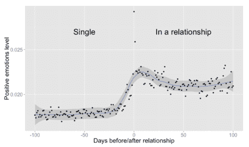
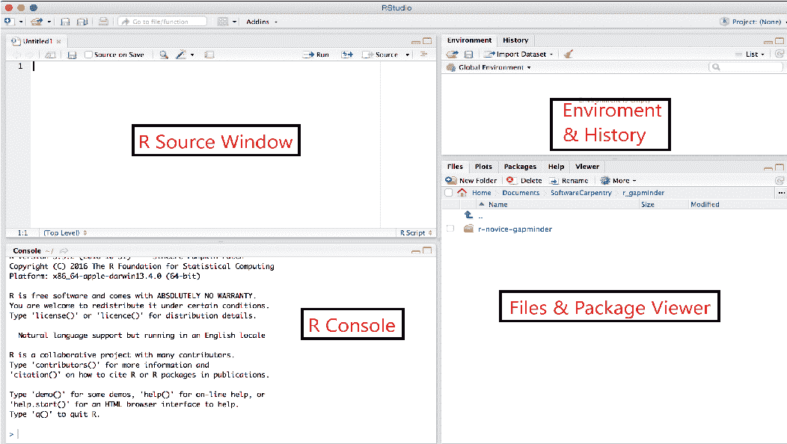
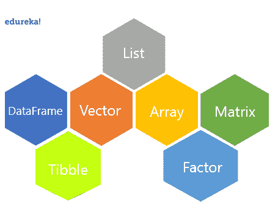
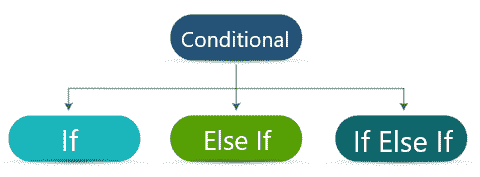
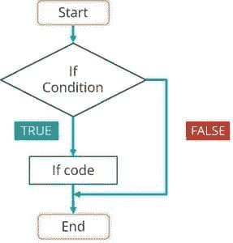
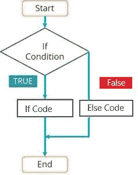
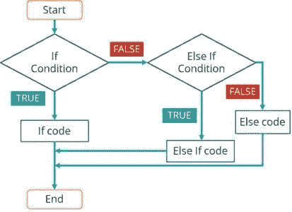
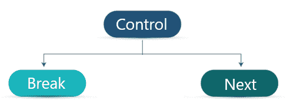
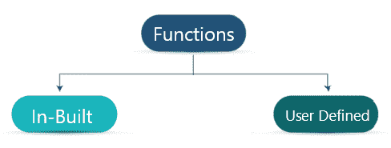
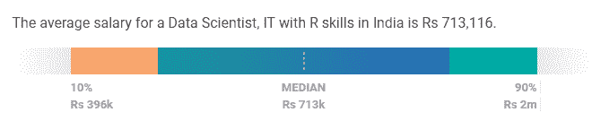

# “什么是 R 编程？”初学者指南

> 原文：<https://www.edureka.co/blog/what-is-r-programming/>

在数据科学领域有 272 万个工作岗位，R 和 [Python](https://www.edureka.co/blog/python-tutorial/) 是让处理数据变得更容易的两大支柱。在这篇关于**什么是 R 编程**的文章中，我将集中解释 R 的基本概念

I will cover the following topics in this blog:

*   [R 的特性](#features)
*   [安装 R & RStudio](#install)
*   [R 包&图书馆](#packageslibraries)
*   [变量&数据类型](#variables)
*   [操作员](#operator)
*   [条件语句](#conditional)
*   [循环语句](#loop)
*   [控制语句](#control)
*   [功能](#functions)
*   [R 编程的范围](#scope)

在博客的整个过程中，你将会被分派一些问题和建议来帮助你更好地理解这些概念。如果你有疑问，请在 [Edureka 社区](https://www.edureka.co/community/)发表，与其他学习者一起集思广益。

r 是一个用于统计和分析的开源工具。It 近年来因其在数据分析、数据科学和机器学习等领域的应用而变得流行。

在我们进入 R 编程的特性和基础之前，让我们看一个 R 在公司中使用的场景。

脸书是一家基于在线社交媒体的公司，旨在提高用户参与度，创建和分享帖子。它使用 R 进行**探索性分析**、**用户参与度分析等。脸书数据科学**集团发布了一系列[博客](https://www.facebook.com/data/posts/10152217010993415)，展示了对单身*和恋爱*用户在时间轴上发布的帖子的分析。下图显示了即将成为情侣的两个人在时间轴上交换帖子的平均数量。


上图显示了恋爱前后 100 天时间线帖子数量的稳定变化。下图显示了通过使用标签，表达积极情绪的词语，积极情绪在增加。



既然我们已经知道了什么是 R，让我们来看看 R 的特性

## **特征 R**

R 的特性有:

*   它是一个开源工具
*   r 支持面向对象以及过程化编程。
*   它为统计计算和软件开发提供了一个环境。
*   提供广泛的包和库
*   r 有一个很棒的社区，供人们分享和向专家学习
*   要连接的众多数据源。

让我们继续安装 R 和 RStudio。

## **安装 R & RStudio**

进入 R [下载](https://cran.r-project.org/bin/)页面，点击各自的 **OS，**点击 **base** 子文件夹。你会在页面上方找到可下载的李NK。运行**。exe** 文件，并通过按下一步和安装完成安装。当您运行**R Gui**app 时，开始会看到 **R 控制台**页面。

RStudio 是一个用于 R 编程的 IDE，可以作为桌面和服务器产品的开源商业软件获得。从 RStudio [下载](https://www.rstudio.com/products/rstudio/download/)页面下载 RStudio 桌面。在成功下载文件后，运行**。exe** 文件并完成安装。打开 RStudio 应用程序，您会看到整个窗口分为 4 个窗格，如下所示。

### ****

*   ### **源窗口**

    我们在这里添加源代码，并通过点击源代码按钮运行整个代码。要运行选定的行，选择行并点击 **Ctrl + Enter** 或 **Run** 按钮。点击 **CTRL+ Enter** 运行一行。

*   ### **R Console**

    r 在此 窗格中显示错误日志、警告、执行 d 语句及其输出。

*   ### 环境 环境和历史

    该窗格由 3 个选项卡组成。**环境**选项卡显示 R 会话中定义和使用的所有变量。**历史**选项卡显示 R 源和控制台中执行的语句。**连接**页签显示ay 数据库及外部连接相关信息。

*   ### **文件&包查看器**

    此窗格由 5 个选项卡组成。**文件**选项卡显示当前工作目录下的文件。**图**选项卡显示使用 R 包创建的图表。**软件包**选项卡列出已安装的软件包。它还包含两个按钮(安装和更新)。 **Help** 选项卡显示 r 中任何包或函数的文档。 **Viewer** 选项卡显示使用 r 创建的 web 应用程序和地图。

*Note: In case any of the 4 panes are closed or hidden, Go to View -> Panes -> Show All Panes to view all panes.***Let’s move forward to learn what is a package and how to load the packages in RStudio.

## **R 包&图书馆**

**R 包**是捆绑在一起的一组功能。这些函数是预编译的，通过预加载在 R 脚本中使用。如上所述，我们可以在窗口右下角的 packages 选项卡中找到已安装的软件包列表。让我们来学习如何在 RStudio 中安装包。

要安装软件包，请在源代码或控制台中使用下面的语法。

`install.packages([package-name])`

默认情况下，RStudio 从 **CRAN 库**安装软件包。我们可以通过将软件包加载到内存中来使用这些函数。

若要加载包，请使用以下语法。

`library([package-name])`

***** 试着在你的系统中安装 dplyr 包，看看它有什么用途。*

## **变量&数据类型**

### **R 变量**

**变量**是存储数据的内存位置的名称。换句话说，我们可以使用变量来访问内存数据。

在 R 中，我们可以使用以下任何一种语法给变量赋值。下述示例将值 Edureka 分配给变量 Company。

*   Company = "Edureka "
*   公司
*   “爱德华卡”->公司

*Note: R variables are case-sensitive.*

**变量可以分为连续变量和分类变量。如果一个变量可以取其最小值和最大值之间的任意值，则称为**连续变量**。**分类变量**(有时称为名义变量)是那些有固定数量的值或选择的变量，如“是”、“否”等。**

### ****数据类型****

**r 由 5 种主要数据类型组成:**列表**、**数据帧**、**向量**、**数组**和**矩阵**。还有另外两种类型称为 factor 和 tibble，它们不是主要的数据类型，但将在下面讨论。**

****

**让我们详细讨论所有的数据类型。**

***   [**列表**](#list)*   [**矢量**](#vector)*   [**阵**](#array)*   [**矩阵**](#matrix)*   [**数据帧**](#dataframe)*   **t1 可操作 T3***   [**因子**](#factor)**

#### ****列表****

**一个**列表**保存了一个元素列表。这些元素可以包括数字、十进制数字、字符或布尔值(真/假)。它们是可变的，即列表中的元素可以使用索引来修改。列表还可以包含列表、向量、数组和矩阵的组合。让我们来学习各种列表操作**

***   **Creating a list**

    列表是使用 **list( )** 函数创建的。使用以下语法创建列表。

    `list(val1,val2,  . . . )`

    **举例:**

    ```
    mylist_1 = list(1, 3.14, "abc", "x")
    mylist_1
    ```

    **输出:**

    ```
    [[1]]
    [1] 1

    [[2]]
    [1] 3.14

    [[3]]
    [1] "abc"

    [[4]]
    [1] "x"
    ```

    您可以使用相同的 list()函数创建嵌套列表。唯一的区别是嵌套列表可以有数字、字符、列表和其他数据类型变量。

    ```
    nested_list = list(1,mylist_1,list(1,5,"a"))
    ```** 

***** * ** *试添加* *符号($。/ &)成列表。【提示:转义字符】***

***Note : Check the data type of variable using class(variable_name).***

*****   #### **显示列表**

    通过调用 **print( )** 函数或简单的列表名称来显示或打印列表元素。

    **举例:**

    ```
    names = list("Rahul","Nikita","Sindhu","Ram")
    names
    ```

    **输出:**

    ```
    [[1]]
    [1] "Rahul"

    [[2]]
    [1] "Nikita"

    [[3]]
    [1] "Sindhu"

    [[4]]
    [1] "Ram"
    ```

    *   **访问列表元素**

    *   我们使用索引来访问列表中的每个元素。让我们看一些如何访问元素的例子。

    **举例:**

    ```
    #Create a list of names.
    names = list("Rahul","Nikita","Sindhu","Ram")
    #Access first element.
    names[1]
    ```

    **输出:**

    ```
    [[1]]
    [1] "Rahul"
    ```

    *   子集化是访问多个元素的过程。**子集**函数用于返回满足特定条件的向量、矩阵或数据帧的**子集**。 *R* 拥有强大的索引特性来访问对象元素。这些特征可用于选择和排除变量和观察值。

    ***** 一个 R 变量的索引从 1 开始到列表的长度。*

    *   **举例:**

    ```
    #uisng :
    names[2:3]
    #using vector method.
    names[c(2,3)]
    ```

    *   **输出:**

    ```
    [[1]]
    [1] "Nikita"

    [[2]]
    [1] "Sindhu"
    ```

    *   #### **更新列表**

    列表中的现有元素可以通过使用元素索引来更新。通过向现有元素分配新值来更新列表元素。 **例如:**

    ```
    #Update 3rd name in names from Sindhu to Shreya.
    names[3] = "Shreya"
    names
    ```

    **输出:**

    ```
    [[1]]
    [1] "Rahul"

    [[2]]
    [1] "Nikita"

    [[3]]
    [1] "Shreya"

    [[4]]
    [1] "Ram"
    ```**** 

*****   #### **向列表添加元素**

    如前所述，列表是可变的，即列表元素可以被添加和更新。使用 list 函数或 length 函数向列表中添加新元素。

    **举例:**

    ```
    names[6] = "Seetha"
    names
    ```

    **输出:**

    ```
    [[1]]
    [1] "Rahul"

    [[2]]
    [1] "Nikita"

    [[3]]
    [1] "Sindhu"

    [[4]]
    [1] "Ram"

    [[5]]
    NULL

    [[6]]
    [1] "Seetha"
    ```

    您是否看到了与之前输出不同的内容？这就给我们带来了一个问题**什么是 NULL** ？

    *NULL represent an element with zero length. Use length function to find the last index and add the element to the list.*

    ```
    **names[length(names)+1] = "Edureka"
    names**
    ```

    ****输出:****

    ```
    **[[1]]
    [1] "Rahul"

    [[2]]
    [1] "Nikita"

    [[3]]
    [1] "Bindhu"

    [[4]]
    [1] "Ram"

    [[5]]
    [1] "Edureka"**
    ```**** 

*********** 尝试在列表的任意位置添加空值*******

*******   **Delete elements**

    通过将元素分配给空值可以删除列表元素。

    **举例:**

    ```
    #Delete list elements
    names[4] = NULL
    names
    ```

    **输出:**

    ```
    [[1]]
    [1] "Rahul"

    [[2]]
    [1] "Nikita"

    [[3]]
    [1] "Sindhu"
    ```****** 

*********** 你们大多数人可能已经注意到了列表输出中的[[ ]]和[ ]。找出[[ ]]和[ ]的区别。*******

#### ********矢量********

********它根据 vector 中的元素将所有元素转换为单一类型。我们可以将一个矢量分为以下类型，如图所示。********

*******   **数字向量** (1，808，6527，742，268)*   **整数向量**(正负实数)*   **字符向量**(“a”、“efjvfVF”、“fbyvkdsb sbv”、“ffWVWVVRV”)*   **逻辑向量**(真/假)*   **复数向量**(a+bi 形式的复数)******

******让我们学习向量运算。******

### ********矢量运算********

*******   **Create a vector**

    使用 c()函数创建一个向量。使用以下语法创建向量。

    `c(val1, val2, ....)`

    ```
    Roll_no = c(1,2,3,4,5)
    Roll_no
    ```

    **输出:**

    ```
    [1] 1 2 3 4 5
    ```****** 

*******Note: R has built-in constants.  Ex: letters[1:3] = {“a” “b” “c”}, LETTERS[1:3] = {“A” “B” “C”}*******

******其余的操作和链表一样，这就给我们带来了一个问题:**链表和向量有什么区别？********

#### ********列表和向量之间的差异********

*******   列表保存不同的数据，如数字、字符、逻辑等。Vector 存储相同类型的元素或隐式转换。*   列表是**递归的，**而向量不是。*   向量是一维的，而列表是多维对象。

    #### **数组**

    **数组**存储二维以上的数据。它将向量作为输入，并使用 dim 参数中的值来创建一个数组。

    在 R 中创建数组的基本语法是

    `array(data, dim, dimnames)`

    其中，

    *   `data`输入向量，该向量成为数组的数据元素
    *   `dim`数组的维度，在这里你传递行数、列数和由提到的维度创建的矩阵数
    *   `dimname`是分配给行和列的名称

    **举例:**

    ```
    v1 = c(9,1,3)
    v2 = c(1,7,9,6,4,5)
    #Take these vectors as input to the array.
    result = array(c(v1,v2),dim = c(3,3,2))
    result
    ```

    **输出:**

    ```
    , , 1
         [,1] [,2] [,3]
    [1,]    9   1   6
    [2,]    1   7   4
    [3,]    3   9   5
    , , 2
         [,1] [,2] [,3]
    [1,]    9   1   6
    [2,]    1   7   4
    [3,]    3   9   5

    ```

    *****NA 和 NULL 有什么区别？*

    *Note: Check out the number of rows and columns of R object using nrow(var) and ncol(var).*

    #### ****矩阵****

    ****矩阵** 是以二维矩形布局排列的数据元素的集合。**

    **创建矩阵的语法是–**

    **`matrix(data, nrow, ncol, byrow, dimnames)`**

    **其中:**

    ***   `data`是输入向量，*   `nrow`要创建的行数*   `ncol`是要创建的列数*   `byrow`是逻辑线索。如果为真，那么输入向量元素按行排列*   `dimname`分配给行和列的名称**

    ****举例:****

    ```
    **A = matrix(c(2, 6, 3, 1, 5, 7),nrow=2,ncol=3,byrow = TRUE)
    A**
    ```

    ****输出:****

    ```
     **[,1] [,2] [,3]
    [1,]   2    6    3
    [2,]   1    5    7** 
    ```

    #### ****数据帧****

    ****数据帧**是一个包含行和列的类似表格的结构。可以通过组合矢量来创建数据帧。**

    **使用创建数据框的基本语法是–**

    **`data.frame(vect1, vect2, ...)`**

    ****举例:****

    ```
    **id = c(1:5)
    names = c("Srinath","Sahil","Anitha","Peter","Siraj")
    employees = data.frame(Id = id, Name = names)
    employees**
    ```

    ****输出:****

    ```
     **Id Name
    1 1 Srinath
    2 2 Sahil
    3 3 Anitha
    4 4 Peter
    5 5 Siraj**
    ```

    #### ****数据帧的特征****

    ***   列名不应为空*   每列应包含相同数量的数据项*   存储在数据框中的数据可以是数字、因子或字符类型*   行名应该是唯一的*****Note: Check out description of any variable using str(variable)***

    ### ******可操作******

    ****一个**tible**是一个类似于数据帧的表状结构。使用以下语法创建 tibble 变量:****

    ****`tibble(list1,list2, ... )`****

    ******举例:******

    ```
    ****id = c(1:5)
    names = c("Srinath","Sahil","Anitha","Peter","Siraj")
    employees = tibble(Id = id, Name = names)
    employees****
    ```

    ******输出:******

    ```
    ****# A tibble: 5 x 2
         Id Name
      <int> <chr>
    1    1 Srinath
    2    2 Sahil
    3    3 Anitha
    4    4 Peter
    5    5 Siraj****
    ```

    ****让我们来看看是什么使一个 tibble 不同于 data frame。****

    #### ******tible 和 Data Frame 的区别******

    *****   Tibble 显示数据和数据类型，而数据框仅显示数据*   tible 以其原始数据类型从数据源获取数据。如果没有指定数据类型 ，Dataframe 从数据源获取数据作为[因子](#factor)*   tible 在切片方面比数据帧更严格。切片是一个列表/向量操作，在给定的 R 对象(向量，数据帧)中返回一个**切片***********Note: Check out dimensions of any variable using dim(var).*****

    ### ********因子********

    ********因子**是从外部数据源读取数据时创建的另一种数据类型。在加载 CSV 或文本文件时，它会将任何包含分类值的列转换为因子。任何向量都可以使用以下语法转换为因子:******

    ********语法:********

    ```
    ******as.factor(vector)******
    ```

    ******因子将分类值转换为具有多个级别的数字向量。******

    ********举例:********

    ```
    ******as.factor(names)******
    ```

    ********输出:********

    ```
    ******[1] Rahul Nikita Sindhu Ram
    Levels: Nikita Rahul Ram Sindhu******
    ```

    ******现在我们已经学习了 R 的不同数据类型，让我们继续学习 R 编程中的操作符。******

    ## ********操作员********

    ******r 支持以下操作符，******

    *******   #### **arithmetic operator******** 

    | 名字 | 操作员 | 描述 | 例子 |
    | 加法 | + | 执行变量的求和 | a = 1；b = 2；c = a+b；c = 3 |
    | 减法 | – | 变量的返回差 | a = 5；b = 2；c = a-b；c = 3 |
    | 乘法运算 | * | 返回变量的乘积 | a = 3；b = 2；c = a * b；c = 6 |
    | 分部 | / | 左操作数除以右操作数 | a = 1；b = 2；c = a+b；c = 3 |
    | 指数 | ** | 对运算符执行指数(幂)计算 | a = 3；b = 2；c = a * * b；c = 9 |

    *******   **关系运算符********

    | 名字 | 操作员 | 描述 | 例子 |
    | 等于 | == | 如果两个操作数相等，则返回 True | a = 1；b = 2；a = = b；错误的 |
    | 不等于 | ！= | 返回 True 如果两个操作数不相等 | a = 5；b = 2；答！= b；真实的 |
    | 大于/小于 | >;< | 返回 True 如果左操作数大于右操作数，反之亦然。 | a = 3；b = 2；a > b；真实的 |
    | 大于等于 | >= | 返回 True 如果左操作数大于或等于右操作数 | a = 3；b = 2；a > = b；真实的 |
    | 小于等于 | <= | 返回 True 如果左操作数小于或等于右操作数 | a = 3；b = 2；a < = b；错误的 |

    *******   **逻辑运算符********

    | 名字 | 操作员 | 描述 | 例子 |
    | 逻辑或 | &#124; | 如果至少有一个元素为真，则返回真 | a = 1；b = 2；a = = b；错误的 |
    | 逻辑与 | & | 如果两个元素都为真，则返回真。 | a = 5；b = 2；答！= b；真实的 |
    | 逻辑非 | ！ | 返回元素的相反或否定 | a = 3；b = 2；a > b；真实的 |

    *******   ### **Assignment operator******** 

    ******赋值运算符将值或变量赋给操作数。******

    ******赋值运算符有=，。******

    ********例子:********

    ```
    ******10 -> b
    a = 5
    c <- a+b******
    ```

    ******我们已经介绍了 R 编程中使用的不同运算符，现在让我们来理解各种条件、循环和控制语句。******

    ## ********条件语句********

    ******r 由 3 个条件语句组成，它们是******

    ************

    ******让我们单独讨论它们。******

    ### ********If 语句********

    ********的流程如果**语句:******

    ************

    ******如上图所示，如果条件为真，那么执行 **if 代码** else 执行 If 体之后的语句。【T2******

    ********语法:********

    ******`if(condition) { If code } statements`******

    ********举例:********

    ```
    ******Grade = "Good"
    if(Grade == "Good") {
    print("Good")
    }******
    ```

    ********输出:********

    ```
    ******[1] "Good"******
    ```

    ### ********Else If 语句********

    ********Else If** 语句的流程:******

    ************

    ******如上图所示，如果条件为真，那么执行 **If 代码** else 执行 **Else 代码**然后跟随 if-else 体后面的语句。******

    ********语法:********

    ******`if(condition) {``If code``}``else {``Else code``Statements`******

    ********举例:********

    ```
    ******Grade = "Good"
    if(Grade == "Good") {
    print("Good") 
    }
    else {
    print("Bad")
    }******
    ```

    ********输出:********

    ```
    ******[1] "Good"******
    ```

    ### ********If Else If 语句********

    ******If Else If 语句的流程:******

    ************

    ******如上图所示，如果条件为真，则执行**如果代码**否则检查第二个条件。如果条件为真，则执行 **Else If 代码**，否则执行 **Else 代码**，后跟 if-else-if 体之后的语句。******

    ********语法:********

    ******`f(condition) {``If code``}``else if (condition){``Else if code``}else {``Else code`******

    ********举例:********

    ```
    ******Grade = "OK"
    if(Grade == "Good") {
    print("Good")
    }
    else if(Grade == "OK") {
    print("Ok")
    }
    else {
    print("Bad")
    }******
    ```

    ********输出:********

    ```
    ******[1] "Ok"******
    ```

    ********开关语句********

    ******switch 是 r 中使用的另一个条件语句。If 语句通常比 switch 语句更受青睐。switch 语句的基本语法是–******

    ********语法:********

    ******`switch (expression, list)`******

    ********例如:********

    ```
    ******switch(2,"GM","GA","GN")******
    ```

    ********输出:********

    ```
    ******[1] "GA"******
    ```

    ## ********循环语句********

    ******循环语句减少了用户多次执行一项任务的工作量。这些语句重复执行一段代码，直到满足条件。******

    ******r 包括 3 个循环语句，******

    ************

    ******让我们详细讨论每一个。******

    ********为循环********

    ******For loop 是用于重复任务的最常见的循环语句。for 循环执行语句的次数已知。 使用以下语法定义一个 for 循环:******

    ********语法:********

    ******`for(var in range){``statements`******

    ********举例 :********

    ```
    ******for(x in 1:10){
    print(x)
    }******
    ```

    ********输出:********

    ```
    ******[1] 1
    [1] 2
    [1] 3
    [1] 4
    [1] 5
    [1] 6
    [1] 7
    [1] 8
    [1] 9
    [1] 10******
    ```

    ********While 循环********

    ********while 循环** 重复一条语句或一组语句，直到条件为真。它在执行循环体之前测试条件。使用以下语法创建 while 循环:******

    ********语法:********

    ******`while(condition) {``Statement`******

    ********举例:********

    ```
    ******a = 5
    while(a>0) {
    a=a-1
    print(a)
    }****** 
    ```

    ********输出:********

    ```
    ******[1] 4
    [1] 3
    [1] 2
    [1] 1
    [1] 0******
    ```

    #### ********重复********

    ******重复循环是退出控制循环的最佳示例，在该循环中，首先执行代码，然后检查条件以确定控制是否应该在循环内或退出循环。使用以下语法创建重复循环: **语法:********

    ******`repeat {``statements``if(condition) {``statements``}`******

    ********举例:********

    ```
    ******m=5
    repeat {
    m= m+2
    print(m)
    if(m>15) {
    break
    }
    }******
    ```

    ********输出:********

    ```
    ******[1] 7
    [1] 9
    [1] 11
    [1] 13
    [1] 15
    [1] 17******
    ```

    ************

    ********控制状态ent********

    ******R 有以下控制语句，******

    ## ****************

    ******让我们详细讨论每一个。******

    #### ********突围********

    ********break** 语句用于停止或终止语句的执行。当在循环中遇到 break 语句时，循环立即终止，程序控制在循环后的下一条语句处继续。If else 和 switch 语句通常包含 break 语句来停止执行。使用 break 语句的语法是–******

    ********语法:********

    ******`break`******

    ********举例:********

    ```
    ******m=5
    repeat {
    m= m+2
    print(m)
    if(m>15) {
    break
    }
    }****** 
    ```

    ```
    ********Output:********
    ```

    ```
    ******[1] 7
    [1] 9
    [1] 11
    [1] 13
    [1] 15
    [1] 17******
    ```

    #### ********下一个********

    ********下一个** 语句用于跳过循环的当前迭代，而不终止或结束它。下一条语句的语法是-******

    ********语法:********

    ******`next`******

    ********举例:********

    ```
    ******for(i in c(1:6)) {
      if (i == "3") {
    next
      }
      print(i)
    }******
    ```

    ********输出:********

    ```
    ******[1] 1
    [1] 2
    [1] 4
    [1] 5
    [1] 6******
    ```

    ## ********功能********

    ******一个**函数**是一组执行特定任务的语句。r 有内置函数，也允许用户创建自己的函数。一个 函数执行一个任务并将结果返回到一个变量中或者在控制台中打印输出。******

    ******r 包含两种类型的函数，******

    ************

    #### ********内置函数********

    ******内置函数是那些在 R 中预定义的函数，如均值、和、中值等。******

    #### ********用户自定义函数********

    ******用户自定义函数根据需求进行定义。使用以下语法定义函数:******

    ### ********功能定义********

    ******`function_name <- function(arg_1, arg_2, ...) {``Function body`******

    ******将函数定义存储在变量中，并使用变量调用函数，变量后接括号( )内的可选参数。******

    ********Ex 充足********

    ```
    ******factorial <- function(n) {
    if(n<= 1) { return(1) 
    } 
    else {
    return(n * factorial(n-1)) 
    }
    }
    factorial(3)******
    ```

    ********输出:********

    ```
    ******[1] 6******
    ```

    ## ********R 编程的范围********

    ******在这个繁忙的世界里，每个人都为了职业、名誉或薪水而学习一门新的语言或技术。在学习或开始任何课程之前，任何人都会想到这个问题“什么是 R 编程，为什么要学习 R 而不是其他技术和工具？”。******

    ******r 在职业成长、工作方面、业务要求、成本、薪酬等各方面都有出色的成长。I t 是开源的，最近赢得了很多观众。购买行货负担减轻一半。r 是一个**多合一**工具，不仅可以执行分析，还可以用于制作报告、仪表板、应用程序等。我们来讨论一下“为什么要学 R？。******

    ### ********工资********

    ******对具有 R 技能的人的需求在增加，薪水也在增加。与 R 一起工作的工程师或程序员的工资从 3.9LPA 到 20LPA 不等。如下图所示。******

    ************

    ******资料来源:薪级表。******

    ### ********工作角色********

    ******近年来，R 程序员的工作机会越来越多。具有 R 编程技能的人可以扮演不同的角色，例如******

    *******   数据科学家*   数据分析师*   r 程序员/开发人员*   商业分析员*   数据科学工程师*   ML 工程师******

    ### ********职业成长&工作机会********

    ******根据各种论坛，世界各地的公司都非常需要数据分析师。r 是世界上使用最多的分析工具，估计拥有广泛的用户。各种公司，如 Infosys、Wipro、Accenture 等，在这一领域发展壮大，雇佣人才并为员工提供培训。******

    ******希望读者发现这篇文章**什么是 R 编程**有帮助。在评论区或[这里](https://www.edureka.co/community/)询问与本文或 R 编程相关的任何问题。我们会尽快回复你。******

    *******如果您希望学习 R 编程并在数据分析领域建立丰富多彩的职业生涯，那么请查看我们的  [**使用 R**](https://www.edureka.co/r-for-analytics) 进行数据分析，它附带有讲师指导的现场培训和真实项目经验。本培训将帮助您理解数据分析，并帮助您掌握该主题。***************