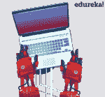
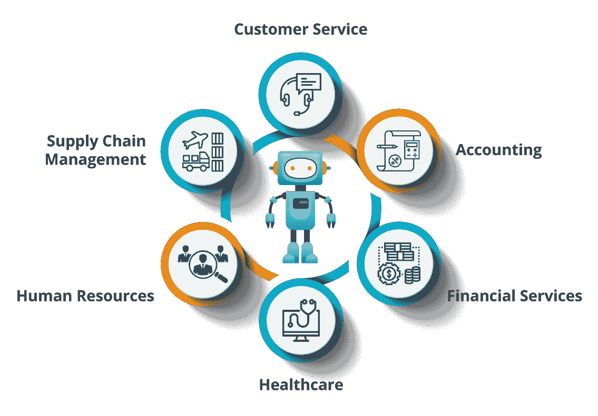

# RPA 是什么？—工作原理、RPA 工具和应用程序

> 原文：<https://www.edureka.co/blog/what-is-robotic-process-automation/>

随着世界朝着使用各种技术的方向前进，自动化也改进了它的方式，使我们的工作变得更容易。尽管自动化这个词是在 20 世纪 50 年代创造的，但很少有人真正理解它的含义。那么，在这篇关于“什么是 RPA”的博客中？，我将讨论到底什么是[机器人过程自动化](https://www.edureka.co/robotic-process-automation-certification-courses)及其各种因素。

以下是本博客涵盖的主题:

*   [什么是 RPA？](#What%20is%20RPA?)
*   [RPA 如何工作？](#How%20RPA%20Works?)
    *   [如何入门 RPA？](#How%20to%20Get%20Started%20with%20RPA?)
*   [RPA 工具](#RPA%20Tools)
    *   [RPA 工具对比](#Comparison%20of%20RPA%20Tools)
    *   [RPA 工具的市场趋势](#Market%20Trend%20of%20RPA%20Tools)
*   [RPA 应用](#Applications%20of%20RPA)

那么，我们先从了解什么是 RPA 开始吧？

## **RPA 是什么？**

在机器人的帮助下实现业务运营自动化以减少人工干预的过程被称为 ***【机器人流程自动化(RPA)*** 。

 如果我必须逐一阐述这些术语中的每一个，那么

*   **机器人**是模仿人类动作的实体，称为机器人。
*   一个**过程**是导致有意义活动的一系列步骤。比如泡茶的过程或者你喜欢的菜等等。
*   **自动化**是机器人在没有人类干预的情况下完成的任何过程。

所以，当我们把所有这些术语总结在一起，然后模仿人类的动作来执行一系列的步骤，从而导致有意义的活动，而没有任何人类的干预也被称为 [***【机器人流程自动化】***](https://www.edureka.co/blog/robotic-process-automation) 。

如果您希望进一步了解机器人过程自动化，那么我建议您浏览一下这个关于什么是 RPA 的有趣视频。

## **什么是机器人过程自动化(RPA)？|爱德华卡**

[https://www.youtube.com/embed/n6nxTBB16ag?rel=0&info=0](https://www.youtube.com/embed/n6nxTBB16ag?rel=0&info=0)

*本教程将为您介绍 RPA。*

现在，你知道它是什么了，让我告诉你它到底是怎么工作的？

## **RPA 如何工作？**

这个问题总是出现在 RPA 是否使用物理机器人，或者是否有实际的机器人来自动执行任务。

好吧，让我告诉你，RPA 不会用真正的机器人代替人类。但是，市场上有一些软件可以让您配置自动化工作流来自动化您的业务运营。据我们的专家称，由于市场上缺乏技能组合，对 **[RPA 认证培训](https://www.edureka.co/robotic-process-automation-training)** 和 [**Automation anywhere 认证**](https://www.edureka.co/automation-anywhere-certification-training) 培训的需求将上升 150%。

虽然我提到过 RPA 是通过软件实施的，而软件不过是 RPA 工具/供应商，但在我们开始讨论工具之前，让我告诉您一些关于如何开始使用 RPA 的指导原则。

### **如何入门 RPA？**

要开始使用 RPA，您需要遵循以下步骤:

*   **第一步:**获得有关 RPA 历史的广泛知识。也就是说，学习所有关于传统自动化的知识。
*   **步骤 2:** 了解 RPA 以及 RPA 的各种应用。
*   **步骤 3:** 选择您希望自动化的流程，并回顾流程依赖关系。这是一种确保您的业务在您忙于自动化任务时不会遭受损失的方法。
*   **步骤 4:** 获得大量 RPA 工具实践经验，如 UiPath、Blue Prism 和 Automation Anywhere。

继续这篇关于什么是 RPA 的文章，让我告诉你 RPA 市场上的顶级工具，它们将帮助你自动化任务。

## **RPA 工具**

RPA 工具/供应商是一种软件，您可以通过它来配置任务以实现自动化。在今天的市场上，有 RPA 供应商，如 Blue Prism、Automation Anywhere、UiPath、WorkFusion、Pega Systems 等等。但是，市场上的领导者是三人组( ***UiPath*** 、 ***蓝棱镜*** & ***自动化无处不在*** )。参考下面 Forester 对 RPA 的研究，了解目前各种 [***RPA 工具***](https://www.edureka.co/blog/rpa-tools-list-and-comparison/) 的排名。

### **对比顶级工具** 

正如我之前提到的，RPA 市场的领导者是 [UiPath](https://www.edureka.co/blog/uipath-tutorial/) 、Blue Prism 和 Automation Anywhere。这些工具是行业中用于各种目的的最广泛使用的工具。这些工具各有优缺点。

让我们先来看看这些工具的市场趋势。

#### **RPA 工具的市场趋势**

这里，红线是 UiPath，蓝线是蓝色棱镜，黄线是任何地方的自动化。从图中可以明显看出，UiPath 在这里是赢家。现在，如果你想知道*为什么 UiPath 赢得了比赛*？

那么，可以考虑下表，了解 UiPath 领先游戏背后的原因。

| **特征** | **UiPath** | **蓝色棱镜** | **自动化随处可见** |
| 有试用版吗？ | 提供社区版/免费版 | 没有可用的试用版 | 试用版可使用 30 天 |
| 它对用户友好吗？ | 提供人性化的视觉设计 er | 提供用户友好的可视化设计器，比任何地方的自动化都容易 | 开发人员友好，但需要很高的编程技能。 |
| **人气** | 最受欢迎的工具 | 比自动化更受欢迎 | 三者中最不受欢迎的工具 |

所有工具的功能和结构都很相似。但是，如果你是自动化的新手，想学习如何自动化任务，那么 [***UiPath***](https://www.edureka.co/blog/uipath-tutorial/) 提供了一个带有拖放可视化设计器的免费版。这个工具不需要编程知识，可以按照你的意愿自动完成任意数量的任务。

所以，如果你能掌握一种工具，那么这将会给你一个良好的开端来增加你的职业机会。

继续这篇关于什么是 RPA 的文章，让我快速告诉您 RPA 的各种应用。

## **RPA 的应用**

德勤、埃森哲、凯捷等跨国公司在日常工作中使用机器人流程自动化。这些公司受益于 RPA，因为它提供了准确、可靠、一致的输出和高生产率。现在，让我告诉您 RPA 的主要应用，以便您了解 RPA 可用于的各个领域。

如上图所示，RPA 提供的不仅仅是测试。通过在会计、金融服务和人力资源行业使用，一个人的压力减少了，可以更好地利用他的才能。因此，RPA 是一项可以让您的工作变得轻松、可靠的技术。

因此，朋友们，我们到此结束这篇“什么是 RPA”的文章。如果您希望获得 RPA 认证并成为一名 [***RPA 开发人员***](https://www.edureka.co/blog/rpa-developer-roles-and-responsibilities/) ，那么 Edureka 提供  ***[机器人流程自动化培训，使用 UiPath](https://www.edureka.co/robotic-process-automation-training)*** 。您可以在此注册，开始参加讲师指导的现场课程。