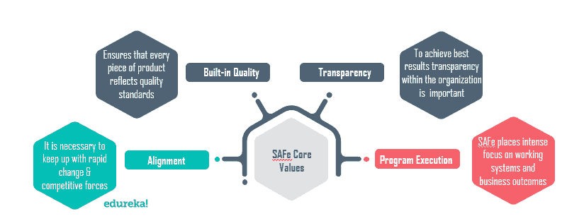
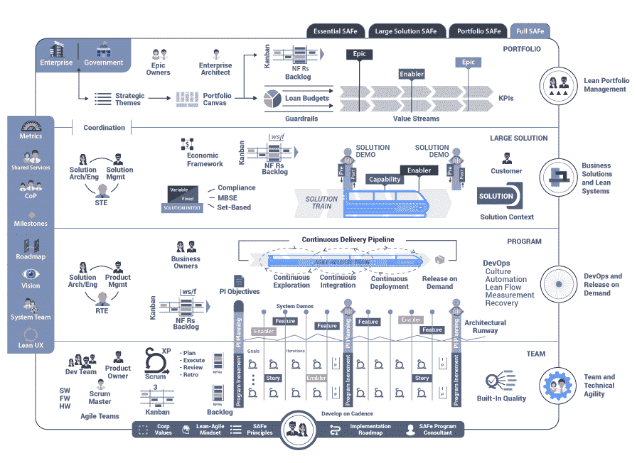

# 安全基础:什么是安全？

> 原文：<https://www.edureka.co/blog/what-is-safe/>

规模敏捷框架或 SAFe 使复杂的组织能够实现规模精益敏捷软件和系统开发的优势。要了解什么是安全的 及其工作原理，您需要了解以下主题:

*   [**为什么要使用敏捷框架？**](#whyuseagile)

*   [**什么是安全？**](#whatissafe)

*   [**什么时候使用可扩展的敏捷框架？**](#whentousesafe)

*   [**SAFe 与其他敏捷实践有何不同？**](#howissafedifferent)

*   [**规模化敏捷框架的基础**](#foundationofsafe)

*   [**安全屋**](#houseofsafe)
*   [**敏捷宣言**](#agilemanifesto)

*   [**不同等级的保险箱**](#safelevels)

    *   [**团队等级**](#teamlevel)

    *   [**程序等级**](#programlevel)

    *   [**价值流等级**](#valuestreamlevel)

    *   [**投资组合级别**](#portfoliolevel)

## **为什么要使用敏捷框架？**

通过实施敏捷框架，您可以获得以下好处:

*   敏捷扩展到处理大价值流和复杂系统开发的需求，尽管如此简单和轻量级。
*   它将生产率提高了 20–50%
*   质量  增加超过  50%
*   它缩短了产品到达市场的时间。该过程至少加快了 30%
*   员工敬业度和工作满意度。

详细的框架显示了所有的关键角色、活动、可交付成果和流程。它还导航站点的其余部分。

给出的图片解释了敏捷过程是如何工作的。史诗是一个庞大的作品体，进一步细分为许多较小的故事或子史诗。这些副史诗作为一个故事分配给团队。然后每个团队处理这些故事或软件特性。

## **什么是安全的？**

Scaled Agile Framework 或 SAFe 最初是由院长莱芬格威尔的书和博客开发的。1.0 版本是 2011 年首次正式发布。最新版本是 4.6，于 2018 年 10 月发布。它旨在为企业投资组合、价值流、计划和团队级别的工作提供指导。

SAFe 是一个免费的在线知识库，允许您在企业层面上实施精益-敏捷实践。它为软件开发团队提供了简单、轻量级的体验。整个框架分为 3 个基本部分**团队、****项目、**和**组合**。

因此，以下是外管局的特点:

*   在企业级实施精益-敏捷软件和系统
*   企业投资组合、价值流、计划和团队流程的详细指南。
*   满足组织内所有利益相关者需求的最佳设计。

## **何时使用可扩展的敏捷框架？**

现在，你可能想知道什么时候应该使用 SAFe。这里有一些例子。

*   当您的团队有兴趣在更大的多团队项目和投资组合中实现敏捷方法时。
*   当一个组织中的多个团队以不同的方式运行敏捷实现，并因此面临障碍、延迟和失败时。
*   当你想运用敏捷，但又想将其提升到组织层面时。但是，您不确定可能需要哪些新角色，或者哪些现有角色(即管理层)需要改变以及如何改变。
*   当您试图将敏捷扩展到您的组织中，但是在从项目组合到项目和团队级别的跨业务部门的战略中努力实现一致性或连贯性时。
*   当您的组织需要改进其产品开发交付周期时。

## SAFe 与其他敏捷实践有什么不同？

另一件需要思考的事情是 SAFe 与其他敏捷实践有什么不同，

*   SAFe 是公开的，可以免费使用。
*   它以一种非常容易接近和可用的形式提供。
*   除了轻量级之外，它还可以非常具体到某个级别。
*   它不断地修改和维护最常用的敏捷实践。
*   SAFe 为常见的敏捷实践提供了有用的扩展。
*   它将敏捷实践建立在企业环境的基础上。
*   软件开发的全貌通过安全的实现提供给你
*   经验主义被放大了。
*   外管局定期收集质量和改进方面的反馈。

## **规模化敏捷框架的建立**

扩展的敏捷框架基于以下基本价值观:

1.  精益-敏捷及其原则
2.  扩展的敏捷核心价值，
3.  精益-敏捷领导
4.  精益-敏捷思维，
5.  实践社区

### **1。精益-敏捷及其原则**

以下是 SAFe 的基本原则和价值观。它们必须被理解、展示和继续，以便在执行框架时获得最佳结果。

*   从经济角度看
*   运用系统思维
*   假设可变性；保留选项
*   通过快速、集成的学习周期进行增量构建
*   将里程碑建立在对工作系统的客观评估基础上
*   可视化和限制在制品，减少批量和管理队列长度
*   应用节奏并与跨领域规划同步
*   释放知识型员工的内在动机
*   下放决策权
*   **安全敏捷核心价值观**

SAFe 基于以下 4 个核心价值观。

*   对齐
*   内在质量
*   透明度
*   程序执行

3.  ### **Lean-agile leadership**

在教师之前，精益-敏捷领导者是持续的学习者。它帮助他们通过理解和展示精益-敏捷安全原则来帮助他们的团队构建更好的系统。

作为推动者，领导者的最终责任是精益-敏捷开发的采用、成功和持续改进。为了变革和持续改进，领导者要经过严格和持续的培训。

领导者真正授权并调动个人和团队实现其最大潜力。

### **这些精益-敏捷领导者的原则**

*   引领变革
*   认识道路；强调终身学习
*   发展人而不是过程
*   激励并与使命一致
*   下放决策权
*   释放知识型员工的内在动机

4.  ### **Lean and agile mentality**

精益-敏捷的思维模式可以从下面两件事情中得到。

1.  精益的安全屋
2.  敏捷宣言

### **乐安的安全屋**

扩展敏捷框架(SAFe)源自精益丰田的*之家所启发的原则和实践。基于此，外管局推出了精益*的*安全屋。*

目标是在最短的交付周期内交付最大的客户价值，同时保持交付给客户的最高质量。

通过实践敏捷并帮助其他人做同样的事情，更新、更好的软件开发方法正在被发现。这就是为什么，虽然右边的物品有巨大的价值，但我们更看重放在左边的物品。

### **敏捷宣言**

1.  最高优先级是通过持续和早期交付有价值的软件来满足客户。
2.  拥抱不断变化的需求，即使是在开发的后期。敏捷过程为了客户的利益驾驭变化。
3.  频繁地交付工作软件，从几个星期到几个月，优先选择较短的时间尺度。
4.  开发人员和业务人员必须在整个项目中每天一起工作。
5.  围绕有积极性的个人建立项目。给他们支持和他们需要的环境，相信他们能完成工作。
6.  与开发团队交流的最有效的方法是面对面的交谈。
7.  工作软件是进步的主要衡量标准。
8.  敏捷过程促进可持续发展。发起人、开发人员和用户应该能够无限期地保持恒定的步调。
9.  对技术优势和良好设计的持续关注增强了敏捷性。
10.  简单——最大化未完成工作量的艺术——至关重要。
11.  最好的架构、需求和设计来自自组织团队。
12.  该团队定期反思如何变得更有效，然后相应地调整自己的行为。

**保险箱中的不同级别**

根据最新版本的外管局，有四个层次的实施。

*   团队级别
*   程序级
*   投资组合级别
*   价值流水平

###  **团队等级安全**

团队级安全包含角色、事件和流程。敏捷团队构建这些角色、事件和流程，并在敏捷发布系列(ART)的上下文中交付价值。它更像是一个常规的 scrum 团队。团队构成了安全和精益企业的基础，因为他们完成了交付客户价值的大部分工作。

Team Level SAFe 创建高绩效团队，进而构建高质量组件和解决方案，支持团队和技术敏捷性。这是程序级别的主要构造。

### **程序级安全**

项目级 SAFe 拥有通过敏捷发布系列(ART)持续交付解决方案所需的角色和活动。这个层次是开发团队、涉众和其他资源致力于一些重要的、正在进行的系统开发任务的地方。

艺术隐喻描述了项目级别的团队、角色和活动，它们不断地交付持续的价值流。ARTs 是虚拟组织，旨在跨越职能界限，消除不必要的移交和步骤，并通过实施安全的精益-敏捷原则和实践来加速价值交付。

最终，在项目层面运作的艺术负责以企业所需的频率创造和释放价值流，以满足市场和客户需求。这一层次的这些思维模式和实践有助于开发运维的企业竞争力，并按需发布，使这种价值流成为可能。

### **价值流级别安全**

在 SAFe 中，价值流级别是可选的。它是 SAFe 4.0 中的新增功能。它是为拥有复杂解决方案的大型独立企业而设计的。它旨在为软件、硬件、电气和电子、光学、力学、流体学等的信息物理系统提供帮助。

它支持多个艺术和供应商的节奏和同步，并提供额外的角色，如价值流工程师、解决方案架构师/工程和解决方案管理。

### **投资组合级安全**

这是对外管局最大的兴趣/关注/参与。投资组合级 SAFe 为通过一个或多个价值流组织精益-敏捷企业价值流提供了基础模块。它有助于开发战略主题中描述的系统和解决方案。

为了满足战略目标，项目组合层通过基本预算和其他治理机制封装了某些元素。因此，它确保价值流中的投资为企业提供必要的回报。

投资组合与业务是双向联系的；

*   为了指导投资组合更广泛地改变业务目标，它提供了战略主题。
*   表明投资组合价值的持续流动。

这里使用的重要关键概念是:

*   连接到企业，
*   项目组合管理，
*   管理投资组合史诗的工作流程。

## **结论**

***扩展敏捷框架(SAFe)*** 是对 a- 框架的渐进式改进，它提供了帮助组织成为精益敏捷的五个核心能力的指导。它有 4 个级别和 4 种配置，完全基于 ***敏捷宣言*** 和 ***精益安全屋*** 。