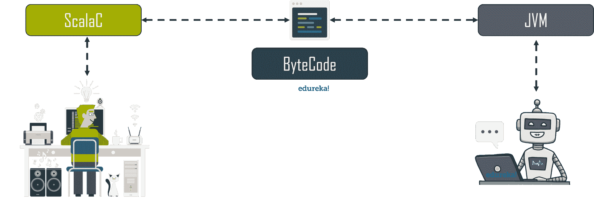
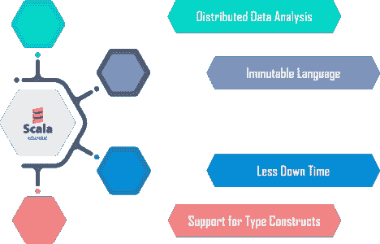
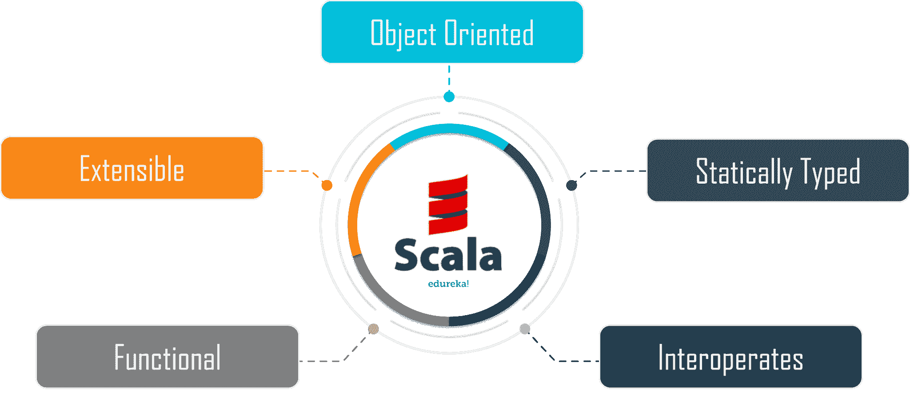
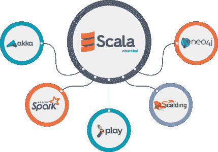
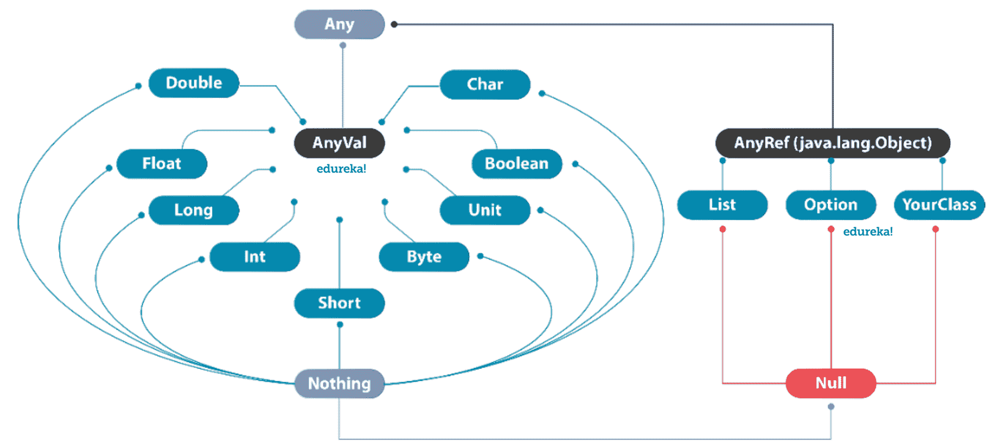
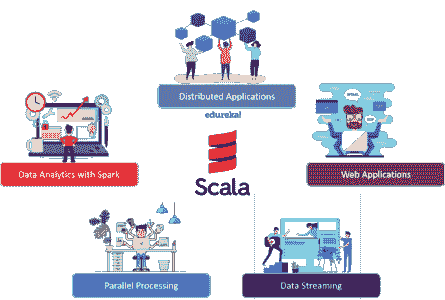
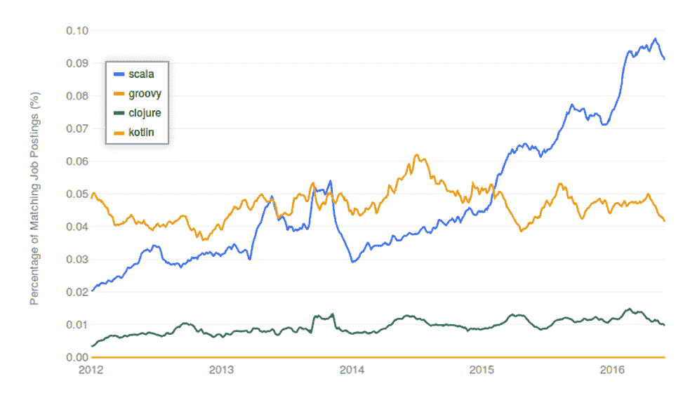
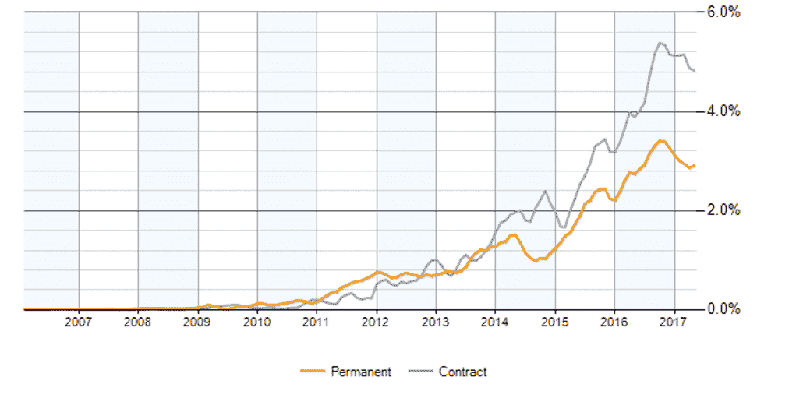

# 什么是 Scala？Scala 编程完全指南

> 原文：<https://www.edureka.co/blog/what-is-scala/>

[**什么是 Scala？**](https://www.edureka.co/apache-spark-scala-certification-training) 一种健壮、高质量的编程语言，改变了**大数据的世界。Scala 的能力足以超越现有最快编程语言的速度。我将带您浏览这篇什么是 Scala 的文章，以便您能够理解 Scala 的真正功能。**

我会把这件事的摘要排列如下。

*   [什么是 Scala？](#what-is-scala)
*   [我们为什么需要 Scala？](#why-scala)
*   [Scala 等语言](#scala-vs-others)
*   [Scala 的特性](#scala-features)
*   [Scala 框架](#scala-frameworks)
*   [Scala 中的变量](#scala-variables)
*   [收藏于 Scala](#scala-collections)
*   [Scala 中的控制语句](#scala-control-statements)
*   [Scala 的应用](#scala-applications)
*   [](#scala-scope)[范围为 Scala](#scala-scope)

那么，让我们从第一个问题开始。

## **什么是 Scala？**

嗯，Scala 是由 **马丁·奥德斯基** 先生和他的研究团队在 2003 年发明的编程语言。

**Scala** 是一种基于编译器的多范例编程语言，具有**紧凑**、**快速**和**高效**的特点。Scala 的主要优势是 **JVM** ( **Java 虚拟机**)。Scala 代码首先由 **Scala 编译器**编译，生成相同的**字节码**，然后被传送到 **Java 虚拟机**生成输出。



因此， **Scala** 成为管理巨量**大数据的成功关键。**

既然我们知道了 Scala 的重要性，现在让我们来理解为什么它实际上是当前趋势中最受欢迎的语言。

## **我们为什么需要 Scala？**



*   Scala 能够处理以**分布式**方式存储的数据。它访问所有可用的资源，并支持并行数据处理。
*   Scala 支持**I**可变数据，并且支持高阶函数。
*   Scala 是 Java 的升级版本，旨在消除不必要的代码。它支持多个库和 API，这将允许程序员实现**更少的停机时间**。
*   Scala 支持多种类型**C**构造，这使得程序员能够轻松地使用包装器/容器类型。

既然我们已经理解了我们需要 Scala 的需求。让我们来比较一下其他语言之间的，并找出为什么它比其他类似的编程语言有优势。

## **Scala 等语言**

名称 **Scala** 描绘了该语言能够提供的**可伸缩性**，现在你可能会提出一个问题。难道最新的编程语言像 [**Python**](https://www.edureka.co/blog/python-tutorial/) ， [**Ruby**](https://www.edureka.co/blog/ruby-on-rails-tutorial/) ， [**Perl**](https://www.edureka.co/blog/videos/learn-perl-the-jewel-of-scripting-languages/) 和传说中的[**Java**](https://www.edureka.co/blog/java-tutorial/)不具有可扩展性吗？


答案是**是的**，它们是**可扩展的**，但是有一些**限制**就像 **Java** 中的 **system.print.ln** 这样的锅炉电镀代码。Scala 的发明就是为了克服这些限制，并最小化代码的执行时间和复杂性。

2006 年 Twitter 在美国推出，开发人员使用 **ruby on rails** 作为他们开发该应用程序的首选武器，后来证明这是一个**错误的选择**，因为他们不得不管理大量 [**大数据**](https://www.edureka.co/blog/category/big-data-analytics) ，这些大数据正落入 **Twitter** 中。

然后他们将其后端切换到 **Java** ，并使用 [ ** Scala ** ](https://www.edureka.co/blog/scala-functional-programming/) 作为他们的新编程语言，使用[**Hadoop**](https://www.edureka.co/blog/hadoop-tutorial/)和[**Spark**](https://www.edureka.co/blog/spark-tutorial/)框架来处理大数据，这些框架以惊人的方式工作。用 [ 微软 Azure 数据工程师 ](https://www.edureka.co/microsoft-azure-data-engineering-certification-course) 可以更好的理解。


现在我们知道了 Scala 的功能，现在让我们了解一下它的强大特性:

## **Scala 的特性**

*   **面向对象编程语言:**

Scala 既是一种函数式编程语言，也是一种面向对象的编程语言。默认情况下，Scala 中使用的每个变量和值都被隐式保存为一个**对象**。

*   **可扩展编程语言:**

Scala 可以支持多种语言结构，而不需要任何**领域特定语言** ( **DSL** )扩展、**库、**和**API**。

### 

*   **静态类型化编程语言:**

Scala 在其整个**范围**内将数据类型绑定到变量。

*   **函数式编程语言:**

Scala 提供了定义函数的轻量级语法，它支持高阶函数 T2，允许函数嵌套 T4。

*   **互通:**

Scala 使用 **scala 编译器**编译代码，并将代码转换成 **Java 字节码**并在 **JVM** 上执行。

成为一名数据工程师的最佳途径是在亚特兰大参加 [Azure 数据工程课程](https://www.edureka.co/microsoft-azure-data-engineering-certification-course-atlanta) 。

这些是 Scala 的特性，让我们了解一下 Scala 能够支持的一些框架。

## **Scala 的框架**



Akka、Spark、Play、Neo4j、burning 是 Scala 可以支持的一些主要框架。

*   **[Akka](https://akka.io/)** 是一个运行时工具包，用于在 JVM 上构建高度并发、分布式和容错的应用程序。Akka 是用 Scala 编写的，Scala 和 Java 都提供了语言绑定。
*   [**Spark**](https://www.edureka.co/blog/spark-tutorial/)框架专为处理大数据而设计，它单独支持 **Scala** 。
*   [**Play**](https://www.playframework.com/) 框架是专为创建 web 应用而设计的，它在这个过程中使用 Scala 以获得同类最佳的性能。
*   **滚烫**是 Scala 编程语言中的一种**领域专用语言** ( **DSL** )，集成了**级联**。它是 Scala 中使用的函数式编程范例，比 Java 更接近于 MapReduce 函数的原始模型。
*   **Neo4j** 是一个由 Scala 支持的 **java spring 框架**，具有特定领域的功能、分析能力、图形算法等等。

这些是 Scala 支持的流行框架，现在让我们了解 Scala 中的变量和数据类型。

## **Scala 中的变量**

变量可被定义为用于存储值的保留内存位置。类似地，Scala 编程语言中也有变量。Scala 中的变量分为两种。

****

**可变变量**

这些变量允许我们在变量声明后**改变**一个值。**可变的**变量通过使用 **var** 关键字来定义。数据类型的第一个字母应该是大写的，因为在 Scala 中，数据类型被视为一个对象。

```
var b = "Edureka"
b = "Brain4ce Organisation"

```

**输出:**

b:String = edu rekab:String = brain 4 ce Organisation这种情况下，变量会接受新的字符串并显示出来。

**不可变变量**

这些变量不允许你在变量声明后改变一个值。**不可变变量**是通过使用 **val** 关键字定义的。数据类型的第一个字母应该是大写的，因为在 **Scala** 中，数据类型被视为对象。

```
val a = "hello world"
a = "how are you"

```

**输出:**a:string = hello world<控制台> :25:错误:重新分配给 vala = " how are you "^


该代码将给出一个**错误**，新值将不会被变量 a 接受。

#### **懒评**

```
lazy val x = 100
x*2

```

**输出:**

x: Int = <懒惰>RES:Int = 200

**懒惰** **评测**是 Scala 的首要特性，这为它买下了一个全新层次的尊严。这里，声明的变量**不会被访问**或**任何** **操作** **是对变量执行** **而不是**，除非程序员特别是**访问**它并且**对它执行操作**。

简单来说，就是一个操作的**按需执行**，实时节省大量的**内存**和**处理资源。**

#### Scala 支持的数据类型如下。

## 

## **Scala 中的收藏**

#### **阵列**

数组是存储**相同数据类型的元素的**固定大小的**顺序集合的数据结构。**

我们将看几个 Scala 中数组的例子

*   这里我们创建了一个整数类型的数组，它是空的，将在所有的内存位置存储 0 作为默认值。

```
val array = new Array[Int](10)

```

**输出:**

Array:Array[Int]= Array(0，0，0，0，0，0，0，0，0)

*   我们可以访问**内存** **位置**和**摄取**一个值到数组中。

```
array(0) = 10
array(1) = 2

```

**输出:**

array: Array[Int] = Array(0，0，0，0，0，0，0，0，0)RES:Array[Int]= Array(10，2，0，0，0，0，0，0)

*   让我们创建一个**字符串** **数据类型**的数组，并使用 for 循环在新的一行中打印每个值。

```
val mystring = Array("Edureka", "Brain4ce", "Organisation")
for ( x <- mystring )
{
println( x )
}

```

**输出:**

爱德华卡 brain 4ce组织

*   现在让我们来了解一下 **ArrayBuffer** 。在我们对一个**数组缓冲区** 执行任何**操作**之前，我们需要导入下面的**库**

```
import scala.collection.mutable.ArrayBuffer

```

**输出:**

导入 Scala . collection . mutable . array buffer

*   让我们**创建**整型**的**和**数组缓冲**。

```
val a = ArrayBuffer[Int]()

```

**输出:**

a:Scala . collection . mutable . array buffer[Int]= array buffer()

*   让我们**将**元素插入**数组缓冲区**

```
a += 1

```

**输出:**

s:a . type =阵列缓冲区(1)

*   让我们**将多个** **元素**插入到**数组缓冲区中。**

```
a += (2,3,4,5)

```

**输出:**

res: a.type =阵列缓冲区(1、2、3、4、5)

*   让我们**将**一个**完整数组**插入**数组缓冲区**

```
a ++= Array(6, 7, 8)

```

**输出:**

res: a.type =阵列缓冲区(1、2、3、4、5、6、7、8)

*   让我们在**数组** **缓冲区**上执行一些**基本操作**。
*   该函数用于**修剪**数组** **缓冲区**的最后两个元素**。

```
a.trimEnd(2)

```

**输出:**

res: a.type = ArrayBuffer(1，2，3，4，5，6，7，8)RES:Scala . collection . mutable . array buffer[Int]= array buffer(1，2，3，4，5，6)

*   该函数用于**将** **元素** **9** 插入**第二个** **内存** **位置**的**数组缓冲区。**

```
a.insert(2, 9)

```

**输出:**RES:Scala . collection . mutable . array buffer[Int]= array buffer(1，2，3，4，5，6)RES:Scala . collection . mutable . array buffer[Int]= array buffer(1，2，9，3，4，5，6)

*   该函数用于**将** **元素** **(0，9，6，1)** 插入**数组缓冲区**的**第 2 个内存位置**。

```
a.insert(2,0,9,6,1)

```

**输出:**

RES:Scala . collection . mutable . array buffer[Int]= array buffer(1，2，9，3，4，5，6)RES:Scala . collection . mutable . array buffer[Int]= array buffer(1，2，0，9，6，1，9，3，4，5，6)

这个函数用来**删除** 中的一个元素 **第二个** **内存** **位置** 的 **数组** **缓冲区** 。

```
a.remove(2)

```

**输出:**

RES:Scala . collection . mutable . array buffer[Int]= array buffer(1，2，0，9，6，1，9，3，4，5，6)RES:Int = 0RES:Scala . collection . mutable . array buffer[Int]= array buffer(1，2，9，6，1，9，3，4，5，6)

*   该函数用于从**数组** **缓冲区**中**移除** **三个** **元素**，从**第二个** **内存** **位置**开始。

```
a.remove(2, 3)

```

**输出:**

RES:Scala . collection . mutable . array buffer[Int]= array buffer(1，2，9，6，1，9，3，4，5，6)RES:Scala . collection . mutable . array buffer[Int]= array buffer(1，2，9，3，4，5，6)

*   让我们对数组缓冲区执行一些常见的操作
*   Sum 函数用于执行数组缓冲区中所有元素的求和。

```
Array(1,2,3,4).sum

```

**输出:**

res: Int = 10

*   **Max** 函数用于查找**数组** **缓冲区**中最大的元素。

```
Array(1,2,3,4).max

```

**输出:**

res: Int = 4

*   让我们对**数组** **缓冲区**执行一次**快速排序**。

```
val a = Array(1,5,3,2,4)
scala.util.Sorting.quickSort(a)

```

**输出:**

a: Array[Int] = Array(1，5，3，2，4)RES:Array[Int]= Array(1，2，3，4，5)

#### **列出了**

**Scala 列表**是一个不可变的元素序列，实现为一个链接的**列表**。与数组不同，链接的**列表**由许多小对象组成，每个小对象包含对一个对象的引用以及对**列表** 其余部分的引用

现在我们来看几个 Scala 中的列表例子。

*   **创建**Scala**列表**对象

```
val list = 1 :: 2 :: 3 :: Nil
val list = List(1,2,3)

```

**输出:**

list: List[Int] = List(1，2，3)List:List[Int]= List(1，2，3)

*   **添加** **元素**到列表

```
val x = List(2)
val y = 1 :: x
val z = 0 :: y

```

**输出:**

x:List[Int]= List(2)y:List[Int]= List(1，2)z:List[Int]= List(0，1，2)

*   **从 Scala **列表**或 **ListBuffer**** 中删除元素

```
val originalList = List(5, 1, 4, 3, 2)
val newList = originalList.filter(_ > 2)

```

**输出:**

originalList:List[Int]= List(5，1，4，3，2)new List:List[Int]= List(5，4，3)

*   让我们**导入** **列表缓冲**

```
import scala.collection.mutable.ListBuffer

```

**输出:**

导入 Scala . collection . mutable . list buffer

*   创建列表缓冲区

```
val x = ListBuffer(1, 2, 3, 4, 5, 6, 7, 8, 9)

```

**输出:**

x:Scala . collection . mutable . list buffer[Int]= list buffer(1，2，3，4，5，6，7，8，9)

*   你可以**一次删除**一个元素，**按值删除** :

```
x -= 5

```

**输出:**

res: x.type = ListBuffer(1，2，3，4，6，7，8，9)

*   您可以通过**位置** : 来**删除**元素

```
x.remove(0)

```

**输出:**

RES:Int = 1RES:Scala . collection . mutable . list buffer[Int]= list buffer(2，3，4，6，7，8，9)

*   列表中的**范围**方法

```
val x = List.range(1,10)

```

**输出:**

x: List[Int] = List(1，2，3，4，5，6，7，8，9)

*   **范围** **函数**也可以带第三个自变量，作为“**步骤**”

```
val x = List.range(0,10,2)

```

**输出:**

x: List[Int] = List(0，2，4，6，8)

*   列表中的**填写**方法

```
val x = List.fill(3)("Apple")

```

**输出:**

x: List[String] = List(苹果，苹果，苹果)

*   列表类**制表**方法
*   制表方法创建一个新的列表，其元素是根据您应用的**函数**创建的

```
val x = List.tabulate(5)(n = n + n)

```

**输出:**

x: List[Int] = List(0，2，4，6，8)

*   **将**项前置到列表中
*   创建列表

```
val x = List(1,2,3)

```

**输出:**

x: List[Int] = List(1，2，3)

*   **将**元素添加到列表中

```
val y = 0 :: x

```

**输出:**

y: List[Int] = List(0，1，2，3)

*   **追加**并合并列表

```
val a = List(1,2,3)
val b = List(4,5,6)
val c = a ::: b

```

**输出:**

y: List[Int] = List(0，1，2，3)a:List[Int]= List(1，2，3)b:List[Int]= List(4，5，6)c:List[Int]= List(1，2，3，4，5，6)

*   你也可以**使用列表的 **concat** 方法:**合并两个 Scala 列表

```
val c = List.concat(a, b)

```

**输出:**

c: List[Int] = List(1，2，3，4，5，6)

*   **用 foreach** 迭代列表

```
val x = List(1,2,3)
x.foreach { println }

```

**输出:**

x: List[Int] = List(1，2，3)123

*   **一次添加一个元素**到**列表缓冲区**

```
var flowers = new ListBuffer[String]()
flowers += "Rose"
flowers += "Lilly"
flowers += "Tulip"

```

**输出:**

flowers:Scala . collection . mutable . list buffer[String]= list buffer()RES:Scala . collection . mutable . list buffer[String]= list buffer(Rose)RES:Scala . collection . mutable . list buffer[String]= list buffer(Rose，Lilly)

*   **添加多个** **元素**

```
flowers += ("Daisy", "Sunflower", "Jasmine")

```

**输出:**

RES:Scala . collection . mutable . list buffer[String]= list buffer(玫瑰、礼来、郁金香、雏菊、向日葵、茉莉)

*   移除一个元素

```
flowers -= "Rose"

```

**输出:**

RES:Scala . collection . mutable . list buffer[String]= list buffer(Lilly，Tulip，Daisy，向日葵，茉莉)

*   **删除多个元素**

```
flowers -= ("Lilly", "Tulip")

```

**输出:**

RES:Scala . collection . mutable . list buffer[String]= list buffer(雏菊、向日葵、茉莉)

*   **删除由另一序列指定的多个元素**

```
flowers --= Seq("Daisy", "Sunflower")

```

**输出:**

RES:Scala . collection . mutable . list buffer[String]= list buffer(Jasmine)

*   **在需要**的时候，将**列表缓冲区**转换为**列表**

```
val flowersList = flowers.toList

```

**输出:**

flowers List:List[String]= List(Jasmine)

#### **集**

**集合**是不包含重复元素的集合。默认情况下， **Scala** 使用不可变的**集合**。如果您想使用可变的**集合**，您必须导入名为的库

**显式导入 Scala . collection . mutable . set**类。

我们将在 Scala 中尝试一些集合的例子。

*   **集合**是不包含**重复**元素的集合。 集合有两种，**不可变**和**可变**。

```
var s : Set[Int] = Set()
var s : Set[Int] = Set(1,1,5,5,7)

```

**输出:**

var s:Set[Int]= Set()var s:Set[Int]= Set(1，1，5，5，7)

*   不可变设置

```
var s = Set(1,3,5,7)

```

**输出:**

s:Scala . collection . immutable . Set[Int]= Set(1，3，5，7)

*   基本操作方法

```
val fruit = Set("apples", "oranges", "pears")
println( "Head of fruit : " + fruit.head )
println( "Tail of fruit : " + fruit.tail )
println( "Check if fruit is empty : " + fruit.isEmpty )
val nums: Set[Int] = Set()
println( "Check if nums is empty : " + nums.isEmpty )

```

**输出:**

fruit:Scala . collection . immutable . Set[String]= Set(苹果、橘子、梨) 头果:苹果 尾果:Set(橘子、梨) 检查果是否为空:falsenums:Set[Int]= Set()检查 nums 是否为空:true

*   **串联**集合
*   你可以使用++运算符或者 Set。++()方法将**连接**两个或更多集合， 但是在添加集合时，它将删除**重复的**元素。

```

val fruit1 = Set("apples", "oranges", "pears")
val fruit2 = Set("mangoes", "banana", "oranges")
val fruit = fruit1 ++ fruit2
fruit

```

**输出:**

fruit 1:Scala . collection . immutable . Set[String]= Set(苹果、橘子、梨)fruit 2:Scala . collection . immutable . Set[String]= Set(芒果、香蕉、橘子)fruit:Scala . collection . immutable . Set[String]= Set(香蕉、苹果、芒果、梨、橘子)

*   使用两台或多台 **++** 作为**操作员**T5
*   可变集合
*   用+=、++=和 Add 方法向可变集合添加元素:
*   使用**变量**与可变

```
var set = scala.collection.mutable.Set[Int]()

```

**输出:**

Set:Scala . collection . mutable . Set[Int]= Set()

*   增加**一个**元素

```
set += 1

```

**输出:**

RES:Scala . collection . mutable . Set[Int]= Set(1)

*   添加**多个**元素

```
set += (2, 3)
set.add(6)
set.add(2)

```

**输出:**

RES:Scala . collection . mutable . Set[Int]= Set(1，2，3)RES:Boolean = trueRES:Boolean = false

#### **地图**

一个 **Scala 映射**是一个键值对的集合。一个**映射**不能有重复的键，但是不同的键可以有相同的值

我们将尝试一些 Scala 中的地图示例。

```
val colors1 = Map("red" -> "#FF0000", "azure" -> "#F0FFFF", "peru" -> "#CD853F")
val colors2 = Map("blue" -> "#0033FF", "yellow" -> "#FFFF00", "red" -> "#FF0000")
colors1.keys
colors1.values
colors1.isEmpty
var colors = colors1 ++ colors2

```

**输出:**

res: Iterable[String] = Set(红色、天蓝色、秘鲁)RES:Iterable[String]= MapLike(# ff 0000、#F0FFFF、# CD 853 f)RES:Boolean = false

让我们在地图中查一下**另一个**T3 的例子。

```
val mapping = Map("virat" -> "kohili", "mahendra" -> "singhdhoni")
val mapping = scala.collection.mutable.Map("virat" -> "kohili", "mahendra" -> "singhdhoni")
mapping("virat")
mapping -= "mahendra"
mapping += ("ajay"-> "sharma")
mapping.getOrElse("virat", 0)

```

**输出:**

mapping:Scala . collection . immutable . Map[String，String] = Map(virat - > kohili，mahendra->singhdhoni)mapping:Scala . collection . mutable . Map[String]= Map(mahendra->singhdhoni，virat->kohili)RES:String = kohiliRES:mapping . type = Map(virat-)

#### **元组**

**Scala tuple** 将固定数量的项目组合在一起，以便它们可以被传递。与数组或列表不同，**元组**可以保存不同类型的对象，但它们也是**不可变的**。下面是一个保存整数的**元组**的例子，一个字符串。

我们将尝试 Scala 中元组的几个例子。

```
val a = (1,2,"Ajay","Devgan")
a._1
a._3

```

**输出:**

a: (Int，Int，String，String) = (1，2，Ajay，devgan)RES:int = 1RES:string = ajay

这些是 Scala 支持的集合，现在让我们来理解一下**控制** **语句**。

## **Scala 中的控制语句**

至此，我们将进入下一个话题，即**控制** **语句**。


#### **如果**

一个 **if** 语句决定执行两个给定**语句**中的哪一个。

```
for (i <- 0 to 5; j <- 0 to 5 if i==j)
println(i + j)

```

**输出:**

02T546810

#### **如果别的**

一个 **if** 语句，后面跟着一个 **else** 语句，执行**两个语句中的一个**。如果 if 程序块提供的**条件**为**真**，则 if 程序块语句将被执行。否则，将执行 **else** 块中的语句。

```
var x = 5
val s = if (x > 0 && x < 6) 1 else 0
val s =if (x > 0 && x < 6) "positive" else 0

```

**输出:**

x:Int = 5s:Int = 1s:Any =正数

#### **而**

**而**是一个控制语句，它检查**条件**并确定是否**执行**循环中出现的一组特定语句。

```
var args = "Edureka"
println("length is " + args.length)
var i = 0
while(i < args.length)
{
println(args(i))
i+= 1
}

```

**输出:**

EdurEka

#### **边做边**

**Do** **While** 循环与 While 循环类似，唯一不同的是循环的**条件**位于 **的**末端****循环**程序块，如下图所示。Do while 循环**在** **最少**处执行** **一次，作为块中语句执行后检查的条件。**

```
var x=7
do
{
println(x)
x=x-1
}while(x > 0);

```

**输出:**

7654321

#### **为**

循环的 **是一个简单的循环，其中有一个**初始化** **变量**、**计数器** **变量**和一个**条件**。初始化变量将被初始化为某个值，计数器变量对迭代进行计数，迭代将一直运行，直到所提供的条件为真。**

```
for ( i <- 1 to 5)
println(i)
#Advaned For Loop
for (i <- 0 to 5 if i==j)
println(10*i + j)

```

**输出:**

12345

**输出(高级为循环):**

01122334455

**For**For 循环的每一次迭代， **yield** 都会生成一个被记忆的值。当您的 for 循环运行完毕， 将返回所有**产生的**值的这个**集合**。

```
for (i <- 1 to 5) yield i
for (i <- 1 to 5) yield i * 2

```

**输出:**

RES:Scala . collection . immutable . indexed seq[Int]= Vector(1，2，3，4，5)RES:Scala . collection . immutable . indexed seq[Int]= Vector(2，4，6，8，10)

#### **Foreach**

**Foreach** 控制语句类似于 for 循环，唯一的区别是它打印每个值并对列表中的项进行迭代，我们可以使用 for 循环。它对数组或集合进行操作，比如在系统中可以找到的 **ArrayList** 。

```
var args= "Hello"
args.foreach(println(arg))

```

**输出:**

Hello

#### **求圆的面积**

```
def area (radius: Int): Double= {
println("This is a function to perfrom double operations")
3.14 * radius * radius
}
area(radius)

```

**输出:**

res: Double = 1384.74

现在让我们来了解一下**应用**，其中我们需要 **Scala** 。

## **Scala 的应用**

Scala 是一种强大的编程语言，能够支持多种功能。

Scala 的一些主要应用如下:

*   设计**网页**应用和网页
*   **Spark 框架**使用 Scala 执行**实时数据流**
*   **并发**和**分布式数据处理应用**
*   **Scala** 支持**批量数据处理**和**并行数据处理**
*   **Spark 框架**在**数据分析** 中使用 Scala

## 

现在，这些是 **Scala** 的一些重要应用，现在让我们看看 **Scala** 编程语言的**范围**。

## **范围为 Scala**

**斯卡拉**是 二十世纪的奇迹在**多重** **溪流**。从第一天开始，它就有了惊人的增长，可以肯定的是，它是需求更高的编程语言之一。下面的数据解释了在不久的将来 Scala 的**范围。**



下面的**图**描述了基于 Scala 编程语言知识的**永久工作**和**基于合同的工作**。

那么，就这样，我们来结束这篇文章。我希望我们能激发你对 Scala、它的特性以及可以使用 Scala 执行的各种操作的了解。

*本文基于* [**Apache Spark 和 Scala 认证培训**](https://www.edureka.co/apache-spark-scala-certification-training) *旨在为您准备 Cloudera Hadoop 和 Spark 开发者认证考试(CCA175)。您将深入了解 Apache Spark 和 Spark 生态系统，包括 Spark 数据帧、Spark SQL、Spark MLlib 和 Spark 流。您将获得关于 Scala 编程语言、HDFS、Sqoop、Flume、Spark GraphX 和 Kafka 等消息系统的全面知识。*