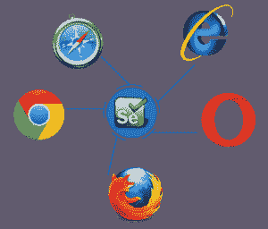
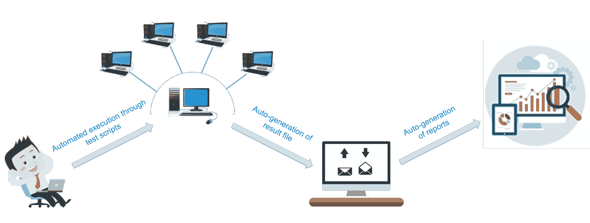
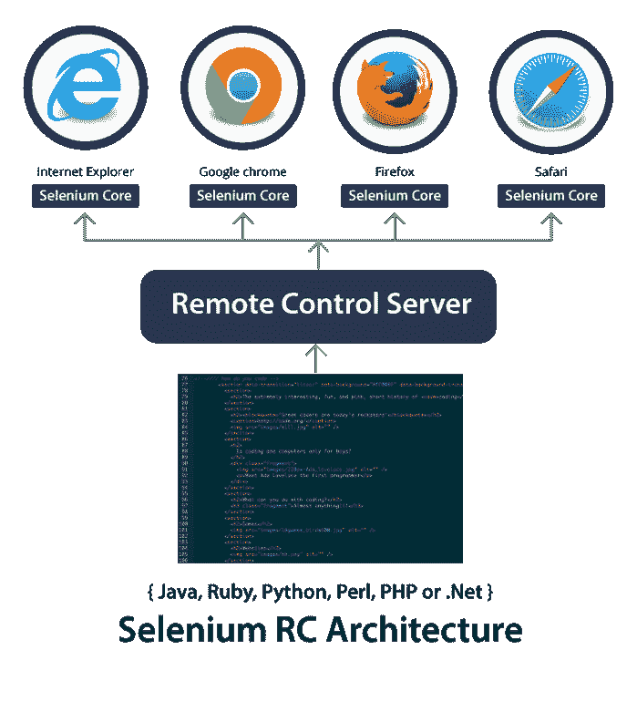
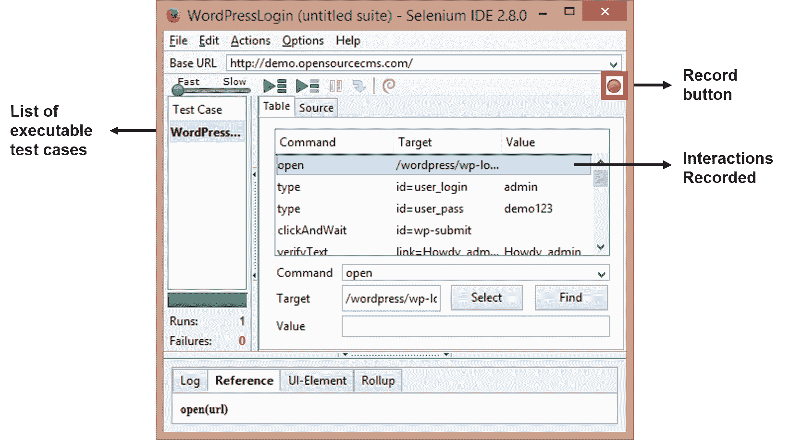
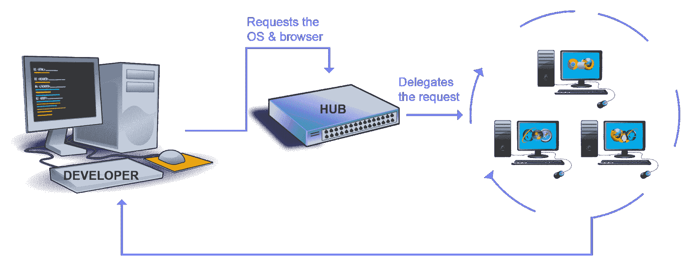

# 硒是什么？Selenium 自动化测试入门

> 原文：<https://www.edureka.co/blog/what-is-selenium/>

你知道什么是硒吗？你知道为什么要用它吗？如果你想知道这两个问题的答案，那么等到你读完这篇博客的全部内容，因为你会很高兴你花了大量的时间来了解你下一份工作的核心。

自动化测试风靡全球& ***[硒认证](https://www.edureka.co/selenium-certification-training)*** 是业内最抢手的技能之一。

## **硒是什么？**

Selenium 是一个开源工具，用于自动化在 web 浏览器上执行的测试(使用任何 web 浏览器测试 Web 应用程序)。

等等，在你忘乎所以之前，让我重申一下，只有 web 应用程序的测试才可能使用 Selenium。我们既不能使用 Selenium 测试任何桌面(软件)应用程序，也不能测试任何移动应用程序。

很糟糕，对吧？我能感受到你的痛苦。但是不要担心，有很多测试软件和移动应用的工具，比如:IBM 的 RFT，HP 的 QPT，Appium 等等。 但是，这篇博客的重点是，测试动态 web 应用程序，以及为什么 Selenium 最适合这个目的。

### **硒的优点是什么？**

由于 Selenium 是开源的，所以不涉及许可成本，这是相对于其他测试工具的一个主要优势。Selenium 越来越受欢迎的其他原因是:

*   测试脚本可以用这些编程语言中的任何一种来编写:[**【Java】**](https://www.edureka.co/blog/java-tutorial/)[**Python**](https://www.edureka.co/blog/videos/python-tutorial/)[**c#**](https://www.edureka.co/blog/c-sharp-tutorial/)[**PHP**](https://www.edureka.co/blog/php-tutorial-for-beginners/)[**Ruby**](https://www.edureka.co/blog/ruby-on-rails-tutorial/)[**Perl**](https://www.edureka.co/blog/videos/learn-perl-the-jewel-of-scripting-languages/)&**。净**
*   测试可以在以下任何操作系统中进行 **:** **Windows** ， **Mac** 或 **Linux**
*   可以使用任何浏览器进行测试: **Mozilla Firefox** ， **Internet Explorer** ， **Google Chrome** ， **Safari** 或 **Opera**
*   可以与[**TestNG**](https://www.edureka.co/blog/dataprovider-in-testng/)[**JUnit**](https://www.edureka.co/blog/junit-tutorial/)等工具集成，管理测试用例，生成报告
*   可与 **Maven** 、[Jenkins](https://www.edureka.co/blog/jenkins-tutorial/)&**Docker**集成实现连续测试

但是肯定会有缺点，对吗？

*   我们只能使用 Selenium 来测试 web 应用程序。我们无法测试桌面应用或任何其他软件
*   没有对硒的保证支持。我们需要利用现有的客户群体
*   无法对图像进行测试。我们需要将 Selenium 与 Sikuli 集成，以进行基于图像的测试
*   没有本地报告工具。但是我们可以通过将它与 TestNG 或 JUnit 等框架集成来克服这个问题

在这篇*什么是硒*的博客中继续深入之前，你应该知道硒是如何形成今天这个样子的背后的故事。所以，让我们按照下面的顺序来理解这个场景:

## **需要进行软件测试的**

软件测试是一切归结的地方。今天的技术世界完全由机器主导，它们的行为由驱动它的软件控制。这些机器会完全按照我们想要的那样运转吗？每次？到处都是？这些问题的答案在于软件测试。

最终，软件应用的成功率将会控制您的业务增长。甚至对于 web 应用程序也是如此，因为今天大多数企业完全依赖于互联网。

以任何一家电子商务公司为例。无论是亚马逊、E-Bay 还是 Flipkart，它们都依赖网站上的客户流量和基于网络的移动应用程序的流量来开展业务。

想象一下，如果发生了灾难性的事情，比如许多产品的价格被限制在 10 美元，而这一切都是因为代码中“不那么容易阅读”的一个小错误。 那还能做什么，下一次怎么预防呢？

通过在部署前测试代码对吗？所以，这就是软件测试的需要。 但是，硒是什么？是软件测试工具吗？嗯，Selenium 是一个自动化测试工具！

在我继续说下去之前，让我澄清一下，软件测试有两种类型:手工测试&自动化测试。Selenium 是作为一个自动化测试工具建立的，用来克服手工测试的缺点/限制。因此，在什么是 selenium 博客的下一部分，让我们了解手工测试的挑战。

## **挑战手工测试**

手动测试是指由 QA 测试人员手动测试(web)应用程序。需要在每个环境中使用不同的数据集手动执行测试，并且应该记录每个事务的成功/失败率。

看看上图，一个穷人手动验证记录的交易。他所面临的挑战会导致疲劳、厌倦、工作延迟、错误和失误，这些都是由于手工操作造成的。这导致了 Selenium(自动化测试工具)的发明。

## **自动化测试击败手工测试**

自动化测试每次都胜过手工测试。为什么？因为它更快，需要更少的人力资源投资，它不容易出错，频繁执行测试是可能的，支持熄灯执行，支持回归测试以及功能测试。

让我们举一个与前面提到的相似的例子。假设有一个登录页面，我们需要验证所有的登录尝试是否成功，那么编写一段代码来验证所有的事务/登录尝试是否成功(自动化测试用例执行)将会非常容易。

此外，这些测试可以配置成在不同的环境和网络浏览器中进行测试。还能做什么？您可以通过安排在一天中的特定时间自动生成结果文件。然后，您还可以根据这些结果自动生成报告。

关键的一点是自动化测试让测试人员的工作变得简单了很多。看看下面的图片，它显示了同一个测试人员在一个更放松的环境中工作。

现在，让我特别谈谈硒。

现在让我们看看硒在市场上的地位。

## **硒 vs QTP vs RFT**

我在下表中比较了它与其他两个流行工具的性能:QTP 和 RFT。

| **特征** | **HP QTP** | **IBM RFT** | **硒** |
| 执照 | 必需的 | 必需的 | 开源 |
| 成本 | 高 | 高 | 开源软件 |
| 客户支持 | 专门的惠普支持 | 专门的 IBM 支持 | 开源社区 |
| 脚本执行期间的硬件消耗 | 高 | 高 | 低 |
| 编码体验 | 不需要 | 必需的 | 需要大量的编码技能和经验 |
| 环境支持 | 仅适用于 Windows | 仅适用于 Windows | Windows、Linux、Solaris OS X(如果浏览器& JVM 或 JavaScript 支持存在) |
| 语言支持 | VB 脚本 | Java 和 C# | Java、C#、Ruby、Python、Perl、PHP 和 JavaScript |

从上表可以清楚地看出为什么 Selenium 是最受欢迎的工具。但是 Selenium 有许多不同的风格，您应该知道哪一种才是适合您需求的合适的 Selenium 工具。

## **硒套工具**

*   硒 RC(现已贬值)
*   硒 IDE
*   硒栅
*   Selenium WebDriver

### **硒的成分有哪些？**

下面我详细解释了硒的每一种成分:

### **【硒遥控】**

在讲述 Selenium RC 的细节之前，我想退一步讲讲 Selenium 项目中的第一个工具。硒核是第一个工具。但是，由于**同源政策**，Selenium Core 在跨域测试方面遇到了障碍。同源策略禁止 JavaScript 代码访问托管在与 JavaScript 启动位置不同的域上的 web 元素。

为了克服同源策略问题，测试人员需要安装 Selenium Core(一个 JavaScript 程序)和包含被测 web 应用程序的 web 服务器的本地副本，这样它们就属于同一个域。这导致了 Selenium RC 的诞生，它被授权给当时 *ThoughtWork 的*工程师、**保罗·哈曼特**。

RC 通过引入 HTTP 代理服务器来“欺骗”浏览器，使其相信 Selenium Core 和正在测试的 web 应用程序来自同一个域，从而解决了这个问题。从而使 RC 成为一个双组件工具。

1.  **硒 RC 服务器**
2.  **Selenium RC Clien**t—*库包含您的编程语言代码*

RC 服务器使用简单的 HTTP GET/ POST 请求进行通信。请看下图，了解钢筋混凝土架构。

Selenium 项目的旗舰工具是 Selenium RC，因为这是他们的第一个工具，它可以用来用不同的编程语言编写测试用例。 但是 RC 的缺点是每次与 RC 服务器的通信都很耗时，因此 RC 非常慢。如此之慢，以至于有时需要几个小时才能完成单项测试。

从 Selenium v3 开始，RC 已经贬值并被转移到传统包中。然而，你可以下载并使用 RC，但不幸的是你不能利用对它的支持。但是另一方面，为什么你要使用一个过时的工具，特别是当有一个更有效的工具叫做 Selenium WebDriver 的时候。在我谈论 WebDriver 之前，让我讨论一下 IDE 和 Grid，它们是组成 Selenium v1 的其他工具。

### **【硒 IDE(集成开发环境)**

2006 年，来自日本的 **Shinya Kastani** 将他的 Selenium IDE 原型捐赠给了 Apache 的 Selenium 项目。它是一个 Firefox 插件，用于更快地创建测试用例。IDE 实现了一个记录和回放模型，其中通过记录用户与 web 浏览器的交互来创建测试用例。这些测试可以回放任意多次。

Selenium IDE 的优势在于，通过插件记录的测试可以用不同的编程语言导出，如 Java、Ruby、Python 等。看看下面 Firefox 的 IDE 插件截图。

但是 IDE 的相关缺点是:

*   插件仅适用于 Mozilla Firefox 不适用于其他浏览器
*   无法测试动态 web 应用程序；只能记录简单的测试
*   测试用例不能使用编程逻辑编写脚本
*   不支持数据驱动测试

这些是硒 IDE 的一些方面。现在让我来谈谈硒网格。

### **什么是硒栅**

Selenium Grid 由 **Patrick Lightbody** 开发，最初被称为 HostedQA(最初是 Selenium v1 的一部分)，它与 RC 结合使用，在远程机器上运行测试。事实上，使用 Grid，可以在多台机器上同时执行多个测试脚本。

借助中枢节点架构实现并行执行。一台机器将充当集线器的角色，其他机器将充当节点。Hub 控制在不同操作系统中的不同浏览器上运行的测试脚本。在不同节点上执行的测试脚本可以用不同的编程语言编写。

网格仍在使用中，可以与 WebDriver 和 RC 一起工作。然而，维护一个包含所有必需的浏览器和操作系统的网格是一个挑战。为此，有多个在线平台提供了一个在线 selenium 网格，您可以访问它来运行 Selenium 自动化脚本。比如可以用 <u>[LambdaTest](http://bit.ly/2UZOaa5)</u> 。它有 2000 多种浏览器环境，您可以在这些环境中运行测试，真正实现跨浏览器测试的自动化。

### **什么是硒网驱动**

由西蒙·斯图尔特于 2006 年创立的 Selenium WebDriver 是第一个可以从操作系统层面控制浏览器的跨平台测试框架。与 IDE 相比，Selenium WebDriver 提供了一个编程接口来创建和执行测试用例。测试用例是这样编写的，即识别网页上的 web 元素，然后在这些元素上执行操作。

WebDriver 是 RC 的升级版，因为它速度更快。它更快，因为它直接调用浏览器。另一方面，RC 需要一个 RC 服务器来与 web 浏览器交互。每个浏览器都有自己的应用程序运行驱动程序。不同的网络驱动程序有:

*   火狐驱动(Gecko 驱动)
*   Chrome 驱动
*   Internet Explorer 驱动程序
*   歌剧司机
*   Safari 驱动程序和
*   HTM 单位司机

#### **硒的好处**

*   支持 7 种编程语言:JAVA、C#、PHP、Ruby、Perl、Python 和. net。
*   支持在各种浏览器上测试，如:Firefox、Chrome、IE、Safari
*   测试可以在不同的操作系统上进行，如:Windows、Mac、Linux、Android、iOS
*   克服了 Selenium v1 的局限性，如文件上传、下载、弹出窗口&对话框障碍

#### **Selenium web driver 的不足**

*   无法生成详细的测试报告
*   无法测试图像

无论面临怎样的挑战，这些缺点都可以通过与其他框架的集成来克服。对于测试图像，可以使用 Sikuli，对于生成详细的测试报告，可以使用 TestNG。

所以这个博客的结论是什么是硒。要了解关于 Selenium WebDriver 和 TestNG 的更多信息，请阅读 Selenium 教程博客系列中的其他博客。你也可以看下面一个行业专家的视频，她分享了她对 Selenium 作为自动化测试工具的看法。

## **硒是什么？|硒教程|硒训练|爱德华卡**

[//www.youtube.com/embed/5FUdrBq-WFo?rel=0&showinfo=0](//www.youtube.com/embed/5FUdrBq-WFo?rel=0&showinfo=0)

这篇“什么是硒”的博客是硒教程博客系列的第一篇。请继续关注 Edureka 的博客网站，了解更多关于 Selenium 的博客。

*如果您希望学习 Selenium 并在测试领域建立自己的事业，那么请查看我们在哥伦布的交互式在线直播 [Selenium 培训，它提供 24*7 支持，在整个学习期间为您提供指导。](https://www.edureka.co/selenium-certification-training-columbus)*

*有问题吗？请在“什么是硒”这篇文章的评论部分提到它，我们将会回复您或者今天就加入我们的课程。*