# 什么是 ServiceNow？–面向您企业的云解决方案

> 原文：<https://www.edureka.co/blog/what-is-servicenow/>

今天，IT 部门的目标是实现最佳效率。然而，这并不是一项容易的任务，因为他们在前进的道路上面临许多障碍。遗留系统仍在使用，这会大大降低它们的速度。在这篇什么是 ServiceNow 的博客中，我将介绍 ServiceNow 是如何在 ITSM 出现的，以及它是如何发展成为成熟的企业云解决方案的。

我们将讨论以下主题:

*   [为什么选择 ServiceNow？](#WhyServiceNow)
*   [什么是 ServiceNow？](#IntroToServiceNow)
*   [ServiceNow 架构](#ServiceNow%20Architecture)
*   [ServiceNow 应用](#ServiceNowApp)
*   [创建个人开发者实例](#PDI)

让我们从理解为什么是 ServiceNow 开始这篇什么是 ServiceNow 的博客。

## **ServiceNow 有什么用？(为什么选择 ServiceNow？)**

ServiceNow 是一个处理和分类客户服务请求的票务工具。您可以使用 ServiceNow 等工具提出处理事件、变更、问题和其他服务的请求。

自 2012 年以来，ServiceNow 就扎根于 ITSM。然而，随着不断变化的技术和云的出现，它创造了一个跨部门平台，作为一个构建在所有其他应用程序之上的企业云解决方案。它能够创建自动执行数据提取过程的**工作流**，这使得它成为当今云计算领域的一个独特产品。

ServiceNow 拥有庞大的客户群，每年都会回到它的平台。 现在让我们来看看不同的云部署模式以及 ServiceNow 的适用范围。

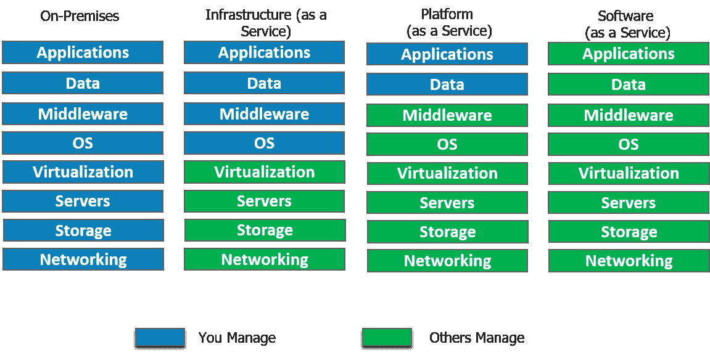

### **【基础设施即服务】**

*   简而言之，IaaS 给你一个 **服务器** 在云(虚拟机)里，你完全可以控制。
*   在 Iaas 中，您负责管理从操作系统到您正在运行的应用程序的一切。

### **【平台即服务】**

*   有了 PaaS，您就拥有了灵活性和简单性的结合。
*   灵活，因为它可以根据应用需求进行定制。
*   简单到不需要操作系统维护、版本、补丁。

### **【SaaS】**

*   第三方提供商托管应用程序的软件分发模式。
*   您只需通过互联网访问软件，而不是安装和维护软件。
*   自动更新减轻了内部 IT 人员的负担。

### **service now 在哪里？ServiceNow 是 SaaS 吗？**

以迎合 ITSM 、的 SaaS 模式起家的 ServiceNow 也冒险进入了 PaaS 云模式，在这种模式下，整个组织的业务流程可以通过单一记录系统进行管理。ServiceNow 提供了在单一平台上执行数据收集、存储以及应用程序开发所需的基础架构。虽然 ServiceNow 不提供内部 IaaS 部署模型，但它支持集成到 Microsoft Azure，这是一种 Iaas 模型。

它提供**配置管理数据库** (CMDB)以及支持服务感知应用的服务映射。服务映射显示了组织资产之间的依赖关系。这导致了商业环境中急需的*可见性*。

很好，现在让我们试着解决这个博客最重要的问题，什么是 ServiceNow？

## **什么是 ServiceNow？**

ServiceNow 成立于 2004 年，涉足 ITSM(信息技术服务管理)领域，为 IBM 和惠普等老牌企业提供竞争。今天，它不仅仅局限于 ITSM，尽管它仍然是其收入的主要部分。 现在，it 已经多元化为五大服务，包括 IT、安全、人力资源服务交付、客户服务和业务应用。 ServiceNow 是一个集成的**云**解决方案，它将所有这些服务组合在一个记录系统中。

ServiceNow 副总裁 Dominic Phillips， 在他的一个主题演讲中指出，尽管我们在消费领域目睹了如此多的"**颠覆"**，但组织内部的内部**业务流程**却缺乏效率。

在当今的数字时代，优步和 Airbnb 在预订出租车或预订桌子 时提供的**便捷性**正是 ServiceNow 希望向其企业内部客户提供的体验。

现在，让我们通过查看 ServiceNow 的架构来了解它的工作原理。

## **ServiceNow 架构**

如今，大多数云服务产品都运行在历史悠久的多租户架构上，如 AWS、Azure、Salesforce、Oracle 等。多租户架构创建了服务于多个客户的单个实例。这通常处理需要频繁维护的复杂数据库，经常导致客户的资源**不可用**。 这就是为什么 ServiceNow 采用了**多实例**架构。

**多实例架构:**为每个员工创建一个唯一的实例，维护一个单独的资源栈。这让我们能够自由处理每个用户的具体需求，使我们能够在**客户对客户**的基础上进行交易。 例如，可以根据合规性要求以及企业的当前需求部署客户升级。

在下图中，3 个客户有不同的实例，每个都有一个独立的资源池。 意思是，硬件共享的同时，软件:应用、中间件、数据库都是分开维护的。**数据隔离**是一个巨大的优势。这就是为什么一个客户的性能不会受到另一个客户实例的影响。很整洁，不是吗？

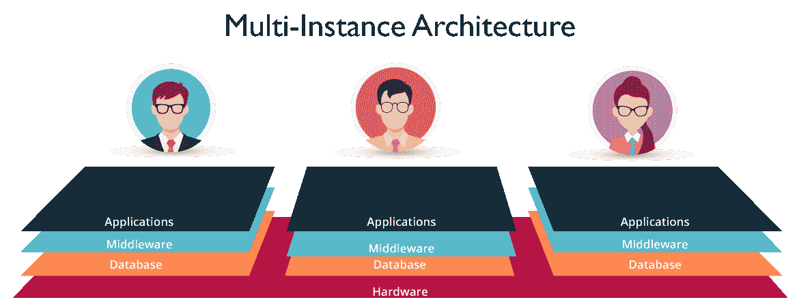

**图:** *什么是 ServiceNow——多实例架构*

## **ServiceNow 应用**

在这篇什么是 ServiceNow 的博客中，让我们 了解一下 ServiceNow 应用的概况。

### **IT 服务台**

一份报告发现，每周 45 小时中有 15 小时是在做与工作无关的事情。经查明，这是由于使用了过时的 ITSM 软件。

在 ServiceNow 中，为员工提供了一个自助服务门户，他们可以通过向相关部门员工发送消息来利用 IT 服务。 ServiceNow 将社交媒体应用的易用性带到了仍落后于传统系统的 ITSM 市场。

通过 **ConnectChat** ，工作人员可以实时回复。这可以看作是对传统邮件系统的改进，在传统邮件系统中，邮件必须来回发送。这支持跨部门共享文件。员工可以将**事件**文件作为对话的一部分，这样技术人员就可以直接查看事件记录并为请求提供服务。如果用户不确定哪个技术人员在值班，他可以创建一个所有技术人员都是成员的组。**可视化任务板**只需一个拖放动作，您就可以将任务分配给不同的部门。

### **解决安全威胁**

尽管有先进的安全管理机制来检测威胁，但当出现安全漏洞时，大多数公司都面临着解决问题的艰巨任务。

ServiceNow 使用**结构化工作流**，这有助于根据风险的严重性及其对组织的影响确定风险的优先级。

使用电子表格和手动处理，威胁研究通常需要 45 分钟。

然而，自动化工具在平台内部提供这些信息，从而将相关时间缩短至 20 秒以下。

### **人力资源服务交付**

有没有想过，人力资源部门如何把大部分时间花在重复的任务上，比如员工入职，而实际上他们应该专注于战略任务？

ServiceNow 希望摆脱所有的手动处理。 这些任务跨越 IT、设施、法律和财务等不同部门。ServiceNow 的 **single** platform c 可以用来连接 HR **工作流**与所有这些部门。使用其跟踪和趋势分析工具，可以轻松做出决策。人力资源部现在拥有类似消费者的可定制表格，为员工提供满意的服务。

### **客服**

当前需要的是提供不间断的高质量服务，同时牢记成本限制。ServiceNow 正在将客户服务转变为一项团队运动。与仅限于客户参与的 CRM(客户关系管理)不同，ServiceNow 客户服务管理(CSM)通过连接**合适的**人员、系统和工作流程来运作。

客户服务不仅限于解决客户票证。每当客户面临问题时，我们都需要找到问题的根源。从长远来看，这将减少案例(票证)数量。ServiceNow 附带了**服务映射**，它提供跨职能信息 到 来发现最初发现错误的初始点。

ServiceNow 使跨工程、现场服务、法律等不同部门的派遣变得容易。以不工作的咖啡机为例。现场代理甚至在开始与客户交谈之前就被告知可能的问题。通过**实时**通知主动通知客户，确保客户满意并快速解决问题。

### **业务应用**

ServiceNow 采用拖放方式，无需编写一行代码即可定制业务应用。对于有经验的开发人员来说，您将永远不必从头开始，因为您可以从可重用的组件、工作流 中进行选择，并使用来自云的信息连接跨部门的障碍。

现在让我们继续阅读这个什么是 ServiceNow 博客，了解什么是 PDI。

### **【个人开发者实例(PDI)**

PDI 用于演示 ServiceNow 的功能。开发者、客户甚至合作伙伴都可以使用。这个实例背后的动机是，它不会干扰**生产**实例。应用程序的想法可以在 PDI 上测试，但不会添加到最终的应用程序库中。

只要有规律的活动，就可以保留实例。要被认为是积极的，你需要在 14 天内创建应用程序或编写脚本。现在我们已经了解了 PDI 的，让我们继续探索 ServiceNow 平台。

## **【创建个人开发者实例(PDI)**

要申请个人开发人员实例，ServiceNow 开发人员计划将为您提供一个功能齐全的实例，适合单个开发人员使用。让我们研究一下请求个人开发人员实例的两个选项。

**第一步:[在 https://developer.servicenow.com](https://developer.servicenow.com/)登陆**开发者网站。

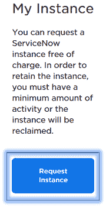 **步骤 2:** 通过执行以下任一操作来请求 PDI。

*   在仪表板主页中，单击请求实例。

从开发人员站点上的任何页面，导航到管理>T3 实例，然后单击请求实例。

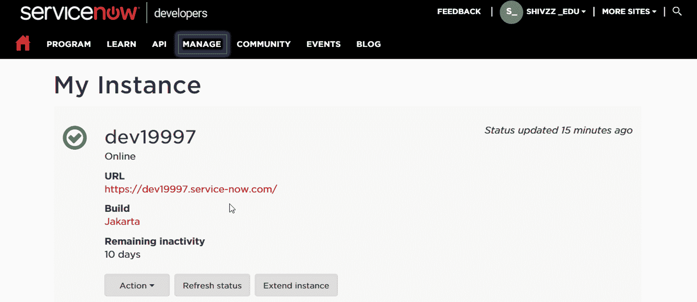

注册成功，会得到一个实例副本，如上图。 你可以点击网址，用你的凭证登录。

service now 用户界面如下所示。我们以系统管理员身份登录。 其主屏幕由以下三个元素组成:

1.  **横幅**:左上角包含 ServiceNow 标志。在右边，你会发现全球搜索引擎，连接聊天，帮助菜单和设置。
2.  **应用导航器**:我们有一个业务应用和模块的列表。
3.  **内容框架:**由表格、列表等不同的数据格式组成。

下图是管理员主页的概述。

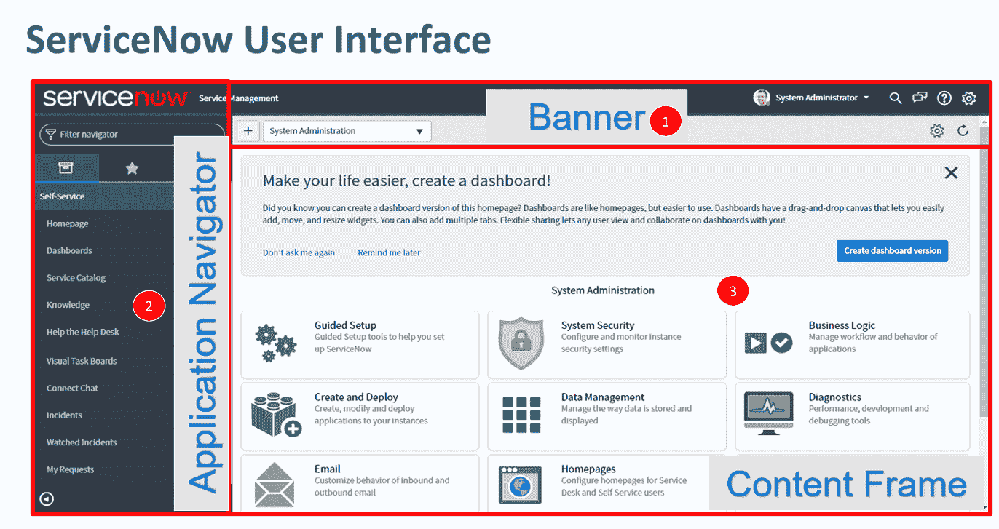  **自定义 UI** 

在这篇什么是 ServiceNow 的博客中，让我们看看如何定制我们的开发人员实例的用户界面。具有管理员角色的用户可以更改 UI 设置。默认情况下，我们使用 UI 16 界面。让我向您展示如何修改标题文本和添加横幅图像。

**第一步:** 搜索系统属性。寻找基本配置选项卡。

这使您可以访问**系统配置**设置。

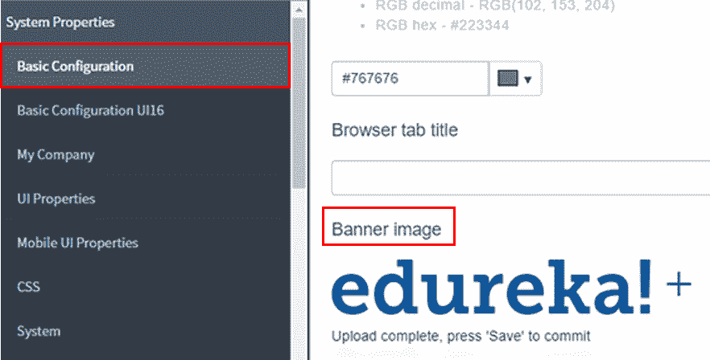

**第二步:**你现在可以设置页面的 标题，也可以更新横幅图片。

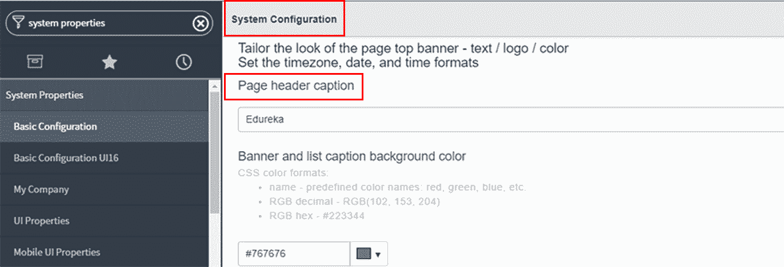

下面是更新后的横幅图片和标题说明。

接下来，让我们现在学习如何在 ServiceNow 中创建报告。

### **创建报表**

**第一步**:我们可以从现有的表格或数据源创建报表。在我们的示例中，我们将从包含所有事件的现有事件表中生成一个报告。

**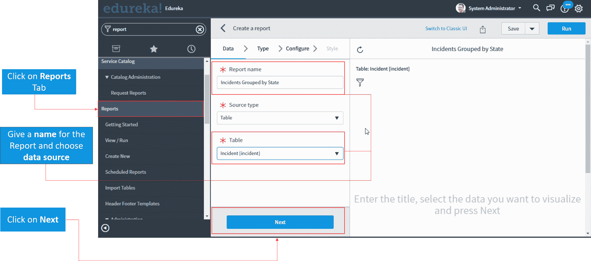**

**第二步:**要显示我们的报告，我们可以从条形图、饼状图和许多其他选项中进行选择。在我们的例子中，我们将选择条形图选项。

****

**第三步:**我们根据**状态**参数对我们的报表进行分组。这将事件分为打开、进行中、关闭和已解决状态。

**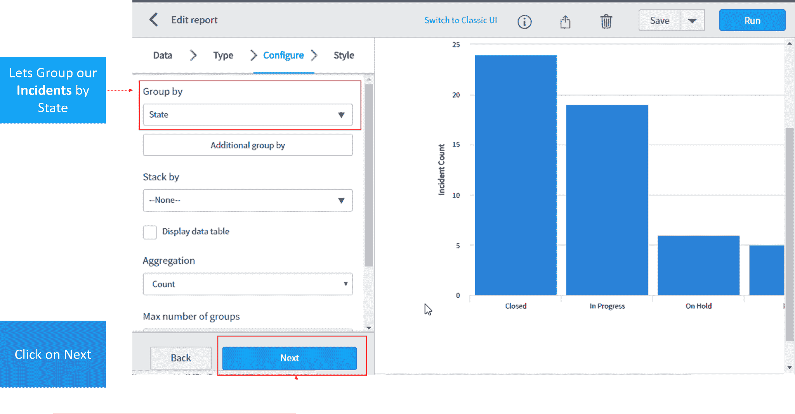**

**第四步**:我们可以根据自己的风格要求定制报表。一旦生成，我们的报告可以与其他用户和组共享。

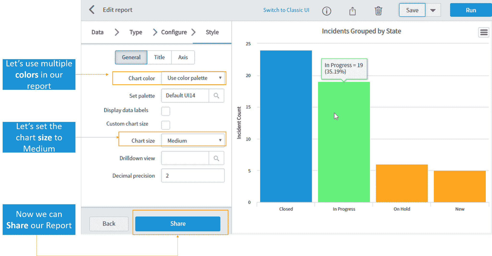

很酷不是吗？ 现在让我们来分解一下 ServiceNow 的另一个简洁的特性。我们已经提到的一个是工作流。

## **工作流程**

工作流提供任务进度。这可以在工作流的**阶段**字段中看到。 工作流用于评估流程中的每个阶段，并自动执行日常任务。 这可以比作 亚马逊 订单履行。ServiceNow 利用了 ITSM 场上一个主要**选手**的*缺*。这只是他们在 ITSM 吸引消费者的例子之一。

service now 中工作流的不同阶段如下: 等待审批、履行、配置、交付和完成。每个阶段表示任务是处于**进行中**、**未决**还是**完成**状态。自动向受分配人发送提醒**，突出显示**其任务的当前进度。

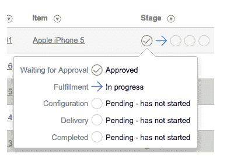

**图:** *什么是 service now–Workflows*

这让我们结束了这个什么是 ServiceNow 的博客。希望这是信息和帮助你。快乐学习！！

*如果你在“**上找到这个博客，什么是 ServiceNow？”**有用，查看 Edureka 提供的 ServiceNow 管理认证课程，edu reka 是一家值得信赖的在线学习公司，在全球拥有超过 250，000 名满意的学习者。本课程将为您提供对 ServiceNow 平台的全面深入了解，包括管理功能和自动化工作流。*

*有问题吗？请在评论区提到它，我们会给你回复。*