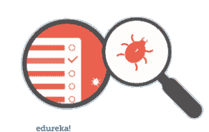
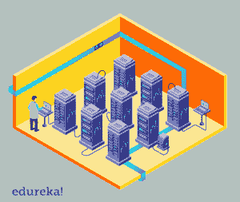
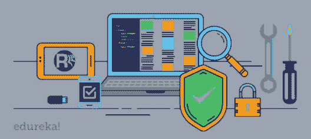
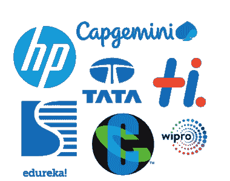

# 什么是软件测试？关于方法和测试你需要知道的

> 原文：<https://www.edureka.co/blog/what-is-software-testing/>

今天的技术世界完全由机器主导，它们的行为由驱动它的软件控制。软件测试解决了我们对机器按照我们希望的方式运行的所有担忧。这篇关于“什么是软件测试”的文章将按照以下顺序为您提供关于测试如何工作的深入知识:

*   [什么是软件测试？](#softwaretesting)
*   为什么我们需要测试？
*   [软件测试的原则](#principles)
*   [软件测试生命周期](#lifecycle)
*   [测试类型](#typesoftesting)
*   [软件测试公司](#softwarecompanies)

## **什么是软件测试？**

软件测试是评估软件应用程序的功能以发现任何软件缺陷的过程。它检查开发的软件是否满足指定的要求，并识别软件中的任何缺陷，以便生产出高质量的产品。它基本上是执行一个系统，以便识别与实际需求相反的任何差距、错误或缺失的需求。

它也被称为验证和确认软件产品的过程。它检查软件产品是否:

现在让我们继续这篇关于什么是软件测试的文章，并了解更多关于测试的重要性。

## **我们为什么需要软件测试？**

软件应用的成功率控制着我们业务的增长。它对软件应用程序和产品的开发起着重要的作用。

我们需要软件测试的原因如下:

1.  **成本效益**–测试有很多好处，其中最重要的一个就是成本效益。从长远来看，按时测试我们的项目可以节省资金。软件开发由许多阶段组成，如果在早期阶段发现错误，修复它们的成本会低得多。【T2
2.  安全-这是软件测试中最敏感和最脆弱的部分。用户总是在寻找他们可以依赖的值得信赖的产品。它有助于预先消除问题和风险。****
3.  **产品质量**–为了让你的产品愿景成真，它必须按计划进行。遵循产品要求很重要，因为这有助于您获得所需的最终结果。T3
4.  **客户满意度**–产品负责人的最终目标是让客户满意。应该对软件进行测试，以尽可能带来最好的用户体验。成为这个饱和市场中的最佳产品将帮助你获得值得信赖的客户，这将产生巨大的长期影响。

现在让我们继续，看看软件测试的一些原则。

## **软件测试原理**

软件测试非常有想象力，是测试人员要执行的一项智力任务。软件或应用程序的测试由一些原则组成，这些原则在测试项目时对软件测试人员起着重要的作用。

软件测试的原则如下:

1.  软件测试有助于发现缺陷:测试任何软件或项目都有助于发现一些缺陷，这些缺陷可能被开发人员发现，也可能不被发现。然而，仅仅测试软件并不能确定你开发的项目或软件没有错误。因此，设计测试用例并找出尽可能多的缺陷是至关重要的。
2.  **有效的测试是不可能的**:除非你的测试项目或应用程序有一个简单明了的结构，并且输入有限，否则不可能或无法检查和测试所有可行的数据集、模块和场景。
3.  早期测试:你越早开始测试你的项目或软件，你就会越好地利用你现有的时间。
4.  **集群中的缺陷**:在测试时，您可以观察到报告的大多数缺陷或 bug 是由于您的软件或系统中的少量模块造成的。**T3**
5.  软件测试是依赖于上下文的:各种各样的方法、程序和测试种类定义了应用程序的类型和特征。例如，与健康设备相关的应用程序比游戏或小软件需要更多的测试和基于医生的反馈。
6.  无错误或无 Bug 的软件是一个神话:仅仅因为当一个测试人员测试了一个应用程序并且没有在那个项目中发现任何缺陷，并不表明或者暗示你的软件已经可以发布了。

既然我们已经知道了软件测试和它的原则，让我们继续前进，看看软件测试的生命周期。

## **软件测试生命周期(STLC)**

 [软件测试生命周期](https://www.edureka.co/blog/software-testing-life-cycle/)是测试团队为确保软件或产品质量而执行的一系列不同活动。它定义了执行软件测试的一系列活动。它还确定了要执行的测试活动以及何时完成这些测试活动。在 STLC 过程中，每项活动都是以有计划、有系统的方式进行的，每个阶段都有不同的目标和可交付成果。

软件测试生命周期的不同阶段有:

*   **需求分析**–需求分析是软件测试生命周期的第一步。在这一步，质量保证(QA)团队根据我们将要测试的内容理解需求&找出可测试的需求。
*   **测试计划**–测试计划是 软件测试生命周期 中最重要的阶段，在这里定义了所有的测试策略。这个阶段也被称为 **测试策略** 阶段。在这个阶段，测试经理参与确定整个项目的工作量和成本估计。它定义了项目的目标&范围。
*   测试用例开发–一旦测试计划阶段完成，测试用例开发就开始了。 这是 STLC 的阶段，测试团队记录详细的测试用例。除了测试用例，测试团队还为测试准备测试数据。一旦测试用例准备好了，这些测试用例就由同行成员或 QA 领导评审。
*   测试环境设置–设置测试环境是软件测试生命周期中至关重要的一部分。测试环境是测试团队执行测试用例的软件和硬件的设置。它支持硬件、软件和网络配置的测试执行。
*   测试执行软件测试生命周期的下一个阶段是测试执行。 测试执行是执行代码并比较预期和实际结果的过程。当测试执行开始时，测试分析师根据项目中允许的测试策略开始执行测试脚本。
*   测试周期结束–软件测试生命周期的最后阶段是测试周期结束。它包括 c 召集测试团队成员开会&评估基于测试覆盖、质量、成本、时间、关键业务目标和软件的周期完成标准。

继续这篇关于什么是软件测试的文章，让我们看看测试的类型。

## **测试类型**

测试是任何成功的软件项目不可或缺的一部分。测试的类型取决于各种因素，包括项目需求、预算、时间表、专业知识和适用性。软件测试是一个巨大的领域，但它可以大致分为两个领域，例如:

*   **手动测试**–手动测试是一种软件测试，测试人员在不使用任何自动化工具的情况下手动执行测试用例。这意味着应用程序是由 QA 测试人员手工测试的。

需要在每个环境中使用不同的数据集手动执行测试，并且应该记录每个事务的成功率或失败率。这种类型的测试需要测试人员的知识、经验、分析/逻辑技能、创造力和直觉。

用于**手动测试**的**工具**有:

1.  -烫烫烫烫-烫烫烫烫烫烫烫烫烫烫烫烫烫烫烫烫烫烫烫烫烫烫烫烫烫烫烫烫烫烫烫烫烫
2.  Bugzilla
3.  吉拉
4.  螳螂
5.  开源软件应用
6.  雷米恩
7.  福格布兹
8.  灯塔

*   **自动化测试**–自动化测试是一种自动化技术，测试人员自己编写脚本，使用合适的软件对软件进行测试。它基本上是一个手工过程的自动化过程。像回归测试一样，自动化测试也用于从负载、性能和压力的角度测试应用程序。

自动化测试允许您执行重复的任务和回归测试，而无需人工测试人员的干预。尽管所有的过程都是自动执行的，但是自动化需要一些手工工作来创建初始的测试脚本。

用于**自动化** **测试**的一些**工具**有:

谈到测试自动化，Selenium 是一个家喻户晓的名字。它被认为是 Web 应用程序用户界面自动化测试的行业标准。

继续这篇关于什么是软件测试的文章，让我们看看一些使用软件测试的顶级公司。

## **软件测试公司**

有许多大公司提供测试服务以及其他核心软件开发服务。让我们来看看软件测试公司中的一些大公司:

*   科学软件
*   凯捷
*   Wipro
*   知道的
*   大功率(High Power)ˌ高压(High Pressure)ˌ高性能(High Performance)ˌ高聚物(High Polymer)
*   印孚瑟斯
*   交通管制站（trafficcontrolstation）
*   Hexaware

至此，我们结束了这个“什么是软件测试”的博客。我希望你们喜欢这篇文章，并且理解什么是软件测试以及测试周期中涉及的步骤。

*既然你已经理解了测试，那就来看看 Edureka 的 [**软件测试基础课程**](https://www.edureka.co/software-testing-fundamentals-training) ，这是一家值得信赖的在线学习公司，在全球拥有超过 250，000 名满意的学习者。本课程旨在向您介绍完整的软件测试生命周期。您将学习不同级别的测试、测试环境设置、测试用例设计技术、测试数据创建、测试执行、错误报告、DevOps 中的 CI/CD 管道以及软件测试的其他基本概念。有问题要问我们吗？请在“什么是软件测试”的评论部分提到它，我们会给你回复。*