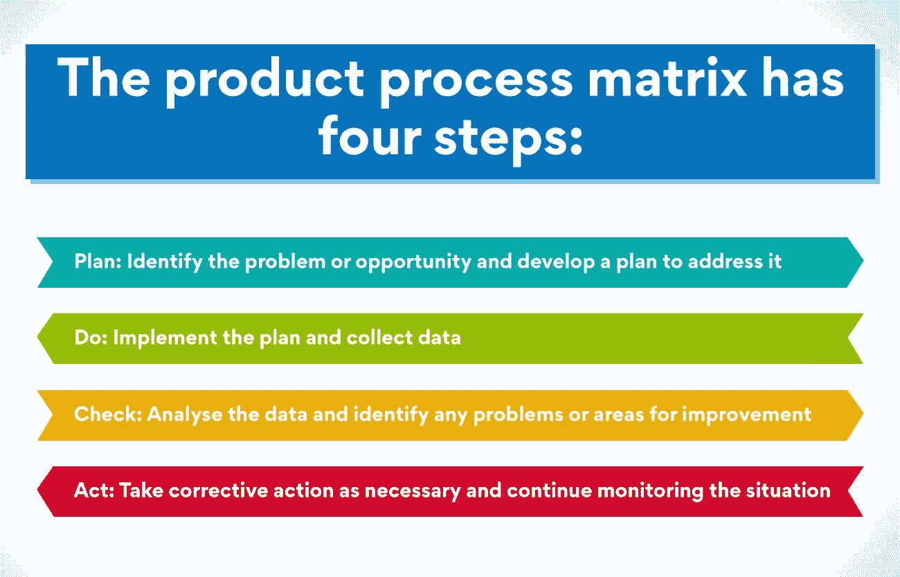
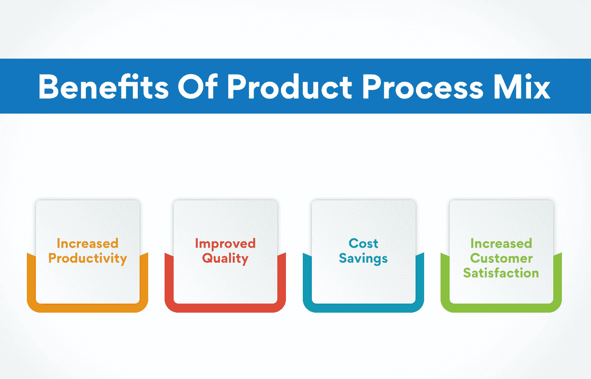
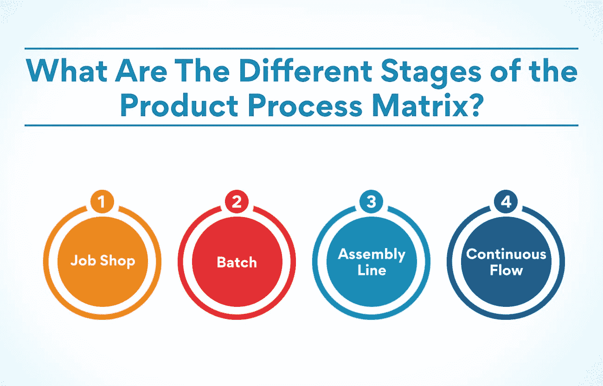

# 什么是产品过程矩阵？

> 原文：<https://www.edureka.co/blog/what-is-the-product-process-matrix/>

产品流程矩阵是运营经理用来分析和优化产品开发流程的工具。它有助于确定需要改进的地方，并有助于缩短产品开发时间。它通常与其他工具结合使用，如流程图和甘特图。我们将讨论产品过程矩阵，以及如何使用它来改进您的产品开发过程！

## **了解产品流程矩阵:概述**

这是一个二维网格，帮助运营经理可视化产品类型和生产流程之间的关系。产品流程矩阵分为四个象限，每个象限代表不同类型的产品流程组合。

*   第一象限包含使用高度自动化流程大规模生产的产品。
*   象限 II 拥有使用半自动或手动流程批量生产的产品。
*   象限 III 包含使用半自动或手动流程定制的产品。
*   象限 IV 包括使用高度定制的手工流程定制的产品。

产品流程矩阵可以帮助运营经理决定生产哪种类型的产品和使用哪种生产流程。它还可以帮助管理者理解产品多样性和生产效率之间的权衡。

## **回忆过去:产品流程矩阵的历史**

它是运营管理中使用的一种工具，帮助企业确定生产产品或服务的最佳方式。它是由美国统计学家、质量控制专家和管理顾问 W. Edwards Deming 博士首先提出的。产品流程矩阵也被称为戴明循环或 PDCA(计划-执行-检查-行动)循环。

产品流程矩阵是一个简单而强大的工具，可用于提高任何组织的质量和生产率。它建立在持续改进的原则上，这是戴明于 1930 年代在贝尔电话实验室工作时发展出来的。产品流程矩阵有四个步骤:

*   计划:找出问题或机会，并制定计划来解决它。
*   执行:实施计划并收集数据。
*   检查:分析数据，找出任何问题或需要改进的地方。
*   行动:采取必要的纠正措施，并继续监控情况。

产品流程矩阵可以改善从制造到客户服务的任何流程。一次又一次，它成为六适马和其他质量改进计划的重要工具。正确使用时，产品过程矩阵可以帮助组织实现其质量和生产率目标。

想深入产品管理，以互动的方式了解更多产品流程矩阵？Edureka 为您带来的是极致而有见地的课程，即[产品管理高级证书](https://www.edureka.co/highered/advanced-executive-program-in-product-management-iitg)。如果你想享受学习产品管理的灵活性和轻松，这个课程就是为你准备的。

## **产品流程组合的优势**

**生产率提高**

产品流程矩阵有助于提高生产率，因为它提供了一个员工可以遵循的清晰而简明的计划。这反过来会减少混乱和错误。当产品过程被很好地定义时，它也允许更容易地培训新员工和减少入职时间。总体而言，产品流程矩阵有助于提高工作场所的效率，进而提高生产率。

**质量提高**

产品流程矩阵的另一个好处是可以帮助提高产品质量或服务质量。有组织的流程有助于确保所有步骤都按照正确的顺序正确执行。

产品流程矩阵有助于提高产品或服务的质量。质量的提高可以让顾客更满意，增加销售额。它将最终导致一个更少的错误和更高质量的产品或服务的状态。

**成本节约**

产品流程矩阵也有助于节约成本。这是因为当生产流程定义良好时，它们可以减少浪费和错误。这将节省时间和金钱，否则将花费在纠正或纠正错误。此外，它还有助于提高公司的整体效率，从而进一步节约成本。

**提高客户满意度**

最后，产品流程矩阵还有助于提高客户满意度。一丝不苟的流程更容易确保产品或服务按时交付并满足客户期望。

快乐的顾客一定会回来，甚至向别人推荐你的公司。因此，提高客户满意度对任何企业都是至关重要的，产品流程矩阵可以帮助您实现这一目标。

## **在产品管理中的意义**

如前所述，[产品经理](https://www.edureka.co/blog/how-to-become-a-better-product-manager-top-10-tips/)可以用它来简化他们的产品开发流程。通过了解和利用产品流程矩阵，产品经理可以更有效地管理他们的产品组合，优先考虑产品特性和要求，并更有效地分配资源。

此外，产品流程矩阵还可以帮助产品经理识别流程改进和产品创新的机会。通过更好地理解产品过程矩阵，产品经理可以更有效地识别和解决他们的产品开发过程中可能效率低下或可以改进的地方。

**有什么优势？**

产品流程矩阵带来了许多优势，例如它可以帮助整个公司标准化运营。这可以提高效率和效力，改善质量控制。此外，产品流程矩阵有助于改善公司内不同部门之间的沟通。这最终会导致部门之间更好的协调与合作，从而进一步改善运营。

最后，产品流程矩阵有助于确定公司运营中需要改进的地方。通过识别这些方面，公司可以采取措施来纠正它们，并提高整体绩效。因此，产品流程矩阵提供了几个对公司极为有利的优势

**缺点:**

产品流程矩阵有许多缺点，包括:

*   很难理解和使用，尤其是对于拥有复杂产品组合的企业。
*   它没有考虑企业可能拥有的不同类型的产品和流程。
*   它没有考虑技术或客户需求变化的影响。

## **产品流程矩阵的不同阶段是什么？**

运营管理是设计、控制和监控生产过程的过程。它是运营经理用来帮助他们理解和控制生产过程的工具。

产品流程矩阵有四个不同的阶段:

*   工作车间
*   批次
*   装配线
*   连续流

**工作车间**

在作业车间阶段，每件产品都是单独制造的，没有固定的生产顺序。这种产品可以根据顾客的要求定制。这是控制产品质量的最关键阶段。

产品经理必须建立质量控制程序和产品标准。他们还需要密切监控生产过程，以确保产品符合客户要求。

**作业车间阶段涉及的任务:**

*   建立产品质量标准
*   建立质量控制程序
*   密切监控生产过程
*   根据需要改变产品以满足客户需求

**车间作业阶段示例**

裁缝店是工作店阶段经营的一个例子。每件产品(套装、连衣裙、裤子等。)是根据客户的规格单独制造的。没有固定的生产顺序，因此裁缝可以根据需要改变产品以满足顾客的要求。

**批次**

在批量阶段，产品是小批量生产的。有一套生产顺序，每件产品一次做一件。这通常用于定制产品或定制产品。

值得注意的是，批量阶段主要用于产品制备。换句话说，产品组装只有在批量生产完成后才真正开始。批量生产阶段的产品质量通常非常高，因为每个产品都是单独制作的。

**批量阶段涉及的任务:**

*   将生产中使用的库存项目一起分批
*   组装产品部件
*   执行产品质量保证检查
*   包装待运产品
*   向客户运送产品

**批处理阶段示例:**

批量生产的一个典型例子是生产特殊订单的计算机。该特定计算机的所有组件将被收集在一起(分批)，然后根据客户的规格组装在一起(装配)。将进行最终的产品质量检查(质量保证)，并将产品包装以便装运(包装)。

**装配线**

这个阶段致力于产品的物理组装。这一过程通常由机器完成，但也可以手工完成。质量控制在这个阶段非常重要，以确保产品符合所有规格。

这里的简化流程对于确保快速高效地组装产品至关重要。它还强调了评估装配线成功与否所需监控的关键绩效指标(KPI)。

**装配线阶段涉及的任务:**

*   根据规格组装产品
*   产品质量控制
*   监控关键绩效指标

**装配线阶段示例:**

像特斯拉和松下这样的公司使用装配线来生产他们的产品。每件产品都要经过一系列的工位，在这些工位上有一组工人在工作。产品沿着生产线移动，直到完成。

**连续流**

最后，在连续流动阶段，产品能够以恒定的速度不间断地生产。产品流程矩阵对于理解非常重要，因为它为组织提供了一种规划产品开发旅程的方式。

它创造了一个持续的流程和产品信息流，可用于在整个过程中进行改进。这个阶段需要特别注意细节，因为任何中断都可能导致进一步的延迟。

**连续流程阶段涉及的任务:**

*   质量控制
*   调度
*   库存管理
*   产能规划
*   文档
*   变更管理

**连续流动阶段示例:**

为了理解连续流阶段，我们来看一个例子。在汽车工业中，一个产品在销售之前要经历不同的阶段。连续流程从产品设计完成后开始，经过生产、装配和测试。

## **产品流程矩阵之后是什么？**

现在你知道了什么是产品流程矩阵，你可能想知道接下来会发生什么。毕竟，仅仅知道这一基本运营管理工具的基础是不够的，你需要知道如何将它付诸行动。

幸运的是，这并不像听起来那么难。事实上，一旦你理解了它，你就能够用它来以许多不同的方式改进你的操作。以下是您可以用这个工具做的一些事情:

*   使用它来简化您的操作
*   用它来提高你的产品质量
*   用它来降低你的成本

如您所见，产品流程矩阵是一个强大的工具，可用于以多种不同方式改善您的运营。然而，重要的是要确定正确的方法来利用这一工具，使[产品开发](https://www.edureka.co/blog/dynamic-stages-of-the-new-age-product-development-process/)获得最大利益。

## **底线**

简而言之，它是一种可以用来帮助简化操作和提高产品质量的工具。如果你从事制造业或产品开发，这绝对值得考虑实施。

当然，与任何工具一样，产品流程矩阵既有优点也有缺点。一个潜在的缺点是设置和维护可能很耗时。然而，如果你能够克服这一障碍，好处是巨大的。

想进入运营管理领域吗？从 Edureka 提供的互动和有见地的课程开始。在实践和同步学习的基础上，[运营、供应链和项目管理高级证书](https://www.edureka.co/highered/advanced-program-in-operations-supply-chain-project-management-iitg)将让你向该领域最好的导师学习。请查看本课程，了解有关其功能的详细信息。