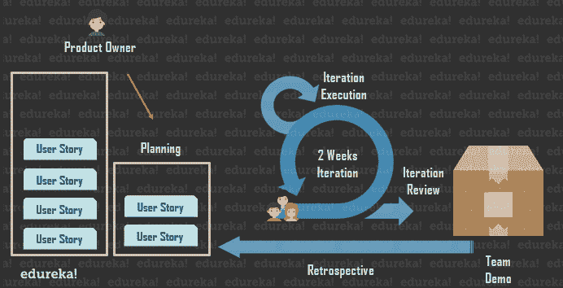
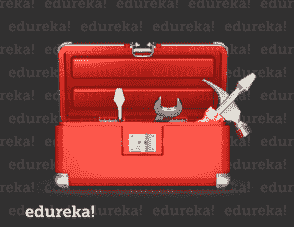
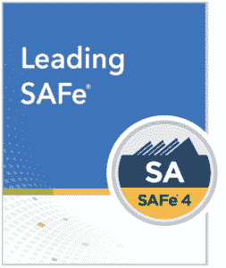

# 如何选择适合自己的安全认证？

> 原文：<https://www.edureka.co/blog/which-safe-certification-to-choose/>

[***安全***](https://www.edureka.co/blog/what-is-safe/) 一个经过修饰的首字母缩写词，代表可伸缩的敏捷框架。小写的*【e】*结尾把 *SAF* 变成了  *SAFe，*使得 SAFe“SAFe”成为一个极好的营销考虑因素。它描述了实践安全是安全的，并通过降低企业中的风险增加了安全级别。但是 ***选择哪个安全认证呢？***

这篇文章旨在帮助你做这个选择，以下是它将涵盖的主题；

*   [**什么是安全？**](#whatissafe)
*   [**为什么安全很重要？**](#whyissafeimportant)
*   [**Scrum 入门**](#scrum)
*   [**选择哪个安全认证？**](#whichsafecertificationtochoose)
*   [**注册安全敏捷师(SA)课程**](#sa)

## **什么是安全的？**

SAFe 是首字母缩写，代表 [***缩放敏捷框架***](https://www.edureka.co/blog/scaled-agile-framework/) 。它是一套组织和工作流程模式，旨在指导企业进行**扩展**精益和**敏捷**实践。SAFe 促进了大量敏捷团队之间的联合、协作和交付。

****

## 为什么安全很重要？

既然你已经理解了缩写是什么，你需要知道外管局带来了什么。

大多数人认为安全是一种扩展敏捷的方式，通常是。这是事实，但安全远不止于此。作为一个在这个领域工作了很长时间的人，我可以告诉你的是，在 SAFe 出现之前，所有的敏捷转换都导致了混合。

原因很简单。Scrum， [***敏捷***](https://www.edureka.co/blog/agile-project-management/) 的形式在绝大多数企业中使用，最初是为从事小项目的小组织的小团队设计的。每一个让 Scrum 适应公司的改变都是非敏捷过程。

这非常重要。敏捷社区中的人是否致力于开发敏捷方法来在组织中扩展敏捷框架？当然，他们做到了。但是，大多数组织所做的是对系统进行本能的修改，使它们相互连接。

不幸的是，许多组织并没有从他们自己开发的敏捷转换努力中得到想要的结果，最终又回到了非敏捷方法。这是非常不幸的，因为它玷污了敏捷，并且它花费了许多公司大量的金钱，却很少或者没有投资回报。

失败的主要原因是公司利用没有经验的资源来实施敏捷。但另一个因素是，他们不容易获得一个内聚的结构来进行非常重要的转变。

安全是一种扩展敏捷结构的清晰方法，比如[***【Scrum】和***](https://www.edureka.co/blog/scrum-vs-kanban/) 【看板】。它是一组支持结构，使敏捷方法在更大的企业环境中工作。理解作为一个系统的扩展敏捷框架很重要，因为它为组织提供了他们需要的连接途径。这是在任何计划利用敏捷并让其员工获得 SAFe 认证 [***的组织中加入 SAFe 的一个重要原因。***](https://www.edureka.co/blog/how-to-get-safe-certified/)

#### **安全是不是太规定性了？ **

有一种说法是，外管局的规范性很强，可能比需要的多一点。  *保险箱是一个工具箱，你不需要的就不要用。* 如果你只需要螺丝刀，那你就把锤子留在工具箱里。

不过，说真的，我认为*过于规定性*的论点是一种避免学习新事物的态度。在没有人想改变任何事情的组织中，你会遇到同样的心态。这种*‘如果它没坏，就不要修理它’*的态度限制了个人和企业的启发式进化。这最终违背了敏捷的目的。所以，我驳回它。

## 【Scrum 入门

那么我推荐什么呢？

首先，如果你有一年或一年以上的敏捷经验，你可以跳过这一节，进入下一节。如果没有，你需要在 [***Scrum***](https://www.edureka.co/blog/agile-scrum-tutorial/) 有一点基础。首先，你需要上一堂 Scrum 课。

现在，这和我上面写的有矛盾吗？可能有一点？但是就像你需要在大学之前从高中毕业一样，你需要在练习安全之前使用 Scrum。有几种 [***Scrum Master 认证***](https://www.edureka.co/blog/how-to-become-a-certified-scrum-master/) 件训练，即；

1.  ***敏捷大师——适应性敏捷 Scrum 大师***
2.  ***Scrum 联盟—[认证 Scrum 大师](https://www.edureka.co/certified-scum-master-certification-training)***
3.  ***scrum.org——职业 Scrum 大师***
4.  ***规模化敏捷学院——安全 Scrum 大师***

## **选择哪个安全认证？**

最后，我们来看一个关键问题。选择哪个安全认证？Scaled Agile 使它的类很容易做出选择，但是分离选择的最基本的方法如下:

*   如果你碰巧是一个 Scrum 大师；
    *   **SSM** 是你想要的，如果你在[***Scrum Master***](https://www.edureka.co/blog/scrum-master/)角色中是新鲜的
    *   **ASSM** 如果你有至少一年的[***Scrum Master***](https://www.edureka.co/blog/scrum-master-roles-responsibilities/)的经验，那就是你想要的。
*   如果你恰好是**产品负责人；**

    **SPMPO** 是给你的。它教会你作为产品所有者需要什么来使组织受益。

*   如果你碰巧是**开发团队**的成员:

    团队的  **安全 SP**规模化从业者认证是你需要了解开发团队成员在大规模敏捷环境中的职责。本培训还描述了确保高水平质量保证所需的 **DevOps/XP** 实践，以及改进交付流程以更快获得结果的实践。

*   如果你碰巧是**经理**、**主管**或**主管**:

    **领先安全 SA 认证**培训是您正确的选择。本培训旨在为您提供从管理角度理解整个框架所需的内容。这也有助于你获得成功所需的心态。

## **注册安全 Agilist (SA)课程**

这是一个为期两天的课程，对于刚接触 SAFe 的人来说，这是一个很好的起点。它涵盖了扩展敏捷框架及其 [***认证考试***](https://www.edureka.co/blog/safe-agile-certification-exam-requirements/) 的所有原则和实践。它教会你领导精益-敏捷转型意味着什么，以及如何采用精益-敏捷思维模式。这一领先的安全培训课程非常适合组织中希望为转型团队做出贡献的领导者。

**课程的学习目标**

*   理解精益企业的 5 个核心竞争力
*   应用精益-敏捷思维价值观和原则
*   成为一名思维敏捷的经理兼教师
*   应用 SAFe 创建高绩效团队
*   能够将外管局的精益和敏捷原则应用于现有的和新的外管局角色
*   成为提供安全实施路线图的转型领导者
*   利用连续交付渠道推动按需发布
*   学会支持 PI 规划
*   用战略主题和精益投资组合管理计划调整战略
*   协调多个敏捷发布系列和一个解决方案系列

这是否意味着，如果我是一名高管或 Scrum 大师，我不会从参加不同的课程(如产品负责人培训)中受益？不，这不是断言。

*然而，每项安全培训都经过设计和测试，适合不同的角色。任何使用 SAFe 参与开发的人，如果尽可能多地参加 SAFe 课程，都会有更好的准备。但是，如果参与者参加与他们将服务的角色相一致的课程，他们将能够更好地在安全的环境中有效地执行任务。*