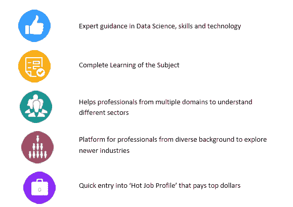

# 谁可以从事数据科学？

> 原文：<https://www.edureka.co/blog/who-can-take-up-a-data-science-tutorial/>

大数据和数据科学是不同行业的就业热潮。如今，各种类型的组织都在采用数据科学和大数据技术。因此，数据科学和分析不受特定背景或领域的限制。要获得深入的数据科学知识，您可以报名参加 Edureka 提供的全天候支持和终身访问的实时 *[**数据科学与 Python**](https://www.edureka.co/data-science-python-certification-course) 认证培训*。

所有垂直行业的专业人士都在通过学习数据科学和大数据技术转向分析。因此，如果您想知道是否可以参加数据科学教程，那么您不应该错过从这里继续阅读的机会。

我们已经讨论了为什么应该报名参加数据科学课程，以及数据科学培训带来的 [**优势**](https://www.edureka.co/blog/advantages-of-data-science-training/) 。现在，不再拖延，让我们来看看——谁可以学习数据科学教程？！

**IT 专业人士:**

数据科学家是新的 **IT 摇滚明星。**是的，一大群 IT 专业人士正从编程和开发转向分析。IT 专业人员带着计算机知识而来，他们的技能可以转移的事实是他们对数据科学着迷的最大原因。不仅如此，这个职业生涯中的完美偏离将会是丰富和有益的。

**营销专业人士:**

大数据是当今市场上所有顶级品牌的一个大问题。所有来自博客、社交媒体、智能手机等的数据。品牌难以在传统数据库系统中捕获和处理。但是，未来表明，大数据是创新、竞争优势和生产力的下一个前沿。因此，组织正在采用大数据和数据科学技术进行数据挖掘和管理。

因此，很明显，拥有数据科学技能的营销专业人员比其他人更受青睐、更受雇佣，薪酬也更高。

**零售商:**

零售业是大数据和具有大数据和数据科学技能的专业人员潜力最大的行业。IDC 研究公司已经证实，零售商正在通过大数据分析来获取商业利益。此外，组织可以通过对话和互动将在线和离线数据整合在一起，以更好地了解推动购物者的因素。

顶级零售商在分析上投入了大量资金，但他们没有合适的人才来支持他们的资金。

**金融专业人士:**

银行、保险公司、投资公司和其他金融机构利用来自各种来源的大量数据，如交易详情、实时市场反馈、客户服务记录、信函和社交媒体帖子以及现有的客户数据库。

许多金融公司在利用大数据方面面临挑战。由于隐私和安全原因，这些公司不愿意采用基于云的大数据基础架构。

考虑到这些方面，该部门在所有想要大数据和数据科学人才的人中名列前茅。

**媒体和娱乐:**

与其他行业相比，媒体和娱乐涉及大量人口。也可以说，它是当今最受欢迎的部门。事实是，这个世界很容易出现互联网。因此，这里的数据流量相当大。此外，挖掘这些数据也是一件至关重要的事情，这需要大数据和数据科学专家。

**医疗专业人员:**

医疗保健也是依赖大数据的行业之一。医疗保健从哪里来这么多数据？

数据来自各种来源，如电子病历(EMR)、实验室、成像系统、医疗通信、索赔、数据库和金融。因此，大数据和数据科学在医疗保健领域发挥着重要作用。

我们只接触了极少数正在并且能够学习数据科学的行业和专业人士。如今，你想到的任何业务都是基于大数据的。所以，触角是无止境的。

**数据科学教程如何发挥魔力？我们来看看:**

正确的指导和系统的学习方法对于掌握一项技术/技能至关重要。数据科学教程在“造就数据科学家”中起着至关重要的作用。数据科学教程扩展了以下帮助:

俗话说得好——“抓住阳光，好好利用”,在这里，大数据和数据科学是目前最闪亮的技能和技术，有着光明的未来。对于专业人士来说，明智的做法是马上学习它，并且 [**会有美好的职业生涯，保证会持续到很久。**](https://www.edureka.co/blog/data-scientist-skills/)

热衷于成为一名数据科学家，看看我们的一些博客帖子，它们提供了全面的信息:

[**数据科学家——核心技能**](https://www.edureka.co/blog/data-scientist-skills/)

[**不同职称的数据科学家**](https://www.edureka.co/blog/job-titles-for-data-scientists/)

[**数据科学家类型**](https://www.edureka.co/blog/types-of-data-scientists/)

[**区别数据科学家&数据分析师**](https://www.edureka.co/blog/difference-between-data-scientist-and-data-analyst/)

Edureka 有一门特别策划的数据科学课程，可以帮助你获得机器学习算法方面的专业知识，如 K-Means 聚类、决策树、随机森林、朴素贝叶斯。您将学习统计学、时间序列、文本挖掘的概念，以及深度学习的介绍。本课程的新批次即将开始！！