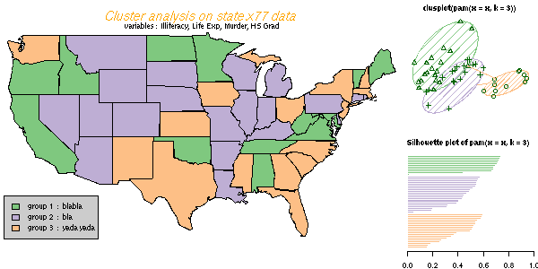
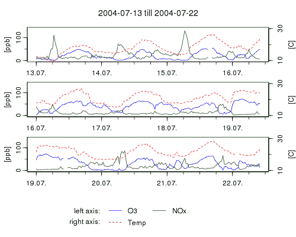

# 为什么要学 R？

> 原文：<https://www.edureka.co/blog/why-learn-r/>

“嘿，当有人称你为科学家时，你会有什么反应，什么感觉？

**是的！ [数据科学家](https://www.edureka.co/blog/who-is-a-data-scientist/) ！**

在这里，你将实现成为数据分析领域的“科学家”的梦想！ *当然还有！事业有成！*

***有志成为数据科学家？*** 用 R 编程学[数据科学！为什么要学 R？因为 R 是统计学家开发的最需要的脚本语言之一。凭借其无与伦比的优势，我们向您介绍 R 可以为现在和未来的商业分析师做些什么。](https://www.edureka.co/data-science-r-programming-certification-course)

***下面我们来浏览一下让 R 在数据科学家中如此受欢迎的 9 大优势:***

## **1。** **R 是一种免费的开源语言** :

首先，R 是免费的！这意味着，任何人都可以从互联网上下载 R(通过一个庞大的镜像服务器网络)并开始研究它。还有什么？您甚至可以修改代码，并向其中添加您自己的创新。r 语言没有许可证限制，因为它是在 GNU(通用公共许可证)下发布的，并且是一种开源编程语言。r 可以随时随地运行，也可以按照许可证的条件出售。

## **2。** **R 跨平台兼容:**

R 的最大优势之一是你可以在几个操作系统和不同的软件/硬件上运行 R。它经常被用在微软的 Windows (32 位和 64 位)、Macintosh、GNU/Linux、UNIX 和它的衍生系统如 Mac OS X、Darwin、FreeBSD、Solaris 等上。它也运行在大型机的一些操作系统上。感谢 R 开发核心团队为使其跨平台兼容而付出的努力！

## **3。m**ost 高级统计编程语言:

由于 R 是由顶尖的计算统计学家和计算机语言设计师开发的，R 编程被视为“国际合作”的产物。毫无疑问，R 是世界上最先进的统计编程语言之一，被一些统计学家广泛使用，使他们的生活变得更加简单和高效。r 程序员可以处理大型复杂对象(不限于一小组问题)，在 MS-Excel 中交换数据，确保代码的准确性，跟踪每个计算步骤，保存历史供以后参考，进行高级统计分析，进行复杂的可视化等等。r 由许多用户贡献的非常精细的技术文档和教程支持。R 的整体结构和语法是专门为统计计算开发的。

## **4。** **优秀图形输出:**

r 程序设计语言具有辉煌的高科技图形能力，这是任何其他统计语言无法比拟的。这就是程序员爱 R 的原因！看看 R 中创建的图形，无论是箱线图、直方图、多边形、散点图、条形图、箭头、树、数学符号、ggplots，这些都非常令人印象深刻，不言自明。用 R 生成的图质量很高，和出版物图一样好！您可以基于您选择的包创建静态甚至动态的图形！因此，R 是一种完全可编程的图形语言，具有突出的特性！

## **5。** **R 是灵活的‘n’趣:**

你认为现有的 R 语言存在一些需要解决的 bug 吗？非常欢迎你做那件事！还是想发明一种新的分析？然后学习 R 编程，牢牢掌握分析界！R 是完全可编程的，您甚至可以进行代码增强、开发动态包、将重复的过程计算机化、用 R 开发您自己的应用程序和信息地图、用 LaTeX 或 Lyx 创建表格等等。用 R 写自己的函数，把自己的 R 软件作为附加包分发，简单又好玩！情况就是这样，许多新的统计方法被开发出来，并附上一个 R 包。

## **6。** **R 极其全面:**

想象一下，一种编程语言提供了来自与数据挖掘、生物信息学、计量经济学和空间分析相关的各种存储库的 4800 多个包！r 编程语言由几个标准的统计测试、分析和模型组成！r 可以轻松地处理无限大小和复杂的对象。R 程序员并不局限于使用单一的方法来实现所需的图形模型或统计计算。相反，R 执行各种各样的功能，例如数据操作、经典统计测试、统计建模(无论是线性还是非线性)、图形技术、分类、聚类等等。

## **7。r 支持扩展:**

r 不仅是一种非常全面的语言，而且在结构上也非常具有可扩展性。R 中的数据结构由向量、标量、数据帧、时间序列、矩阵、列表等组成。r 还支持矩阵算法以及可扩展的对象系统，如回归模型和地理空间坐标。r 还支持过程编程和函数，以及某些函数的 OOP(面向对象编程)。R 编程语言还可以使用 RCurl 包从 Google 中提取数据，将不同长度的向量或数据帧连接成一个数据帧，用拉链以不同的方式连接两个数据帧的行或列，还可以使用 R！

## **8。r 有一个庞大的社区:**

随着越来越多的人和公司采用 R 作为“统计语言”，R 为自己创造了一个庞大的社区！这些有着相似经历的人给论坛、社交媒体、R 会议和其他网络渠道带来了很多附加值。通过这些使用 R 的活跃小组，学生和专业人员可以清楚地了解 R 是什么，R 的优势以及如何在他们的专业生活中使用 R 的显著特征。获得 R 专业人员的支持，并在短时间内解决您的疑问。成为 200 万人的庞大社区的一部分，开始使用 R！

## **9。r 容易关联到其他编程语言:**

在认识到 R 在商业分析中的作用之后，一个新的趋势已经形成，即现有的软件以及新兴的软件都与各种 R 包集成在一起，以使它们更有生产力。现在，R 越来越依赖于许多文件系统、应用程序和数据库。因此，R 很容易与其他编程语言联系起来。r 不仅从 Microsoft Excel 导入数据，还从 Microsoft Access、MySQL、SQLite、Oracle 等导入数据，非常友好。r 还可以使用 ODBC(开放式数据库连接协议)和 ROracle 包轻松连接到各种数据库。

***你是否渴望在商业分析领域加速自己的职业生涯？你想进入像 SAP、甲骨文、脸书、谷歌、IBM、必应、Mozilla、托马斯·库克、芝加哥大学这样的公司吗？这些公司和许多这样的公司在商业分析中广泛使用 R 的力量。开始学 R 还需要更多的理由吗？不要！我猜你对 r 的优点很满意吧，来，起来！开始编码， ***检索，*** 分析，用 R 修改你的大数据！***

有问题要问我们吗？请在评论区提及它们，我们将会回复您。

**相关帖子:**

[你对 R 的商业分析了解多少？](https://www.edureka.co/blog/what-do-you-know-about-business-analytics-with-r/)

[大数据分析是最佳职业选择的 10 个理由](https://www.edureka.co/blog/10-reasons-why-big-data-analytics-is-the-best-career-move "10 Reasons Why Big Data Analytics is the Best Career Move")