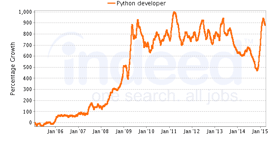
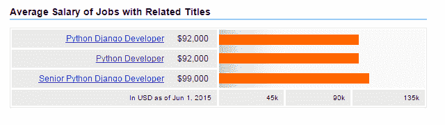

# 为什么 Python 培训对大数据工作至关重要？

> 原文：<https://www.edureka.co/blog/why-python-training-is-essential-for-big-data-jobs/>

Python 是由吉多·范·罗苏姆在 20 世纪 80 年代末开发的，是一种强调代码可读性和简单语法的通用高级编程语言。让我们看看 Python 是如何与大数据相处的！

**面向大数据的 Python**

通常，Python 简单的语法和渐进的学习曲线是它被用于大数据的最受欢迎的原因之一。了解组织中的实习生积极参与向新员工教授该语言是很有意思的。要深入了解 Python 及其各种应用程序，您可以注册参加实时 ***[Python 在线培训](https://www.edureka.co/python)*** ，全天候支持，终身访问。

Python 的忠实用户之一 AppNexus 表示， " *我们已经能够建立一个框架，使我们能够轻松地从所有这些不同的数据源中获取数据，并对它们进行建模。因此，不用每个人都花时间编写数据库连接器代码，他们能够使用简单的配置并快速启动"*

随后，Python 允许组织更快地将代码从开发转移到生产，因为作为原型制作的相同代码可以转移到生产中。

我们都知道 Hadoop 是一项重要的技术，作为一个大的数据解决方案已经获得了巨大的人气，但是您知道 Python 是用来编写 Hadoop 的 MapReduce 程序和应用程序来访问带有 PyDoop 包的 Hadoop 的 HDFS API 吗？

让我们看看 PyDoop，一个为 Hadoop 的 MapReduce 和 HDFS 提供 Python API 的应用程序包。PyDoop 可能是 Python 和大数据之间最重要的联系之一，它比 Hadoop 的内置 Python 编程解决方案(包括 Hadoop 流)有几个优势。

PyDoop 最大的优势是它是 HDFS API。这允许用户连接到 HDFS 安装，读取和写入文件，并获取有关文件、目录和全局文件系统属性的信息。

PyDoop 的 MapReduce API 允许用最少的编程工作解决许多复杂的问题。使用 PyDoop 可以在 Python 中实现高级 MapReduce 概念，如“计数器”和“记录读取器”。

## **Python 今日趋势**

根据 Indeed.com 的工作趋势，Python 和 R 与大数据的结合正在稳步回升。随着许多公司寻求大数据分析，python 培训似乎是你简历中的一项必备内容。到目前为止，Python 是三者中需求量最大的，在大数据领域有大约 **27，000 个工作岗位**(来源——信息世界)。Python for Big Data 培训会自动使您具备从事这些工作的资格。

完成 Python 培训有助于你在短时间内找到高薪工作。随着大数据领域更多工作的到来， Python 培训将使你成为理想的候选人。

尽管很简单，Python 对于解决几乎任何领域中复杂和困难的数据分析问题都非常强大。Python 是独立于平台的，因此它可以与大多数现有的 it 环境集成。Python 具有处理大数据操作任务的强大能力，其作为脚本语言的天然优势使其非常适合面向数据的应用。难怪，各种规模和不同行业类型的公司都在使用 Python 来管理他们的大数据需求。随着公司继续利用 Python 的力量进行大数据处理，Python 培训将有助于建立你在大数据分析方面的技能。

有问题要问我们吗？在评论区提到它们，我们会给你回复。

**相关帖子:**

[Python 进行大数据分析](https://www.edureka.co/blog/videos/python-for-big-data-analytics-2/)

[Python 中的字符串](https://www.edureka.co/blog/strings_in_python/)

[开始学习 Python 课程吧！](https://www.edureka.co/python)