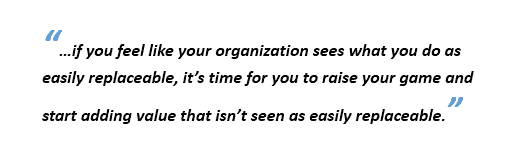
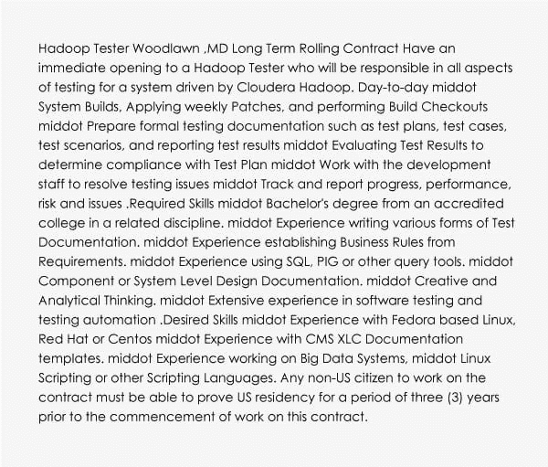

# 一个软件测试工程师为什么要学习大数据和 Hadoop 生态系统技术？

> 原文：<https://www.edureka.co/blog/why-software-testing-eng-learn-big-data-and-hadoop-ecosystem-technologies/>

可以理解，测试过程是任何软件领域中最重要的方面。当组织选择适应改进的技术时，测试工程师的角色扩展到不同的领域。在这篇博文中，我们来讨论一下为什么一个软件测试工程师要学习大数据和 Hadoop 生态系统技术。

如果你是大数据/Hadoop 领域的新手，浏览一下我们的一些帖子，关于 [5 个学习 Hadoop 的理由](https://www.edureka.co/blog/5-reasons-to-learn-hadoop)、[大数据背后的宣传](https://www.edureka.co/blog/the-hype-behind-big-data/)和[Hadoop 是什么？](https://www.edureka.co/blog/what-is-hadoop/)

让我们直接进入这个话题的实质细节；

## 一个软件测试工程师为什么要学习大数据和 Hadoop？

**职业成长:**

上面的图表不言自明。这清楚地表明 Hadoop 相关工作的增长率远高于软件测试工作的增长率。软件测试相关工作的最大增长率约为 1.6%，但基于 Hadoop 的测试工作的增长率高达 5%(约为 1.5%)。)

学习 Hadoop 的人 80%都是非开发背景。你也可以成为其中一员。

从这个由大数据平台顶级行业专家设计的在线大数据课程中探索和了解更多关于 Hadoop 的知识。

**在测试应用程序以解决大数据问题时，当前测试实践的局限性:**

*   软件测试方法是由数据驱动的(如数据的偏斜，数据集大小不匹配等。)而不是测试场景。
*   标准数据匹配工具(如 win diff 等。)不要处理大量数据。这成为软件测试工程师技能的一个限制。

对于中等规模的数据，可以将数据公开为 HBase 表，并通过对少量输入应用业务逻辑来验证输入数据集。

对于大规模数据，大数据技术为工程师提供了独特的技能集，用于测试大型和复杂的数据集，并在气象学、基因组学、连接组学、复杂物理模拟以及生物和环境研究领域找到大量机会。

## **测试现场状态——专家意见:**

Scott Barber，一位著名的测试人员、演讲者和测试相关主题的作家；专攻系统性能测试领域的引用了一些关于测试领域现状的非常有力和有影响力的话。

******

在不同的社交媒体上有许多关于测试成为“垂死职业”的可能性的讨论，斯科特也同意测试作为一种职业正处于戏剧性的转变之中。

好吧，那句话够戏剧化的了，让我们看看事实，亲自看看测试领域发生了什么。

通过亚特兰大 [蔚蓝数据工程培训](https://www.edureka.co/microsoft-azure-data-engineering-certification-course-atlanta) 了解更多大数据及其应用。

## **一看 Hadoop/大数据测试人员职位简介:**

以下是某个组织对其 Hadoop 测试人员的要求:

当查看上述要求时，我们可以看到测试技能是非常需要的，并且是这份工作的基础。现在，要成为大数据或 Hadoop 测试人员，软件测试工程师需要做的就是用大数据/Hadoop 技能更新自己。

## 

## 

## **转移到 Hadoop/大数据有多容易:**

*   **去 Java 还是不去 Java——****灵活选择:**

对于那些 Java 专家来说，这种转变是小菜一碟，因为这是一个开源的、基于 Java 的编程框架。这里使用的 MapReduce 脚本是用 Java 编写的。现在，很明显，要在 Hadoop 上工作，Java 知识是必不可少的。

说了以上这些，并不代表非 Java 专家前路坎坷。Hadoop 的美妙之处在于它拥有一系列工具，一个**‘非 Java’**专家都可以使用。一些 Hadoop 工具，如 Hive、Pig 和 Sqoop，不需要 Java 知识，因为它们严重依赖 SQL。

*   **测试专业人员和 Hadoop 专业人员之间共享的技能和应用平台:**

一开始，从舒适区转移到大数据/ Hadoop 等新领域的想法可能有点令人不知所措。但是人们必须意识到测试和 Hadoop 并不相互排斥。这里列出了他们之间可以使用的技能和平台，根据[http://www.itjobswatch.co.uk](http://www.itjobswatch.co.uk/)。这些技能中的一项或多项也可以与大数据和 Hadoop 技能结合使用。因此，更容易实现平稳过渡。

一个好的测试工程师拥有敏锐的分析能力，强大的技术能力，良好的态度，注重细节并愿意学习。这些正是任何人转向 Hadoop 所需要的特质。无可辩驳的是，测试正在经历变革，但这不会是它的终结。但是随着时代的变化，考虑到 Hadoop 的所有特性和灵活性，谨慎的做法是乘风破浪。

还不相信自己能学会 Hadoop？不要相信任何人。自己判断。点击下方观看 Edureka 教授的大数据和 Hadoop 课程的样本课程记录。从 [数据工程课程](https://www.edureka.co/microsoft-azure-data-engineering-certification-course) 中了解大数据及其应用。

有问题要问我们吗？在评论区提到它们，我们会给你回复。

**相关帖子:**

[大数据和 Hadoop 入门](https://www.edureka.co/big-data-and-hadoop "Get started with Big Data & Hadoop")

[大数据培训可以改变组织的 7 种方式](https://www.edureka.co/blog/7-ways-big-data-training-can-change-your-organization/)